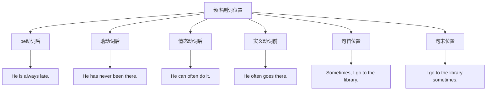

# 副词位置规则

## 🎯 学习目标
- 掌握副词在句子中的基本位置规则
- 理解不同位置对句子意义的影响
- 能够准确判断副词的最佳位置

## 📚 核心概念

### 1. 副词位置的重要性
**副词位置**直接影响句子的意义和语调，正确的位置能使表达更加准确和自然。

**位置影响**：
- **语义影响**: 不同位置表达不同含义
- **语调影响**: 位置影响句子的语调
- **强调影响**: 位置影响强调的重点
- **逻辑影响**: 位置影响逻辑关系

## 🔍 副词位置详解

### 2. 基本位置规则

#### 2.1 句首位置 (Initial Position)
**定义**：副词位于句子的开头

**适用副词**：
- **时间副词**: Yesterday, Today, Tomorrow
- **地点副词**: Here, There
- **连接副词**: However, Therefore, Moreover
- **评注副词**: Fortunately, Unfortunately, Obviously

**例句分析**：
| 副词类型 | 例句 | 位置作用 |
|----------|------|----------|
| **时间副词** | **Yesterday**, I went to school. | 强调时间 |
| **地点副词** | **Here** comes the bus. | 强调地点 |
| **连接副词** | **However**, he is not happy. | 表示转折 |
| **评注副词** | **Fortunately**, he arrived on time. | 表达态度 |

**注意事项**：
- 句首副词后通常用逗号分隔
- 句首位置强调作用较强
- 某些副词在句首时句子要倒装

#### 2.2 句中位置 (Mid Position)
**定义**：副词位于句子中间

**适用副词**：
- **频率副词**: always, often, sometimes, never
- **程度副词**: very, quite, rather, too
- **方式副词**: carefully, quickly, slowly

**例句分析**：
| 副词类型 | 例句 | 位置作用 |
|----------|------|----------|
| **频率副词** | I **always** study hard. | 修饰动词 |
| **程度副词** | She is **very** beautiful. | 修饰形容词 |
| **方式副词** | He **carefully** opened the door. | 修饰动词 |

**位置规律**：
- **be动词后**: He is **always** late.
- **助动词后**: He has **never** been there.
- **情态动词后**: He can **easily** do it.
- **实义动词前**: He **often** goes there.

#### 2.3 句末位置 (Final Position)
**定义**：副词位于句子的末尾

**适用副词**：
- **方式副词**: quickly, slowly, carefully
- **地点副词**: here, there, everywhere
- **时间副词**: yesterday, today, tomorrow

**例句分析**：
| 副词类型 | 例句 | 位置作用 |
|----------|------|----------|
| **方式副词** | He runs **quickly**. | 修饰动词 |
| **地点副词** | The book is **here**. | 表示地点 |
| **时间副词** | I will call you **tomorrow**. | 表示时间 |

**注意事项**：
- 句末位置通常不强调
- 多个副词时按重要性排列
- 句末副词通常不用逗号分隔

### 3. 特殊位置规则

#### 3.1 频率副词位置
**位置规律**：

**位置优先级**：
1. **be动词后**: He is **always** late.
2. **助动词后**: He has **never** been there.
3. **情态动词后**: He can **often** do it.
4. **实义动词前**: He **often** goes there.
5. **句首位置**: **Sometimes**, I go to the library.
6. **句末位置**: I go to the library **sometimes**.

#### 3.2 程度副词位置
**位置规律**：
- **修饰形容词**: 形容词前
- **修饰副词**: 副词前
- **修饰动词**: 动词前

**例句对比**：
| 修饰对象 | 例句 | 位置说明 |
|----------|------|----------|
| **修饰形容词** | She is **very** beautiful. | 形容词前 |
| **修饰副词** | He runs **very** quickly. | 副词前 |
| **修饰动词** | I **completely** agree. | 动词前 |

#### 3.3 方式副词位置
**位置规律**：
- **句末位置**: 最常见
- **句中位置**: 强调时使用
- **句首位置**: 特殊强调

**例句对比**：
| 位置 | 例句 | 强调程度 |
|------|------|----------|
| **句末** | He runs **quickly**. | 一般 |
| **句中** | He **quickly** runs. | 较强 |
| **句首** | **Quickly**, he runs. | 最强 |

### 4. 多个副词的位置

#### 4.1 副词顺序规则
**基本顺序**：方式 → 地点 → 时间

**例句分析**：
| 顺序 | 例句 | 说明 |
|------|------|------|
| **方式+地点+时间** | He runs **quickly** **here** **every day**. | 标准顺序 |
| **方式+时间** | She sings **beautifully** **every night**. | 省略地点 |
| **地点+时间** | He works **there** **every morning**. | 省略方式 |

#### 4.2 副词组合位置
**组合规律**：
- **短副词在前**: He runs **fast** **every day**.
- **长副词在后**: He runs **every day** **beautifully**.
- **重要性排序**: 重要信息在前

**例句对比**：
| 组合方式 | 例句 | 说明 |
|----------|------|------|
| **短+长** | He runs **fast** **every morning**. | 短副词在前 |
| **长+短** | He runs **every morning** **fast**. | 长副词在前 |
| **重要性** | He runs **here** **every day** **quickly**. | 按重要性排序 |

### 5. 特殊句型中的副词位置

#### 5.1 疑问句中的副词位置
**位置规律**：
- **疑问副词**: 句首
- **其他副词**: 句中或句末

**例句分析**：
| 句型 | 例句 | 副词位置 |
|------|------|----------|
| **特殊疑问句** | **When** do you study? | 疑问副词句首 |
| **一般疑问句** | Do you **often** study? | 频率副词句中 |
| **反义疑问句** | You study **hard**, don't you? | 方式副词句末 |

#### 5.2 否定句中的副词位置
**位置规律**：
- **否定副词**: 句中
- **其他副词**: 句中或句末

**例句分析**：
| 句型 | 例句 | 副词位置 |
|------|------|----------|
| **否定句** | I **never** go there. | 否定副词句中 |
| **否定句** | I don't go there **often**. | 频率副词句末 |
| **双重否定** | I **never** don't go there. | 否定副词句中 |

#### 5.3 倒装句中的副词位置
**位置规律**：
- **倒装副词**: 句首
- **其他副词**: 句中或句末

**例句分析**：
| 句型 | 例句 | 副词位置 |
|------|------|----------|
| **完全倒装** | **Here** comes the bus. | 地点副词句首 |
| **部分倒装** | **Never** have I seen such a thing. | 否定副词句首 |
| **时间倒装** | **Now** comes the time. | 时间副词句首 |

## 📊 副词位置总结表

| 副词类型 | 主要位置 | 次要位置 | 例句 | 注意事项 |
|----------|----------|----------|------|----------|
| **时间副词** | 句首/句末 | 句中 | **Yesterday**, I went to school. | 强调时间 |
| **地点副词** | 句末 | 句首/句中 | The book is **here**. | 表示地点 |
| **方式副词** | 句末 | 句中/句首 | He runs **quickly**. | 修饰动词 |
| **程度副词** | 句中 | 句末 | She is **very** beautiful. | 修饰形容词 |
| **频率副词** | 句中 | 句首/句末 | I **always** study hard. | 修饰动词 |
| **疑问副词** | 句首 | - | **When** will you come? | 引导疑问句 |
| **关系副词** | 从句中 | - | This is **where** I live. | 引导从句 |
| **连接副词** | 句首/句中 | 句末 | **However**, he is not happy. | 连接句子 |

## 🎯 学习要点

### 6. 位置判断技巧
1. **功能判断**: 看副词修饰什么
2. **意义判断**: 看副词表达什么意义
3. **强调判断**: 看是否需要强调
4. **逻辑判断**: 看逻辑关系

### 7. 位置选择原则
1. **语义准确**: 位置要准确表达意思
2. **语调自然**: 位置要符合语调习惯
3. **强调适当**: 位置要适当强调
4. **逻辑清晰**: 位置要体现逻辑关系

## 🔗 相关链接
- [[01-副词分类]] - 副词分类详解
- [[03-副词比较级最高级]] - 副词比较级和最高级
- [[04-副词易混点辨析]] - 副词易混点辨析
- [[01-基础认知层/02-句子成分/01-基本成分]] - 句子基本成分

## 📝 练习建议
1. **位置练习**: 练习副词在不同位置的使用
2. **顺序练习**: 练习多个副词的顺序
3. **句型练习**: 练习特殊句型中的副词位置
4. **应用练习**: 在实际语境中应用副词位置规则

---
*学习建议: 掌握副词位置规则是正确使用副词的关键，要多练习不同位置的使用*
