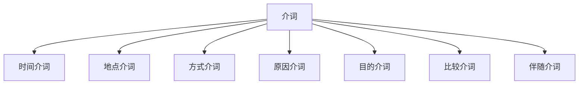

# 介词系统

## 📚 介词概述

介词是用来表示名词或代词与其他词之间关系的词类，通常位于名词或代词之前。

## 🎯 学习目标

- **认识层面**：了解介词的基本概念和分类
- **理解层面**：掌握常用介词的用法和搭配
- **应用层面**：能够正确使用介词进行表达

## 📖 介词的分类

### 介词分类图

## ⏰ 时间介词 (Prepositions of Time)

### 常用时间介词

| 介词 | 用法 | 例子 |
|------|------|------|
| at | 具体时间点 | at 7 o'clock, at noon |
| in | 时间段、月份、年份 | in the morning, in May, in 2023 |
| on | 具体日期、星期 | on Monday, on January 1st |
| for | 持续一段时间 | for two hours, for a week |
| since | 从过去某时开始 | since 2020, since last year |
| during | 在...期间 | during the meeting, during summer |
| before | 在...之前 | before dinner, before 5 o'clock |
| after | 在...之后 | after school, after work |

### 用法规则

1. **at 的用法**
   - **at** 7:30 (在7:30)
   - **at** night (在晚上)
   - **at** the weekend (在周末)

2. **in 的用法**
   - **in** the morning (在早上)
   - **in** May (在五月)
   - **in** 2023 (在2023年)

3. **on 的用法**
   - **on** Monday (在星期一)
   - **on** January 1st (在1月1日)
   - **on** my birthday (在我生日那天)

## 📍 地点介词 (Prepositions of Place)

### 常用地点介词

| 介词 | 用法 | 例子 |
|------|------|------|
| in | 在...内部 | in the room, in the box |
| on | 在...表面 | on the table, on the wall |
| at | 在...地点 | at school, at home |
| under | 在...下面 | under the table, under the bed |
| over | 在...上方 | over the bridge, over the river |
| above | 在...上方 | above the clouds, above the sea |
| below | 在...下方 | below the surface, below zero |
| between | 在...之间 | between two trees, between you and me |
| among | 在...中间 | among the students, among the crowd |
| near | 在...附近 | near the school, near the station |
| beside | 在...旁边 | beside the river, beside me |
| behind | 在...后面 | behind the house, behind you |
| in front of | 在...前面 | in front of the building, in front of me |

### 用法规则

1. **in, on, at 的区别**
   - **in** the room (在房间里)
   - **on** the table (在桌子上)
   - **at** the station (在车站)

2. **over 和 above 的区别**
   - The plane is **over** the city. (飞机在城市上空)
   - The picture is **above** the desk. (图片在桌子上方)

## 🎭 方式介词 (Prepositions of Manner)

### 常用方式介词

| 介词 | 用法 | 例子 |
|------|------|------|
| by | 通过...方式 | by car, by train, by plane |
| with | 用...工具 | with a pen, with my hands |
| in | 用...语言、方式 | in English, in a loud voice |
| on | 通过...媒介 | on the phone, on TV |
| through | 通过...途径 | through the window, through hard work |

### 用法规则

1. **by 的用法**
   - I go to school **by** bus. (我乘公交车上学)
   - She learned English **by** listening to music. (她通过听音乐学英语)

2. **with 的用法**
   - I write **with** a pen. (我用钢笔写字)
   - He cut the paper **with** scissors. (他用剪刀剪纸)

## 🔍 原因介词 (Prepositions of Reason)

### 常用原因介词

| 介词 | 用法 | 例子 |
|------|------|------|
| because of | 因为 | because of the rain, because of you |
| due to | 由于 | due to the weather, due to illness |
| owing to | 由于 | owing to the delay, owing to the accident |
| thanks to | 多亏 | thanks to your help, thanks to the rain |

### 用法规则

1. **because of 的用法**
   - The game was cancelled **because of** the rain. (比赛因为下雨取消了)

2. **due to 的用法**
   - The delay was **due to** bad weather. (延误是由于恶劣天气)

## 🎯 目的介词 (Prepositions of Purpose)

### 常用目的介词

| 介词 | 用法 | 例子 |
|------|------|------|
| for | 为了 | for you, for the exam, for fun |
| to | 为了 | to help you, to learn English |
| in order to | 为了 | in order to pass the exam |
| so as to | 为了 | so as to improve my English |

### 用法规则

1. **for 的用法**
   - I bought this book **for** you. (我为你买了这本书)
   - We study **for** the exam. (我们为考试而学习)

2. **to 的用法**
   - I came here **to** help you. (我来这里是为了帮助你)

## 📊 比较介词 (Prepositions of Comparison)

### 常用比较介词

| 介词 | 用法 | 例子 |
|------|------|------|
| than | 比 | taller than, better than |
| as | 像...一样 | as tall as, as good as |
| like | 像 | like a bird, like you |
| unlike | 不像 | unlike you, unlike before |

### 用法规则

1. **than 的用法**
   - He is taller **than** me. (他比我高)
   - This book is better **than** that one. (这本书比那本好)

2. **as 的用法**
   - She is as tall **as** her sister. (她和姐姐一样高)

## 🤝 伴随介词 (Prepositions of Accompaniment)

### 常用伴随介词

| 介词 | 用法 | 例子 |
|------|------|------|
| with | 和...一起 | with my friends, with you |
| without | 没有 | without money, without you |
| together with | 和...一起 | together with my family |

### 用法规则

1. **with 的用法**
   - I went to the movies **with** my friends. (我和朋友去看电影)

2. **without 的用法**
   - I can't live **without** you. (没有你我无法生活)

## 📝 介词短语 (Prepositional Phrases)

### 介词短语的构成

#### 结构：介词 + 名词/代词/动名词

| 类型 | 例子 | 功能 |
|------|------|------|
| 时间短语 | in the morning, at night | 作时间状语 |
| 地点短语 | in the room, on the table | 作地点状语 |
| 方式短语 | by car, with a pen | 作方式状语 |
| 原因短语 | because of rain, due to illness | 作原因状语 |

### 用法规则

1. **作状语**
   - I study **in the library**. (我在图书馆学习)
   - He came **by train**. (他乘火车来的)

2. **作定语**
   - The book **on the table** is mine. (桌子上的书是我的)
   - The man **with glasses** is my teacher. (戴眼镜的男人是我的老师)

3. **作表语**
   - The book is **on the desk**. (书在桌子上)
   - He is **at home**. (他在家)

## ⚠️ 常见错误分析

### 错误1：时间介词混用
- ❌ I will see you **in** Monday.
- ✅ I will see you **on** Monday.

### 错误2：地点介词混用
- ❌ The book is **at** the table.
- ✅ The book is **on** the table.

### 错误3：介词遗漏
- ❌ I am looking **the** book.
- ✅ I am looking **for** the book.

## 🎯 费曼学习法应用

### 第一步：选择概念
选择"时间介词"这个概念进行解释

### 第二步：教授他人
用简单语言解释：时间介词用来表示动作发生的时间

### 第三步：发现问题
在解释过程中发现：at, in, on 的使用场合容易混淆

### 第四步：重新学习
回到资料重新学习时间介词的使用规则

### 第五步：简化表达
用更简单的语言重新表达：at用于时间点，in用于时间段，on用于具体日期

## 📚 刻意练习

### 基础练习
1. 选择适当的介词：
   - I will see you (in/on) Monday. → on
   - The book is (in/on) the table. → on

2. 用适当的介词填空：
   - I go to school **by** bus.
   - She is **at** home.

### 进阶练习
1. 用适当的介词短语填空：
   - I study **in the library**.
   - He came **by train**.

2. 将下列句子改为介词短语：
   - The book is on the table. → The book **on the table** is mine.

## 🔗 相关知识点

- [[01-名词系统|名词系统]] - 介词后接名词
- [[02-代词系统|代词系统]] - 介词后接代词
- [[05-状语|状语]] - 介词短语作状语
- [[04-定语|定语]] - 介词短语作定语

## 📖 扩展阅读

- [[99-附录资料/01-语法术语表|语法术语表]]
- [[04-综合应用/02-常见错误分析/05-其他常见错误|其他常见错误]]
- [[04-综合应用/01-语法综合练习/01-基础练习|基础练习]]
