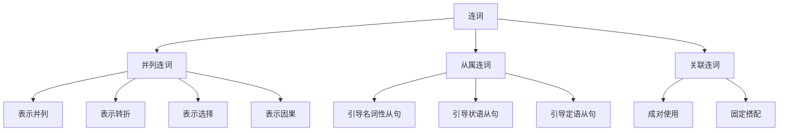

# 连词系统

## 📚 连词概述

连词是用来连接词、短语、从句或句子的词类，表示它们之间的逻辑关系。

## 🎯 学习目标

- **认识层面**：了解连词的基本概念和分类
- **理解层面**：掌握各类连词的用法和逻辑关系
- **应用层面**：能够正确使用连词进行表达

## 📖 连词的分类

### 连词分类图

## 🔗 并列连词 (Coordinating Conjunctions)

### 基本并列连词

| 连词 | 含义 | 例子 |
|------|------|------|
| and | 和，并且 | I like apples **and** oranges. |
| but | 但是 | He is rich **but** not happy. |
| or | 或者 | You can go **or** stay. |
| so | 所以 | It's raining, **so** we can't go out. |
| for | 因为 | He didn't come, **for** he was sick. |
| yet | 然而 | He is old, **yet** he is strong. |
| nor | 也不 | He doesn't like coffee, **nor** does he like tea. |

### 用法规则

1. **and 的用法**
   - 连接并列成分：I like **apples and oranges**. (我喜欢苹果和橙子)
   - 表示递进：He is tall **and** handsome. (他高大且英俊)

2. **but 的用法**
   - 表示转折：He is rich **but** not happy. (他富有但不快乐)
   - 表示对比：She is young **but** experienced. (她年轻但有经验)

3. **or 的用法**
   - 表示选择：You can go **or** stay. (你可以走或留下)
   - 表示否则：Hurry up, **or** you'll be late. (快点，否则你会迟到)

## 🔄 从属连词 (Subordinating Conjunctions)

### 时间从属连词

| 连词 | 含义 | 例子 |
|------|------|------|
| when | 当...时候 | **When** I was young, I liked to play. |
| while | 当...时候 | **While** he was reading, I was sleeping. |
| before | 在...之前 | **Before** you go, please close the door. |
| after | 在...之后 | **After** he left, I felt lonely. |
| since | 自从 | **Since** he came, everything has changed. |
| until | 直到 | I will wait **until** you come back. |
| as soon as | 一...就 | **As soon as** he arrives, we will start. |

### 条件从属连词

| 连词 | 含义 | 例子 |
|------|------|------|
| if | 如果 | **If** it rains, we will stay home. |
| unless | 除非 | **Unless** you study hard, you won't pass. |
| provided that | 假如 | **Provided that** you help me, I will help you. |
| as long as | 只要 | **As long as** you work hard, you will succeed. |

### 原因从属连词

| 连词 | 含义 | 例子 |
|------|------|------|
| because | 因为 | I didn't go **because** I was sick. |
| since | 既然 | **Since** you are here, let's start. |
| as | 由于 | **As** it was late, we went home. |
| now that | 既然 | **Now that** you are here, we can begin. |

### 目的从属连词

| 连词 | 含义 | 例子 |
|------|------|------|
| so that | 以便 | I study hard **so that** I can pass the exam. |
| in order that | 为了 | He works hard **in order that** he can support his family. |
| lest | 以免 | He left early **lest** he should be late. |

### 结果从属连词

| 连词 | 含义 | 例子 |
|------|------|------|
| so...that | 如此...以致 | He is **so** tired **that** he can't work. |
| such...that | 如此...以致 | It was **such** a hot day **that** we stayed inside. |

### 让步从属连词

| 连词 | 含义 | 例子 |
|------|------|------|
| although | 虽然 | **Although** he is old, he is strong. |
| though | 虽然 | **Though** it was raining, we went out. |
| even though | 即使 | **Even though** he is rich, he is not happy. |
| while | 虽然 | **While** I understand your point, I disagree. |

### 方式从属连词

| 连词 | 含义 | 例子 |
|------|------|------|
| as | 按照 | Do **as** I told you. |
| as if | 好像 | He talks **as if** he knows everything. |
| as though | 好像 | She looks **as though** she is tired. |

### 比较从属连词

| 连词 | 含义 | 例子 |
|------|------|------|
| than | 比 | He is taller **than** his brother. |
| as...as | 像...一样 | She is **as** tall **as** her sister. |
| the more...the more | 越...越 | **The more** you study, **the more** you learn. |

## 🔄 关联连词 (Correlative Conjunctions)

### 常见关联连词

| 连词 | 含义 | 例子 |
|------|------|------|
| both...and | 既...又 | He is **both** smart **and** hardworking. |
| either...or | 要么...要么 | You can **either** go **or** stay. |
| neither...nor | 既不...也不 | He **neither** smokes **nor** drinks. |
| not only...but also | 不仅...而且 | She is **not only** beautiful **but also** intelligent. |
| whether...or | 无论...还是 | **Whether** you like it **or** not, you must do it. |
| as...as | 像...一样 | He is **as** tall **as** his father. |
| more...than | 比...更 | He is **more** intelligent **than** his brother. |

### 用法规则

1. **both...and 的用法**
   - 连接两个并列成分：He is **both** a teacher **and** a writer. (他既是老师又是作家)

2. **either...or 的用法**
   - 表示选择：You can **either** come with us **or** stay here. (你可以和我们一起去或留在这里)

3. **neither...nor 的用法**
   - 表示否定：He **neither** smokes **nor** drinks. (他既不抽烟也不喝酒)

## 📝 连词的用法

### 1. 连接词和短语
- **and**: I like **apples and oranges**. (我喜欢苹果和橙子)
- **but**: He is rich **but not happy**. (他富有但不快乐)

### 2. 连接从句
- **when**: **When I was young**, I liked to play. (我年轻时喜欢玩)
- **because**: I didn't go **because I was sick**. (我没去因为我病了)

### 3. 连接句子
- **and**: He is tall, **and** he is handsome. (他高大，而且英俊)
- **but**: He is rich, **but** he is not happy. (他富有，但不快乐)

## ⚠️ 常见错误分析

### 错误1：连词重复使用
- ❌ **Because** he was sick, **so** he didn't come.
- ✅ **Because** he was sick, he didn't come.

### 错误2：连词位置错误
- ❌ He **not only** is smart **but also** hardworking.
- ✅ He is **not only** smart **but also** hardworking.

### 错误3：连词搭配错误
- ❌ **Both** he **as well as** his brother are students.
- ✅ **Both** he **and** his brother are students.

## 🎯 费曼学习法应用

### 第一步：选择概念
选择"并列连词"这个概念进行解释

### 第二步：教授他人
用简单语言解释：并列连词用来连接同等重要的词、短语或句子

### 第三步：发现问题
在解释过程中发现：不同并列连词表示不同的逻辑关系

### 第四步：重新学习
回到资料重新学习各类并列连词的含义和用法

### 第五步：简化表达
用更简单的语言重新表达：and表示并列，but表示转折，or表示选择

## 📚 刻意练习

### 基础练习
1. 选择适当的连词：
   - He is tall (and/but) handsome. → and
   - He is rich (and/but) not happy. → but

2. 用适当的连词填空：
   - **When** I was young, I liked to play.
   - I didn't go **because** I was sick.

### 进阶练习
1. 用适当的关联连词填空：
   - He is **both** smart **and** hardworking.
   - You can **either** go **or** stay.

2. 将下列句子改为复合句：
   - He was sick. He didn't come. → **Because** he was sick, he didn't come.

## 🔗 相关知识点

- [[01-名词系统|名词系统]] - 连词连接名词
- [[03-动词系统|动词系统]] - 连词连接动词
- [[02-理解掌握层/04-从句系统/01-名词性从句|名词性从句]] - 从属连词引导从句
- [[02-理解掌握层/04-从句系统/03-状语从句|状语从句]] - 从属连词引导状语从句

## 📖 扩展阅读

- [[99-附录资料/01-语法术语表|语法术语表]]
- [[04-综合应用/02-常见错误分析/05-其他常见错误|其他常见错误]]
- [[04-综合应用/01-语法综合练习/01-基础练习|基础练习]]
