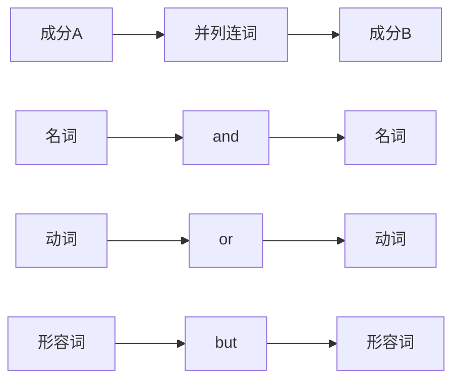
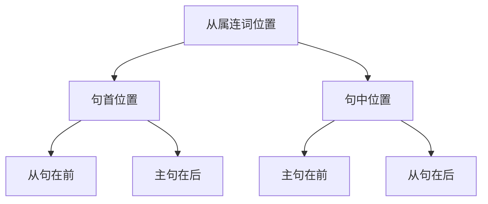
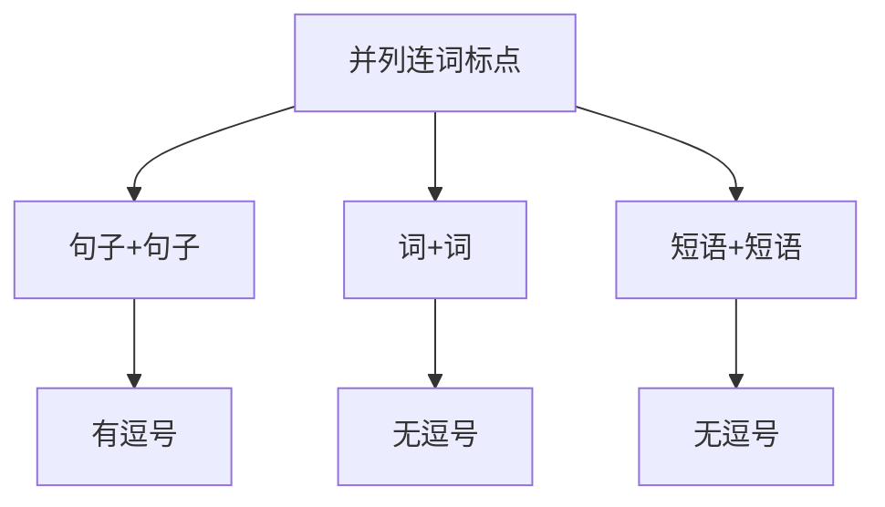
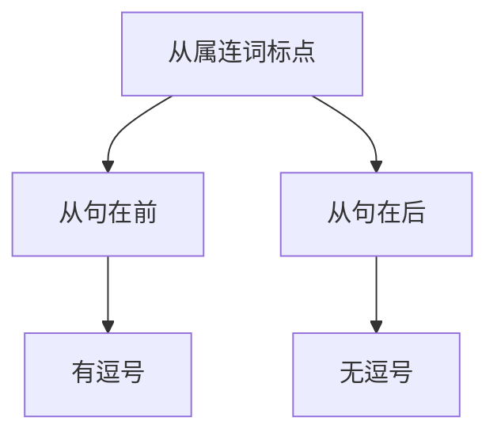
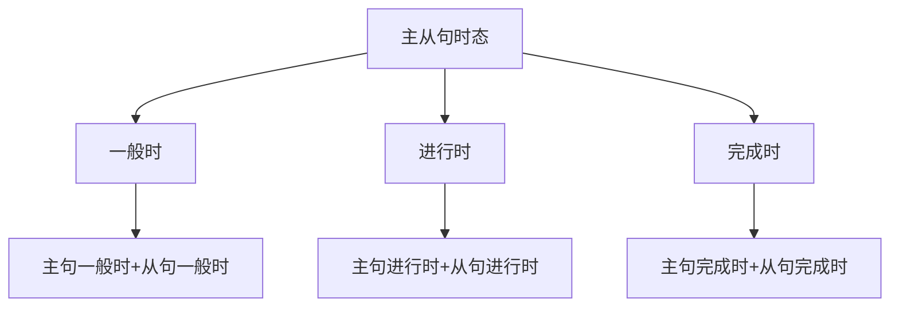
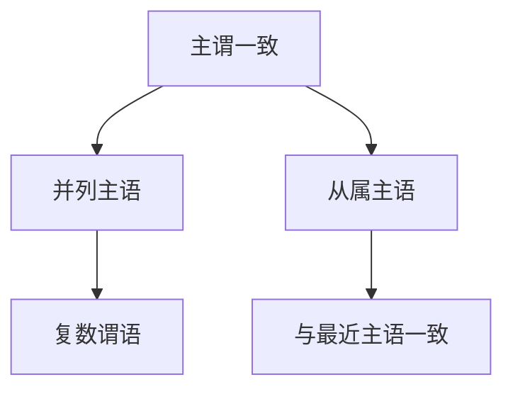

# 连词使用规则

## 🎯 学习目标
- 掌握连词使用的基本规则
- 理解连词在句子中的位置规则
- 能够正确使用连词连接句子成分

## 📚 核心概念

### 1. 连词使用规则概述
**连词使用规则**是指在英语中使用连词时需要遵循的语法规则和语言习惯，包括位置规则、标点规则、时态规则等。

**基本规则**：
- **位置规则**: 连词在句子中的位置
- **标点规则**: 连词前后的标点使用
- **时态规则**: 主从句时态的一致性
- **语法规则**: 连词使用的语法要求

## 🔍 连词使用规则详解

### 2. 位置规则

#### 2.1 并列连词位置规则
**基本规则**：并列连词通常位于被连接成分之间

**位置规律**：

**具体规则**：
| 连词类型 | 位置 | 例句 | 说明 |
|----------|------|------|------|
| **and** | 中间 | I like apple **and** orange. | 连接两个名词 |
| **or** | 中间 | You can stay **or** leave. | 连接两个动词 |
| **but** | 中间 | He is poor **but** happy. | 连接两个形容词 |
| **so** | 中间 | It's raining, **so** I stay home. | 连接两个句子 |

**特殊位置**：
- **句首位置**: **And** he came too. / **But** he didn't come.
- **句中位置**: I study hard, **and** I get good grades.
- **句末位置**: I like apple **and** orange.

#### 2.2 从属连词位置规则
**基本规则**：从属连词可以位于句首或句中

**位置规律**：

**具体规则**：
| 连词类型 | 位置 | 例句 | 说明 |
|----------|------|------|------|
| **when** | 句首 | **When** I study, I feel happy. | 从句在前 |
| **because** | 句中 | I stayed home **because** it was raining. | 从句在后 |
| **if** | 句首 | **If** it rains, I'll stay home. | 从句在前 |
| **although** | 句首 | **Although** it's raining, we'll go. | 从句在前 |

**位置灵活性**：
- **句首**: **When** I was young, I liked playing.
- **句中**: I liked playing **when** I was young.
- **句末**: I liked playing **when** I was young.

### 3. 标点规则

#### 3.1 并列连词标点规则
**基本规则**：
- 连接两个句子时，连词前通常用逗号
- 连接词或短语时，通常不用逗号

**标点规律**：

**具体规则**：
| 连接类型 | 标点 | 例句 | 说明 |
|----------|------|------|------|
| **句子+句子** | 有逗号 | I study hard, **and** I get good grades. | 连接句子 |
| **词+词** | 无逗号 | I like apple **and** orange. | 连接词 |
| **短语+短语** | 无逗号 | in the morning **and** in the evening | 连接短语 |

**特殊标点**：
- **分号**: I study hard; I get good grades. (代替逗号+and)
- **冒号**: I have two choices: stay **or** leave. (引出选择)

#### 3.2 从属连词标点规则
**基本规则**：
- 从句在前时，从句后通常用逗号
- 从句在后时，通常不用逗号

**标点规律**：

**具体规则**：
| 位置类型 | 标点 | 例句 | 说明 |
|----------|------|------|------|
| **从句在前** | 有逗号 | **When** I study, I feel happy. | 从句后逗号 |
| **从句在后** | 无逗号 | I feel happy **when** I study. | 从句前无逗号 |

**特殊标点**：
- **分号**: I study hard; **however**, I don't get good grades.
- **破折号**: I study hard — **because** I want to succeed.

### 4. 时态规则

#### 4.1 主从句时态一致规则
**基本规则**：主从句时态要保持逻辑一致

**时态规律**：

**具体规则**：
| 主句时态 | 从句时态 | 例句 | 说明 |
|----------|----------|------|------|
| **一般现在时** | 一般现在时 | I study **when** I have time. | 时态一致 |
| **一般过去时** | 一般过去时 | I studied **when** I had time. | 时态一致 |
| **现在进行时** | 现在进行时 | I am studying **while** he is sleeping. | 时态一致 |
| **现在完成时** | 现在完成时 | I have studied **since** I came here. | 时态一致 |

#### 4.2 时态不一致规则
**基本规则**：某些情况下主从句时态可以不一致

**特殊情况**：
| 主句时态 | 从句时态 | 例句 | 说明 |
|----------|----------|------|------|
| **一般现在时** | 一般过去时 | I know **that** he came yesterday. | 客观事实 |
| **一般过去时** | 一般现在时 | He said **that** he is tired. | 直接引语 |
| **一般将来时** | 一般现在时 | I will call you **when** I arrive. | 时间从句 |
| **一般将来时** | 一般过去时 | I will call you **after** I finished. | 时间从句 |

### 5. 语法规则

#### 5.1 主谓一致规则
**基本规则**：连词连接的主语要遵循主谓一致规则

**一致规律**：

**具体规则**：
| 主语类型 | 谓语形式 | 例句 | 说明 |
|----------|----------|------|------|
| **both A and B** | 复数 | **Both** Tom **and** Jerry **are** here. | 复数谓语 |
| **either A or B** | 与最近主语一致 | **Either** Tom **or** Jerry **is** here. | 最近主语一致 |
| **neither A nor B** | 与最近主语一致 | **Neither** Tom **nor** Jerry **is** here. | 最近主语一致 |

#### 5.2 语序规则
**基本规则**：连词使用要遵循正确的语序

**语序规律**：
| 连词类型 | 语序 | 例句 | 说明 |
|----------|------|------|------|
| **并列连词** | 正常语序 | I study **and** I work. | 正常语序 |
| **从属连词** | 正常语序 | **When** I study, I feel happy. | 正常语序 |
| **倒装连词** | 倒装语序 | **Not only** is he smart, **but also** he is kind. | 倒装语序 |

### 6. 特殊规则

#### 6.1 省略规则
**基本规则**：某些情况下可以省略连词后的重复成分

**省略规律**：
| 省略类型 | 例句 | 说明 |
|----------|------|------|
| **主语省略** | I study **and** (I) work. | 省略重复主语 |
| **动词省略** | I can **and** (I) will help you. | 省略重复动词 |
| **宾语省略** | I like apple **and** (I like) orange. | 省略重复宾语 |

#### 6.2 倒装规则
**基本规则**：某些连词可以引起倒装

**倒装规律**：
| 连词类型 | 倒装情况 | 例句 | 说明 |
|----------|----------|------|------|
| **not only...but also** | 部分倒装 | **Not only** is he smart, **but also** he is kind. | 部分倒装 |
| **so...that** | 部分倒装 | **So** tired **was** he **that** he couldn't work. | 部分倒装 |
| **such...that** | 部分倒装 | **Such** a good student **is** he **that** everyone likes him. | 部分倒装 |

#### 6.3 否定规则
**基本规则**：连词使用要注意否定的一致性

**否定规律**：
| 否定类型 | 例句 | 说明 |
|----------|------|------|
| **双重否定** | I don't like tea **or** coffee. | 否定+or |
| **否定转移** | I don't think **that** he will come. | 否定转移 |
| **否定一致** | **Neither** Tom **nor** Jerry **is** here. | 否定一致 |

## 📊 连词使用规则总结表

| 规则类型 | 具体规则 | 适用连词 | 典型例句 | 注意事项 |
|----------|----------|----------|----------|----------|
| **位置规则** | 并列连词中间 | and, or, but | I like apple **and** orange. | 位置固定 |
| **位置规则** | 从属连词灵活 | when, because, if | **When** I study, I feel happy. | 位置灵活 |
| **标点规则** | 句子连接有逗号 | 所有连词 | I study hard, **and** I get good grades. | 标点适当 |
| **标点规则** | 词连接无逗号 | 所有连词 | I like apple **and** orange. | 标点适当 |
| **时态规则** | 主从句时态一致 | 从属连词 | I study **when** I have time. | 时态一致 |
| **时态规则** | 特殊情况不一致 | 从属连词 | I will call you **when** I arrive. | 特殊情况 |
| **语法规则** | 主谓一致 | 并列连词 | **Both** Tom **and** Jerry **are** here. | 主谓一致 |
| **语法规则** | 语序正确 | 所有连词 | I study **and** I work. | 语序正确 |
| **特殊规则** | 省略重复 | 并列连词 | I study **and** (I) work. | 省略适当 |
| **特殊规则** | 倒装语序 | 特殊连词 | **Not only** is he smart, **but also** he is kind. | 倒装正确 |
| **特殊规则** | 否定一致 | 所有连词 | I don't like tea **or** coffee. | 否定一致 |

## 🎯 学习要点

### 7. 连词使用技巧
1. **位置正确**: 确保连词位置正确
2. **标点适当**: 适当使用标点符号
3. **时态一致**: 确保时态逻辑一致
4. **语法正确**: 确保语法结构正确

### 8. 常见错误避免
1. **位置错误**: 避免连词位置错误
2. **标点错误**: 避免标点使用错误
3. **时态错误**: 避免时态使用错误
4. **语法错误**: 避免语法结构错误

## 🔗 相关链接
- [[01-并列连词]] - 并列连词详解
- [[02-从属连词]] - 从属连词详解
- [[04-连词易混点辨析]] - 连词易混点辨析
- [[01-基础认知层/02-句子成分/01-基本成分]] - 句子基本成分

## 📝 练习建议
1. **位置练习**: 练习连词的正确位置
2. **标点练习**: 练习连词的标点使用
3. **时态练习**: 练习主从句时态一致
4. **应用练习**: 在实际语境中应用连词规则

---
*学习建议: 掌握连词使用规则是提高英语表达能力的重要技能，要多练习不同类型的规则*
