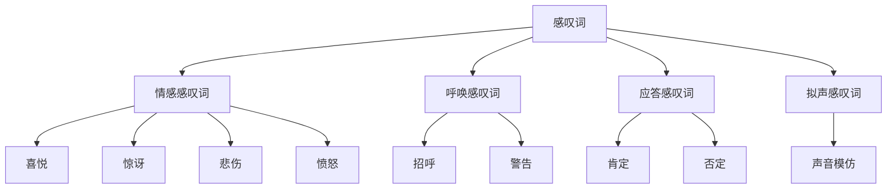

# 感叹词系统

## 📚 感叹词概述

感叹词是用来表达强烈感情或呼唤应答的词类，通常独立使用，不与其他词构成语法关系。

## 🎯 学习目标

- **认识层面**：了解感叹词的基本概念和分类
- **理解层面**：掌握感叹词的用法和语气表达
- **应用层面**：能够正确使用感叹词进行表达

## 📖 感叹词的分类

### 感叹词分类图

## 😊 情感感叹词 (Emotional Interjections)

### 喜悦感叹词

| 感叹词 | 含义 | 例子 |
|--------|------|------|
| Hurrah! | 好哇！ | **Hurrah!** We won the game! |
| Hooray! | 好哇！ | **Hooray!** It's my birthday! |
| Yay! | 太好了！ | **Yay!** I passed the exam! |
| Wow! | 哇！ | **Wow!** What a beautiful view! |
| Great! | 太好了！ | **Great!** That's wonderful! |

### 惊讶感叹词

| 感叹词 | 含义 | 例子 |
|--------|------|------|
| Oh! | 哦！ | **Oh!** I didn't know that! |
| Ah! | 啊！ | **Ah!** Now I understand! |
| What! | 什么！ | **What!** You're kidding! |
| Really! | 真的！ | **Really!** That's amazing! |
| Gosh! | 天哪！ | **Gosh!** That's incredible! |

### 悲伤感叹词

| 感叹词 | 含义 | 例子 |
|--------|------|------|
| Alas! | 唉！ | **Alas!** He is gone forever! |
| Oh no! | 哦不！ | **Oh no!** I lost my keys! |
| Dear me! | 天哪！ | **Dear me!** What a tragedy! |
| Poor thing! | 可怜！ | **Poor thing!** He's so sad! |

### 愤怒感叹词

| 感叹词 | 含义 | 例子 |
|--------|------|------|
| Damn! | 该死！ | **Damn!** I missed the bus! |
| Blast! | 该死！ | **Blast!** The computer crashed! |
| Darn! | 该死！ | **Darn!** I forgot my wallet! |
| Shoot! | 该死！ | **Shoot!** I made a mistake! |

## 📞 呼唤感叹词 (Vocative Interjections)

### 招呼感叹词

| 感叹词 | 含义 | 例子 |
|--------|------|------|
| Hello! | 你好！ | **Hello!** How are you? |
| Hi! | 嗨！ | **Hi!** Nice to see you! |
| Hey! | 嘿！ | **Hey!** Wait for me! |
| Yo! | 哟！ | **Yo!** What's up? |

### 警告感叹词

| 感叹词 | 含义 | 例子 |
|--------|------|------|
| Look out! | 小心！ | **Look out!** There's a car! |
| Watch out! | 注意！ | **Watch out!** The floor is wet! |
| Be careful! | 小心！ | **Be careful!** It's dangerous! |
| Heads up! | 注意！ | **Heads up!** Something's falling! |

## ✅ 应答感叹词 (Response Interjections)

### 肯定应答

| 感叹词 | 含义 | 例子 |
|--------|------|------|
| Yes! | 是的！ | **Yes!** I agree with you! |
| Yeah! | 是的！ | **Yeah!** That's right! |
| Yep! | 是的！ | **Yep!** I understand! |
| Sure! | 当然！ | **Sure!** I'll help you! |
| OK! | 好的！ | **OK!** Let's go! |

### 否定应答

| 感叹词 | 含义 | 例子 |
|--------|------|------|
| No! | 不！ | **No!** I don't think so! |
| Nope! | 不！ | **Nope!** That's not right! |
| Nah! | 不！ | **Nah!** I don't want to! |
| Uh-uh! | 不！ | **Uh-uh!** That's wrong! |

## 🔊 拟声感叹词 (Onomatopoeic Interjections)

### 声音模仿

| 感叹词 | 含义 | 例子 |
|--------|------|------|
| Bang! | 砰！ | **Bang!** The door slammed shut! |
| Crash! | 哗啦！ | **Crash!** The dishes fell! |
| Splash! | 扑通！ | **Splash!** He jumped into the water! |
| Thud! | 砰！ | **Thud!** The book fell to the floor! |
| Tick-tock! | 滴答！ | **Tick-tock!** The clock is running! |

## 📝 感叹词的用法

### 1. 独立使用
- **Oh!** I see what you mean. (哦！我明白你的意思了)
- **Wow!** That's amazing! (哇！太棒了！)

### 2. 句首使用
- **Hello!** How are you today? (你好！你今天怎么样？)
- **Look out!** There's a car coming! (小心！有车来了！)

### 3. 句中使用
- Well, **oh my**, that's interesting! (嗯，哦天哪，那很有趣！)
- I think, **hmm**, we should go now. (我想，嗯，我们现在应该走了)

### 4. 句末使用
- That's great, **hooray!** (太好了，好哇！)
- I can't believe it, **really!** (我无法相信，真的！)

## ⚠️ 常见错误分析

### 错误1：感叹词使用不当
- ❌ **Oh!** I am very happy.
- ✅ **Wow!** I am very happy.

### 错误2：感叹词位置错误
- ❌ I am happy **oh!**
- ✅ **Oh!** I am happy.

### 错误3：感叹词过度使用
- ❌ **Oh!** **Wow!** **Great!** That's wonderful!
- ✅ **Wow!** That's wonderful!

## 🎯 费曼学习法应用

### 第一步：选择概念
选择"情感感叹词"这个概念进行解释

### 第二步：教授他人
用简单语言解释：情感感叹词用来表达强烈的感情

### 第三步：发现问题
在解释过程中发现：不同情感需要不同的感叹词

### 第四步：重新学习
回到资料重新学习各类情感感叹词的用法

### 第五步：简化表达
用更简单的语言重新表达：根据要表达的情感选择合适的感叹词

## 📚 刻意练习

### 基础练习
1. 选择适当的感叹词：
   - (Oh/Wow) I am surprised! → Wow
   - (Hello/Hi) How are you? → Hello

2. 用适当的感叹词填空：
   - **Wow!** That's amazing!
   - **Look out!** There's danger!

### 进阶练习
1. 根据情境选择感叹词：
   - 看到美丽的风景：**Wow!** What a beautiful view!
   - 听到好消息：**Great!** That's wonderful!

2. 用感叹词表达情感：
   - 表达惊讶：**Oh!** I didn't know that!
   - 表达喜悦：**Hooray!** We won!

## 🔗 相关知识点

- [[01-名词系统|名词系统]] - 感叹词独立使用
- [[03-动词系统|动词系统]] - 感叹词不与其他词构成语法关系
- [[02-理解掌握层/03-语气系统/01-陈述语气|陈述语气]] - 感叹词表达语气
- [[02-理解掌握层/03-语气系统/02-疑问语气|疑问语气]] - 感叹词表达疑问

## 📖 扩展阅读

- [[99-附录资料/01-语法术语表|语法术语表]]
- [[04-综合应用/02-常见错误分析/05-其他常见错误|其他常见错误]]
- [[04-综合应用/01-语法综合练习/01-基础练习|基础练习]]
