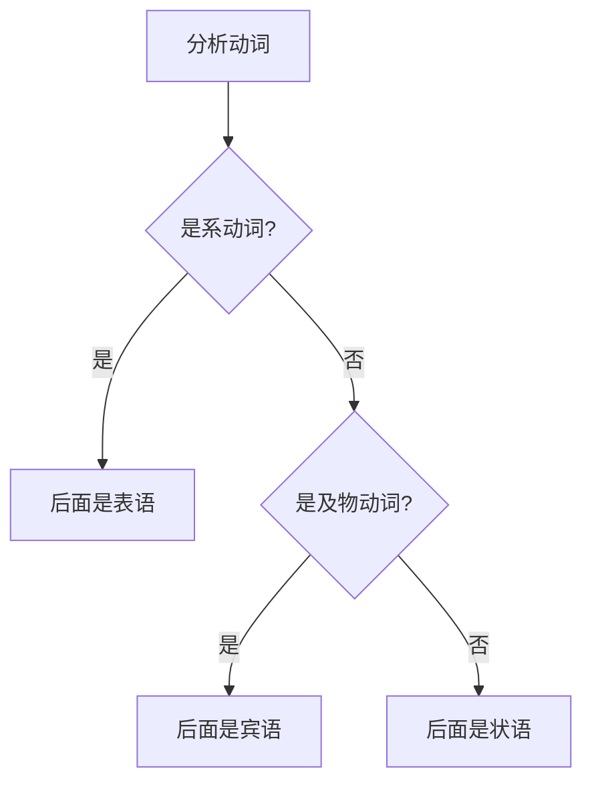
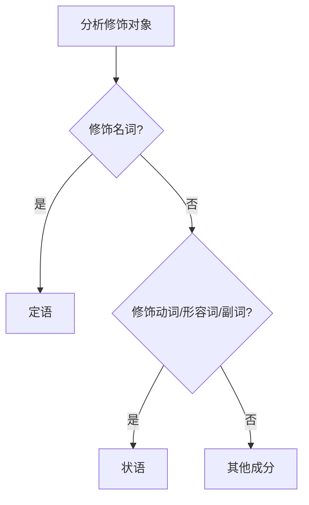
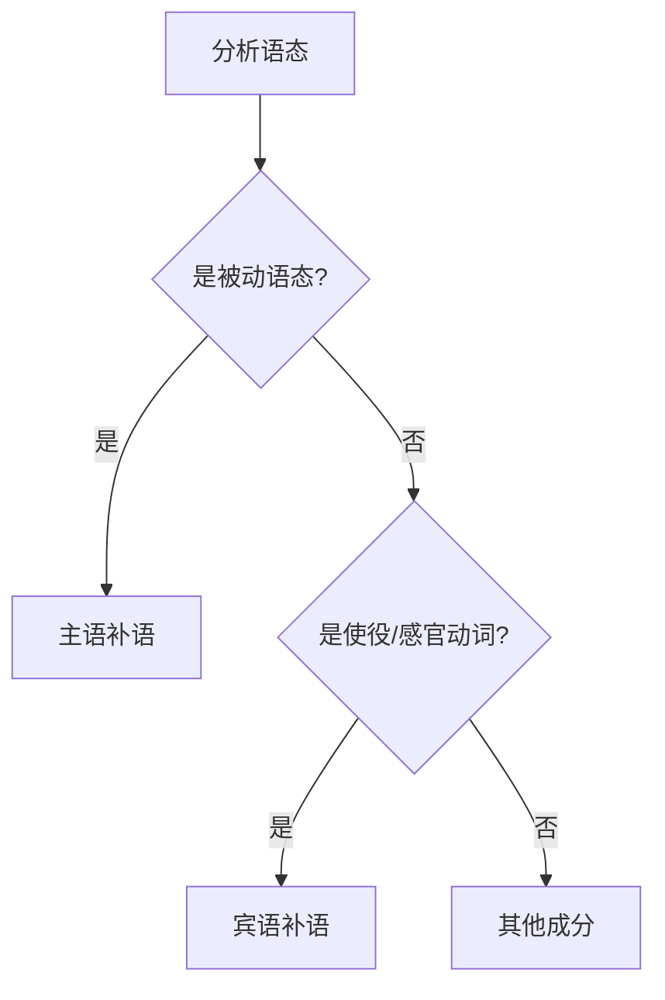
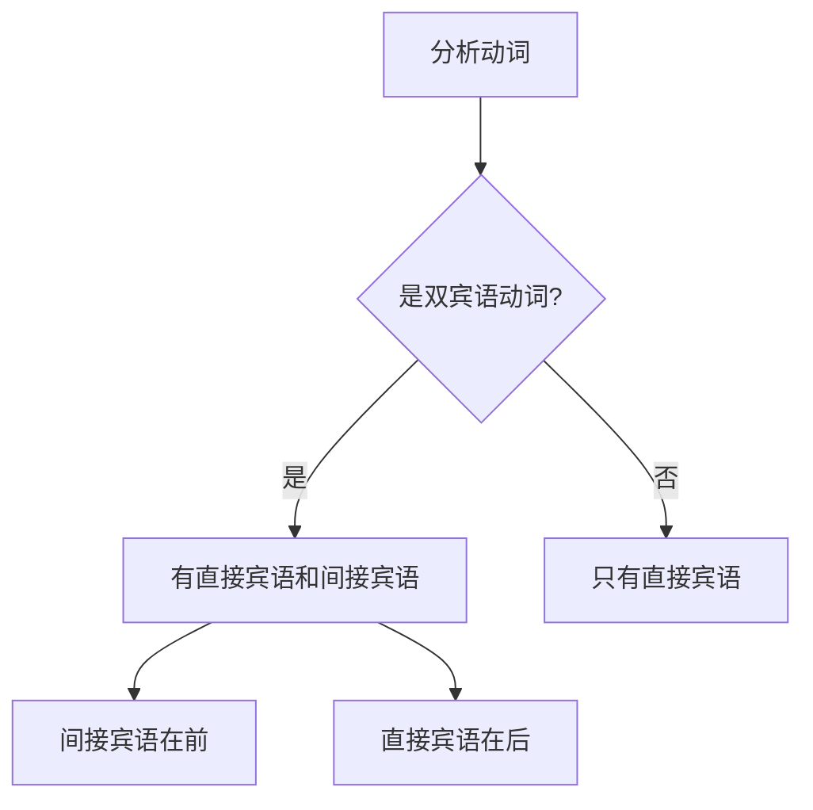
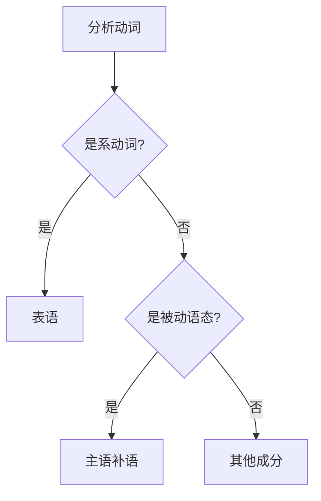

# 句子成分易混点辨析

## 核心概念
句子成分辨析是英语语法学习中的难点，准确区分相似成分有助于提高语法运用的准确性。

## 主要易混点

### 1. 宾语 vs 表语

#### 区别要点
| 方面 | 宾语 | 表语 |
|------|------|------|
| 位置 | 及物动词后 | 系动词后 |
| 功能 | 动作承受者 | 说明主语性质 |
| 动词类型 | 及物动词 | 系动词 |
| 可否省略 | 不可省略 | 不可省略 |

#### 辨析方法

#### 典型例句
- **宾语**: I read books. (read是及物动词)
- **表语**: He is a teacher. (is是系动词)

#### 常见错误
❌ 错误: He looks a teacher.
✅ 正确: He looks like a teacher. (look like是短语动词)

### 2. 定语 vs 状语

#### 区别要点
| 方面 | 定语 | 状语 |
|------|------|------|
| 修饰对象 | 名词、代词 | 动词、形容词、副词 |
| 位置 | 前置或后置 | 句首、句中、句末 |
| 功能 | 限定、描述 | 补充说明 |
| 可否省略 | 可省略 | 可省略 |

#### 辨析方法

#### 典型例句
- **定语**: The book on the desk is mine. (on the desk修饰book)
- **状语**: I study in the library. (in the library修饰study)

#### 常见错误
❌ 错误: The book on the desk is interesting.
✅ 正确: The book on the desk is interesting. (正确)

### 3. 主语补语 vs 宾语补语

#### 区别要点
| 方面 | 主语补语 | 宾语补语 |
|------|----------|----------|
| 位置 | 主语后 | 宾语后 |
| 功能 | 补充说明主语 | 补充说明宾语 |
| 动词类型 | 被动语态 | 使役动词、感官动词 |
| 关系 | 主语与补语 | 宾语与补语 |

#### 辨析方法

#### 典型例句
- **主语补语**: He was elected president. (president补充说明he)
- **宾语补语**: We made him happy. (happy补充说明him)

#### 常见错误
❌ 错误: He was elected as president.
✅ 正确: He was elected president. (elect后直接跟补语)

### 4. 直接宾语 vs 间接宾语

#### 区别要点
| 方面 | 直接宾语 | 间接宾语 |
|------|----------|----------|
| 位置 | 动词后 | 直接宾语前 |
| 功能 | 动作直接承受者 | 动作间接承受者 |
| 转换 | 可转换为被动语态 | 可转换为介词短语 |
| 关系 | 直接关系 | 间接关系 |

#### 辨析方法

#### 典型例句
- **直接宾语**: She gave me a book. (book是直接宾语)
- **间接宾语**: She gave me a book. (me是间接宾语)

#### 常见错误
❌ 错误: She gave a book to me.
✅ 正确: She gave me a book. (间接宾语在前)

### 5. 表语 vs 主语补语

#### 区别要点
| 方面 | 表语 | 主语补语 |
|------|------|----------|
| 动词类型 | 系动词 | 被动语态 |
| 位置 | 系动词后 | 被动语态后 |
| 功能 | 说明主语性质 | 补充说明主语 |
| 关系 | 主系表 | 主谓补 |

#### 辨析方法

#### 典型例句
- **表语**: He is a teacher. (is是系动词)
- **主语补语**: He was elected president. (was elected是被动语态)

## 综合辨析表

| 易混点 | 关键区别 | 判断方法 | 典型例句 |
|--------|----------|----------|----------|
| 宾语 vs 表语 | 动词类型 | 及物动词→宾语，系动词→表语 | read books vs is a teacher |
| 定语 vs 状语 | 修饰对象 | 修饰名词→定语，修饰动词→状语 | book on desk vs study in library |
| 主补 vs 宾补 | 位置关系 | 主语后→主补，宾语后→宾补 | was elected president vs made him happy |
| 直宾 vs 间宾 | 关系远近 | 直接承受→直宾，间接承受→间宾 | gave a book vs gave me |
| 表语 vs 主补 | 动词类型 | 系动词→表语，被动语态→主补 | is a teacher vs was elected president |

## 辨析技巧

### 技巧1: 动词分析法
1. 识别动词类型（及物/不及物/系动词）
2. 根据动词类型判断后续成分
3. 验证成分与动词的搭配关系

### 技巧2: 位置分析法
1. 观察成分在句子中的位置
2. 分析成分与前后词的关系
3. 确定成分的语法功能

### 技巧3: 功能分析法
1. 理解成分的语法功能
2. 分析成分的语义作用
3. 验证成分的必要性

## 记忆口诀
> **宾语表语看动词，及物系动要分清**
> **定语状语看修饰，名词动词要区分**
> **主补宾补看位置，主语宾语要明确**
> **直宾间宾看关系，直接间接要辨明**

## 刻意练习

### 练习1: 成分识别
判断下列句子中划线部分的成分：
1. The book on the desk is interesting.
2. She gave me a beautiful gift.
3. He was elected president last year.
4. I consider him my best friend.

### 练习2: 错误纠正
找出并纠正下列句子中的错误：
1. He looks a teacher.
2. She gave a book to me.
3. The book on the desk is mine.

### 练习3: 成分转换
将下列句子改写，改变句子成分：
1. 原句: She gave me a book.
2. 转换: A book was given to me by her.

## 相关链接
- [[01-基本成分]] - 理解句子基本成分
- [[02-句子结构类型]] - 掌握句子结构类型
- [[03-成分关系图]] - 分析成分关系

## 学习要点
1. **理解**: 掌握各易混点的本质区别
2. **识别**: 能够准确识别相似成分
3. **辨析**: 能够区分易混成分
4. **应用**: 在写作中正确运用各种成分

---
*学习建议: 通过大量对比练习，逐步掌握成分辨析的方法*
