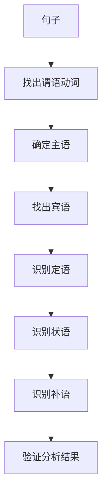

# 句子成分分析练习

## 📚 练习概述

通过系统性的练习，掌握句子成分的识别和分析方法，提高语法分析能力。

## 🎯 练习目标

- **认识层面**：能够识别各种句子成分
- **理解层面**：理解句子成分之间的关系
- **应用层面**：能够分析复杂句子的成分结构

## 📖 练习方法

### 分析步骤

## 🔍 基础练习

### 练习1：简单句分析

#### 题目1
**句子**：The students are studying English in the library.

**分析步骤**：
1. **找出谓语动词**：are studying
2. **确定主语**：The students
3. **找出宾语**：English
4. **识别状语**：in the library (地点状语)

**成分分析**：
- 主语：The students
- 谓语：are studying
- 宾语：English
- 状语：in the library

#### 题目2
**句子**：She is a beautiful teacher.

**分析步骤**：
1. **找出谓语动词**：is
2. **确定主语**：She
3. **识别表语**：a beautiful teacher

**成分分析**：
- 主语：She
- 谓语：is
- 表语：a beautiful teacher
- 定语：beautiful (修饰teacher)

#### 题目3
**句子**：I found the book interesting.

**分析步骤**：
1. **找出谓语动词**：found
2. **确定主语**：I
3. **找出宾语**：the book
4. **识别宾补**：interesting

**成分分析**：
- 主语：I
- 谓语：found
- 宾语：the book
- 宾补：interesting

### 练习2：复合句分析

#### 题目1
**句子**：The book which I bought yesterday is very interesting.

**分析步骤**：
1. **主句**：The book is very interesting.
2. **从句**：which I bought yesterday (定语从句)

**成分分析**：
- 主语：The book
- 谓语：is
- 表语：very interesting
- 定语：which I bought yesterday (修饰book)
- 状语：yesterday (时间状语)

#### 题目2
**句子**：When I was young, I liked to play football.

**分析步骤**：
1. **主句**：I liked to play football.
2. **从句**：When I was young (时间状语从句)

**成分分析**：
- 主语：I
- 谓语：liked
- 宾语：to play football
- 状语：When I was young

## 📊 进阶练习

### 练习3：复杂句分析

#### 题目1
**句子**：The teacher who is standing there is the one that I told you about yesterday.

**分析步骤**：
1. **主句**：The teacher is the one.
2. **定语从句1**：who is standing there (修饰teacher)
3. **定语从句2**：that I told you about yesterday (修饰one)

**成分分析**：
- 主语：The teacher
- 谓语：is
- 表语：the one
- 定语1：who is standing there
- 定语2：that I told you about yesterday
- 状语：yesterday

#### 题目2
**句子**：Although it was raining heavily, we decided to go out because we had promised to meet our friends.

**分析步骤**：
1. **主句**：we decided to go out
2. **让步状语从句**：Although it was raining heavily
3. **原因状语从句**：because we had promised to meet our friends

**成分分析**：
- 主语：we
- 谓语：decided
- 宾语：to go out
- 状语1：Although it was raining heavily
- 状语2：because we had promised to meet our friends

### 练习4：特殊句型分析

#### 题目1：存在句
**句子**：There are many books on the table.

**成分分析**：
- 形式主语：There
- 谓语：are
- 真正主语：many books
- 状语：on the table

#### 题目2：强调句
**句子**：It is the book that I want.

**成分分析**：
- 形式主语：It
- 谓语：is
- 表语：the book
- 强调部分：that I want

#### 题目3：倒装句
**句子**：Never have I seen such a beautiful sunset.

**成分分析**：
- 状语：Never
- 谓语：have seen
- 主语：I
- 宾语：such a beautiful sunset

## 🎯 综合练习

### 练习5：长句分析

#### 题目
**句子**：The students who are studying in the library, which was built last year, are preparing for the exam that will be held next month.

**分析步骤**：
1. **主句**：The students are preparing for the exam.
2. **定语从句1**：who are studying in the library
3. **定语从句2**：which was built last year
4. **定语从句3**：that will be held next month

**成分分析**：
- 主语：The students
- 谓语：are preparing
- 宾语：for the exam
- 定语1：who are studying in the library
- 定语2：which was built last year
- 定语3：that will be held next month
- 状语1：in the library
- 状语2：last year
- 状语3：next month

## 📝 练习答案

### 基础练习答案

#### 练习1答案
1. **The students are studying English in the library.**
   - 主语：The students
   - 谓语：are studying
   - 宾语：English
   - 状语：in the library

2. **She is a beautiful teacher.**
   - 主语：She
   - 谓语：is
   - 表语：a beautiful teacher
   - 定语：beautiful

3. **I found the book interesting.**
   - 主语：I
   - 谓语：found
   - 宾语：the book
   - 宾补：interesting

### 进阶练习答案

#### 练习2答案
1. **The book which I bought yesterday is very interesting.**
   - 主语：The book
   - 谓语：is
   - 表语：very interesting
   - 定语：which I bought yesterday
   - 状语：yesterday

2. **When I was young, I liked to play football.**
   - 主语：I
   - 谓语：liked
   - 宾语：to play football
   - 状语：When I was young

## 🔗 相关知识点

- [[01-主语|主语]] - 主语识别方法
- [[02-谓语|谓语]] - 谓语识别方法
- [[03-宾语|宾语]] - 宾语识别方法
- [[04-定语|定语]] - 定语识别方法
- [[05-状语|状语]] - 状语识别方法
- [[06-补语|补语]] - 补语识别方法

## 📖 扩展练习

### 自测练习
1. 分析下列句子的成分：
   - The beautiful flowers in the garden are blooming.
   - I consider him a good friend.
   - Although it was late, we continued working.

2. 找出下列句子中的定语从句：
   - The man who is talking is my teacher.
   - The book which I read yesterday is interesting.
   - The place where we met is beautiful.

### 提高练习
1. 分析复杂句的成分结构
2. 识别特殊句型的成分
3. 理解句子成分之间的逻辑关系

## 📚 学习建议

1. **循序渐进**：从简单句开始，逐步过渡到复杂句
2. **反复练习**：通过大量练习巩固识别方法
3. **总结规律**：归纳句子成分的识别规律
4. **实际应用**：在阅读和写作中应用分析技能
