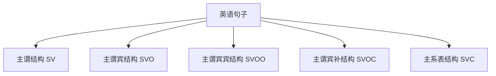

# 五种基本句型

## 📚 基本句型概述

英语句子有五种基本句型，它们是构成所有复杂句子的基础。掌握这五种基本句型是学习英语语法的重要基础。

## 🎯 学习目标

- **认识层面**：了解五种基本句型的结构
- **理解层面**：掌握各句型的构成要素和特点
- **应用层面**：能够识别和使用各种基本句型

## 📖 五种基本句型

### 句型结构图

## 🎭 第一种：主谓结构 (SV)

### 结构特点
- **主语 (Subject)** + **谓语 (Verb)**
- 谓语动词为不及物动词

### 例句分析

| 例句 | 主语 | 谓语 | 说明 |
|------|------|------|------|
| Birds fly. | Birds | fly | 鸟飞翔 |
| The sun rises. | The sun | rises | 太阳升起 |
| She smiled. | She | smiled | 她笑了 |
| Time flies. | Time | flies | 时间飞逝 |

### 使用要点
1. 谓语动词必须是不及物动词
2. 句子意思完整，不需要宾语
3. 可以带状语修饰

### 扩展例句
- **Birds fly** in the sky. (鸟在天空中飞翔)
- **The sun rises** in the east. (太阳从东方升起)
- **She smiled** happily. (她开心地笑了)

## 🎯 第二种：主谓宾结构 (SVO)

### 结构特点
- **主语 (Subject)** + **谓语 (Verb)** + **宾语 (Object)**
- 谓语动词为及物动词

### 例句分析

| 例句 | 主语 | 谓语 | 宾语 | 说明 |
|------|------|------|------|------|
| I read books. | I | read | books | 我读书 |
| She likes music. | She | likes | music | 她喜欢音乐 |
| He bought a car. | He | bought | a car | 他买了一辆车 |
| We study English. | We | study | English | 我们学习英语 |

### 使用要点
1. 谓语动词必须是及物动词
2. 宾语是动作的承受者
3. 宾语可以是名词、代词、动名词、不定式等

### 扩展例句
- **I read books** every day. (我每天读书)
- **She likes music** very much. (她非常喜欢音乐)
- **He bought a car** yesterday. (他昨天买了一辆车)

## 🔄 第三种：主谓宾宾结构 (SVOO)

### 结构特点
- **主语 (Subject)** + **谓语 (Verb)** + **间接宾语 (Indirect Object)** + **直接宾语 (Direct Object)**
- 谓语动词为双宾语动词

### 例句分析

| 例句 | 主语 | 谓语 | 间接宾语 | 直接宾语 | 说明 |
|------|------|------|----------|----------|------|
| He gave me a book. | He | gave | me | a book | 他给了我一本书 |
| She taught us English. | She | taught | us | English | 她教我们英语 |
| I bought him a gift. | I | bought | him | a gift | 我给他买了一个礼物 |
| We sent her a letter. | We | sent | her | a letter | 我们给她寄了一封信 |

### 使用要点
1. 谓语动词必须是双宾语动词
2. 间接宾语通常是人，直接宾语通常是物
3. 可以转换为：动词 + 直接宾语 + to/for + 间接宾语

### 转换例句
- He gave me a book. → He gave a book **to me**.
- She taught us English. → She taught English **to us**.
- I bought him a gift. → I bought a gift **for him**.

## 🎨 第四种：主谓宾补结构 (SVOC)

### 结构特点
- **主语 (Subject)** + **谓语 (Verb)** + **宾语 (Object)** + **补语 (Complement)**
- 补语补充说明宾语

### 例句分析

| 例句 | 主语 | 谓语 | 宾语 | 补语 | 说明 |
|------|------|------|------|------|------|
| We call him Tom. | We | call | him | Tom | 我们叫他汤姆 |
| I found the book interesting. | I | found | the book | interesting | 我发现这本书有趣 |
| He made me angry. | He | made | me | angry | 他让我生气 |
| She considers him honest. | She | considers | him | honest | 她认为他诚实 |

### 使用要点
1. 谓语动词必须是带宾补的动词
2. 补语补充说明宾语的身份、状态、特征等
3. 补语可以是名词、形容词、不定式、分词等

### 常见带宾补的动词
- **使役动词**：make, let, have
- **感官动词**：see, hear, watch, feel
- **认为动词**：consider, think, find, believe
- **称呼动词**：call, name, elect

## 🏠 第五种：主系表结构 (SVC)

### 结构特点
- **主语 (Subject)** + **系动词 (Verb)** + **表语 (Complement)**
- 表语说明主语的身份、状态、特征等

### 例句分析

| 例句 | 主语 | 系动词 | 表语 | 说明 |
|------|------|--------|------|------|
| He is a teacher. | He | is | a teacher | 他是老师 |
| The book is interesting. | The book | is | interesting | 这本书有趣 |
| She looks happy. | She | looks | happy | 她看起来快乐 |
| The flowers are beautiful. | The flowers | are | beautiful | 花很美丽 |

### 使用要点
1. 系动词连接主语和表语
2. 表语说明主语的身份、状态、特征等
3. 表语可以是名词、形容词、介词短语等

### 常见系动词
- **be动词**：am, is, are, was, were
- **感官动词**：look, sound, smell, taste, feel
- **变化动词**：become, get, turn, grow
- **保持动词**：keep, stay, remain

## 📊 句型对比分析

### 对比表

| 句型 | 结构 | 谓语特点 | 例句 |
|------|------|----------|------|
| SV | 主+谓 | 不及物动词 | Birds fly. |
| SVO | 主+谓+宾 | 及物动词 | I read books. |
| SVOO | 主+谓+间宾+直宾 | 双宾语动词 | He gave me a book. |
| SVOC | 主+谓+宾+补 | 带宾补动词 | We call him Tom. |
| SVC | 主+系+表 | 系动词 | He is a teacher. |

## ⚠️ 常见错误分析

### 错误1：句型混淆
- ❌ He is read books. (混淆SVC和SVO)
- ✅ He reads books. (SVO句型)

### 错误2：成分缺失
- ❌ He gave me. (SVOO句型缺少直接宾语)
- ✅ He gave me a book.

### 错误3：动词类型错误
- ❌ I found the book. (SVOC句型缺少补语)
- ✅ I found the book interesting.

## 🎯 费曼学习法应用

### 第一步：选择概念
选择"主谓宾结构"这个概念进行解释

### 第二步：教授他人
用简单语言解释：主谓宾结构是主语执行动作，动作作用于宾语

### 第三步：发现问题
在解释过程中发现：需要区分及物动词和不及物动词

### 第四步：重新学习
回到资料重新学习动词的分类

### 第五步：简化表达
用更简单的语言重新表达：主语做动作，动作作用于宾语

## 📚 刻意练习

### 基础练习
1. 识别下列句子的句型：
   - Birds fly. → SV
   - I read books. → SVO
   - He gave me a book. → SVOO

2. 用适当的句型造句：
   - SV：The sun rises.
   - SVO：She likes music.
   - SVC：He is a teacher.

### 进阶练习
1. 将下列句子转换为不同句型：
   - He gave me a book. → He gave a book to me.
   - I found the book interesting. → The book is interesting.

2. 分析复杂句的基本句型：
   - The book which I bought yesterday is very interesting. → SVC

## 🔗 相关知识点

- [[01-主语|主语]] - 基本句型中的主语
- [[02-谓语|谓语]] - 基本句型中的谓语
- [[03-宾语|宾语]] - 基本句型中的宾语
- [[06-补语|补语]] - 基本句型中的补语

## 📖 扩展阅读

- [[02-句型转换|句型转换]] - 基本句型的转换
- [[03-句型扩展|句型扩展]] - 基本句型的扩展
- [[04-基本句型练习|基本句型练习]] - 基本句型练习
- [[99-附录资料/01-语法术语表|语法术语表]]
