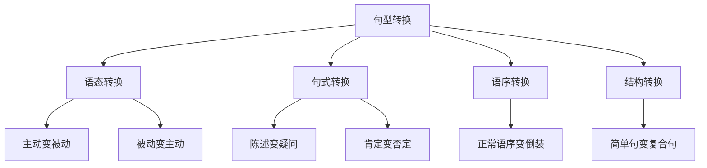

# 句型转换

## 📚 句型转换概述

句型转换是指在不改变句子基本意思的前提下，改变句子的结构形式，使表达更加丰富多样。

## 🎯 学习目标

- **认识层面**：了解句型转换的基本类型
- **理解层面**：掌握各种转换的规则和方法
- **应用层面**：能够熟练进行句型转换

## 📖 句型转换类型

### 转换类型图

## 🔄 语态转换

### 主动语态变被动语态

#### 转换规则
1. 将宾语变为主语
2. 将主语变为by短语（可省略）
3. 谓语动词变为be + 过去分词
4. 保持时态不变

#### 转换示例

| 主动语态 | 被动语态 | 说明 |
|----------|----------|------|
| I read the book. | The book is read by me. | 一般现在时 |
| He wrote a letter. | A letter was written by him. | 一般过去时 |
| She is reading a book. | A book is being read by her. | 现在进行时 |
| They have finished the work. | The work has been finished by them. | 现在完成时 |

#### 特殊转换

##### 双宾语动词
- **主动**：He gave me a book.
- **被动1**：I was given a book by him.
- **被动2**：A book was given to me by him.

##### 带宾补的动词
- **主动**：We call him Tom.
- **被动**：He is called Tom by us.

### 被动语态变主动语态

#### 转换规则
1. 将主语变为宾语
2. 将by短语变为主语
3. 谓语动词变为主动形式
4. 保持时态不变

#### 转换示例

| 被动语态 | 主动语态 | 说明 |
|----------|----------|------|
| The book is read by me. | I read the book. | 一般现在时 |
| A letter was written by him. | He wrote a letter. | 一般过去时 |
| A book is being read by her. | She is reading a book. | 现在进行时 |

## ❓ 句式转换

### 陈述句变疑问句

#### 一般疑问句
- **陈述句**：He is a teacher.
- **疑问句**：Is he a teacher?

#### 特殊疑问句
- **陈述句**：He is a teacher.
- **疑问句**：What is he?

#### 反义疑问句
- **陈述句**：He is a teacher.
- **疑问句**：He is a teacher, isn't he?

### 肯定句变否定句

#### 转换规则
1. 在be动词后加not
2. 在助动词后加not
3. 在情态动词后加not
4. 在实义动词前加don't/doesn't/didn't

#### 转换示例

| 肯定句 | 否定句 | 说明 |
|--------|--------|------|
| He is a teacher. | He is not a teacher. | be动词 |
| He can swim. | He cannot swim. | 情态动词 |
| He reads books. | He does not read books. | 实义动词 |
| He is reading. | He is not reading. | 助动词 |

## 🔀 语序转换

### 倒装句转换

#### 完全倒装
- **正常语序**：Here comes the bus.
- **倒装语序**：The bus comes here.

#### 部分倒装
- **正常语序**：I have never seen such a beautiful sunset.
- **倒装语序**：Never have I seen such a beautiful sunset.

#### 倒装条件
1. **否定词开头**：Never, Seldom, Hardly等
2. **地点副词开头**：Here, There等
3. **条件句省略if**：Had I known, I would have come.

## 🏗️ 结构转换

### 简单句变复合句

#### 并列句转换
- **简单句**：He is tall and handsome.
- **并列句**：He is tall, and he is handsome.

#### 主从复合句转换
- **简单句**：I know his name.
- **复合句**：I know what his name is.

### 复合句变简单句

#### 从句变短语
- **复合句**：The book which I bought yesterday is interesting.
- **简单句**：The book bought yesterday is interesting.

#### 从句变不定式
- **复合句**：I hope that I can see you again.
- **简单句**：I hope to see you again.

## 📊 转换练习

### 基础转换练习

#### 练习1：语态转换
1. **主动变被动**
   - I read the book. → The book is read by me.
   - He wrote a letter. → A letter was written by him.

2. **被动变主动**
   - The book is read by me. → I read the book.
   - A letter was written by him. → He wrote a letter.

#### 练习2：句式转换
1. **陈述变疑问**
   - He is a teacher. → Is he a teacher?
   - She likes music. → Does she like music?

2. **肯定变否定**
   - He is a teacher. → He is not a teacher.
   - She likes music. → She does not like music.

### 进阶转换练习

#### 练习3：语序转换
1. **倒装转换**
   - Never have I seen such a beautiful sunset.
   - Here comes the bus.

2. **正常语序转换**
   - I have never seen such a beautiful sunset.
   - The bus comes here.

#### 练习4：结构转换
1. **简单句变复合句**
   - He is tall and handsome. → He is tall, and he is handsome.
   - I know his name. → I know what his name is.

2. **复合句变简单句**
   - The book which I bought yesterday is interesting. → The book bought yesterday is interesting.
   - I hope that I can see you again. → I hope to see you again.

## ⚠️ 常见错误分析

### 错误1：语态转换错误
- ❌ The book is read by I.
- ✅ The book is read by me.

### 错误2：疑问句转换错误
- ❌ Does he is a teacher?
- ✅ Is he a teacher?

### 错误3：否定句转换错误
- ❌ He not is a teacher.
- ✅ He is not a teacher.

## 🎯 费曼学习法应用

### 第一步：选择概念
选择"语态转换"这个概念进行解释

### 第二步：教授他人
用简单语言解释：语态转换是改变动作的执行者和承受者

### 第三步：发现问题
在解释过程中发现：需要掌握动词的过去分词形式

### 第四步：重新学习
回到资料重新学习动词的变化规律

### 第五步：简化表达
用更简单的语言重新表达：主动语态是主语做动作，被动语态是主语承受动作

## 📚 刻意练习

### 基础练习
1. 将下列句子改为被动语态：
   - I read the book. → The book is read by me.
   - He wrote a letter. → A letter was written by him.

2. 将下列句子改为疑问句：
   - He is a teacher. → Is he a teacher?
   - She likes music. → Does she like music?

### 进阶练习
1. 将下列句子改为倒装句：
   - I have never seen such a beautiful sunset. → Never have I seen such a beautiful sunset.
   - Here comes the bus. → The bus comes here.

2. 将下列复合句改为简单句：
   - The book which I bought yesterday is interesting. → The book bought yesterday is interesting.

## 🔗 相关知识点

- [[01-五种基本句型|五种基本句型]] - 句型转换的基础
- [[02-理解掌握层/02-语态系统/02-被动语态|被动语态]] - 语态转换
- [[02-理解掌握层/03-语气系统/02-疑问语气|疑问语气]] - 句式转换
- [[03-应用提升层/02-特殊语法结构/01-倒装结构|倒装结构]] - 语序转换

## 📖 扩展阅读

- [[03-句型扩展|句型扩展]] - 句型的进一步扩展
- [[04-基本句型练习|基本句型练习]] - 句型转换练习
- [[99-附录资料/01-语法术语表|语法术语表]]
