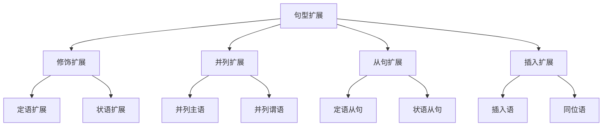

# 句型扩展

## 📚 句型扩展概述

句型扩展是指在基本句型的基础上，通过添加修饰成分、并列成分或从句，使句子更加丰富、准确和生动。

## 🎯 学习目标

- **认识层面**：了解句型扩展的基本方法
- **理解层面**：掌握各种扩展技巧和规则
- **应用层面**：能够熟练进行句型扩展

## 📖 句型扩展方法

### 扩展方法图

## 🔧 修饰扩展

### 定语扩展

#### 前置定语
- **基本句**：The book is interesting.
- **扩展句**：The interesting book is very popular.

#### 后置定语
- **基本句**：The man is my teacher.
- **扩展句**：The man in the black suit is my teacher.

#### 多重定语
- **基本句**：The car is red.
- **扩展句**：The beautiful red sports car is very expensive.

### 状语扩展

#### 时间状语
- **基本句**：I read books.
- **扩展句**：I read books every day in the library.

#### 地点状语
- **基本句**：She works.
- **扩展句**：She works hard in the office.

#### 方式状语
- **基本句**：He speaks.
- **扩展句**：He speaks English fluently.

#### 原因状语
- **基本句**：He is tired.
- **扩展句**：He is tired because he worked all night.

## 🔗 并列扩展

### 并列主语
- **基本句**：Tom is a student.
- **扩展句**：Tom and Mary are students.

### 并列谓语
- **基本句**：He reads books.
- **扩展句**：He reads books and writes articles.

### 并列宾语
- **基本句**：I like music.
- **扩展句**：I like music and sports.

### 并列定语
- **基本句**：The book is interesting.
- **扩展句**：The book is interesting and educational.

## 📝 从句扩展

### 定语从句扩展
- **基本句**：The book is interesting.
- **扩展句**：The book which I bought yesterday is interesting.

### 状语从句扩展
- **基本句**：I will go to school.
- **扩展句**：I will go to school if it doesn't rain.

### 名词性从句扩展
- **基本句**：I know the answer.
- **扩展句**：I know what the answer is.

## 💬 插入扩展

### 插入语
- **基本句**：He is a good student.
- **扩展句**：He is, in my opinion, a good student.

### 同位语
- **基本句**：Beijing is the capital.
- **扩展句**：Beijing, the capital of China, is a beautiful city.

### 呼语
- **基本句**：Come here.
- **扩展句**：Come here, Tom.

## 📊 扩展练习

### 基础扩展练习

#### 练习1：修饰扩展
1. **定语扩展**
   - The book is interesting. → The interesting book is very popular.
   - The man is my teacher. → The man in the black suit is my teacher.

2. **状语扩展**
   - I read books. → I read books every day in the library.
   - She works. → She works hard in the office.

#### 练习2：并列扩展
1. **并列主语**
   - Tom is a student. → Tom and Mary are students.

2. **并列谓语**
   - He reads books. → He reads books and writes articles.

### 进阶扩展练习

#### 练习3：从句扩展
1. **定语从句**
   - The book is interesting. → The book which I bought yesterday is interesting.

2. **状语从句**
   - I will go to school. → I will go to school if it doesn't rain.

#### 练习4：插入扩展
1. **插入语**
   - He is a good student. → He is, in my opinion, a good student.

2. **同位语**
   - Beijing is the capital. → Beijing, the capital of China, is a beautiful city.

## ⚠️ 常见错误分析

### 错误1：修饰语位置错误
- ❌ The book interesting is very popular.
- ✅ The interesting book is very popular.

### 错误2：并列结构不一致
- ❌ He likes reading and to write.
- ✅ He likes reading and writing.

### 错误3：从句引导词错误
- ❌ The book which I bought it yesterday is interesting.
- ✅ The book which I bought yesterday is interesting.

## 🎯 费曼学习法应用

### 第一步：选择概念
选择"定语扩展"这个概念进行解释

### 第二步：教授他人
用简单语言解释：定语扩展是给名词添加修饰语

### 第三步：发现问题
在解释过程中发现：需要掌握定语的位置规则

### 第四步：重新学习
回到资料重新学习定语的语法规则

### 第五步：简化表达
用更简单的语言重新表达：定语是修饰名词的词或短语

## 📚 刻意练习

### 基础练习
1. 给下列句子添加定语：
   - The book is interesting. → The interesting book is very popular.
   - The man is my teacher. → The man in the black suit is my teacher.

2. 给下列句子添加状语：
   - I read books. → I read books every day in the library.
   - She works. → She works hard in the office.

### 进阶练习
1. 将下列句子改为并列结构：
   - Tom is a student. → Tom and Mary are students.
   - He reads books. → He reads books and writes articles.

2. 给下列句子添加从句：
   - The book is interesting. → The book which I bought yesterday is interesting.
   - I will go to school. → I will go to school if it doesn't rain.

## 🔗 相关知识点

- [[01-五种基本句型|五种基本句型]] - 句型扩展的基础
- [[02-句型转换|句型转换]] - 句型转换技巧
- [[01-基础认知层/02-句子成分/04-定语|定语]] - 定语扩展
- [[01-基础认知层/02-句子成分/05-状语|状语]] - 状语扩展

## 📖 扩展阅读

- [[04-基本句型练习|基本句型练习]] - 句型扩展练习
- [[02-理解掌握层/04-从句系统/02-定语从句|定语从句]] - 从句扩展
- [[99-附录资料/01-语法术语表|语法术语表]]
