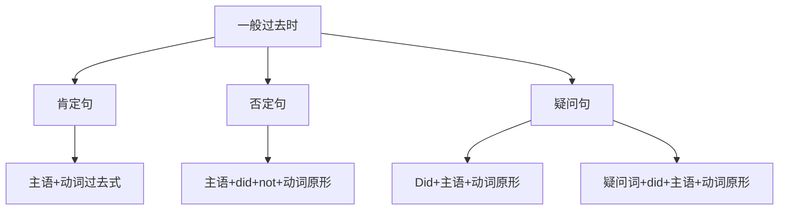

# 一般过去时

## 🎯 学习目标
- 掌握一般过去时的基本概念和构成
- 理解一般过去时的各种用法
- 熟练运用一般过去时的各种形式

## 📚 基本概念

### 一般过去时（Simple Past Tense）
**定义**：表示过去某个时间发生的动作或状态

### 基本特征
- 表示过去的动作或状态
- 有肯定、否定、疑问形式
- 动词用过去式
- 常与过去时间状语连用

## 🔄 一般过去时构成

## 📊 一般过去时变化表

### 基本变化表
| 人称 | 肯定句 | 否定句 | 疑问句 |
|------|--------|--------|--------|
| 第一人称单数 | I worked. | I did not work. | Did I work? |
| 第二人称单数 | You worked. | You did not work. | Did you work? |
| 第三人称单数 | He worked. | He did not work. | Did he work? |
| 第一人称复数 | We worked. | We did not work. | Did we work? |
| 第二人称复数 | You worked. | You did not work. | Did you work? |
| 第三人称复数 | They worked. | They did not work. | Did they work? |

## 🎯 基本用法

### 1. 表示过去某个时间发生的动作
**功能**：表示过去某个时间发生的动作

**示例**：
- ✅ I went to Beijing yesterday. (我昨天去了北京)
- ✅ She studied English last year. (她去年学英语)
- ✅ He played football last week. (他上周踢足球)
- ✅ We had dinner at 7:00 yesterday. (我们昨天7点吃晚饭)
- ✅ They visited the museum last month. (他们上个月参观了博物馆)

**语法特点**：
- 表示过去发生的动作
- 常与过去时间状语连用
- 动词用过去式

### 2. 表示过去存在的状态
**功能**：表示过去存在的状态

**示例**：
- ✅ I was a student last year. (我去年是学生)
- ✅ She was beautiful when she was young. (她年轻时很美丽)
- ✅ He had a car last year. (他去年有车)
- ✅ We lived in Shanghai last year. (我们去年住在上海)
- ✅ They were happy yesterday. (他们昨天很快乐)

**语法特点**：
- 表示过去存在的状态
- 用be动词或实义动词
- 动词用过去式

### 3. 表示过去的习惯性动作
**功能**：表示过去的习惯性动作

**示例**：
- ✅ I always got up early when I was young. (我年轻时总是早起)
- ✅ She often went to the library. (她经常去图书馆)
- ✅ He usually played basketball after school. (他通常放学后打篮球)
- ✅ We sometimes had dinner together. (我们有时一起吃晚饭)
- ✅ They rarely watched TV. (他们很少看电视)

**语法特点**：
- 表示过去的习惯性动作
- 常与频率副词连用
- 动词用过去式

### 4. 表示过去连续发生的动作
**功能**：表示过去连续发生的动作

**示例**：
- ✅ I got up, had breakfast, and went to school. (我起床、吃早饭，然后去上学)
- ✅ She opened the door, entered the room, and sat down. (她开门、进入房间，然后坐下)
- ✅ He took off his coat, hung it up, and sat down. (他脱掉外套、挂起来，然后坐下)
- ✅ We arrived at the station, bought tickets, and got on the train. (我们到达车站、买票，然后上火车)
- ✅ They finished their work, packed their bags, and left. (他们完成工作、收拾行李，然后离开)

**语法特点**：
- 表示过去连续发生的动作
- 动作按时间顺序发生
- 动词用过去式

## 🎯 时间状语

### 1. 表示过去时间的状语
**功能**：表示过去的时间

**示例**：
- ✅ I went to Beijing yesterday. (我昨天去了北京)
- ✅ She studied English last year. (她去年学英语)
- ✅ He played football last week. (他上周踢足球)
- ✅ We had dinner at 7:00 yesterday. (我们昨天7点吃晚饭)
- ✅ They visited the museum last month. (他们上个月参观了博物馆)

**语法特点**：
- 表示过去时间
- 常用yesterday, last year, last week等
- 放在句首或句末

### 2. 表示过去时间点的状语
**功能**：表示过去的具体时间点

**示例**：
- ✅ I arrived at 8:00 yesterday morning. (我昨天早上8点到达)
- ✅ She left at 3:00 yesterday afternoon. (她昨天下午3点离开)
- ✅ He called me at 9:00 last night. (他昨晚9点给我打电话)
- ✅ We met at 2:00 yesterday. (我们昨天2点见面)
- ✅ They started at 10:00 yesterday. (他们昨天10点开始)

**语法特点**：
- 表示过去的具体时间点
- 常用at+时间点
- 放在句首或句末

### 3. 表示过去时间段的状语
**功能**：表示过去的时间段

**示例**：
- ✅ I worked for 8 hours yesterday. (我昨天工作了8个小时)
- ✅ She studied for 3 hours last night. (她昨晚学习了3个小时)
- ✅ He played football for 2 hours last week. (他上周踢了2个小时足球)
- ✅ We stayed there for a week last month. (我们上个月在那里待了一个星期)
- ✅ They traveled for 10 days last year. (他们去年旅行了10天)

**语法特点**：
- 表示过去的时间段
- 常用for+时间段
- 放在句首或句末

## 🎯 动词过去式构成

### 1. 规则变化
**规则**：动词原形+ed

**变化规则**：
| 规则 | 示例 | 说明 |
|------|------|------|
| 一般情况 | work→worked, play→played | 直接加-ed |
| 以e结尾 | live→lived, hope→hoped | 直接加-d |
| 以辅音字母+y结尾 | study→studied, try→tried | 变y为i加-ed |
| 以重读闭音节结尾 | stop→stopped, plan→planned | 双写辅音字母加-ed |

**示例**：
- ✅ work → worked (工作)
- ✅ play → played (玩)
- ✅ live → lived (生活)
- ✅ hope → hoped (希望)
- ✅ study → studied (学习)
- ✅ try → tried (尝试)
- ✅ stop → stopped (停止)
- ✅ plan → planned (计划)

**语法特点**：
- 规则变化
- 直接加-ed
- 有特殊变化规则

### 2. 不规则变化
**规则**：不规则动词的过去式

**示例**：
- ✅ go → went (去)
- ✅ come → came (来)
- ✅ see → saw (看)
- ✅ do → did (做)
- ✅ have → had (有)
- ✅ be → was/were (是)

**语法特点**：
- 不规则变化
- 需要特殊记忆
- 大多数不规则动词过去式不规则

## 🎯 特殊用法

### 1. 表示过去的习惯性动作
**功能**：表示过去的习惯性动作

**示例**：
- ✅ I always got up early when I was young. (我年轻时总是早起)
- ✅ She often went to the library. (她经常去图书馆)
- ✅ He usually played basketball after school. (他通常放学后打篮球)
- ✅ We sometimes had dinner together. (我们有时一起吃晚饭)
- ✅ They rarely watched TV. (他们很少看电视)

**语法特点**：
- 表示过去的习惯性动作
- 常与频率副词连用
- 动词用过去式

### 2. 表示过去连续发生的动作
**功能**：表示过去连续发生的动作

**示例**：
- ✅ I got up, had breakfast, and went to school. (我起床、吃早饭，然后去上学)
- ✅ She opened the door, entered the room, and sat down. (她开门、进入房间，然后坐下)
- ✅ He took off his coat, hung it up, and sat down. (他脱掉外套、挂起来，然后坐下)
- ✅ We arrived at the station, bought tickets, and got on the train. (我们到达车站、买票，然后上火车)
- ✅ They finished their work, packed their bags, and left. (他们完成工作、收拾行李，然后离开)

**语法特点**：
- 表示过去连续发生的动作
- 动作按时间顺序发生
- 动词用过去式

### 3. 表示过去的经历
**功能**：表示过去的经历

**示例**：
- ✅ I went to Beijing last year. (我去年去了北京)
- ✅ She saw this movie last week. (她上周看了这部电影)
- ✅ He read this book last month. (他上个月读了这本书)
- ✅ We visited many countries last year. (我们去年访问了许多国家)
- ✅ They met the president last year. (他们去年见了总统)

**语法特点**：
- 表示过去的经历
- 强调经历
- 动词用过去式

## 📊 一般过去时用法对比表

| 用法 | 示例 | 说明 |
|------|------|------|
| 过去发生的动作 | I went to Beijing yesterday. | 表示过去发生的动作 |
| 过去存在的状态 | I was a student last year. | 表示过去存在的状态 |
| 过去的习惯性动作 | I always got up early when I was young. | 表示过去的习惯性动作 |
| 过去连续发生的动作 | I got up, had breakfast, and went to school. | 表示过去连续发生的动作 |
| 过去的经历 | I went to Beijing last year. | 表示过去的经历 |

## 🚫 常见错误分析

### 错误类型1：过去式使用错误
**错误**：❌ I go to Beijing yesterday.
**正确**：✅ I went to Beijing yesterday.
**分析**：过去时态需要用过去式

### 错误类型2：助动词使用错误
**错误**：❌ I did not went to Beijing yesterday.
**正确**：✅ I did not go to Beijing yesterday.
**分析**：否定句中助动词后接动词原形

### 错误类型3：疑问句构成错误
**错误**：❌ Did you went to Beijing yesterday?
**正确**：✅ Did you go to Beijing yesterday?
**分析**：疑问句中助动词后接动词原形

### 错误类型4：时间状语使用错误
**错误**：❌ I went to Beijing tomorrow.
**正确**：✅ I will go to Beijing tomorrow.
**分析**：将来时间用将来时态

## 🔗 相关链接
- [[02-过去进行时]]：过去进行时的用法
- [[03-过去完成时]]：过去完成时的用法
- [[04-过去完成进行时]]：过去完成进行时的用法
- [[05-过去时态对比分析]]：过去时态的对比分析
- [[01-基础认知层/01-词性系统/03-动词系统/03-动词基本形式]]：动词的基本形式

## 💡 记忆口诀

**一般过去时记忆法**：
- 过去发生的动作用一般过去时，过去存在的状态用一般过去时
- 过去的习惯性动作用一般过去时，过去连续发生的动作用一般过去时
- 构成：主语+动词过去式，否定句用did+not+动词原形
- 疑问句用Did+主语+动词原形，时间状语用过去时间
- 规则动词加-ed，不规则动词要特殊记忆
- 过去时间用过去时态，将来时间用将来时态

---
*掌握一般过去时是语法学习的重要基础，需要大量练习才能熟练运用*
