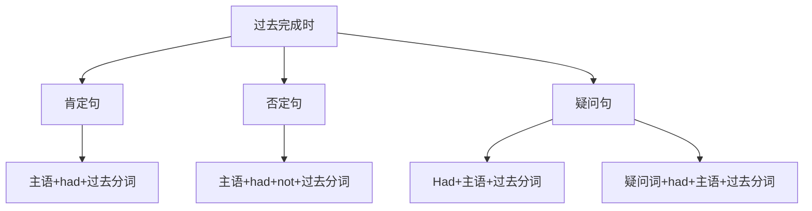

# 过去完成时

## 🎯 学习目标
- 掌握过去完成时的基本概念和构成
- 理解过去完成时的各种用法
- 熟练运用过去完成时的各种形式

## 📚 基本概念

### 过去完成时（Past Perfect Tense）
**定义**：表示在过去某个时间之前已经完成的动作或状态

### 基本特征
- 表示过去的过去
- 表示动作的完成
- 有肯定、否定、疑问形式
- 用had+过去分词构成

## 🔄 过去完成时构成

## 📊 过去完成时变化表

### 基本变化表
| 人称 | 肯定句 | 否定句 | 疑问句 |
|------|--------|--------|--------|
| 第一人称单数 | I had worked. | I had not worked. | Had I worked? |
| 第二人称单数 | You had worked. | You had not worked. | Had you worked? |
| 第三人称单数 | He had worked. | He had not worked. | Had he worked? |
| 第一人称复数 | We had worked. | We had not worked. | Had we worked? |
| 第二人称复数 | You had worked. | You had not worked. | Had you worked? |
| 第三人称复数 | They had worked. | They had not worked. | Had they worked? |

## 🎯 基本用法

### 1. 表示过去的过去
**功能**：表示在过去某个时间之前已经完成的动作

**示例**：
- ✅ When I arrived, he had already left. (我到达时，他已经离开了)
- ✅ By the time she came, I had finished my work. (她来时，我已经完成了工作)
- ✅ Before he went to bed, he had brushed his teeth. (他睡觉前，已经刷了牙)
- ✅ After I had eaten dinner, I watched TV. (我吃完晚饭后，看了电视)
- ✅ By 8:00 yesterday, I had finished my homework. (昨天8点前，我已经完成了作业)

**语法特点**：
- 表示过去的过去
- 强调动作的完成
- 用had+过去分词构成

### 2. 表示过去某个时间之前持续的动作或状态
**功能**：表示过去某个时间之前持续的动作或状态

**示例**：
- ✅ I had lived here for 10 years before I moved. (我搬家前在这里住了10年)
- ✅ She had worked in this company for 5 years before she quit. (她辞职前在这家公司工作了5年)
- ✅ He had studied English for 3 years before he went abroad. (他出国前学了3年英语)
- ✅ We had known each other for a long time before we got married. (我们结婚前认识很久了)
- ✅ They had been married for 20 years before they divorced. (他们离婚前结婚已经20年了)

**语法特点**：
- 表示过去某个时间之前持续的动作或状态
- 常与for, since连用
- 用had+过去分词构成

### 3. 表示过去的经历
**功能**：表示过去的经历

**示例**：
- ✅ I had been to Beijing before I went to Shanghai. (我去上海前去过北京)
- ✅ She had seen this movie before she recommended it. (她推荐这部电影前看过)
- ✅ He had read this book before he bought it. (他买这本书前读过)
- ✅ We had visited many countries before we settled down. (我们定居前访问过许多国家)
- ✅ They had met the president before they retired. (他们退休前见过总统)

**语法特点**：
- 表示过去的经历
- 强调经历
- 用had+过去分词构成

### 4. 表示过去某个时间之前刚刚完成的动作
**功能**：表示过去某个时间之前刚刚完成的动作

**示例**：
- ✅ I had just finished my work when you called. (你打电话时，我刚刚完成工作)
- ✅ She had just arrived when the meeting started. (会议开始时，她刚刚到达)
- ✅ He had just left when I arrived. (我到达时，他刚刚离开)
- ✅ We had just started when it began to rain. (开始下雨时，我们刚刚开始)
- ✅ They had just finished when the bell rang. (铃响时，他们刚刚完成)

**语法特点**：
- 表示过去某个时间之前刚刚完成的动作
- 常与just连用
- 用had+过去分词构成

## 🎯 时间状语

### 1. 表示过去时间的状语
**功能**：表示过去的时间

**示例**：
- ✅ By 8:00 yesterday, I had finished my homework. (昨天8点前，我已经完成了作业)
- ✅ By the time she came, I had finished my work. (她来时，我已经完成了工作)
- ✅ Before he went to bed, he had brushed his teeth. (他睡觉前，已经刷了牙)
- ✅ After I had eaten dinner, I watched TV. (我吃完晚饭后，看了电视)
- ✅ When I arrived, he had already left. (我到达时，他已经离开了)

**语法特点**：
- 表示过去时间
- 常用by, before, after, when等
- 放在句首或句末

### 2. 表示持续时间的状语
**功能**：表示持续的时间

**示例**：
- ✅ I had lived here for 10 years before I moved. (我搬家前在这里住了10年)
- ✅ She had worked in this company for 5 years before she quit. (她辞职前在这家公司工作了5年)
- ✅ He had studied English for 3 years before he went abroad. (他出国前学了3年英语)
- ✅ We had known each other for a long time before we got married. (我们结婚前认识很久了)
- ✅ They had been married for 20 years before they divorced. (他们离婚前结婚已经20年了)

**语法特点**：
- 表示持续时间
- 常用for, since连用
- for后接时间段，since后接时间点

### 3. 表示不确定时间的状语
**功能**：表示不确定的时间

**示例**：
- ✅ I had already finished my homework. (我已经完成了作业)
- ✅ She had never been to Japan before. (她以前从未去过日本)
- ✅ He had ever seen this movie before. (他以前曾经看过这部电影)
- ✅ We had just arrived when it began to rain. (开始下雨时，我们刚刚到达)
- ✅ They had recently moved when we visited them. (我们去看他们时，他们最近搬了家)

**语法特点**：
- 表示不确定时间
- 常用already, never, ever, just, recently等
- 放在had和过去分词之间

## 🎯 过去分词构成

### 1. 规则变化
**规则**：动词原形+ed

**变化规则**：
| 规则 | 示例 | 说明 |
|---|---|---|
| 一般情况 | work→worked, play→played | 直接加-ed |
| 以e结尾 | live→lived, hope→hoped | 直接加-d |
| 以辅音字母+y结尾 | study→studied, try→tried | 变y为i加-ed |
| 以重读闭音节结尾 | stop→stopped, plan→planned | 双写辅音字母加-ed |

**示例**：
- ✅ work → worked (工作)
- ✅ play → played (玩)
- ✅ live → lived (生活)
- ✅ hope → hoped (希望)
- ✅ study → studied (学习)
- ✅ try → tried (尝试)
- ✅ stop → stopped (停止)
- ✅ plan → planned (计划)

**语法特点**：
- 规则变化
- 直接加-ed
- 有特殊变化规则

### 2. 不规则变化
**规则**：不规则动词的过去分词

**示例**：
- ✅ go → gone (去)
- ✅ come → come (来)
- ✅ see → seen (看)
- ✅ do → done (做)
- ✅ have → had (有)
- ✅ be → been (是)

**语法特点**：
- 不规则变化
- 需要特殊记忆
- 大多数不规则动词过去分词不规则

## 🎯 特殊用法

### 1. 表示过去的过去
**功能**：表示过去的过去

**示例**：
- ✅ When I arrived, he had already left. (我到达时，他已经离开了)
- ✅ By the time she came, I had finished my work. (她来时，我已经完成了工作)
- ✅ Before he went to bed, he had brushed his teeth. (他睡觉前，已经刷了牙)
- ✅ After I had eaten dinner, I watched TV. (我吃完晚饭后，看了电视)
- ✅ By 8:00 yesterday, I had finished my homework. (昨天8点前，我已经完成了作业)

**语法特点**：
- 表示过去的过去
- 强调动作的完成
- 用had+过去分词构成

### 2. 表示过去某个时间之前持续的动作或状态
**功能**：表示过去某个时间之前持续的动作或状态

**示例**：
- ✅ I had lived here for 10 years before I moved. (我搬家前在这里住了10年)
- ✅ She had worked in this company for 5 years before she quit. (她辞职前在这家公司工作了5年)
- ✅ He had studied English for 3 years before he went abroad. (他出国前学了3年英语)
- ✅ We had known each other for a long time before we got married. (我们结婚前认识很久了)
- ✅ They had been married for 20 years before they divorced. (他们离婚前结婚已经20年了)

**语法特点**：
- 表示过去某个时间之前持续的动作或状态
- 常与for, since连用
- 用had+过去分词构成

### 3. 表示过去的经历
**功能**：表示过去的经历

**示例**：
- ✅ I had been to Beijing before I went to Shanghai. (我去上海前去过北京)
- ✅ She had seen this movie before she recommended it. (她推荐这部电影前看过)
- ✅ He had read this book before he bought it. (他买这本书前读过)
- ✅ We had visited many countries before we settled down. (我们定居前访问过许多国家)
- ✅ They had met the president before they retired. (他们退休前见过总统)

**语法特点**：
- 表示过去的经历
- 强调经历
- 用had+过去分词构成

## 📊 过去完成时用法对比表

| 用法 | 示例 | 说明 |
|------|------|------|
| 过去的过去 | When I arrived, he had already left. | 表示过去的过去 |
| 过去持续的动作或状态 | I had lived here for 10 years before I moved. | 表示过去持续的动作或状态 |
| 过去的经历 | I had been to Beijing before I went to Shanghai. | 表示过去的经历 |
| 过去刚刚完成的动作 | I had just finished my work when you called. | 表示过去刚刚完成的动作 |

## 🚫 常见错误分析

### 错误类型1：had使用错误
**错误**：❌ I have finished my work yesterday.
**正确**：✅ I had finished my work yesterday.
**分析**：过去完成时需要用had

### 错误类型2：过去分词使用错误
**错误**：❌ I had finish my work yesterday.
**正确**：✅ I had finished my work yesterday.
**分析**：过去完成时需要用过去分词

### 错误类型3：时间状语使用错误
**错误**：❌ I had finished my work tomorrow.
**正确**：✅ I will have finished my work tomorrow.
**分析**：将来时间用将来完成时

### 错误类型4：时态选择错误
**错误**：❌ When I arrived, he left.
**正确**：✅ When I arrived, he had left.
**分析**：过去的过去用过去完成时

## 🔗 相关链接
- [[01-一般过去时]]：一般过去时的用法
- [[02-过去进行时]]：过去进行时的用法
- [[04-过去完成进行时]]：过去完成进行时的用法
- [[05-过去时态对比分析]]：过去时态的对比分析
- [[01-基础认知层/01-词性系统/03-动词系统/03-动词基本形式]]：动词的基本形式

## 💡 记忆口诀

**过去完成时记忆法**：
- 过去的过去用过去完成时，过去持续的动作或状态用过去完成时
- 过去的经历用过去完成时，过去刚刚完成的动作用过去完成时
- 构成：had+过去分词，had随人称变化
- 时间状语：by, before, after, when, for, since
- for后接时间段，since后接时间点
- 过去的过去要分清，时态选择要正确

---
*掌握过去完成时是语法学习的重要基础，需要大量练习才能熟练运用*
