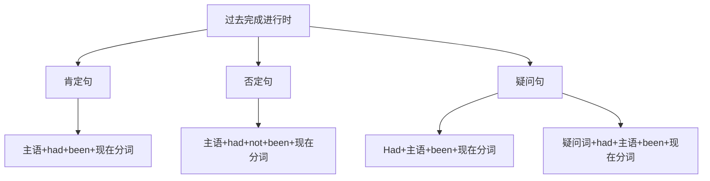

# 过去完成进行时

## 🎯 学习目标
- 掌握过去完成进行时的基本概念和构成
- 理解过去完成进行时的各种用法
- 熟练运用过去完成进行时的各种形式

## 📚 基本概念

### 过去完成进行时（Past Perfect Continuous Tense）
**定义**：表示在过去某个时间之前一直持续进行，并且可能继续下去的动作

### 基本特征
- 表示过去的持续动作
- 表示动作的未完成性
- 有肯定、否定、疑问形式
- 用had+been+现在分词构成

## 🔄 过去完成进行时构成

## 📊 过去完成进行时变化表

### 基本变化表
| 人称 | 肯定句 | 否定句 | 疑问句 |
|------|--------|--------|--------|
| 第一人称单数 | I had been working. | I had not been working. | Had I been working? |
| 第二人称单数 | You had been working. | You had not been working. | Had you been working? |
| 第三人称单数 | He had been working. | He had not been working. | Had he been working? |
| 第一人称复数 | We had been working. | We had not been working. | Had we been working? |
| 第二人称复数 | You had been working. | You had not been working. | Had you been working? |
| 第三人称复数 | They had been working. | They had not been working. | Had they been working? |

## 🎯 基本用法

### 1. 表示在过去某个时间之前一直持续进行的动作
**功能**：表示在过去某个时间之前一直持续进行的动作

**示例**：
- ✅ When I arrived, he had been working for 3 hours. (我到达时，他已经工作了3个小时)
- ✅ By the time she came, I had been studying for 2 hours. (她来时，我已经学习了2个小时)
- ✅ Before he went to bed, he had been reading for an hour. (他睡觉前，已经读了1个小时)
- ✅ After I had been waiting for an hour, the bus arrived. (我等了1个小时后，公共汽车到了)
- ✅ By 8:00 yesterday, I had been working for 8 hours. (昨天8点前，我已经工作了8个小时)

**语法特点**：
- 表示过去的持续动作
- 强调动作的持续性
- 用had+been+现在分词构成

### 2. 表示过去某个时间之前持续的动作或状态
**功能**：表示过去某个时间之前持续的动作或状态

**示例**：
- ✅ I had been living here for 10 years before I moved. (我搬家前在这里住了10年)
- ✅ She had been working in this company for 5 years before she quit. (她辞职前在这家公司工作了5年)
- ✅ He had been studying English for 3 years before he went abroad. (他出国前学了3年英语)
- ✅ We had been knowing each other for a long time before we got married. (我们结婚前认识很久了)
- ✅ They had been building a house for 6 months before they finished. (他们完成前建了6个月房子)

**语法特点**：
- 表示过去某个时间之前持续的动作或状态
- 常与for, since连用
- 用had+been+现在分词构成

### 3. 表示过去某个时间之前一直在进行的动作
**功能**：表示过去某个时间之前一直在进行的动作

**示例**：
- ✅ I had been reading this book recently. (我最近一直在读这本书)
- ✅ She had been working on this project lately. (她最近一直在做这个项目)
- ✅ He had been learning Chinese these days. (他这些天一直在学中文)
- ✅ We had been preparing for the exam recently. (我们最近一直在准备考试)
- ✅ They had been building a new house lately. (他们最近一直在建新房子)

**语法特点**：
- 表示过去某个时间之前一直在进行的动作
- 常与recently, lately, these days连用
- 用had+been+现在分词构成

### 4. 表示过去某个时间之前动作的重复性
**功能**：表示过去某个时间之前动作的重复性

**示例**：
- ✅ I had been calling you all day. (我一整天都在给你打电话)
- ✅ She had been asking the same question. (她一直在问同样的问题)
- ✅ He had been complaining about the weather. (他一直在抱怨天气)
- ✅ We had been trying to solve this problem. (我们一直在努力解决这个问题)
- ✅ They had been looking for the lost key. (他们一直在寻找丢失的钥匙)

**语法特点**：
- 表示过去某个时间之前动作的重复性
- 强调动作的反复
- 用had+been+现在分词构成

## 🎯 时间状语

### 1. 表示持续时间的状语
**功能**：表示持续的时间

**示例**：
- ✅ When I arrived, he had been working for 3 hours. (我到达时，他已经工作了3个小时)
- ✅ By the time she came, I had been studying for 2 hours. (她来时，我已经学习了2个小时)
- ✅ Before he went to bed, he had been reading for an hour. (他睡觉前，已经读了1个小时)
- ✅ After I had been waiting for an hour, the bus arrived. (我等了1个小时后，公共汽车到了)
- ✅ By 8:00 yesterday, I had been working for 8 hours. (昨天8点前，我已经工作了8个小时)

**语法特点**：
- 表示持续时间
- 常用for, since连用
- for后接时间段，since后接时间点

### 2. 表示最近时间的状语
**功能**：表示最近的时间

**示例**：
- ✅ I had been reading this book recently. (我最近一直在读这本书)
- ✅ She had been working on this project lately. (她最近一直在做这个项目)
- ✅ He had been learning Chinese these days. (他这些天一直在学中文)
- ✅ We had been preparing for the exam recently. (我们最近一直在准备考试)
- ✅ They had been building a new house lately. (他们最近一直在建新房子)

**语法特点**：
- 表示最近时间
- 常用recently, lately, these days等
- 放在句首或句末

### 3. 表示频率的状语
**功能**：表示动作的频率

**示例**：
- ✅ I had been calling you all day. (我一整天都在给你打电话)
- ✅ She had been asking the same question. (她一直在问同样的问题)
- ✅ He had been complaining about the weather. (他一直在抱怨天气)
- ✅ We had been trying to solve this problem. (我们一直在努力解决这个问题)
- ✅ They had been looking for the lost key. (他们一直在寻找丢失的钥匙)

**语法特点**：
- 表示动作频率
- 常用all day, constantly, repeatedly等
- 强调动作的反复

## 🎯 现在分词构成

### 1. 规则变化
**规则**：动词原形+ing

**变化规则**：
| 规则 | 示例 | 说明 |
|------|------|------|
| 一般情况 | work→working, play→playing | 直接加-ing |
| 以e结尾 | live→living, hope→hoping | 去e加-ing |
| 以辅音字母+y结尾 | study→studying, try→trying | 直接加-ing |
| 以重读闭音节结尾 | stop→stopping, plan→planning | 双写辅音字母加-ing |

**示例**：
- ✅ work → working (工作)
- ✅ play → playing (玩)
- ✅ live → living (生活)
- ✅ hope → hoping (希望)
- ✅ study → studying (学习)
- ✅ try → trying (尝试)
- ✅ stop → stopping (停止)
- ✅ plan → planning (计划)

**语法特点**：
- 规则变化
- 直接加-ing
- 有特殊变化规则

### 2. 不规则变化
**规则**：不规则动词的现在分词

**示例**：
- ✅ go → going (去)
- ✅ come → coming (来)
- ✅ see → seeing (看)
- ✅ do → doing (做)
- ✅ have → having (有)
- ✅ be → being (是)

**语法特点**：
- 不规则变化
- 需要特殊记忆
- 大多数不规则动词现在分词规则

## 🎯 特殊用法

### 1. 表示动作的未完成性
**功能**：表示动作的未完成性

**示例**：
- ✅ I had been working on this project. (我一直在做这个项目)
- ✅ She had been writing a novel. (她一直在写小说)
- ✅ He had been learning English. (他一直在学英语)
- ✅ We had been preparing for the exam. (我们一直在准备考试)
- ✅ They had been building a new house. (他们一直在建新房子)

**语法特点**：
- 表示动作的未完成性
- 强调动作的持续
- 用had+been+现在分词构成

### 2. 表示动作的重复性
**功能**：表示动作的重复性

**示例**：
- ✅ I had been calling you all day. (我一整天都在给你打电话)
- ✅ She had been asking the same question. (她一直在问同样的问题)
- ✅ He had been complaining about the weather. (他一直在抱怨天气)
- ✅ We had been trying to solve this problem. (我们一直在努力解决这个问题)
- ✅ They had been looking for the lost key. (他们一直在寻找丢失的钥匙)

**语法特点**：
- 表示动作的重复性
- 强调动作的反复
- 用had+been+现在分词构成

### 3. 表示动作的渐进性
**功能**：表示动作的渐进性

**示例**：
- ✅ The weather had been getting warmer. (天气一直在变暖)
- ✅ The prices had been rising. (价格一直在上涨)
- ✅ The population had been growing. (人口一直在增长)
- ✅ The technology had been developing. (技术一直在发展)
- ✅ The situation had been improving. (情况一直在改善)

**语法特点**：
- 表示动作的渐进性
- 表示变化的过程
- 强调动作的持续
- 用had+been+现在分词构成

## 📊 过去完成进行时用法对比表

| 用法 | 示例 | 说明 |
|------|------|------|
| 过去的持续动作 | When I arrived, he had been working for 3 hours. | 表示过去的持续动作 |
| 过去持续的动作或状态 | I had been living here for 10 years before I moved. | 表示过去持续的动作或状态 |
| 过去一直在进行的动作 | I had been reading this book recently. | 表示过去一直在进行的动作 |
| 过去动作的重复性 | I had been calling you all day. | 表示过去动作的重复性 |

## 🚫 常见错误分析

### 错误类型1：had使用错误
**错误**：❌ I have been working for 3 hours yesterday.
**正确**：✅ I had been working for 3 hours yesterday.
**分析**：过去完成进行时需要用had

### 错误类型2：been使用错误
**错误**：❌ I had working for 3 hours yesterday.
**正确**：✅ I had been working for 3 hours yesterday.
**分析**：过去完成进行时需要用been

### 错误类型3：现在分词使用错误
**错误**：❌ I had been work for 3 hours yesterday.
**正确**：✅ I had been working for 3 hours yesterday.
**分析**：过去完成进行时需要用现在分词

### 错误类型4：时间状语使用错误
**错误**：❌ I had been working tomorrow.
**正确**：✅ I will have been working tomorrow.
**分析**：将来时间用将来完成进行时

## 🔗 相关链接
- [[01-一般过去时]]：一般过去时的用法
- [[02-过去进行时]]：过去进行时的用法
- [[03-过去完成时]]：过去完成时的用法
- [[05-过去时态对比分析]]：过去时态的对比分析
- [[01-基础认知层/01-词性系统/03-动词系统/03-动词基本形式]]：动词的基本形式

## 💡 记忆口诀

**过去完成进行时记忆法**：
- 过去的持续动作用过去完成进行时，过去持续的动作或状态用过去完成进行时
- 过去一直在进行的动作用过去完成进行时，过去动作的重复性用过去完成进行时
- 构成：had+been+现在分词，had随人称变化
- 时间状语：for, since, recently, lately, these days
- for后接时间段，since后接时间点
- 强调动作的持续性和未完成性

---
*掌握过去完成进行时是语法学习的重要基础，需要大量练习才能熟练运用*
