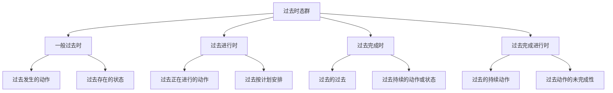

# 过去时态对比分析

## 🎯 学习目标
- 掌握过去时态群的基本概念和构成
- 理解过去时态群的各种用法
- 熟练运用过去时态群的各种形式

## 📚 基本概念

### 过去时态群（Past Tense Group）
**定义**：表示过去时间范畴的各种时态的总称

### 基本特征
- 表示过去时间范畴
- 包括四种时态
- 有各自的特点和用法
- 需要区分使用

## 🔄 过去时态群分类

## 📊 过去时态群对比表

### 基本对比表
| 时态 | 构成 | 基本用法 | 时间状语 | 示例 |
|------|------|----------|----------|------|
| 一般过去时 | 动词过去式 | 过去发生的动作 | yesterday, last year | I worked yesterday. |
| 过去进行时 | was/were+现在分词 | 过去正在进行的动作 | at 8:00, while | I was working at 8:00. |
| 过去完成时 | had+过去分词 | 过去的过去 | by, before, when | I had worked by 8:00. |
| 过去完成进行时 | had+been+现在分词 | 过去的持续动作 | for, since, recently | I had been working for 3 hours. |

## 🎯 一般过去时

### 1. 基本概念
**定义**：表示过去某个时间发生的动作或状态

**特征**：
- 表示过去的动作或状态
- 有肯定、否定、疑问形式
- 动词用过去式
- 常与过去时间状语连用

### 2. 基本用法
**用法**：
- 表示过去某个时间发生的动作
- 表示过去存在的状态
- 表示过去的习惯性动作
- 表示过去连续发生的动作

**示例**：
- ✅ I went to Beijing yesterday. (我昨天去了北京)
- ✅ I was a student last year. (我去年是学生)
- ✅ I always got up early when I was young. (我年轻时总是早起)
- ✅ I got up, had breakfast, and went to school. (我起床、吃早饭，然后去上学)

### 3. 时间状语
**时间状语**：
- 过去时间：yesterday, last year, last week, last month
- 过去时间点：at 8:00 yesterday, at 3:00 last week
- 过去时间段：for 8 hours yesterday, for a week last month

## 🎯 过去进行时

### 1. 基本概念
**定义**：表示过去某个时间正在进行的动作

**特征**：
- 表示过去正在进行的动作
- 有肯定、否定、疑问形式
- 用was/were+现在分词构成
- 常与过去时间状语连用

### 2. 基本用法
**用法**：
- 表示过去某个时间正在进行的动作
- 表示过去某个时间段正在进行的动作
- 表示过去两个同时进行的动作
- 表示过去按计划、安排将要发生的动作

**示例**：
- ✅ I was reading a book at 8:00 yesterday. (我昨天8点正在读书)
- ✅ I was working from 9:00 to 12:00 yesterday. (我昨天从9点到12点在工作)
- ✅ While I was reading, she was watching TV. (我在读书时，她在看电视)
- ✅ I was leaving for Beijing tomorrow. (我明天要去北京)

### 3. 时间状语
**时间状语**：
- 过去时间点：at 8:00 yesterday, at 3:00 last week
- 过去时间段：from 9:00 to 12:00, for 2 hours yesterday
- 过去时间从句：while, when, as

## 🎯 过去完成时

### 1. 基本概念
**定义**：表示在过去某个时间之前已经完成的动作或状态

**特征**：
- 表示过去的过去
- 表示动作的完成
- 有肯定、否定、疑问形式
- 用had+过去分词构成

### 2. 基本用法
**用法**：
- 表示过去的过去
- 表示过去某个时间之前持续的动作或状态
- 表示过去的经历
- 表示过去某个时间之前刚刚完成的动作

**示例**：
- ✅ When I arrived, he had already left. (我到达时，他已经离开了)
- ✅ I had lived here for 10 years before I moved. (我搬家前在这里住了10年)
- ✅ I had been to Beijing before I went to Shanghai. (我去上海前去过北京)
- ✅ I had just finished my work when you called. (你打电话时，我刚刚完成工作)

### 3. 时间状语
**时间状语**：
- 过去时间：by 8:00 yesterday, before he went to bed
- 持续时间：for 10 years, since 2010
- 不确定时间：already, never, ever, just, recently

## 🎯 过去完成进行时

### 1. 基本概念
**定义**：表示在过去某个时间之前一直持续进行，并且可能继续下去的动作

**特征**：
- 表示过去的持续动作
- 表示动作的未完成性
- 有肯定、否定、疑问形式
- 用had+been+现在分词构成

### 2. 基本用法
**用法**：
- 表示在过去某个时间之前一直持续进行的动作
- 表示过去某个时间之前持续的动作或状态
- 表示过去某个时间之前一直在进行的动作
- 表示过去某个时间之前动作的重复性

**示例**：
- ✅ When I arrived, he had been working for 3 hours. (我到达时，他已经工作了3个小时)
- ✅ I had been living here for 10 years before I moved. (我搬家前在这里住了10年)
- ✅ I had been reading this book recently. (我最近一直在读这本书)
- ✅ I had been calling you all day. (我一整天都在给你打电话)

### 3. 时间状语
**时间状语**：
- 持续时间：for 3 hours, since 2010
- 最近时间：recently, lately, these days
- 频率：all day, constantly, repeatedly

## 🔄 过去时态群对比分析

### 1. 时间概念对比
| 时态 | 时间概念 | 特点 | 示例 |
|------|----------|------|------|
| 一般过去时 | 过去 | 过去发生的动作 | I worked yesterday. |
| 过去进行时 | 过去 | 过去正在进行的动作 | I was working at 8:00. |
| 过去完成时 | 过去的过去 | 过去动作对过去的影响 | I had worked by 8:00. |
| 过去完成进行时 | 过去的过去到现在 | 过去的持续动作 | I had been working for 3 hours. |

### 2. 动作性质对比
| 时态 | 动作性质 | 特点 | 示例 |
|------|----------|------|------|
| 一般过去时 | 过去动作 | 动作已完成 | I went to Beijing yesterday. |
| 过去进行时 | 进行性动作 | 过去正在进行的动作 | I was reading at 8:00. |
| 过去完成时 | 完成性动作 | 过去的过去已完成 | I had finished my work. |
| 过去完成进行时 | 持续性动作 | 过去的持续动作 | I had been working for 3 hours. |

### 3. 语法构成对比
| 时态 | 构成 | 特点 | 示例 |
|------|------|------|------|
| 一般过去时 | 动词过去式 | 简单构成 | I worked. |
| 过去进行时 | was/were+现在分词 | 进行时态 | I was working. |
| 过去完成时 | had+过去分词 | 完成时态 | I had worked. |
| 过去完成进行时 | had+been+现在分词 | 完成进行时态 | I had been working. |

## 🎯 过去时态群选择技巧

### 1. 根据时间概念选择
- 过去时间：一般过去时、过去进行时
- 过去的过去：过去完成时
- 过去的过去到现在：过去完成进行时

### 2. 根据动作性质选择
- 过去动作：一般过去时
- 进行性动作：过去进行时
- 完成性动作：过去完成时
- 持续性动作：过去完成进行时

### 3. 根据语法功能选择
- 简单表达：一般过去时
- 进行表达：过去进行时
- 完成表达：过去完成时
- 完成进行表达：过去完成进行时

## 🚫 常见错误分析

### 错误类型1：时态选择错误
**错误**：❌ I am work yesterday.
**正确**：✅ I worked yesterday.
**分析**：过去时间用过去时态

### 错误类型2：时态构成错误
**错误**：❌ I was work yesterday.
**正确**：✅ I was working yesterday.
**分析**：过去进行时需要用现在分词

### 错误类型3：时间状语使用错误
**错误**：❌ I had worked tomorrow.
**正确**：✅ I will have worked tomorrow.
**分析**：将来时间用将来完成时

### 错误类型4：动作性质判断错误
**错误**：❌ I was knowing English.
**正确**：✅ I knew English.
**分析**：状态动词不用进行时

## 📊 过去时态群用法总结

| 时态 | 主要用法 | 时间状语 | 典型例句 |
|------|----------|----------|----------|
| 一般过去时 | 过去发生的动作 | yesterday, last year | I worked yesterday. |
| 过去进行时 | 过去正在进行的动作 | at 8:00, while | I was working at 8:00. |
| 过去完成时 | 过去的过去 | by, before, when | I had worked by 8:00. |
| 过去完成进行时 | 过去的持续动作 | for, since, recently | I had been working for 3 hours. |

## 🔗 相关链接
- [[01-一般过去时]]：一般过去时的用法
- [[02-过去进行时]]：过去进行时的用法
- [[03-过去完成时]]：过去完成时的用法
- [[04-过去完成进行时]]：过去完成进行时的用法
- [[01-基础认知层/01-词性系统/03-动词系统/03-动词基本形式]]：动词的基本形式

## 💡 记忆口诀

**过去时态群记忆法**：
- 一般过去时表示过去发生的动作，过去进行时表示过去正在进行的动作
- 过去完成时表示过去的过去，过去完成进行时表示过去的持续动作
- 时间概念要分清，动作性质要判断
- 语法构成要记牢，时间状语要准确
- 时态选择要正确，错误用法要避免

---
*掌握过去时态群对比分析是语法学习的重要基础，需要大量练习才能熟练运用*
