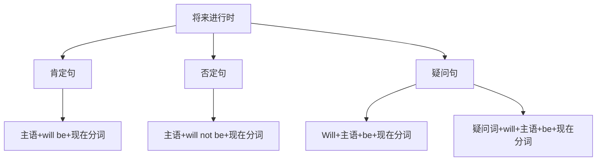

# 将来进行时

## 🎯 学习目标
- 掌握将来进行时的基本概念和构成
- 理解将来进行时的各种用法
- 熟练运用将来进行时的各种形式

## 📚 基本概念

### 将来进行时（Future Continuous Tense）
**定义**：表示将来某个时间正在进行的动作

### 基本特征
- 表示将来正在进行的动作
- 有肯定、否定、疑问形式
- 用will be+现在分词构成
- 常与将来时间状语连用

## 🔄 将来进行时构成

## 📊 将来进行时变化表

### 基本变化表
| 人称 | 肯定句 | 否定句 | 疑问句 |
|------|--------|--------|--------|
| 第一人称单数 | I will be working. | I will not be working. | Will I be working? |
| 第二人称单数 | You will be working. | You will not be working. | Will you be working? |
| 第三人称单数 | He will be working. | He will not be working. | Will he be working? |
| 第一人称复数 | We will be working. | We will not be working. | Will we be working? |
| 第二人称复数 | You will be working. | You will not be working. | Will you be working? |
| 第三人称复数 | They will be working. | They will not be working. | Will they be working? |

## 🎯 基本用法

### 1. 表示将来某个时间正在进行的动作
**功能**：表示将来某个时间正在进行的动作

**示例**：
- ✅ I will be working at 8:00 tomorrow. (我明天8点将正在工作)
- ✅ She will be studying at 9:00 tomorrow. (她明天9点将正在学习)
- ✅ He will be playing football at 3:00 tomorrow. (他明天3点将正在踢足球)
- ✅ We will be having dinner at 7:00 tomorrow. (我们明天7点将正在吃晚饭)
- ✅ They will be watching TV at 8:00 tomorrow. (他们明天8点将正在看电视)

**语法特点**：
- 表示将来正在进行的动作
- 常与将来时间状语连用
- 用will be+现在分词构成

### 2. 表示将来某个时间段正在进行的动作
**功能**：表示将来某个时间段正在进行的动作

**示例**：
- ✅ I will be working from 9:00 to 12:00 tomorrow. (我明天从9点到12点将正在工作)
- ✅ She will be studying all day tomorrow. (她明天整天将正在学习)
- ✅ He will be playing football for 2 hours tomorrow. (他明天将踢2个小时足球)
- ✅ We will be traveling for a week next month. (我们下个月将旅行一个星期)
- ✅ They will be building a house for 6 months next year. (他们明年将建6个月房子)

**语法特点**：
- 表示将来某个时间段正在进行的动作
- 常与时间段状语连用
- 用will be+现在分词构成

### 3. 表示按计划、安排将要进行的动作
**功能**：表示按计划、安排将要进行的动作

**示例**：
- ✅ I will be leaving for Beijing tomorrow. (我明天将要去北京)
- ✅ She will be coming to see us next week. (她下星期将来看我们)
- ✅ He will be starting a new job next month. (他下个月将开始新工作)
- ✅ We will be moving to a new house next year. (我们明年将搬到新房子)
- ✅ They will be getting married next month. (他们下个月将结婚)

**语法特点**：
- 表示按计划安排
- 常用于表示将来的动作
- 用will be+现在分词构成

### 4. 表示礼貌的询问
**功能**：表示礼貌的询问

**示例**：
- ✅ Will you be using the computer this afternoon? (你今天下午要用电脑吗？)
- ✅ Will you be coming to the meeting tomorrow? (你明天要来开会吗？)
- ✅ Will you be staying here tonight? (你今晚要住在这里吗？)
- ✅ Will you be needing any help? (你需要帮助吗？)
- ✅ Will you be wanting anything else? (你还需要别的什么吗？)

**语法特点**：
- 表示礼貌的询问
- 比一般将来时更委婉
- 用will be+现在分词构成

## 🎯 时间状语

### 1. 表示将来时间点的状语
**功能**：表示将来的具体时间点

**示例**：
- ✅ I will be working at 8:00 tomorrow. (我明天8点将正在工作)
- ✅ She will be studying at 9:00 tomorrow. (她明天9点将正在学习)
- ✅ He will be playing football at 3:00 tomorrow. (他明天3点将正在踢足球)
- ✅ We will be having dinner at 7:00 tomorrow. (我们明天7点将正在吃晚饭)
- ✅ They will be watching TV at 8:00 tomorrow. (他们明天8点将正在看电视)

**语法特点**：
- 表示将来的具体时间点
- 常用at+时间点
- 放在句首或句末

### 2. 表示将来时间段的状语
**功能**：表示将来的时间段

**示例**：
- ✅ I will be working from 9:00 to 12:00 tomorrow. (我明天从9点到12点将正在工作)
- ✅ She will be studying all day tomorrow. (她明天整天将正在学习)
- ✅ He will be playing football for 2 hours tomorrow. (他明天将踢2个小时足球)
- ✅ We will be traveling for a week next month. (我们下个月将旅行一个星期)
- ✅ They will be building a house for 6 months next year. (他们明年将建6个月房子)

**语法特点**：
- 表示将来的时间段
- 常用from...to..., for+时间段
- 放在句首或句末

### 3. 表示将来时间的状语从句
**功能**：表示将来时间的状语从句

**示例**：
- ✅ When you arrive, I will be working. (你到达时，我将正在工作)
- ✅ While you are sleeping, I will be studying. (你睡觉时，我将正在学习)
- ✅ As you are traveling, I will be working. (你旅行时，我将正在工作)
- ✅ Before you leave, I will be preparing. (你离开前，我将正在准备)
- ✅ After you arrive, I will be waiting. (你到达后，我将正在等待)

**语法特点**：
- 表示将来时间的状语从句
- 常用when, while, as, before, after连接
- 放在句首或句末

## 🎯 现在分词构成

### 1. 规则变化
**规则**：动词原形+ing

**变化规则**：
| 规则 | 示例 | 说明 |
|------|------|------|
| 一般情况 | work→working, play→playing | 直接加-ing |
| 以e结尾 | live→living, hope→hoping | 去e加-ing |
| 以辅音字母+y结尾 | study→studying, try→trying | 直接加-ing |
| 以重读闭音节结尾 | stop→stopping, plan→planning | 双写辅音字母加-ing |

**示例**：
- ✅ work → working (工作)
- ✅ play → playing (玩)
- ✅ live → living (生活)
- ✅ hope → hoping (希望)
- ✅ study → studying (学习)
- ✅ try → trying (尝试)
- ✅ stop → stopping (停止)
- ✅ plan → planning (计划)

**语法特点**：
- 规则变化
- 直接加-ing
- 有特殊变化规则

### 2. 不规则变化
**规则**：不规则动词的现在分词

**示例**：
- ✅ go → going (去)
- ✅ come → coming (来)
- ✅ see → seeing (看)
- ✅ do → doing (做)
- ✅ have → having (有)
- ✅ be → being (是)

**语法特点**：
- 不规则变化
- 需要特殊记忆
- 大多数不规则动词现在分词规则

## 🎯 特殊用法

### 1. 表示礼貌的询问
**功能**：表示礼貌的询问

**示例**：
- ✅ Will you be using the computer this afternoon? (你今天下午要用电脑吗？)
- ✅ Will you be coming to the meeting tomorrow? (你明天要来开会吗？)
- ✅ Will you be staying here tonight? (你今晚要住在这里吗？)
- ✅ Will you be needing any help? (你需要帮助吗？)
- ✅ Will you be wanting anything else? (你还需要别的什么吗？)

**语法特点**：
- 表示礼貌的询问
- 比一般将来时更委婉
- 用will be+现在分词构成

### 2. 表示按计划、安排将要进行的动作
**功能**：表示按计划、安排将要进行的动作

**示例**：
- ✅ I will be leaving for Beijing tomorrow. (我明天将要去北京)
- ✅ She will be coming to see us next week. (她下星期将来看我们)
- ✅ He will be starting a new job next month. (他下个月将开始新工作)
- ✅ We will be moving to a new house next year. (我们明年将搬到新房子)
- ✅ They will be getting married next month. (他们下个月将结婚)

**语法特点**：
- 表示按计划安排
- 常用于表示将来的动作
- 用will be+现在分词构成

### 3. 表示将来的预测
**功能**：表示将来的预测

**示例**：
- ✅ It will be raining tomorrow. (明天将下雨)
- ✅ She will be successful. (她将成功)
- ✅ He will be passing the exam. (他将通过考试)
- ✅ We will be winning the game. (我们将赢得比赛)
- ✅ They will be happy. (他们将很快乐)

**语法特点**：
- 表示将来的预测
- 强调客观预测
- 用will be+现在分词构成

## 📊 将来进行时用法对比表

| 用法 | 示例 | 说明 |
|------|------|------|
| 将来正在进行的动作 | I will be working at 8:00 tomorrow. | 表示将来正在进行的动作 |
| 将来时间段正在进行的动作 | I will be working from 9:00 to 12:00. | 表示将来时间段正在进行的动作 |
| 按计划安排的动作 | I will be leaving for Beijing tomorrow. | 表示按计划安排的动作 |
| 礼貌的询问 | Will you be using the computer? | 表示礼貌的询问 |

## 🚫 常见错误分析

### 错误类型1：will使用错误
**错误**：❌ I will to be working tomorrow.
**正确**：✅ I will be working tomorrow.
**分析**：will后接动词原形

### 错误类型2：现在分词构成错误
**错误**：❌ I will be work tomorrow.
**正确**：✅ I will be working tomorrow.
**分析**：将来进行时需要用现在分词

### 错误类型3：时间状语使用错误
**错误**：❌ I will be working yesterday.
**正确**：✅ I was working yesterday.
**分析**：过去时间用过去进行时

### 错误类型4：状态动词使用错误
**错误**：❌ I will be knowing English.
**正确**：✅ I will know English.
**分析**：状态动词不用进行时

## 🔗 相关链接
- [[01-一般将来时]]：一般将来时的用法
- [[03-将来完成时]]：将来完成时的用法
- [[04-将来完成进行时]]：将来完成进行时的用法
- [[05-将来时态对比分析]]：将来时态的对比分析
- [[01-基础认知层/01-词性系统/03-动词系统/03-动词基本形式]]：动词的基本形式

## 💡 记忆口诀

**将来进行时记忆法**：
- 将来正在进行的动作用将来进行时，将来时间段正在进行的动作用将来进行时
- 按计划安排的动作用将来进行时，礼貌的询问用将来进行时
- 构成：will be+现在分词，will随人称变化
- 现在分词：动词原形+ing，有特殊变化规则
- 时间状语：at+时间点，from...to..., when, while
- 状态动词不用进行时，过去时间用过去进行时

---
*掌握将来进行时是语法学习的重要基础，需要大量练习才能熟练运用*
