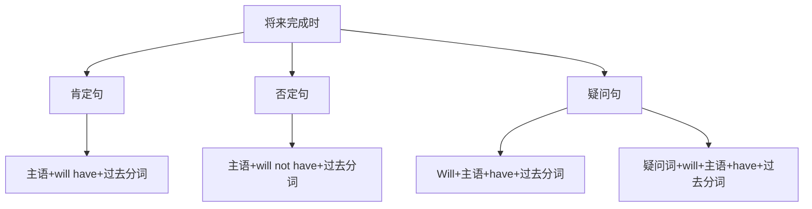

# 将来完成时

## 🎯 学习目标
- 掌握将来完成时的基本概念和构成
- 理解将来完成时的各种用法
- 熟练运用将来完成时的各种形式

## 📚 基本概念

### 将来完成时（Future Perfect Tense）
**定义**：表示在将来某个时间之前已经完成的动作

### 基本特征
- 表示将来的过去
- 表示动作的完成
- 有肯定、否定、疑问形式
- 用will have+过去分词构成

## 🔄 将来完成时构成

## 📊 将来完成时变化表

### 基本变化表
| 人称 | 肯定句 | 否定句 | 疑问句 |
|------|--------|--------|--------|
| 第一人称单数 | I will have worked. | I will not have worked. | Will I have worked? |
| 第二人称单数 | You will have worked. | You will not have worked. | Will you have worked? |
| 第三人称单数 | He will have worked. | He will not have worked. | Will he have worked? |
| 第一人称复数 | We will have worked. | We will not have worked. | Will we have worked? |
| 第二人称复数 | You will have worked. | You will not have worked. | Will you have worked? |
| 第三人称复数 | They will have worked. | They will not have worked. | Will they have worked? |

## 🎯 基本用法

### 1. 表示在将来某个时间之前已经完成的动作
**功能**：表示在将来某个时间之前已经完成的动作

**示例**：
- ✅ I will have finished my work by 8:00 tomorrow. (我明天8点前将完成工作)
- ✅ She will have arrived by the time you call. (你打电话时，她将已经到达)
- ✅ He will have left before you arrive. (你到达前，他将已经离开)
- ✅ We will have eaten dinner by 7:00 tomorrow. (我们明天7点前将吃完晚饭)
- ✅ They will have finished the project by next month. (他们下个月前将完成项目)

**语法特点**：
- 表示将来的过去
- 强调动作的完成
- 用will have+过去分词构成

### 2. 表示到将来某个时间为止持续的动作或状态
**功能**：表示到将来某个时间为止持续的动作或状态

**示例**：
- ✅ I will have lived here for 10 years by next year. (到明年我将在这里住了10年)
- ✅ She will have worked in this company for 5 years by next month. (到下个月她将在这家公司工作了5年)
- ✅ He will have studied English for 3 years by next year. (到明年他将学了3年英语)
- ✅ We will have known each other for a long time by next year. (到明年我们将认识很久了)
- ✅ They will have been married for 20 years by next year. (到明年他们将结婚20年了)

**语法特点**：
- 表示到将来某个时间为止持续的动作或状态
- 常与for, since连用
- 用will have+过去分词构成

### 3. 表示对将来某个时间之前动作的推测
**功能**：表示对将来某个时间之前动作的推测

**示例**：
- ✅ He will have finished his homework by now. (他现在应该已经完成作业了)
- ✅ She will have arrived at the airport by this time. (她现在应该已经到达机场了)
- ✅ They will have left for Beijing by now. (他们现在应该已经去北京了)
- ✅ We will have received the letter by tomorrow. (我们明天应该已经收到信了)
- ✅ You will have heard the news by now. (你现在应该已经听到消息了)

**语法特点**：
- 表示对将来某个时间之前动作的推测
- 强调推测的可靠性
- 用will have+过去分词构成

### 4. 表示将来某个时间之前刚刚完成的动作
**功能**：表示将来某个时间之前刚刚完成的动作

**示例**：
- ✅ I will have just finished my work when you arrive. (你到达时，我将刚刚完成工作)
- ✅ She will have just arrived when the meeting starts. (会议开始时，她将刚刚到达)
- ✅ He will have just left when you call. (你打电话时，他将刚刚离开)
- ✅ We will have just started when it begins to rain. (开始下雨时，我们将刚刚开始)
- ✅ They will have just finished when the bell rings. (铃响时，他们将刚刚完成)

**语法特点**：
- 表示将来某个时间之前刚刚完成的动作
- 常与just连用
- 用will have+过去分词构成

## 🎯 时间状语

### 1. 表示将来时间的状语
**功能**：表示将来的时间

**示例**：
- ✅ I will have finished my work by 8:00 tomorrow. (我明天8点前将完成工作)
- ✅ She will have arrived by the time you call. (你打电话时，她将已经到达)
- ✅ He will have left before you arrive. (你到达前，他将已经离开)
- ✅ We will have eaten dinner by 7:00 tomorrow. (我们明天7点前将吃完晚饭)
- ✅ They will have finished the project by next month. (他们下个月前将完成项目)

**语法特点**：
- 表示将来时间
- 常用by, before, by the time等
- 放在句首或句末

### 2. 表示持续时间的状语
**功能**：表示持续的时间

**示例**：
- ✅ I will have lived here for 10 years by next year. (到明年我将在这里住了10年)
- ✅ She will have worked in this company for 5 years by next month. (到下个月她将在这家公司工作了5年)
- ✅ He will have studied English for 3 years by next year. (到明年他将学了3年英语)
- ✅ We will have known each other for a long time by next year. (到明年我们将认识很久了)
- ✅ They will have been married for 20 years by next year. (到明年他们将结婚20年了)

**语法特点**：
- 表示持续时间
- 常用for, since连用
- for后接时间段，since后接时间点

### 3. 表示不确定时间的状语
**功能**：表示不确定的时间

**示例**：
- ✅ He will have finished his homework by now. (他现在应该已经完成作业了)
- ✅ She will have arrived at the airport by this time. (她现在应该已经到达机场了)
- ✅ They will have left for Beijing by now. (他们现在应该已经去北京了)
- ✅ We will have received the letter by tomorrow. (我们明天应该已经收到信了)
- ✅ You will have heard the news by now. (你现在应该已经听到消息了)

**语法特点**：
- 表示不确定时间
- 常用by now, by this time等
- 放在句首或句末

## 🎯 过去分词构成

### 1. 规则变化
**规则**：动词原形+ed

**变化规则**：
| 规则 | 示例 | 说明 |
|------|------|------|
| 一般情况 | work→worked, play→played | 直接加-ed |
| 以e结尾 | live→lived, hope→hoped | 直接加-d |
| 以辅音字母+y结尾 | study→studied, try→tried | 变y为i加-ed |
| 以重读闭音节结尾 | stop→stopped, plan→planned | 双写辅音字母加-ed |

**示例**：
- ✅ work → worked (工作)
- ✅ play → played (玩)
- ✅ live → lived (生活)
- ✅ hope → hoped (希望)
- ✅ study → studied (学习)
- ✅ try → tried (尝试)
- ✅ stop → stopped (停止)
- ✅ plan → planned (计划)

**语法特点**：
- 规则变化
- 直接加-ed
- 有特殊变化规则

### 2. 不规则变化
**规则**：不规则动词的过去分词

**示例**：
- ✅ go → gone (去)
- ✅ come → come (来)
- ✅ see → seen (看)
- ✅ do → done (做)
- ✅ have → had (有)
- ✅ be → been (是)

**语法特点**：
- 不规则变化
- 需要特殊记忆
- 大多数不规则动词过去分词不规则

## 🎯 特殊用法

### 1. 表示对将来某个时间之前动作的推测
**功能**：表示对将来某个时间之前动作的推测

**示例**：
- ✅ He will have finished his homework by now. (他现在应该已经完成作业了)
- ✅ She will have arrived at the airport by this time. (她现在应该已经到达机场了)
- ✅ They will have left for Beijing by now. (他们现在应该已经去北京了)
- ✅ We will have received the letter by tomorrow. (我们明天应该已经收到信了)
- ✅ You will have heard the news by now. (你现在应该已经听到消息了)

**语法特点**：
- 表示对将来某个时间之前动作的推测
- 强调推测的可靠性
- 用will have+过去分词构成

### 2. 表示到将来某个时间为止持续的动作或状态
**功能**：表示到将来某个时间为止持续的动作或状态

**示例**：
- ✅ I will have lived here for 10 years by next year. (到明年我将在这里住了10年)
- ✅ She will have worked in this company for 5 years by next month. (到下个月她将在这家公司工作了5年)
- ✅ He will have studied English for 3 years by next year. (到明年他将学了3年英语)
- ✅ We will have known each other for a long time by next year. (到明年我们将认识很久了)
- ✅ They will have been married for 20 years by next year. (到明年他们将结婚20年了)

**语法特点**：
- 表示到将来某个时间为止持续的动作或状态
- 常与for, since连用
- 用will have+过去分词构成

### 3. 表示将来某个时间之前刚刚完成的动作
**功能**：表示将来某个时间之前刚刚完成的动作

**示例**：
- ✅ I will have just finished my work when you arrive. (你到达时，我将刚刚完成工作)
- ✅ She will have just arrived when the meeting starts. (会议开始时，她将刚刚到达)
- ✅ He will have just left when you call. (你打电话时，他将刚刚离开)
- ✅ We will have just started when it begins to rain. (开始下雨时，我们将刚刚开始)
- ✅ They will have just finished when the bell rings. (铃响时，他们将刚刚完成)

**语法特点**：
- 表示将来某个时间之前刚刚完成的动作
- 常与just连用
- 用will have+过去分词构成

## 📊 将来完成时用法对比表

| 用法 | 示例 | 说明 |
|------|------|------|
| 将来某个时间之前已完成的动作 | I will have finished my work by 8:00 tomorrow. | 表示将来某个时间之前已完成的动作 |
| 到将来某个时间为止持续的动作 | I will have lived here for 10 years by next year. | 表示到将来某个时间为止持续的动作 |
| 对将来动作的推测 | He will have finished his homework by now. | 表示对将来动作的推测 |
| 将来刚刚完成的动作 | I will have just finished my work when you arrive. | 表示将来刚刚完成的动作 |

## 🚫 常见错误分析

### 错误类型1：will使用错误
**错误**：❌ I will to have finished my work.
**正确**：✅ I will have finished my work.
**分析**：will后接动词原形

### 错误类型2：过去分词使用错误
**错误**：❌ I will have finish my work.
**正确**：✅ I will have finished my work.
**分析**：将来完成时需要用过去分词

### 错误类型3：时间状语使用错误
**错误**：❌ I will have finished my work yesterday.
**正确**：✅ I had finished my work yesterday.
**分析**：过去时间用过去完成时

### 错误类型4：时态选择错误
**错误**：❌ I will finish my work by 8:00 tomorrow.
**正确**：✅ I will have finished my work by 8:00 tomorrow.
**分析**：将来某个时间之前完成的动作用将来完成时

## 🔗 相关链接
- [[01-一般将来时]]：一般将来时的用法
- [[02-将来进行时]]：将来进行时的用法
- [[04-将来完成进行时]]：将来完成进行时的用法
- [[05-将来时态对比分析]]：将来时态的对比分析
- [[01-基础认知层/01-词性系统/03-动词系统/03-动词基本形式]]：动词的基本形式

## 💡 记忆口诀

**将来完成时记忆法**：
- 将来某个时间之前已完成的动作用将来完成时，到将来某个时间为止持续的动作或状态用将来完成时
- 对将来动作的推测用将来完成时，将来刚刚完成的动作用将来完成时
- 构成：will have+过去分词，will随人称变化
- 时间状语：by, before, by the time, for, since
- for后接时间段，since后接时间点
- 过去时间用过去完成时，将来时间用将来完成时

---
*掌握将来完成时是语法学习的重要基础，需要大量练习才能熟练运用*
