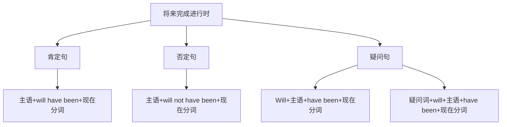

# 将来完成进行时

## 🎯 学习目标
- 掌握将来完成进行时的基本概念和构成
- 理解将来完成进行时的各种用法
- 熟练运用将来完成进行时的各种形式

## 📚 基本概念

### 将来完成进行时（Future Perfect Continuous Tense）
**定义**：表示在将来某个时间之前一直持续进行，并且可能继续下去的动作

### 基本特征
- 表示将来的持续动作
- 表示动作的未完成性
- 有肯定、否定、疑问形式
- 用will have been+现在分词构成

## 🔄 将来完成进行时构成

## 📊 将来完成进行时变化表

### 基本变化表
| 人称 | 肯定句 | 否定句 | 疑问句 |
|------|--------|--------|--------|
| 第一人称单数 | I will have been working. | I will not have been working. | Will I have been working? |
| 第二人称单数 | You will have been working. | You will not have been working. | Will you have been working? |
| 第三人称单数 | He will have been working. | He will not have been working. | Will he have been working? |
| 第一人称复数 | We will have been working. | We will not have been working. | Will we have been working? |
| 第二人称复数 | You will have been working. | You will not have been working. | Will you have been working? |
| 第三人称复数 | They will have been working. | They will not have been working. | Will they have been working? |

## 🎯 基本用法

### 1. 表示在将来某个时间之前一直持续进行的动作
**功能**：表示在将来某个时间之前一直持续进行的动作

**示例**：
- ✅ I will have been working for 3 hours by 8:00 tomorrow. (到明天8点我将已经工作了3个小时)
- ✅ She will have been studying for 2 hours by 9:00 tomorrow. (到明天9点她将已经学习了2个小时)
- ✅ He will have been playing football for an hour by 3:00 tomorrow. (到明天3点他将已经踢了1个小时足球)
- ✅ We will have been waiting for an hour by 7:00 tomorrow. (到明天7点我们将已经等了1个小时)
- ✅ They will have been watching TV for 2 hours by 8:00 tomorrow. (到明天8点他们将已经看了2个小时电视)

**语法特点**：
- 表示将来的持续动作
- 强调动作的持续性
- 用will have been+现在分词构成

### 2. 表示到将来某个时间为止持续的动作或状态
**功能**：表示到将来某个时间为止持续的动作或状态

**示例**：
- ✅ I will have been living here for 10 years by next year. (到明年我将已经在这里住了10年)
- ✅ She will have been working in this company for 5 years by next month. (到下个月她将已经在这家公司工作了5年)
- ✅ He will have been studying English for 3 years by next year. (到明年他将已经学了3年英语)
- ✅ We will have been knowing each other for a long time by next year. (到明年我们将已经认识很久了)
- ✅ They will have been building a house for 6 months by next year. (到明年他们将已经建了6个月房子)

**语法特点**：
- 表示到将来某个时间为止持续的动作或状态
- 常与for, since连用
- 用will have been+现在分词构成

### 3. 表示对将来某个时间之前持续动作的推测
**功能**：表示对将来某个时间之前持续动作的推测

**示例**：
- ✅ He will have been working for 8 hours by now. (他现在应该已经工作了8个小时)
- ✅ She will have been studying for 3 hours by this time. (她现在应该已经学习了3个小时)
- ✅ They will have been traveling for a week by now. (他们现在应该已经旅行了一个星期)
- ✅ We will have been waiting for 2 hours by tomorrow. (我们明天应该已经等了2个小时)
- ✅ You will have been learning English for 5 years by next year. (你明年应该已经学了5年英语)

**语法特点**：
- 表示对将来某个时间之前持续动作的推测
- 强调推测的可靠性
- 用will have been+现在分词构成

### 4. 表示将来某个时间之前动作的重复性
**功能**：表示将来某个时间之前动作的重复性

**示例**：
- ✅ I will have been calling you all day by evening. (到晚上我将已经给你打了一整天电话)
- ✅ She will have been asking the same question all morning by noon. (到中午她将已经问了一上午同样的问题)
- ✅ He will have been complaining about the weather all week by Friday. (到周五他将已经抱怨了一星期天气)
- ✅ We will have been trying to solve this problem all month by next week. (到下星期我们将已经努力解决了一个月这个问题)
- ✅ They will have been looking for the lost key all day by evening. (到晚上他们将已经寻找了一整天丢失的钥匙)

**语法特点**：
- 表示将来某个时间之前动作的重复性
- 强调动作的反复
- 用will have been+现在分词构成

## 🎯 时间状语

### 1. 表示持续时间的状语
**功能**：表示持续的时间

**示例**：
- ✅ I will have been working for 3 hours by 8:00 tomorrow. (到明天8点我将已经工作了3个小时)
- ✅ She will have been studying for 2 hours by 9:00 tomorrow. (到明天9点她将已经学习了2个小时)
- ✅ He will have been playing football for an hour by 3:00 tomorrow. (到明天3点他将已经踢了1个小时足球)
- ✅ We will have been waiting for an hour by 7:00 tomorrow. (到明天7点我们将已经等了1个小时)
- ✅ They will have been watching TV for 2 hours by 8:00 tomorrow. (到明天8点他们将已经看了2个小时电视)

**语法特点**：
- 表示持续时间
- 常用for, since连用
- for后接时间段，since后接时间点

### 2. 表示将来时间的状语
**功能**：表示将来的时间

**示例**：
- ✅ I will have been working for 3 hours by 8:00 tomorrow. (到明天8点我将已经工作了3个小时)
- ✅ She will have been studying for 2 hours by 9:00 tomorrow. (到明天9点她将已经学习了2个小时)
- ✅ He will have been playing football for an hour by 3:00 tomorrow. (到明天3点他将已经踢了1个小时足球)
- ✅ We will have been waiting for an hour by 7:00 tomorrow. (到明天7点我们将已经等了1个小时)
- ✅ They will have been watching TV for 2 hours by 8:00 tomorrow. (到明天8点他们将已经看了2个小时电视)

**语法特点**：
- 表示将来时间
- 常用by, before, by the time等
- 放在句首或句末

### 3. 表示频率的状语
**功能**：表示动作的频率

**示例**：
- ✅ I will have been calling you all day by evening. (到晚上我将已经给你打了一整天电话)
- ✅ She will have been asking the same question all morning by noon. (到中午她将已经问了一上午同样的问题)
- ✅ He will have been complaining about the weather all week by Friday. (到周五他将已经抱怨了一星期天气)
- ✅ We will have been trying to solve this problem all month by next week. (到下星期我们将已经努力解决了一个月这个问题)
- ✅ They will have been looking for the lost key all day by evening. (到晚上他们将已经寻找了一整天丢失的钥匙)

**语法特点**：
- 表示动作频率
- 常用all day, all morning, all week等
- 强调动作的反复

## 🎯 现在分词构成

### 1. 规则变化
**规则**：动词原形+ing

**变化规则**：
| 规则 | 示例 | 说明 |
|------|------|------|
| 一般情况 | work→working, play→playing | 直接加-ing |
| 以e结尾 | live→living, hope→hoping | 去e加-ing |
| 以辅音字母+y结尾 | study→studying, try→trying | 直接加-ing |
| 以重读闭音节结尾 | stop→stopping, plan→planning | 双写辅音字母加-ing |

**示例**：
- ✅ work → working (工作)
- ✅ play → playing (玩)
- ✅ live → living (生活)
- ✅ hope → hoping (希望)
- ✅ study → studying (学习)
- ✅ try → trying (尝试)
- ✅ stop → stopping (停止)
- ✅ plan → planning (计划)

**语法特点**：
- 规则变化
- 直接加-ing
- 有特殊变化规则

### 2. 不规则变化
**规则**：不规则动词的现在分词

**示例**：
- ✅ go → going (去)
- ✅ come → coming (来)
- ✅ see → seeing (看)
- ✅ do → doing (做)
- ✅ have → having (有)
- ✅ be → being (是)

**语法特点**：
- 不规则变化
- 需要特殊记忆
- 大多数不规则动词现在分词规则

## 🎯 特殊用法

### 1. 表示对将来某个时间之前持续动作的推测
**功能**：表示对将来某个时间之前持续动作的推测

**示例**：
- ✅ He will have been working for 8 hours by now. (他现在应该已经工作了8个小时)
- ✅ She will have been studying for 3 hours by this time. (她现在应该已经学习了3个小时)
- ✅ They will have been traveling for a week by now. (他们现在应该已经旅行了一个星期)
- ✅ We will have been waiting for 2 hours by tomorrow. (我们明天应该已经等了2个小时)
- ✅ You will have been learning English for 5 years by next year. (你明年应该已经学了5年英语)

**语法特点**：
- 表示对将来某个时间之前持续动作的推测
- 强调推测的可靠性
- 用will have been+现在分词构成

### 2. 表示到将来某个时间为止持续的动作或状态
**功能**：表示到将来某个时间为止持续的动作或状态

**示例**：
- ✅ I will have been living here for 10 years by next year. (到明年我将已经在这里住了10年)
- ✅ She will have been working in this company for 5 years by next month. (到下个月她将已经在这家公司工作了5年)
- ✅ He will have been studying English for 3 years by next year. (到明年他将已经学了3年英语)
- ✅ We will have been knowing each other for a long time by next year. (到明年我们将已经认识很久了)
- ✅ They will have been building a house for 6 months by next year. (到明年他们将已经建了6个月房子)

**语法特点**：
- 表示到将来某个时间为止持续的动作或状态
- 常与for, since连用
- 用will have been+现在分词构成

### 3. 表示将来某个时间之前动作的重复性
**功能**：表示将来某个时间之前动作的重复性

**示例**：
- ✅ I will have been calling you all day by evening. (到晚上我将已经给你打了一整天电话)
- ✅ She will have been asking the same question all morning by noon. (到中午她将已经问了一上午同样的问题)
- ✅ He will have been complaining about the weather all week by Friday. (到周五他将已经抱怨了一星期天气)
- ✅ We will have been trying to solve this problem all month by next week. (到下星期我们将已经努力解决了一个月这个问题)
- ✅ They will have been looking for the lost key all day by evening. (到晚上他们将已经寻找了一整天丢失的钥匙)

**语法特点**：
- 表示将来某个时间之前动作的重复性
- 强调动作的反复
- 用will have been+现在分词构成

## 📊 将来完成进行时用法对比表

| 用法 | 示例 | 说明 |
|------|------|------|
| 将来某个时间之前持续的动作 | I will have been working for 3 hours by 8:00 tomorrow. | 表示将来某个时间之前持续的动作 |
| 到将来某个时间为止持续的动作 | I will have been living here for 10 years by next year. | 表示到将来某个时间为止持续的动作 |
| 对将来持续动作的推测 | He will have been working for 8 hours by now. | 表示对将来持续动作的推测 |
| 将来动作的重复性 | I will have been calling you all day by evening. | 表示将来动作的重复性 |

## 🚫 常见错误分析

### 错误类型1：will使用错误
**错误**：❌ I will to have been working.
**正确**：✅ I will have been working.
**分析**：will后接动词原形

### 错误类型2：been使用错误
**错误**：❌ I will have working.
**正确**：✅ I will have been working.
**分析**：将来完成进行时需要用been

### 错误类型3：现在分词使用错误
**错误**：❌ I will have been work.
**正确**：✅ I will have been working.
**分析**：将来完成进行时需要用现在分词

### 错误类型4：时间状语使用错误
**错误**：❌ I will have been working yesterday.
**正确**：✅ I had been working yesterday.
**分析**：过去时间用过去完成进行时

## 🔗 相关链接
- [[01-一般将来时]]：一般将来时的用法
- [[02-将来进行时]]：将来进行时的用法
- [[03-将来完成时]]：将来完成时的用法
- [[05-将来时态对比分析]]：将来时态的对比分析
- [[01-基础认知层/01-词性系统/03-动词系统/03-动词基本形式]]：动词的基本形式

## 💡 记忆口诀

**将来完成进行时记忆法**：
- 将来某个时间之前持续的动作用将来完成进行时，到将来某个时间为止持续的动作用将来完成进行时
- 对将来持续动作的推测用将来完成进行时，将来动作的重复性用将来完成进行时
- 构成：will have been+现在分词，will随人称变化
- 时间状语：for, since, by, before, by the time
- for后接时间段，since后接时间点
- 强调动作的持续性和未完成性

---
*掌握将来完成进行时是语法学习的重要基础，需要大量练习才能熟练运用*
