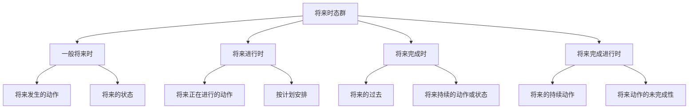

# 将来时态对比分析

## 🎯 学习目标
- 掌握将来时态群的基本概念和构成
- 理解将来时态群的各种用法
- 熟练运用将来时态群的各种形式

## 📚 基本概念

### 将来时态群（Future Tense Group）
**定义**：表示将来时间范畴的各种时态的总称

### 基本特征
- 表示将来时间范畴
- 包括四种时态
- 有各自的特点和用法
- 需要区分使用

## 🔄 将来时态群分类

## 📊 将来时态群对比表

### 基本对比表
| 时态 | 构成 | 基本用法 | 时间状语 | 示例 |
|------|------|----------|----------|------|
| 一般将来时 | will+动词原形 | 将来发生的动作 | tomorrow, next year | I will work tomorrow. |
| 将来进行时 | will be+现在分词 | 将来正在进行的动作 | at 8:00, while | I will be working at 8:00. |
| 将来完成时 | will have+过去分词 | 将来的过去 | by, before, when | I will have worked by 8:00. |
| 将来完成进行时 | will have been+现在分词 | 将来的持续动作 | for, since, by | I will have been working for 3 hours. |

## 🎯 一般将来时

### 1. 基本概念
**定义**：表示将来某个时间将要发生的动作或状态

**特征**：
- 表示将来的动作或状态
- 有肯定、否定、疑问形式
- 用will+动词原形构成
- 常与将来时间状语连用

### 2. 基本用法
**用法**：
- 表示将来某个时间将要发生的动作
- 表示将来存在的状态
- 表示将来的习惯性动作
- 表示将来的意愿

**示例**：
- ✅ I will go to Beijing tomorrow. (我明天要去北京)
- ✅ I will be a student next year. (我明年将是学生)
- ✅ I will always get up early. (我将总是早起)
- ✅ I will help you. (我将帮助你)

### 3. 时间状语
**时间状语**：
- 将来时间：tomorrow, next year, next week, next month
- 将来时间点：at 8:00 tomorrow, at 3:00 next week
- 将来时间段：for 8 hours tomorrow, for a week next month

## 🎯 将来进行时

### 1. 基本概念
**定义**：表示将来某个时间正在进行的动作

**特征**：
- 表示将来正在进行的动作
- 有肯定、否定、疑问形式
- 用will be+现在分词构成
- 常与将来时间状语连用

### 2. 基本用法
**用法**：
- 表示将来某个时间正在进行的动作
- 表示将来某个时间段正在进行的动作
- 表示按计划、安排将要进行的动作
- 表示礼貌的询问

**示例**：
- ✅ I will be working at 8:00 tomorrow. (我明天8点将正在工作)
- ✅ I will be working from 9:00 to 12:00 tomorrow. (我明天从9点到12点将正在工作)
- ✅ I will be leaving for Beijing tomorrow. (我明天将要去北京)
- ✅ Will you be using the computer this afternoon? (你今天下午要用电脑吗？)

### 3. 时间状语
**时间状语**：
- 将来时间点：at 8:00 tomorrow, at 3:00 next week
- 将来时间段：from 9:00 to 12:00, for 2 hours tomorrow
- 将来时间从句：when, while, as, before, after

## 🎯 将来完成时

### 1. 基本概念
**定义**：表示在将来某个时间之前已经完成的动作

**特征**：
- 表示将来的过去
- 表示动作的完成
- 有肯定、否定、疑问形式
- 用will have+过去分词构成

### 2. 基本用法
**用法**：
- 表示在将来某个时间之前已经完成的动作
- 表示到将来某个时间为止持续的动作或状态
- 表示对将来某个时间之前动作的推测
- 表示将来某个时间之前刚刚完成的动作

**示例**：
- ✅ I will have finished my work by 8:00 tomorrow. (我明天8点前将完成工作)
- ✅ I will have lived here for 10 years by next year. (到明年我将在这里住了10年)
- ✅ He will have finished his homework by now. (他现在应该已经完成作业了)
- ✅ I will have just finished my work when you arrive. (你到达时，我将刚刚完成工作)

### 3. 时间状语
**时间状语**：
- 将来时间：by 8:00 tomorrow, before you arrive
- 持续时间：for 10 years, since 2010
- 不确定时间：by now, by this time

## 🎯 将来完成进行时

### 1. 基本概念
**定义**：表示在将来某个时间之前一直持续进行，并且可能继续下去的动作

**特征**：
- 表示将来的持续动作
- 表示动作的未完成性
- 有肯定、否定、疑问形式
- 用will have been+现在分词构成

### 2. 基本用法
**用法**：
- 表示在将来某个时间之前一直持续进行的动作
- 表示到将来某个时间为止持续的动作或状态
- 表示对将来某个时间之前持续动作的推测
- 表示将来某个时间之前动作的重复性

**示例**：
- ✅ I will have been working for 3 hours by 8:00 tomorrow. (到明天8点我将已经工作了3个小时)
- ✅ I will have been living here for 10 years by next year. (到明年我将已经在这里住了10年)
- ✅ He will have been working for 8 hours by now. (他现在应该已经工作了8个小时)
- ✅ I will have been calling you all day by evening. (到晚上我将已经给你打了一整天电话)

### 3. 时间状语
**时间状语**：
- 持续时间：for 3 hours, since 2010
- 将来时间：by 8:00 tomorrow, before you arrive
- 频率：all day, all morning, all week

## 🔄 将来时态群对比分析

### 1. 时间概念对比
| 时态 | 时间概念 | 特点 | 示例 |
|------|----------|------|------|
| 一般将来时 | 将来 | 将来发生的动作 | I will work tomorrow. |
| 将来进行时 | 将来 | 将来正在进行的动作 | I will be working at 8:00. |
| 将来完成时 | 将来的过去 | 将来动作对将来的影响 | I will have worked by 8:00. |
| 将来完成进行时 | 将来的过去到现在 | 将来的持续动作 | I will have been working for 3 hours. |

### 2. 动作性质对比
| 时态 | 动作性质 | 特点 | 示例 |
|------|----------|------|------|
| 一般将来时 | 将来动作 | 动作将要发生 | I will go to Beijing tomorrow. |
| 将来进行时 | 进行性动作 | 将来正在进行的动作 | I will be working at 8:00. |
| 将来完成时 | 完成性动作 | 将来动作已完成 | I will have finished my work. |
| 将来完成进行时 | 持续性动作 | 将来的持续动作 | I will have been working for 3 hours. |

### 3. 语法构成对比
| 时态 | 构成 | 特点 | 示例 |
|------|------|------|------|
| 一般将来时 | will+动词原形 | 简单构成 | I will work. |
| 将来进行时 | will be+现在分词 | 进行时态 | I will be working. |
| 将来完成时 | will have+过去分词 | 完成时态 | I will have worked. |
| 将来完成进行时 | will have been+现在分词 | 完成进行时态 | I will have been working. |

## 🎯 将来时态群选择技巧

### 1. 根据时间概念选择
- 将来时间：一般将来时、将来进行时
- 将来的过去：将来完成时
- 将来的过去到现在：将来完成进行时

### 2. 根据动作性质选择
- 将来动作：一般将来时
- 进行性动作：将来进行时
- 完成性动作：将来完成时
- 持续性动作：将来完成进行时

### 3. 根据语法功能选择
- 简单表达：一般将来时
- 进行表达：将来进行时
- 完成表达：将来完成时
- 完成进行表达：将来完成进行时

## 🚫 常见错误分析

### 错误类型1：时态选择错误
**错误**：❌ I am work tomorrow.
**正确**：✅ I will work tomorrow.
**分析**：将来时间用将来时态

### 错误类型2：时态构成错误
**错误**：❌ I will have work for 3 hours.
**正确**：✅ I will have been working for 3 hours.
**分析**：持续动作用将来完成进行时

### 错误类型3：时间状语使用错误
**错误**：❌ I will have finished my work yesterday.
**正确**：✅ I had finished my work yesterday.
**分析**：过去时间用过去完成时

### 错误类型4：动作性质判断错误
**错误**：❌ I will be knowing English.
**正确**：✅ I will know English.
**分析**：状态动词不用进行时

## 📊 将来时态群用法总结

| 时态 | 主要用法 | 时间状语 | 典型例句 |
|------|----------|----------|----------|
| 一般将来时 | 将来发生的动作 | tomorrow, next year | I will work tomorrow. |
| 将来进行时 | 将来正在进行的动作 | at 8:00, while | I will be working at 8:00. |
| 将来完成时 | 将来的过去 | by, before, when | I will have worked by 8:00. |
| 将来完成进行时 | 将来的持续动作 | for, since, by | I will have been working for 3 hours. |

## 🔗 相关链接
- [[01-一般将来时]]：一般将来时的用法
- [[02-将来进行时]]：将来进行时的用法
- [[03-将来完成时]]：将来完成时的用法
- [[04-将来完成进行时]]：将来完成进行时的用法
- [[01-基础认知层/01-词性系统/03-动词系统/03-动词基本形式]]：动词的基本形式

## 💡 记忆口诀

**将来时态群记忆法**：
- 一般将来时表示将来发生的动作，将来进行时表示将来正在进行的动作
- 将来完成时表示将来的过去，将来完成进行时表示将来的持续动作
- 时间概念要分清，动作性质要判断
- 语法构成要记牢，时间状语要准确
- 时态选择要正确，错误用法要避免

---
*掌握将来时态群对比分析是语法学习的重要基础，需要大量练习才能熟练运用*
