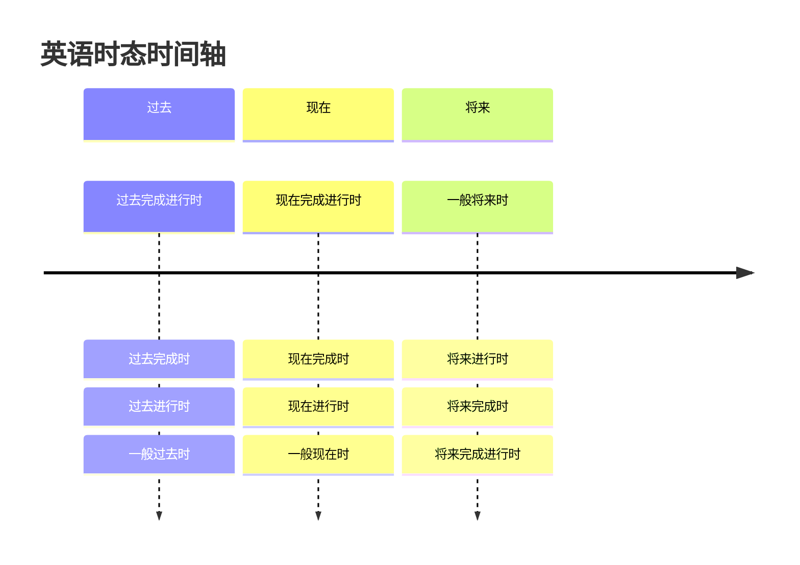
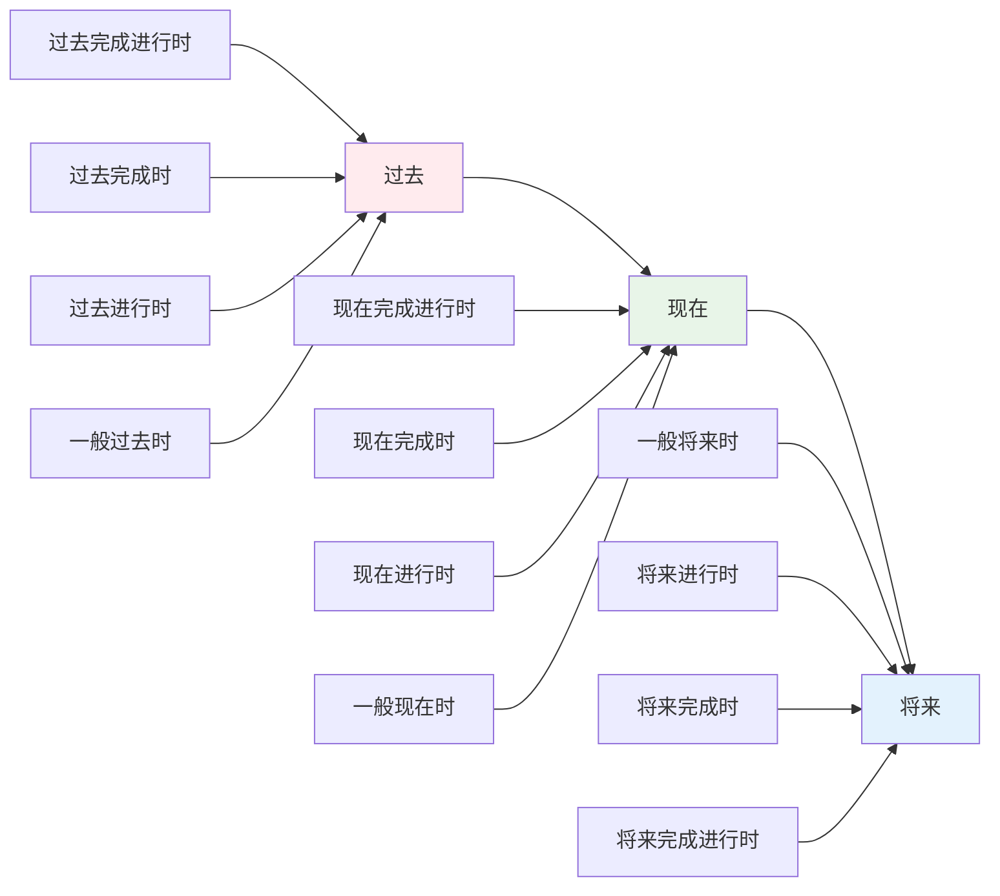
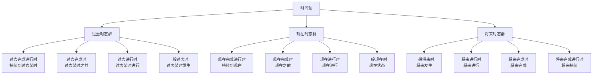
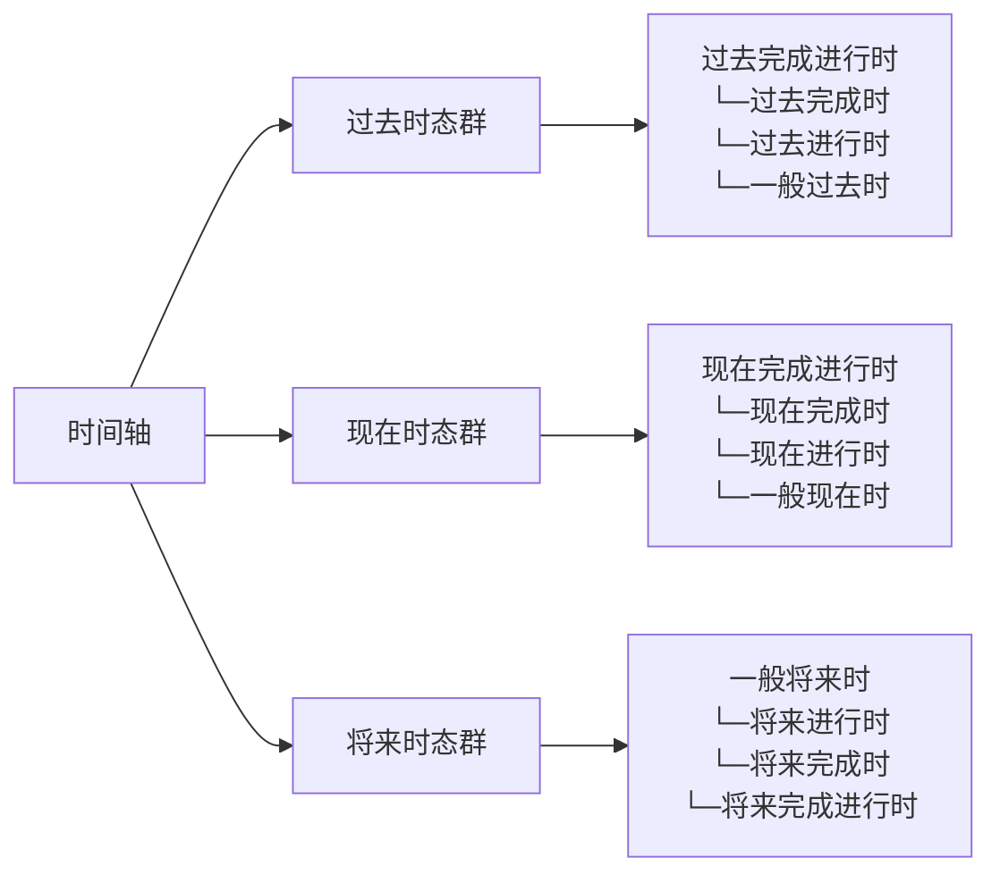
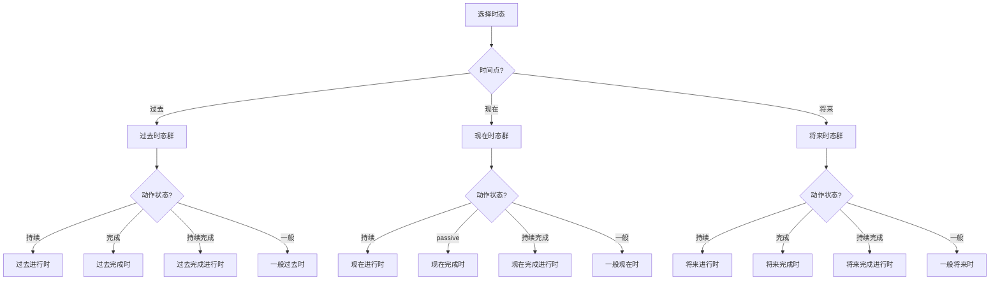
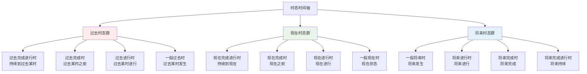

# 时态时间轴图

## 核心概念
时态时间轴图通过可视化的时间轴展示各种时态在时间维度上的位置关系，帮助学习者理解时态的时间概念和相互关系。

## 基本时间轴

### 1. 时间轴基础结构


### 2. 详细时间轴图
```mermaid
gantt
    title 英语时态时间轴图
    dateFormat X
    axisFormat %s
    
    section 过去时态群
    过去完成进行时    :done, past-perfect-continuous, 0, 1
    过去完成时        :done, past-perfect, 1, 2
    过去进行时        :done, past-continuous, 2, 3
    一般过去时        :done, past-simple, 3, 4
    
    section 现在时态群
    现在完成进行时    :active, present-perfect-continuous, 4, 5
    现在完成时        :active, present-perfect, 5, 6
    现在进行时        :active, present-continuous, 6, 7
    一般现在时        :active, present-simple, 7, 8
    
    section 将来时态群
    一般将来时        :future, future-simple, 8, 9
    将来进行时        :future, future-continuous, 9, 10
    将来完成时        :future, future-perfect, 10, 11
    将来完成进行时    :future, future-perfect-continuous, 11, 12
```

## 时态时间关系

### 3. 时态时间点图


### 4. 时态时间范围图


## 时态对比分析

### 5. 时态时间对比表
| 时态 | 时间点 | 时间范围 | 时间关系 | 典型时间词 |
|------|--------|----------|----------|------------|
| **一般现在时** | 现在 | 现在 | 现在状态 | always, usually, often |
| **现在进行时** | 现在 | 现在进行 | 现在进行 | now, at present |
| **现在完成时** | 现在 | 现在之前 | 现在之前 | already, yet, just |
| **现在完成进行时** | 现在 | 持续到现在 | 持续到现在 | for, since |
| **一般过去时** | 过去 | 过去某时 | 过去发生 | yesterday, last week |
| **过去进行时** | 过去 | 过去进行 | 过去进行 | at that time |
| **过去完成时** | 过去 | 过去之前 | 过去之前 | by then, before |
| **过去完成进行时** | 过去 | 持续到过去 | 持续到过去 | for, since |
| **一般将来时** | 将来 | 将来发生 | 将来发生 | tomorrow, next week |
| **将来进行时** | 将来 | 将来进行 | 将来进行 | at this time tomorrow |
| **将来完成时** | 将来 | 将来完成 | 将来完成 | by then, before |
| **将来完成进行时** | 将来 | 持续到将来 | 持续到将来 | for, since |

### 6. 时态时间关系图


## 时态时间轴应用

### 7. 时态选择流程图


### 8. 时态时间轴记忆图


## 时态时间轴练习

### 9. 时间轴填空练习
**练习1**: 在时间轴上标出下列时态的位置
```
时间轴: 过去 ←→ 现在 ←→ 将来
时态: 一般过去时, 现在进行时, 将来完成时
```

**练习2**: 根据时间轴选择正确的时态
```
时间点: 现在
动作状态: 持续
正确答案: 现在进行时
```

### 10. 时态时间关系练习
**练习1**: 分析下列时态的时间关系
```
句子: By the time he arrived, I had been waiting for two hours.
分析: 过去完成进行时表示持续到过去某时的动作
```

**练习2**: 根据时间关系选择时态
```
时间关系: 将来某时之前完成
正确答案: 将来完成时
```

## 记忆口诀
> **过去现在将来分，时态时间要记清**
> **过去时态表过去，现在时态表现在**
> **将来时态表将来，时间轴图要掌握**
> **持续完成进行时，时间关系要分清**

## 刻意练习

### 练习1: 时间轴识别
在时间轴上标出下列时态的位置：
1. 一般过去时
2. 现在进行时
3. 将来完成时

### 练习2: 时态选择
根据时间点选择正确的时态：
1. 时间点：现在，动作状态：持续
2. 时间点：过去，动作状态：完成
3. 时间点：将来，动作状态：进行

### 练习3: 时间关系分析
分析下列时态的时间关系：
1. I have been studying English for three years.
2. By next year, I will have finished my studies.

## 相关链接
- [[02-时态选择决策树]] - 学习时态选择方法
- [[03-时态易混点辨析]] - 避免时态混淆
- [[01-现在时态群/01-一般现在时]] - 深入学习一般现在时

## 学习要点
1. **理解**: 掌握时态的时间概念
2. **识别**: 能够识别时态的时间位置
3. **选择**: 能够根据时间选择时态
4. **应用**: 在实际中正确运用时态

---
*学习建议: 通过时间轴图理解时态的时间关系，结合实例加深记忆*
