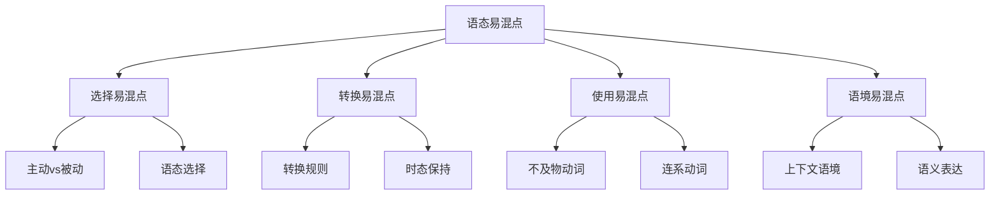

# 语态易混点辨析

## 🎯 学习目标
- 识别语态使用中的常见易混点
- 掌握易混点的正确用法
- 避免语态使用中的常见错误

## 🔍 易混点分类

## 🔄 选择易混点

### 1. 主动语态vs被动语态
**易混点**：主动语态和被动语态的选择错误

**常见错误**：
| 错误 | 正确 | 分析 |
|------|------|------|
| The book is read by me. | I read the book. | 主动语态更自然 |
| The car was bought by him. | He bought the car. | 主动语态更直接 |
| The house will be built by them. | They will build the house. | 主动语态更简洁 |
| The work is being done by us. | We are doing the work. | 主动语态更清晰 |
| The problem has been solved by her. | She has solved the problem. | 主动语态更明确 |

**辨析技巧**：
- 主动语态更自然
- 被动语态用于特定情况
- 根据语境选择
- 注意表达效果

**示例对比**：
- ✅ I read the book. (我读书) - 主动语态
- ✅ The book is read by me. (书被我读) - 被动语态
- ✅ He bought the car. (他买车) - 主动语态
- ✅ The car was bought by him. (车被他买) - 被动语态

### 2. 语态选择错误
**易混点**：语态选择错误

**常见错误**：
| 错误 | 正确 | 分析 |
|------|------|------|
| I am read a book. | I read a book. | 主动语态用主动形式 |
| The book reads by me. | The book is read by me. | 被动语态用被动形式 |
| I am reading a book. | I am reading a book. | 现在进行时主动语态 |
| The book is being read by me. | The book is being read by me. | 现在进行时被动语态 |
| I have read a book. | I have read a book. | 现在完成时主动语态 |

**辨析技巧**：
- 主动语态用主动形式
- 被动语态用被动形式
- 时态要保持一致
- 注意动词形式

**示例对比**：
- ✅ I read a book. (我读书) - 主动语态
- ✅ A book is read by me. (书被我读) - 被动语态
- ✅ I am reading a book. (我正在读书) - 主动语态
- ✅ A book is being read by me. (书正在被我读) - 被动语态

## 🎯 转换易混点

### 1. 转换规则错误
**易混点**：转换规则错误

**常见错误**：
| 错误 | 正确 | 分析 |
|------|------|------|
| I read a book. → A book is read by I. | I read a book. → A book is read by me. | by短语用宾格 |
| I read a book. → A book was read by me. | I read a book. → A book is read by me. | 时态要保持一致 |
| I gave him a book. → A book was given him by me. | I gave him a book. → A book was given to him by me. | 间接宾语前要加to |
| I found the book interesting. → The book was found interesting by me. | I found the book interesting. → The book was found interesting by me. | 宾语补足语要保留 |

**辨析技巧**：
- by短语用宾格
- 时态要保持一致
- 间接宾语前要加to
- 宾语补足语要保留

**示例对比**：
- ✅ I read a book. → A book is read by me. (正确转换)
- ✅ I read a book. → A book is read by I. (错误转换)
- ✅ I gave him a book. → A book was given to him by me. (正确转换)
- ✅ I gave him a book. → A book was given him by me. (错误转换)

### 2. 时态保持错误
**易混点**：时态保持错误

**常见错误**：
| 错误 | 正确 | 分析 |
|------|------|------|
| I read a book. → A book was read by me. | I read a book. → A book is read by me. | 一般现在时保持一致 |
| I read a book. → A book is read by me. | I read a book. → A book was read by me. | 一般过去时保持一致 |
| I will read a book. → A book is read by me. | I will read a book. → A book will be read by me. | 一般将来时保持一致 |
| I am reading a book. → A book is read by me. | I am reading a book. → A book is being read by me. | 现在进行时保持一致 |
| I have read a book. → A book is read by me. | I have read a book. → A book has been read by me. | 现在完成时保持一致 |

**辨析技巧**：
- 时态要保持一致
- 主动语态和被动语态时态相同
- 注意be动词的变化
- 检查时态标志

**示例对比**：
- ✅ I read a book. → A book is read by me. (一般现在时)
- ✅ I read a book. → A book was read by me. (一般过去时)
- ✅ I will read a book. → A book will be read by me. (一般将来时)
- ✅ I am reading a book. → A book is being read by me. (现在进行时)
- ✅ I have read a book. → A book has been read by me. (现在完成时)

## 🎯 使用易混点

### 1. 不及物动词被动语态
**易混点**：不及物动词被动语态错误

**常见错误**：
| 错误 | 正确 | 分析 |
|------|------|------|
| I run. → I am run. | I run. → 不能转换 | 不及物动词不能转换 |
| She sleeps. → She is slept. | She sleeps. → 不能转换 | 不及物动词不能转换 |
| He works. → He is worked. | He works. → 不能转换 | 不及物动词不能转换 |
| We study. → We are studied. | We study. → 不能转换 | 不及物动词不能转换 |
| They play. → They are played. | They play. → 不能转换 | 不及物动词不能转换 |

**辨析技巧**：
- 不及物动词不能转换
- 不及物动词没有宾语
- 需要改变句子结构
- 使用动名词形式

**示例对比**：
- ✅ I run fast. (我跑得快) - 主动语态
- ❌ I am run fast. (错误) - 不及物动词不能转换
- ✅ Running is done by me fast. (跑步被我做得很快) - 改变结构
- ✅ I run fast. → 不能直接转换 - 正确理解

### 2. 连系动词被动语态
**易混点**：连系动词被动语态错误

**常见错误**：
| 错误 | 正确 | 分析 |
|------|------|------|
| I am a student. → A student is been by me. | I am a student. → 不能转换 | 连系动词不能转换 |
| She looks beautiful. → Beautiful is looked by her. | She looks beautiful. → 不能转换 | 连系动词不能转换 |
| He seems tired. → Tired is seemed by him. | He seems tired. → 不能转换 | 连系动词不能转换 |
| We become friends. → Friends are become by us. | We become friends. → 不能转换 | 连系动词不能转换 |
| They turn red. → Red is turned by them. | They turn red. → 不能转换 | 连系动词不能转换 |

**辨析技巧**：
- 连系动词不能转换
- 连系动词表示状态
- 没有动作概念
- 保持原句不变

**示例对比**：
- ✅ I am a student. (我是学生) - 连系动词
- ❌ A student is been by me. (错误) - 连系动词不能转换
- ✅ I am a student. → 不能转换 - 正确理解
- ✅ She looks beautiful. (她看起来很美丽) - 连系动词

### 3. 情态动词被动语态
**易混点**：情态动词被动语态错误

**常见错误**：
| 错误 | 正确 | 分析 |
|------|------|------|
| I can do the work. → The work can be done by me. | I can do the work. → The work can be done by me. | 情态动词+be+过去分词 |
| She must finish the task. → The task must be finished by her. | She must finish the task. → The task must be finished by her. | 情态动词+be+过去分词 |
| He should close the door. → The door should be closed by him. | He should close the door. → The door should be closed by him. | 情态动词+be+过去分词 |
| We may send the letter. → The letter may be sent by us. | We may send the letter. → The letter may be sent by us. | 情态动词+be+过去分词 |
| They will build the house. → The house will be built by them. | They will build the house. → The house will be built by them. | 情态动词+be+过去分词 |

**辨析技巧**：
- 情态动词+be+过去分词
- 情态动词保持不变
- 主语和宾语互换
- 时态保持不变

**示例对比**：
- ✅ I can do the work. → The work can be done by me. (正确转换)
- ✅ She must finish the task. → The task must be finished by her. (正确转换)
- ✅ He should close the door. → The door should be closed by him. (正确转换)
- ✅ We may send the letter. → The letter may be sent by us. (正确转换)
- ✅ They will build the house. → The house will be built by them. (正确转换)

## 🎯 语境易混点

### 1. 上下文语境错误
**易混点**：上下文语境错误

**常见错误**：
| 错误 | 正确 | 分析 |
|------|------|------|
| The book was written by Mark Twain. | The book was written by Mark Twain. | 强调动作承受者用被动语态 |
| Mark Twain wrote the book. | Mark Twain wrote the book. | 强调动作执行者用主动语态 |
| The window was broken. | The window was broken. | 不知道动作执行者用被动语态 |
| Someone broke the window. | Someone broke the window. | 知道动作执行者用主动语态 |
| English is spoken all over the world. | English is spoken all over the world. | 动作执行者不重要用被动语态 |

**辨析技巧**：
- 根据上下文选择语态
- 强调动作承受者用被动语态
- 强调动作执行者用主动语态
- 考虑语境因素

**示例对比**：
- ✅ The book was written by Mark Twain. (强调书)
- ✅ Mark Twain wrote the book. (强调作者)
- ✅ The window was broken. (不知道谁打破的)
- ✅ Someone broke the window. (知道有人打破的)
- ✅ English is spoken all over the world. (动作执行者不重要)

### 2. 语义表达错误
**易混点**：语义表达错误

**常见错误**：
| 错误 | 正确 | 分析 |
|------|------|------|
| I am read a book. | I read a book. | 主动语态用主动形式 |
| The book reads by me. | The book is read by me. | 被动语态用被动形式 |
| I am reading a book. | I am reading a book. | 现在进行时主动语态 |
| The book is being read by me. | The book is being read by me. | 现在进行时被动语态 |
| I have read a book. | I have read a book. | 现在完成时主动语态 |

**辨析技巧**：
- 注意语义表达
- 主动语态用主动形式
- 被动语态用被动形式
- 时态要保持一致

**示例对比**：
- ✅ I read a book. (我读书) - 主动语态
- ❌ I am read a book. (错误) - 语态形式错误
- ✅ A book is read by me. (书被我读) - 被动语态
- ❌ The book reads by me. (错误) - 语态形式错误

## 📊 易混点对比表

| 易混点类型 | 错误示例 | 正确示例 | 辨析要点 |
|------------|----------|----------|----------|
| 主动vs被动 | The book is read by me. | I read the book. | 主动语态更自然 |
| 语态选择 | I am read a book. | I read a book. | 主动语态用主动形式 |
| 转换规则 | A book is read by I. | A book is read by me. | by短语用宾格 |
| 时态保持 | I read a book. → A book was read by me. | I read a book. → A book is read by me. | 时态要保持一致 |
| 不及物动词 | I run. → I am run. | I run. → 不能转换 | 不及物动词不能转换 |
| 连系动词 | I am a student. → A student is been by me. | I am a student. → 不能转换 | 连系动词不能转换 |
| 情态动词 | I can do the work. → The work can be done by me. | I can do the work. → The work can be done by me. | 情态动词+be+过去分词 |
| 上下文语境 | Mark Twain wrote the book. | The book was written by Mark Twain. | 根据语境选择语态 |
| 语义表达 | The book reads by me. | The book is read by me. | 被动语态用被动形式 |

## 🎯 辨析技巧总结

### 1. 语态选择法
- 主动语态更自然
- 被动语态用于特定情况
- 根据语境选择
- 注意表达效果

### 2. 转换规则法
- by短语用宾格
- 时态要保持一致
- 间接宾语前要加to
- 宾语补足语要保留

### 3. 动词性质判断法
- 不及物动词不能转换
- 连系动词不能转换
- 情态动词可以转换
- 根据动词性质判断

### 4. 语境分析法
- 根据上下文选择语态
- 强调动作承受者用被动语态
- 强调动作执行者用主动语态
- 考虑语境因素

## 🔗 相关链接
- [[01-主动语态]]：主动语态的用法
- [[02-被动语态]]：被动语态的用法
- [[03-语态转换]]：语态转换的规则
- [[01-基础认知层/01-词性系统/03-动词系统]]：动词系统

## 💡 记忆口诀

**语态易混点辨析记忆法**：
- 主动语态更自然，被动语态用于特定情况
- 主动语态用主动形式，被动语态用被动形式
- by短语用宾格，时态要保持一致
- 不及物动词不能转换，连系动词不能转换
- 情态动词可以转换：情态动词+be+过去分词
- 根据语境选择语态，注意语义表达

---
*掌握语态易混点辨析是提高语法准确性的关键，需要大量练习和对比分析*
