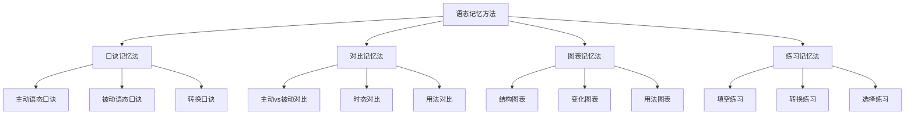

# 语态记忆辅助

## 🎯 学习目标
- 掌握语态记忆的有效方法
- 理解语态记忆的技巧和策略
- 提高语态学习的效率和准确性

## 📚 记忆方法分类



## 🎯 口诀记忆法

### 1. 主动语态口诀
**口诀**：
```
主动语态要记牢，主语执行动作好
及物动词有宾语，不及物动词无宾语
连系动词有表语，双宾语有间接和直接
复合宾语有宾语和宾语补足语
时态变化要记牢，动词形式要正确
结构简单表达直接，是英语中最常用的语态
```

**记忆要点**：
- 主语是动作的执行者
- 动作由主语主动发出
- 结构简单，表达直接
- 是英语中最常用的语态

**应用示例**：
- ✅ I read a book. (我读书) - 主动语态
- ✅ She teaches English. (她教英语) - 主动语态
- ✅ He works hard. (他工作努力) - 主动语态
- ✅ We study together. (我们一起学习) - 主动语态
- ✅ They play football. (他们踢足球) - 主动语态

### 2. 被动语态口诀
**口诀**：
```
被动语态要记牢，主语承受动作好
构成：be+过去分词，时态通过be动词体现
强调动作承受者用被动语态，不知道动作执行者用被动语态
动作执行者不重要用被动语态，避免提及动作执行者用被动语态
双宾语有两个被动形式，复合宾语被动语态保留宾语补足语
情态动词被动语态：情态动词+be+过去分词
```

**记忆要点**：
- 主语是动作的承受者
- 动作由主语被动接受
- 用be+过去分词构成
- 可以带by短语表示动作执行者

**应用示例**：
- ✅ A book is read by me. (书被我读) - 被动语态
- ✅ English is taught by her. (英语被她教) - 被动语态
- ✅ The work is done by him. (工作被他做) - 被动语态
- ✅ The study is done by us. (学习被我们做) - 被动语态
- ✅ Football is played by them. (足球被他们踢) - 被动语态

### 3. 语态转换口诀
**口诀**：
```
主动转被动：宾语变主语，动词变被动语态，主语变by短语
被动转主动：主语变宾语，动词变主动语态，by短语变主语
双宾语有两个被动形式，间接宾语或直接宾语都可以作主语
复合宾语被动语态保留宾语补足语，情态动词被动语态：情态动词+be+过去分词
不及物动词不能直接转换，连系动词不能转换
时态要保持一致，by短语用宾格
```

**记忆要点**：
- 主动转被动：宾语变主语
- 被动转主动：主语变宾语
- 时态要保持一致
- by短语用宾格

**应用示例**：
- ✅ I read a book. → A book is read by me. (主动转被动)
- ✅ A book is read by me. → I read a book. (被动转主动)
- ✅ I gave him a book. → He was given a book by me. (双宾语转换)
- ✅ I found the book interesting. → The book was found interesting by me. (复合宾语转换)

## 🎯 对比记忆法

### 1. 主动vs被动对比
**对比表**：
| 方面 | 主动语态 | 被动语态 |
|------|----------|----------|
| 主语 | 动作执行者 | 动作承受者 |
| 动词 | 主动形式 | be+过去分词 |
| 宾语 | 有宾语 | 无宾语 |
| 表达 | 直接自然 | 间接委婉 |
| 使用 | 常用 | 特定情况 |

**记忆技巧**：
- 主动语态：主语执行动作
- 被动语态：主语承受动作
- 主动语态更自然
- 被动语态用于特定情况

**应用示例**：
- ✅ I read a book. (我读书) - 主动语态
- ✅ A book is read by me. (书被我读) - 被动语态
- ✅ She teaches English. (她教英语) - 主动语态
- ✅ English is taught by her. (英语被她教) - 被动语态

### 2. 时态对比
**对比表**：
| 时态 | 主动语态 | 被动语态 |
|------|----------|----------|
| 一般现在时 | I read a book. | A book is read by me. |
| 一般过去时 | I read a book. | A book was read by me. |
| 一般将来时 | I will read a book. | A book will be read by me. |
| 现在进行时 | I am reading a book. | A book is being read by me. |
| 过去进行时 | I was reading a book. | A book was being read by me. |
| 现在完成时 | I have read a book. | A book has been read by me. |
| 过去完成时 | I had read a book. | A book had been read by me. |

**记忆技巧**：
- 时态要保持一致
- 主动语态和被动语态时态相同
- 注意be动词的变化
- 检查时态标志

**应用示例**：
- ✅ I read a book. → A book is read by me. (一般现在时)
- ✅ I read a book. → A book was read by me. (一般过去时)
- ✅ I will read a book. → A book will be read by me. (一般将来时)
- ✅ I am reading a book. → A book is being read by me. (现在进行时)
- ✅ I have read a book. → A book has been read by me. (现在完成时)

### 3. 用法对比
**对比表**：
| 用法 | 主动语态 | 被动语态 |
|------|----------|----------|
| 强调动作执行者 | I read the book. | 不适用 |
| 强调动作承受者 | 不适用 | The book is read by me. |
| 不知道动作执行者 | 不适用 | The window was broken. |
| 动作执行者不重要 | 不适用 | English is spoken worldwide. |
| 避免提及动作执行者 | 不适用 | Mistakes were made. |

**记忆技巧**：
- 主动语态强调动作执行者
- 被动语态强调动作承受者
- 根据语境选择语态
- 注意表达效果

**应用示例**：
- ✅ I read the book. (强调我) - 主动语态
- ✅ The book is read by me. (强调书) - 被动语态
- ✅ The window was broken. (不知道谁打破的) - 被动语态
- ✅ English is spoken worldwide. (动作执行者不重要) - 被动语态

## 🎯 图表记忆法

### 1. 结构图表
**主动语态结构图**：
```
主语 + 动词 + 宾语
  ↓     ↓     ↓
执行者 执行动作 承受动作
```

**被动语态结构图**：
```
主语 + be + 过去分词 + (by短语)
  ↓    ↓       ↓        ↓
承受者 被动标志 被动动作 执行者
```

**记忆技巧**：
- 主动语态：主语执行动作
- 被动语态：主语承受动作
- 结构要记牢
- 成分要分清

### 2. 变化图表
**时态变化图**：
```
一般现在时：am/is/are + 过去分词
一般过去时：was/were + 过去分词
一般将来时：will be + 过去分词
现在进行时：am/is/are being + 过去分词
过去进行时：was/were being + 过去分词
现在完成时：have/has been + 过去分词
过去完成时：had been + 过去分词
```

**记忆技巧**：
- 时态通过be动词体现
- 过去分词保持不变
- 变化规律要记牢
- 练习要反复

### 3. 用法图表
**用法选择图**：
```
强调动作执行者 → 主动语态
强调动作承受者 → 被动语态
不知道动作执行者 → 被动语态
动作执行者不重要 → 被动语态
避免提及动作执行者 → 被动语态
```

**记忆技巧**：
- 根据语境选择语态
- 考虑表达效果
- 注意语义重点
- 灵活运用

## 🎯 练习记忆法

### 1. 填空练习
**练习1：主动语态填空**
```
1. I _____ a book every day. (read)
2. She _____ English to students. (teach)
3. He _____ hard for the exam. (study)
4. We _____ football on weekends. (play)
5. They _____ their homework. (do)
```

**答案**：
1. read
2. teaches
3. studies
4. play
5. do

**练习2：被动语态填空**
```
1. A book _____ by me every day. (read)
2. English _____ to students by her. (teach)
3. The exam _____ hard by him. (study)
4. Football _____ on weekends by us. (play)
5. Their homework _____ by them. (do)
```

**答案**：
1. is read
2. is taught
3. is studied
4. is played
5. is done

### 2. 转换练习
**练习1：主动转被动**
```
1. I read a book. → A book _____ by me.
2. She teaches English. → English _____ by her.
3. He studies hard. → Hard _____ by him.
4. We play football. → Football _____ by us.
5. They do homework. → Homework _____ by them.
```

**答案**：
1. is read
2. is taught
3. is studied
4. is played
5. is done

**练习2：被动转主动**
```
1. A book is read by me. → I _____ a book.
2. English is taught by her. → She _____ English.
3. Hard is studied by him. → He _____ hard.
4. Football is played by us. → We _____ football.
5. Homework is done by them. → They _____ homework.
```

**答案**：
1. read
2. teaches
3. studies
4. play
5. do

### 3. 选择练习
**练习1：语态选择**
```
1. I _____ a book. (read / am read)
2. A book _____ by me. (is read / reads)
3. She _____ English. (teaches / is taught)
4. English _____ by her. (is taught / teaches)
5. He _____ hard. (studies / is studied)
```

**答案**：
1. read
2. is read
3. teaches
4. is taught
5. studies

**练习2：时态选择**
```
1. I _____ a book yesterday. (read / was read)
2. A book _____ by me yesterday. (was read / read)
3. I _____ a book tomorrow. (will read / will be read)
4. A book _____ by me tomorrow. (will be read / will read)
5. I _____ a book now. (am reading / am being read)
```

**答案**：
1. read
2. was read
3. will read
4. will be read
5. am reading

## 📊 记忆效果评估

### 1. 记忆程度测试
**测试1：概念理解**
- 主动语态的定义是什么？
- 被动语态的定义是什么？
- 语态转换的规则是什么？
- 不及物动词能否转换为被动语态？
- 连系动词能否转换为被动语态？

**测试2：结构识别**
- 识别主动语态的结构
- 识别被动语态的结构
- 识别时态变化
- 识别语态转换
- 识别错误用法

**测试3：实际应用**
- 选择正确的语态
- 进行语态转换
- 识别语态错误
- 理解语态含义
- 运用语态表达

### 2. 记忆巩固方法
**方法1：重复练习**
- 每天练习语态转换
- 反复记忆口诀
- 多次练习填空
- 持续练习选择
- 定期复习巩固

**方法2：对比分析**
- 对比主动和被动语态
- 分析时态变化规律
- 比较用法差异
- 总结转换规则
- 归纳记忆要点

**方法3：实际应用**
- 在写作中运用语态
- 在口语中练习语态
- 在阅读中识别语态
- 在听力中理解语态
- 在翻译中转换语态

## 🔗 相关链接
- [[01-主动语态]]：主动语态的用法
- [[02-被动语态]]：被动语态的用法
- [[03-语态转换]]：语态转换的规则
- [[04-语态易混点辨析]]：语态的易混点辨析
- [[01-基础认知层/01-词性系统/03-动词系统]]：动词系统

## 💡 记忆口诀总结

**语态记忆总口诀**：
```
主动被动要分清，主语角色是关键
主动语态主语执行动作，被动语态主语承受动作
构成规则要记牢，时态变化要一致
转换规则要掌握，练习巩固要持续
口诀对比图表法，多种方法结合用
实际应用多练习，语态掌握没问题
```

---
*掌握语态记忆辅助方法是提高语法学习效率的关键，需要多种方法结合使用*
