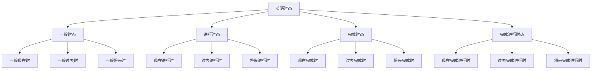
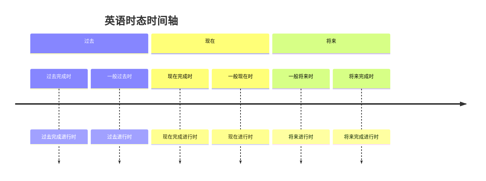
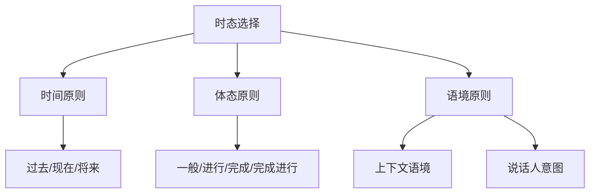

# 时态总览

## 📚 时态系统概述

时态是英语语法中表示动作发生时间的重要语法范畴，通过动词的变化来表达动作发生的时间、持续性和完成性。

## 🎯 学习目标

- **认识层面**：了解时态的基本概念和分类
- **理解层面**：掌握各种时态的构成和用法
- **应用层面**：能够正确运用各种时态

## 📖 时态分类

### 时态分类图

## ⏰ 时间轴概念

### 时间轴图

## 🔍 时态特征

### 时态特征表

| 时态类型 | 时间特征 | 体态特征 | 主要用法 |
|----------|----------|----------|----------|
| 一般现在时 | 现在 | 一般 | 习惯、真理、状态 |
| 一般过去时 | 过去 | 一般 | 过去发生的动作 |
| 一般将来时 | 将来 | 一般 | 将来发生的动作 |
| 现在进行时 | 现在 | 进行 | 正在进行的动作 |
| 过去进行时 | 过去 | 进行 | 过去某时正在进行的动作 |
| 将来进行时 | 将来 | 进行 | 将来某时正在进行的动作 |
| 现在完成时 | 现在 | 完成 | 过去发生对现在有影响 |
| 过去完成时 | 过去 | 完成 | 过去某时前已完成的动作 |
| 将来完成时 | 将来 | 完成 | 将来某时前将完成的动作 |
| 现在完成进行时 | 现在 | 完成进行 | 过去开始持续到现在 |
| 过去完成进行时 | 过去 | 完成进行 | 过去某时前一直进行的动作 |
| 将来完成进行时 | 将来 | 完成进行 | 将来某时前一直进行的动作 |

## 📊 时态构成

### 时态构成表

| 时态 | 构成形式 | 例句 |
|------|----------|------|
| 一般现在时 | 动词原形/第三人称单数 | I work. / He works. |
| 一般过去时 | 动词过去式 | I worked. |
| 一般将来时 | will/shall + 动词原形 | I will work. |
| 现在进行时 | am/is/are + 现在分词 | I am working. |
| 过去进行时 | was/were + 现在分词 | I was working. |
| 将来进行时 | will be + 现在分词 | I will be working. |
| 现在完成时 | have/has + 过去分词 | I have worked. |
| 过去完成时 | had + 过去分词 | I had worked. |
| 将来完成时 | will have + 过去分词 | I will have worked. |
| 现在完成进行时 | have/has been + 现在分词 | I have been working. |
| 过去完成进行时 | had been + 现在分词 | I had been working. |
| 将来完成进行时 | will have been + 现在分词 | I will have been working. |

## 🎯 时态选择原则

### 选择原则图

### 选择原则说明

1. **时间原则**：根据动作发生的时间选择时态
2. **体态原则**：根据动作的性质选择体态
3. **语境原则**：根据上下文和说话人意图选择时态

## 📝 时态对比

### 现在时态对比

| 时态 | 时间特征 | 体态特征 | 例句 |
|------|----------|----------|------|
| 一般现在时 | 现在 | 一般 | I work every day. |
| 现在进行时 | 现在 | 进行 | I am working now. |
| 现在完成时 | 现在 | 完成 | I have worked. |
| 现在完成进行时 | 现在 | 完成进行 | I have been working. |

### 过去时态对比

| 时态 | 时间特征 | 体态特征 | 例句 |
|------|----------|----------|------|
| 一般过去时 | 过去 | 一般 | I worked yesterday. |
| 过去进行时 | 过去 | 进行 | I was working at 8 PM. |
| 过去完成时 | 过去 | 完成 | I had worked before he came. |
| 过去完成进行时 | 过去 | 完成进行 | I had been working for 3 hours. |

## ⚠️ 常见错误分析

### 错误1：时态混用
- ❌ I have seen him yesterday.
- ✅ I saw him yesterday.

### 错误2：时间状语与时态不匹配
- ❌ I will go to school yesterday.
- ✅ I went to school yesterday.

### 错误3：体态选择错误
- ❌ I am working for 3 hours.
- ✅ I have been working for 3 hours.

## 🎯 费曼学习法应用

### 第一步：选择概念
选择"现在完成时"这个概念进行解释

### 第二步：教授他人
用简单语言解释：现在完成时表示过去发生的动作对现在有影响

### 第三步：发现问题
在解释过程中发现：需要掌握过去分词的变化规律

### 第四步：重新学习
回到资料重新学习动词的变化规律

### 第五步：简化表达
用更简单的语言重新表达：现在完成时是"已经做了"的意思

## 📚 刻意练习

### 基础练习
1. 识别下列句子的时态：
   - I work every day. → 一般现在时
   - I am working now. → 现在进行时
   - I have worked. → 现在完成时

2. 选择正确的时态：
   - I ______ (work) for 3 hours. → have been working
   - He ______ (come) yesterday. → came

### 进阶练习
1. 根据时间状语选择时态：
   - I ______ (work) every day. → work
   - I ______ (work) now. → am working
   - I ______ (work) for 3 hours. → have been working

2. 时态转换练习：
   - I work every day. → I worked every day. (改为过去时)
   - I am working now. → I was working then. (改为过去进行时)

## 🔗 相关知识点

- [[02-一般时态|一般时态]] - 时态基础
- [[03-进行时态|进行时态]] - 进行体态
- [[04-完成时态|完成时态]] - 完成体态
- [[05-完成进行时态|完成进行时态]] - 完成进行体态

## 📖 扩展阅读

- [[06-时态对比分析|时态对比分析]] - 时态对比
- [[01-基础认知层/01-词性系统/03-动词系统|动词系统]] - 动词基础
- [[99-附录资料/01-语法术语表|语法术语表]]
