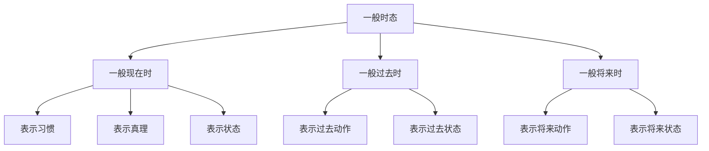

# 一般时态

## 📚 一般时态概述

一般时态是英语时态系统的基础，表示动作的一般性、习惯性或状态，不强调动作的进行性或完成性。

## 🎯 学习目标

- **认识层面**：了解一般时态的基本概念
- **理解层面**：掌握一般时态的构成和用法
- **应用层面**：能够正确运用一般时态

## 📖 一般时态分类

### 一般时态分类图

## ⏰ 一般现在时

### 基本概念
一般现在时表示经常性、习惯性的动作或状态，以及客观真理。

### 构成形式
- **肯定句**：主语 + 动词原形/第三人称单数
- **否定句**：主语 + don't/doesn't + 动词原形
- **疑问句**：Do/Does + 主语 + 动词原形？

### 用法说明

#### 1. 表示经常性动作
- I **work** every day.
- She **studies** English.

#### 2. 表示客观真理
- The sun **rises** in the east.
- Water **boils** at 100°C.

#### 3. 表示现在状态
- I **am** a teacher.
- He **likes** music.

#### 4. 表示将来安排
- The train **leaves** at 8 AM.
- School **starts** next Monday.

### 时间状语
- always, usually, often, sometimes, never
- every day/week/month/year
- in the morning/afternoon/evening
- on Monday/Tuesday...

## 📅 一般过去时

### 基本概念
一般过去时表示过去某个时间发生的动作或存在的状态。

### 构成形式
- **肯定句**：主语 + 动词过去式
- **否定句**：主语 + didn't + 动词原形
- **疑问句**：Did + 主语 + 动词原形？

### 用法说明

#### 1. 表示过去动作
- I **worked** yesterday.
- She **studied** English last year.

#### 2. 表示过去状态
- I **was** a student.
- He **liked** music.

#### 3. 表示过去习惯
- I **used to** play football.
- She **would** read books.

### 时间状语
- yesterday, last week/month/year
- ago, in 2020, on Monday
- when I was young, in the past

## 🔮 一般将来时

### 基本概念
一般将来时表示将来某个时间要发生的动作或存在的状态。

### 构成形式
- **肯定句**：主语 + will/shall + 动词原形
- **否定句**：主语 + won't/shan't + 动词原形
- **疑问句**：Will/Shall + 主语 + 动词原形？

### 用法说明

#### 1. 表示将来动作
- I **will work** tomorrow.
- She **will study** English.

#### 2. 表示将来状态
- I **will be** a teacher.
- He **will like** music.

#### 3. 表示预测
- It **will rain** tomorrow.
- The price **will rise**.

### 时间状语
- tomorrow, next week/month/year
- in the future, soon, later
- in 2025, on Monday

## 📊 一般时态对比

### 对比表

| 时态 | 时间 | 构成 | 用法 | 例句 |
|------|------|------|------|------|
| 一般现在时 | 现在 | 动词原形/第三人称单数 | 习惯、真理、状态 | I work every day. |
| 一般过去时 | 过去 | 动词过去式 | 过去动作、状态 | I worked yesterday. |
| 一般将来时 | 将来 | will/shall + 动词原形 | 将来动作、状态 | I will work tomorrow. |

## ⚠️ 常见错误分析

### 错误1：第三人称单数错误
- ❌ He work every day.
- ✅ He works every day.

### 错误2：过去时态错误
- ❌ I work yesterday.
- ✅ I worked yesterday.

### 错误3：将来时态错误
- ❌ I will to work tomorrow.
- ✅ I will work tomorrow.

## 🎯 费曼学习法应用

### 第一步：选择概念
选择"一般现在时"这个概念进行解释

### 第二步：教授他人
用简单语言解释：一般现在时表示经常发生的动作

### 第三步：发现问题
在解释过程中发现：需要掌握第三人称单数的变化规律

### 第四步：重新学习
回到资料重新学习动词的变化规律

### 第五步：简化表达
用更简单的语言重新表达：一般现在时是"经常做"的意思

## 📚 刻意练习

### 基础练习
1. 用一般现在时填空：
   - I ______ (work) every day. → work
   - He ______ (study) English. → studies
   - They ______ (like) music. → like

2. 用一般过去时填空：
   - I ______ (work) yesterday. → worked
   - She ______ (study) English last year. → studied
   - We ______ (like) music. → liked

### 进阶练习
1. 用一般将来时填空：
   - I ______ (work) tomorrow. → will work
   - He ______ (study) English next year. → will study
   - They ______ (like) music. → will like

2. 时态转换练习：
   - I work every day. → I worked every day. (改为过去时)
   - I worked yesterday. → I will work tomorrow. (改为将来时)

## 🔗 相关知识点

- [[01-时态总览|时态总览]] - 时态基础
- [[03-进行时态|进行时态]] - 进行体态
- [[04-完成时态|完成时态]] - 完成体态
- [[01-基础认知层/01-词性系统/03-动词系统|动词系统]] - 动词基础

## 📖 扩展阅读

- [[05-完成进行时态|完成进行时态]] - 完成进行体态
- [[06-时态对比分析|时态对比分析]] - 时态对比
- [[99-附录资料/01-语法术语表|语法术语表]]
