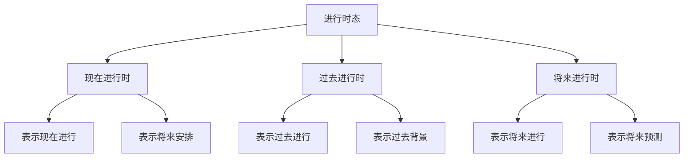

# 进行时态

## 📚 进行时态概述

进行时态表示动作正在进行或持续进行，强调动作的进行性和持续性。

## 🎯 学习目标

- **认识层面**：了解进行时态的基本概念
- **理解层面**：掌握进行时态的构成和用法
- **应用层面**：能够正确运用进行时态

## 📖 进行时态分类

### 进行时态分类图

## 🔄 现在进行时

### 基本概念
现在进行时表示现在正在进行的动作或状态。

### 构成形式
- **肯定句**：主语 + am/is/are + 现在分词
- **否定句**：主语 + am/is/are + not + 现在分词
- **疑问句**：Am/Is/Are + 主语 + 现在分词？

### 用法说明

#### 1. 表示现在进行
- I **am working** now.
- She **is studying** English.

#### 2. 表示将来安排
- I **am leaving** tomorrow.
- We **are meeting** at 3 PM.

#### 3. 表示暂时状态
- He **is living** in Beijing.
- The weather **is getting** warmer.

#### 4. 表示重复动作
- He **is always complaining**.
- She **is constantly changing** her mind.

### 时间状语
- now, at the moment, at present
- right now, currently
- this week/month/year

## 📅 过去进行时

### 基本概念
过去进行时表示过去某个时间正在进行的动作。

### 构成形式
- **肯定句**：主语 + was/were + 现在分词
- **否定句**：主语 + was/were + not + 现在分词
- **疑问句**：Was/Were + 主语 + 现在分词？

### 用法说明

#### 1. 表示过去进行
- I **was working** at 8 PM yesterday.
- She **was studying** when I called.

#### 2. 表示过去背景
- While I **was reading**, the phone rang.
- He **was sleeping** when the fire started.

#### 3. 表示过去习惯
- He **was always complaining**.
- She **was constantly changing** her mind.

### 时间状语
- at 8 PM yesterday, when I called
- while, as, during
- this time yesterday/last week

## 🔮 将来进行时

### 基本概念
将来进行时表示将来某个时间正在进行的动作。

### 构成形式
- **肯定句**：主语 + will be + 现在分词
- **否定句**：主语 + won't be + 现在分词
- **疑问句**：Will + 主语 + be + 现在分词？

### 用法说明

#### 1. 表示将来进行
- I **will be working** at 8 PM tomorrow.
- She **will be studying** when you arrive.

#### 2. 表示将来预测
- It **will be raining** tomorrow.
- The price **will be rising**.

#### 3. 表示礼貌询问
- **Will you be using** the car tonight?
- **Will you be needing** any help?

### 时间状语
- at 8 PM tomorrow, when you arrive
- this time tomorrow/next week
- in the future

## 📊 进行时态对比

### 对比表

| 时态 | 时间 | 构成 | 用法 | 例句 |
|------|------|------|------|------|
| 现在进行时 | 现在 | am/is/are + 现在分词 | 现在进行、将来安排 | I am working now. |
| 过去进行时 | 过去 | was/were + 现在分词 | 过去进行、过去背景 | I was working at 8 PM. |
| 将来进行时 | 将来 | will be + 现在分词 | 将来进行、将来预测 | I will be working tomorrow. |

## ⚠️ 常见错误分析

### 错误1：进行时态构成错误
- ❌ I am work now.
- ✅ I am working now.

### 错误2：时间状语错误
- ❌ I am working yesterday.
- ✅ I was working yesterday.

### 错误3：状态动词误用
- ❌ I am knowing the answer.
- ✅ I know the answer.

## 🎯 费曼学习法应用

### 第一步：选择概念
选择"现在进行时"这个概念进行解释

### 第二步：教授他人
用简单语言解释：现在进行时表示正在进行的动作

### 第三步：发现问题
在解释过程中发现：需要掌握现在分词的变化规律

### 第四步：重新学习
回到资料重新学习动词的变化规律

### 第五步：简化表达
用更简单的语言重新表达：现在进行时是"正在做"的意思

## 📚 刻意练习

### 基础练习
1. 用现在进行时填空：
   - I ______ (work) now. → am working
   - He ______ (study) English. → is studying
   - They ______ (play) football. → are playing

2. 用过去进行时填空：
   - I ______ (work) at 8 PM yesterday. → was working
   - She ______ (study) when I called. → was studying
   - We ______ (play) football. → were playing

### 进阶练习
1. 用将来进行时填空：
   - I ______ (work) at 8 PM tomorrow. → will be working
   - He ______ (study) when you arrive. → will be studying
   - They ______ (play) football. → will be playing

2. 时态转换练习：
   - I am working now. → I was working then. (改为过去进行时)
   - I was working yesterday. → I will be working tomorrow. (改为将来进行时)

## 🔗 相关知识点

- [[01-时态总览|时态总览]] - 时态基础
- [[02-一般时态|一般时态]] - 一般时态
- [[04-完成时态|完成时态]] - 完成时态
- [[01-基础认知层/01-词性系统/03-动词系统|动词系统]] - 动词基础

## 📖 扩展阅读

- [[05-完成进行时态|完成进行时态]] - 完成进行时态
- [[06-时态对比分析|时态对比分析]] - 时态对比
- [[99-附录资料/01-语法术语表|语法术语表]]
