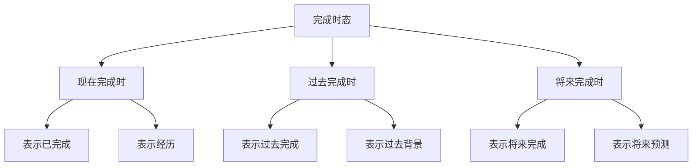

# 完成时态

## 📚 完成时态概述

完成时态表示动作已经完成或状态已经实现，强调动作的完成性和结果性。

## 🎯 学习目标

- **认识层面**：了解完成时态的基本概念
- **理解层面**：掌握完成时态的构成和用法
- **应用层面**：能够正确运用完成时态

## 📖 完成时态分类

### 完成时态分类图

## ✅ 现在完成时

### 基本概念
现在完成时表示过去发生的动作对现在的影响或结果。

### 构成形式
- **肯定句**：主语 + have/has + 过去分词
- **否定句**：主语 + haven't/hasn't + 过去分词
- **疑问句**：Have/Has + 主语 + 过去分词？

### 用法说明

#### 1. 表示已完成
- I **have finished** my homework.
- She **has arrived** in Beijing.

#### 2. 表示经历
- I **have been** to Japan.
- He **has seen** this movie.

#### 3. 表示持续
- I **have lived** here for 3 years.
- She **has worked** here since 2020.

#### 4. 表示结果
- The train **has left**.
- The price **has risen**.

### 时间状语
- already, yet, just, recently
- for, since, so far, up to now
- ever, never, once, twice

## 📅 过去完成时

### 基本概念
过去完成时表示过去某个时间之前已经完成的动作。

### 构成形式
- **肯定句**：主语 + had + 过去分词
- **否定句**：主语 + hadn't + 过去分词
- **疑问句**：Had + 主语 + 过去分词？

### 用法说明

#### 1. 表示过去完成
- I **had finished** my homework before he came.
- She **had arrived** when I called.

#### 2. 表示过去背景
- When I arrived, the meeting **had started**.
- He **had left** before I got there.

#### 3. 表示过去经历
- I **had been** to Japan before.
- He **had seen** this movie.

### 时间状语
- before, after, when, by the time
- already, yet, just, recently
- for, since, by then

## 🔮 将来完成时

### 基本概念
将来完成时表示将来某个时间之前将完成的动作。

### 构成形式
- **肯定句**：主语 + will have + 过去分词
- **否定句**：主语 + won't have + 过去分词
- **疑问句**：Will + 主语 + have + 过去分词？

### 用法说明

#### 1. 表示将来完成
- I **will have finished** my homework by 8 PM.
- She **will have arrived** by tomorrow.

#### 2. 表示将来预测
- The price **will have risen** by next year.
- He **will have retired** by 2030.

#### 3. 表示将来经历
- I **will have been** to Japan by then.
- He **will have seen** this movie.

### 时间状语
- by 8 PM, by tomorrow, by next year
- by the time, before, when
- by then, by then

## 📊 完成时态对比

### 对比表

| 时态 | 时间 | 构成 | 用法 | 例句 |
|------|------|------|------|------|
| 现在完成时 | 现在 | have/has + 过去分词 | 已完成、经历、持续 | I have finished my homework. |
| 过去完成时 | 过去 | had + 过去分词 | 过去完成、过去背景 | I had finished before he came. |
| 将来完成时 | 将来 | will have + 过去分词 | 将来完成、将来预测 | I will have finished by 8 PM. |

## ⚠️ 常见错误分析

### 错误1：完成时态构成错误
- ❌ I have finish my homework.
- ✅ I have finished my homework.

### 错误2：时间状语错误
- ❌ I have finished my homework yesterday.
- ✅ I finished my homework yesterday.

### 错误3：时态混用
- ❌ I had finished my homework now.
- ✅ I have finished my homework now.

## 🎯 费曼学习法应用

### 第一步：选择概念
选择"现在完成时"这个概念进行解释

### 第二步：教授他人
用简单语言解释：现在完成时表示已经完成的动作

### 第三步：发现问题
在解释过程中发现：需要掌握过去分词的变化规律

### 第四步：重新学习
回到资料重新学习动词的变化规律

### 第五步：简化表达
用更简单的语言重新表达：现在完成时是"已经做了"的意思

## 📚 刻意练习

### 基础练习
1. 用现在完成时填空：
   - I ______ (finish) my homework. → have finished
   - He ______ (arrive) in Beijing. → has arrived
   - They ______ (see) this movie. → have seen

2. 用过去完成时填空：
   - I ______ (finish) my homework before he came. → had finished
   - She ______ (arrive) when I called. → had arrived
   - We ______ (see) this movie. → had seen

### 进阶练习
1. 用将来完成时填空：
   - I ______ (finish) my homework by 8 PM. → will have finished
   - He ______ (arrive) by tomorrow. → will have arrived
   - They ______ (see) this movie. → will have seen

2. 时态转换练习：
   - I have finished my homework. → I had finished my homework. (改为过去完成时)
   - I had finished my homework. → I will have finished my homework. (改为将来完成时)

## 🔗 相关知识点

- [[01-时态总览|时态总览]] - 时态基础
- [[02-一般时态|一般时态]] - 一般时态
- [[03-进行时态|进行时态]] - 进行时态
- [[01-基础认知层/01-词性系统/03-动词系统|动词系统]] - 动词基础

## 📖 扩展阅读

- [[05-完成进行时态|完成进行时态]] - 完成进行时态
- [[06-时态对比分析|时态对比分析]] - 时态对比
- [[99-附录资料/01-语法术语表|语法术语表]]
