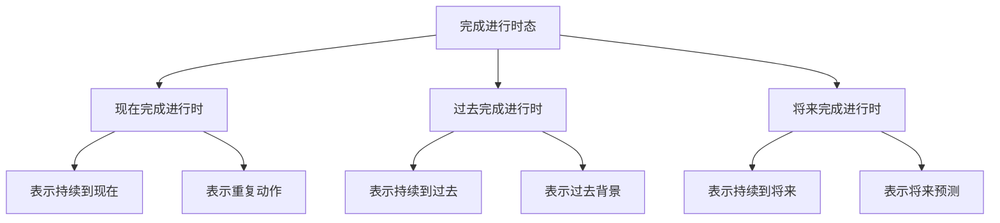

# 完成进行时态

## 📚 完成进行时态概述

完成进行时态表示动作从过去开始一直持续到现在或将来，强调动作的持续性和完成性。

## 🎯 学习目标

- **认识层面**：了解完成进行时态的基本概念
- **理解层面**：掌握完成进行时态的构成和用法
- **应用层面**：能够正确运用完成进行时态

## 📖 完成进行时态分类

### 完成进行时态分类图

## 🔄 现在完成进行时

### 基本概念
现在完成进行时表示从过去开始一直持续到现在的动作。

### 构成形式
- **肯定句**：主语 + have/has been + 现在分词
- **否定句**：主语 + haven't/hasn't been + 现在分词
- **疑问句**：Have/Has + 主语 + been + 现在分词？

### 用法说明

#### 1. 表示持续到现在
- I **have been working** for 3 hours.
- She **has been studying** English since 2020.

#### 2. 表示重复动作
- He **has been calling** me every day.
- They **have been meeting** regularly.

#### 3. 表示最近动作
- I **have been reading** this book.
- She **has been writing** a novel.

#### 4. 表示结果状态
- I **have been waiting** for you.
- The weather **has been getting** warmer.

### 时间状语
- for 3 hours, since 2020
- all day, all week, all year
- recently, lately, these days

## 📅 过去完成进行时

### 基本概念
过去完成进行时表示从过去某个时间开始一直持续到过去另一个时间的动作。

### 构成形式
- **肯定句**：主语 + had been + 现在分词
- **否定句**：主语 + hadn't been + 现在分词
- **疑问句**：Had + 主语 + been + 现在分词？

### 用法说明

#### 1. 表示持续到过去
- I **had been working** for 3 hours when he came.
- She **had been studying** English for 2 years.

#### 2. 表示过去背景
- When I arrived, he **had been waiting** for an hour.
- The meeting **had been going** on for 2 hours.

#### 3. 表示过去重复
- He **had been calling** me every day.
- They **had been meeting** regularly.

### 时间状语
- for 3 hours, since 2020
- all day, all week, all year
- when, before, by the time

## 🔮 将来完成进行时

### 基本概念
将来完成进行时表示从过去开始一直持续到将来某个时间的动作。

### 构成形式
- **肯定句**：主语 + will have been + 现在分词
- **否定句**：主语 + won't have been + 现在分词
- **疑问句**：Will + 主语 + have been + 现在分词？

### 用法说明

#### 1. 表示持续到将来
- I **will have been working** for 3 hours by 8 PM.
- She **will have been studying** English for 2 years.

#### 2. 表示将来预测
- The price **will have been rising** for months.
- He **will have been waiting** for an hour.

#### 3. 表示将来重复
- He **will have been calling** me every day.
- They **will have been meeting** regularly.

### 时间状语
- for 3 hours, since 2020
- all day, all week, all year
- by 8 PM, by tomorrow, by next year

## 📊 完成进行时态对比

### 对比表

| 时态 | 时间 | 构成 | 用法 | 例句 |
|------|------|------|------|------|
| 现在完成进行时 | 现在 | have/has been + 现在分词 | 持续到现在、重复动作 | I have been working for 3 hours. |
| 过去完成进行时 | 过去 | had been + 现在分词 | 持续到过去、过去背景 | I had been working for 3 hours. |
| 将来完成进行时 | 将来 | will have been + 现在分词 | 持续到将来、将来预测 | I will have been working for 3 hours. |

## ⚠️ 常见错误分析

### 错误1：完成进行时态构成错误
- ❌ I have been work for 3 hours.
- ✅ I have been working for 3 hours.

### 错误2：时间状语错误
- ❌ I have been working yesterday.
- ✅ I was working yesterday.

### 错误3：时态混用
- ❌ I had been working now.
- ✅ I have been working now.

## 🎯 费曼学习法应用

### 第一步：选择概念
选择"现在完成进行时"这个概念进行解释

### 第二步：教授他人
用简单语言解释：现在完成进行时表示一直持续到现在的动作

### 第三步：发现问题
在解释过程中发现：需要掌握现在分词的变化规律

### 第四步：重新学习
回到资料重新学习动词的变化规律

### 第五步：简化表达
用更简单的语言重新表达：现在完成进行时是"一直在做"的意思

## 📚 刻意练习

### 基础练习
1. 用现在完成进行时填空：
   - I ______ (work) for 3 hours. → have been working
   - He ______ (study) English since 2020. → has been studying
   - They ______ (wait) for you. → have been waiting

2. 用过去完成进行时填空：
   - I ______ (work) for 3 hours when he came. → had been working
   - She ______ (study) English for 2 years. → had been studying
   - We ______ (wait) for you. → had been waiting

### 进阶练习
1. 用将来完成进行时填空：
   - I ______ (work) for 3 hours by 8 PM. → will have been working
   - He ______ (study) English for 2 years. → will have been studying
   - They ______ (wait) for you. → will have been waiting

2. 时态转换练习：
   - I have been working for 3 hours. → I had been working for 3 hours. (改为过去完成进行时)
   - I had been working for 3 hours. → I will have been working for 3 hours. (改为将来完成进行时)

## 🔗 相关知识点

- [[01-时态总览|时态总览]] - 时态基础
- [[02-一般时态|一般时态]] - 一般时态
- [[03-进行时态|进行时态]] - 进行时态
- [[04-完成时态|完成时态]] - 完成时态

## 📖 扩展阅读

- [[06-时态对比分析|时态对比分析]] - 时态对比
- [[01-基础认知层/01-词性系统/03-动词系统|动词系统]] - 动词基础
- [[99-附录资料/01-语法术语表|语法术语表]]
