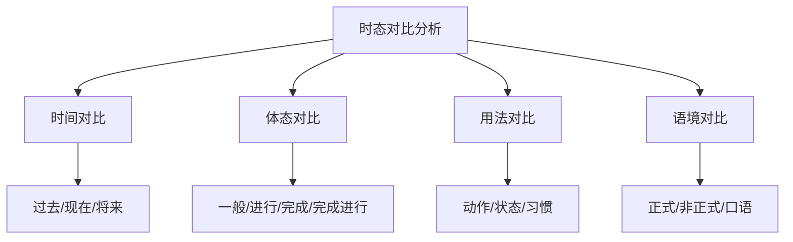

# 时态对比分析

## 📚 时态对比分析概述

时态对比分析是深入理解英语时态系统的重要方法，通过对比不同时态的用法和特点，提高时态运用的准确性。

## 🎯 学习目标

- **认识层面**：了解时态对比的基本方法
- **理解层面**：掌握各种时态的差异和联系
- **应用层面**：能够准确选择和使用时态

## 📖 时态对比方法

### 对比方法图

## ⏰ 时间对比

### 现在时态对比

| 时态 | 时间特征 | 体态特征 | 主要用法 | 例句 |
|------|----------|----------|----------|------|
| 一般现在时 | 现在 | 一般 | 习惯、真理、状态 | I work every day. |
| 现在进行时 | 现在 | 进行 | 正在进行的动作 | I am working now. |
| 现在完成时 | 现在 | 完成 | 过去发生对现在有影响 | I have worked. |
| 现在完成进行时 | 现在 | 完成进行 | 过去开始持续到现在 | I have been working. |

### 过去时态对比

| 时态 | 时间特征 | 体态特征 | 主要用法 | 例句 |
|------|----------|----------|----------|------|
| 一般过去时 | 过去 | 一般 | 过去发生的动作 | I worked yesterday. |
| 过去进行时 | 过去 | 进行 | 过去某时正在进行的动作 | I was working at 8 PM. |
| 过去完成时 | 过去 | 完成 | 过去某时前已完成的动作 | I had worked before he came. |
| 过去完成进行时 | 过去 | 完成进行 | 过去某时前一直进行的动作 | I had been working for 3 hours. |

### 将来时态对比

| 时态 | 时间特征 | 体态特征 | 主要用法 | 例句 |
|------|----------|----------|----------|------|
| 一般将来时 | 将来 | 一般 | 将来发生的动作 | I will work tomorrow. |
| 将来进行时 | 将来 | 进行 | 将来某时正在进行的动作 | I will be working at 8 PM. |
| 将来完成时 | 将来 | 完成 | 将来某时前将完成的动作 | I will have worked by 8 PM. |
| 将来完成进行时 | 将来 | 完成进行 | 将来某时前一直进行的动作 | I will have been working for 3 hours. |

## 🔄 体态对比

### 一般体态对比

| 时态 | 体态特征 | 主要用法 | 例句 |
|------|----------|----------|------|
| 一般现在时 | 一般 | 习惯、真理、状态 | I work every day. |
| 一般过去时 | 一般 | 过去动作、状态 | I worked yesterday. |
| 一般将来时 | 一般 | 将来动作、状态 | I will work tomorrow. |

### 进行体态对比

| 时态 | 体态特征 | 主要用法 | 例句 |
|------|----------|----------|------|
| 现在进行时 | 进行 | 现在进行、将来安排 | I am working now. |
| 过去进行时 | 进行 | 过去进行、过去背景 | I was working at 8 PM. |
| 将来进行时 | 进行 | 将来进行、将来预测 | I will be working at 8 PM. |

### 完成体态对比

| 时态 | 体态特征 | 主要用法 | 例句 |
|------|----------|----------|------|
| 现在完成时 | 完成 | 已完成、经历、持续 | I have worked. |
| 过去完成时 | 完成 | 过去完成、过去背景 | I had worked before he came. |
| 将来完成时 | 完成 | 将来完成、将来预测 | I will have worked by 8 PM. |

### 完成进行体态对比

| 时态 | 体态特征 | 主要用法 | 例句 |
|------|----------|----------|------|
| 现在完成进行时 | 完成进行 | 持续到现在、重复动作 | I have been working for 3 hours. |
| 过去完成进行时 | 完成进行 | 持续到过去、过去背景 | I had been working for 3 hours. |
| 将来完成进行时 | 完成进行 | 持续到将来、将来预测 | I will have been working for 3 hours. |

## 📝 用法对比

### 动作与状态对比

| 时态 | 动作用法 | 状态用法 | 例句 |
|------|----------|----------|------|
| 一般现在时 | 习惯动作 | 现在状态 | I work every day. / I am a teacher. |
| 现在进行时 | 正在进行的动作 | 暂时状态 | I am working now. / I am living in Beijing. |
| 现在完成时 | 已完成的动作 | 持续状态 | I have worked. / I have lived here for 3 years. |

### 时间表达对比

| 时态 | 时间表达 | 例句 |
|------|----------|------|
| 一般现在时 | every day, always, usually | I work every day. |
| 现在进行时 | now, at the moment, currently | I am working now. |
| 现在完成时 | already, yet, just, recently | I have already worked. |
| 现在完成进行时 | for 3 hours, since 2020 | I have been working for 3 hours. |

## 🎯 语境对比

### 正式与非正式对比

| 时态 | 正式用法 | 非正式用法 | 例句 |
|------|----------|------------|------|
| 一般将来时 | will/shall | be going to | I will work. / I am going to work. |
| 现在完成时 | have/has + 过去分词 | 口语简化 | I have worked. / I've worked. |
| 过去完成时 | had + 过去分词 | 口语简化 | I had worked. / I'd worked. |

### 口语与书面语对比

| 时态 | 口语用法 | 书面语用法 | 例句 |
|------|----------|------------|------|
| 一般现在时 | 简化形式 | 完整形式 | I work. / I do work. |
| 现在进行时 | 简化形式 | 完整形式 | I'm working. / I am working. |
| 现在完成时 | 简化形式 | 完整形式 | I've worked. / I have worked. |

## ⚠️ 常见错误分析

### 错误1：时态混用
- ❌ I have seen him yesterday.
- ✅ I saw him yesterday.

### 错误2：时间状语与时态不匹配
- ❌ I will go to school yesterday.
- ✅ I went to school yesterday.

### 错误3：体态选择错误
- ❌ I am working for 3 hours.
- ✅ I have been working for 3 hours.

## 🎯 费曼学习法应用

### 第一步：选择概念
选择"现在完成时与一般过去时"的对比进行解释

### 第二步：教授他人
用简单语言解释：现在完成时强调对现在的影响，一般过去时强调过去的时间

### 第三步：发现问题
在解释过程中发现：需要掌握时间状语的使用规则

### 第四步：重新学习
回到资料重新学习时间状语的语法规则

### 第五步：简化表达
用更简单的语言重新表达：现在完成时是"已经做了"，一般过去时是"昨天做了"

## 📚 刻意练习

### 基础练习
1. 选择正确的时态：
   - I ______ (work) every day. → work
   - I ______ (work) now. → am working
   - I ______ (work) for 3 hours. → have been working

2. 时态对比练习：
   - I work every day. (一般现在时)
   - I am working now. (现在进行时)
   - I have worked. (现在完成时)

### 进阶练习
1. 根据语境选择时态：
   - I ______ (work) every day. → work
   - I ______ (work) now. → am working
   - I ______ (work) for 3 hours. → have been working

2. 时态转换练习：
   - I work every day. → I worked every day. (改为过去时)
   - I am working now. → I was working then. (改为过去进行时)

## 🔗 相关知识点

- [[01-时态总览|时态总览]] - 时态基础
- [[02-一般时态|一般时态]] - 一般时态
- [[03-进行时态|进行时态]] - 进行时态
- [[04-完成时态|完成时态]] - 完成时态

## 📖 扩展阅读

- [[05-完成进行时态|完成进行时态]] - 完成进行时态
- [[01-基础认知层/01-词性系统/03-动词系统|动词系统]] - 动词基础
- [[99-附录资料/01-语法术语表|语法术语表]]
