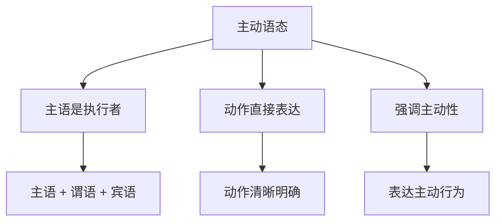

# 主动语态

## 📚 主动语态概述

主动语态是英语语态系统的基础，表示主语是动作的执行者，强调动作的主动性和直接性。

## 🎯 学习目标

- **认识层面**：了解主动语态的基本概念
- **理解层面**：掌握主动语态的构成和用法
- **应用层面**：能够正确运用主动语态

## 📖 主动语态特征

### 主动语态特征图

## 🔍 主动语态构成

### 基本构成
- **主语** + **谓语动词** + **宾语**
- 主语是动作的执行者
- 谓语动词用主动形式
- 宾语是动作的承受者

### 构成示例

| 句型 | 主语 | 谓语 | 宾语 | 例句 |
|------|------|------|------|------|
| SVO | I | read | the book | I read the book. |
| SVOO | He | gave | me a book | He gave me a book. |
| SVOC | We | call | him Tom | We call him Tom. |

## 📝 主动语态用法

### 1. 表示主动动作
- **I write** a letter.
- **She studies** English.
- **They build** a house.

### 2. 强调执行者
- **The teacher** teaches us English.
- **My mother** cooks dinner.
- **The workers** build the bridge.

### 3. 表达直接行为
- **I open** the door.
- **He closes** the window.
- **She turns on** the light.

### 4. 描述自然现象
- **The sun** rises in the east.
- **The wind** blows strongly.
- **The rain** falls heavily.

## 🎯 主动语态优势

### 优势分析

| 优势 | 说明 | 例句 |
|------|------|------|
| 直接性 | 动作表达直接明确 | I read the book. |
| 主动性 | 强调执行者的主动性 | She studies hard. |
| 简洁性 | 结构简单，表达简洁 | He works every day. |
| 自然性 | 符合自然表达习惯 | The sun shines. |

## 📊 主动语态与时态

### 时态应用表

| 时态 | 主动语态构成 | 例句 |
|------|-------------|------|
| 一般现在时 | 主语 + 动词原形/第三人称单数 | I work. / He works. |
| 一般过去时 | 主语 + 动词过去式 | I worked. |
| 一般将来时 | 主语 + will + 动词原形 | I will work. |
| 现在进行时 | 主语 + am/is/are + 现在分词 | I am working. |
| 过去进行时 | 主语 + was/were + 现在分词 | I was working. |
| 现在完成时 | 主语 + have/has + 过去分词 | I have worked. |
| 过去完成时 | 主语 + had + 过去分词 | I had worked. |

## ⚠️ 常见错误分析

### 错误1：主谓不一致
- ❌ He work every day.
- ✅ He works every day.

### 错误2：时态错误
- ❌ I work yesterday.
- ✅ I worked yesterday.

### 错误3：语态混用
- ❌ I am worked by the company.
- ✅ I work for the company.

## 🎯 费曼学习法应用

### 第一步：选择概念
选择"主动语态"这个概念进行解释

### 第二步：教授他人
用简单语言解释：主动语态是主语做动作

### 第三步：发现问题
在解释过程中发现：需要掌握动词的变化规律

### 第四步：重新学习
回到资料重新学习动词的语法规则

### 第五步：简化表达
用更简单的语言重新表达：主动语态是"我做"的意思

## 📚 刻意练习

### 基础练习
1. 用主动语态造句：
   - I ______ (read) books. → read
   - He ______ (study) English. → studies
   - They ______ (work) hard. → work

2. 识别主动语态：
   - I read the book. → 主动语态
   - The book is read by me. → 被动语态
   - She studies English. → 主动语态

### 进阶练习
1. 时态转换练习：
   - I work every day. → I worked every day. (改为过去时)
   - I work every day. → I will work every day. (改为将来时)

2. 语态转换练习：
   - I read the book. → The book is read by me. (改为被动语态)
   - The book is read by me. → I read the book. (改为主动语态)

## 🔗 相关知识点

- [[02-被动语态|被动语态]] - 语态对比
- [[03-语态转换|语态转换]] - 语态转换技巧
- [[01-基础认知层/01-词性系统/03-动词系统|动词系统]] - 动词基础
- [[01-基础认知层/03-基本句型/01-五种基本句型|五种基本句型]] - 句型基础

## 📖 扩展阅读

- [[02-理解掌握层/01-时态系统/01-时态总览|时态总览]] - 时态与语态
- [[99-附录资料/01-语法术语表|语法术语表]]
