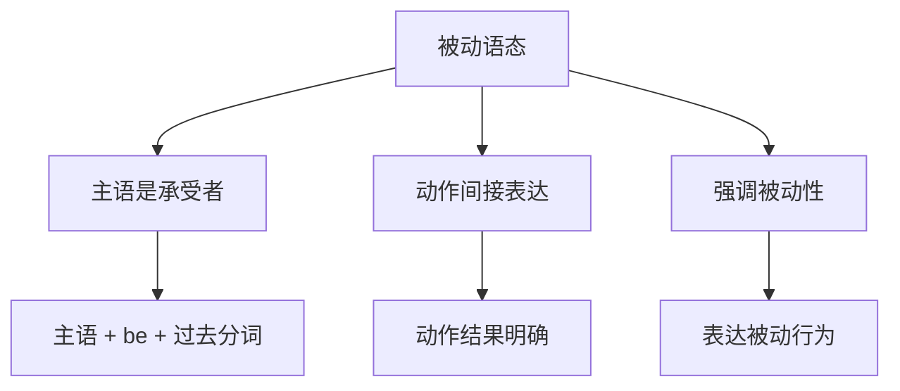

# 被动语态

## 📚 被动语态概述

被动语态表示主语是动作的承受者，强调动作的被动性和结果性。

## 🎯 学习目标

- **认识层面**：了解被动语态的基本概念
- **理解层面**：掌握被动语态的构成和用法
- **应用层面**：能够正确运用被动语态

## 📖 被动语态特征

### 被动语态特征图

## 🔍 被动语态构成

### 基本构成
- **主语** + **be动词** + **过去分词** + **by短语**（可省略）
- 主语是动作的承受者
- be动词根据时态变化
- 过去分词表示被动

### 构成示例

| 时态 | 被动语态构成 | 例句 |
|------|-------------|------|
| 一般现在时 | am/is/are + 过去分词 | The book is read by me. |
| 一般过去时 | was/were + 过去分词 | The book was read by me. |
| 一般将来时 | will be + 过去分词 | The book will be read by me. |
| 现在进行时 | am/is/are being + 过去分词 | The book is being read by me. |
| 过去进行时 | was/were being + 过去分词 | The book was being read by me. |
| 现在完成时 | have/has been + 过去分词 | The book has been read by me. |
| 过去完成时 | had been + 过去分词 | The book had been read by me. |

## 📝 被动语态用法

### 1. 强调承受者
- **The book** is read by many people.
- **The house** was built last year.
- **The bridge** will be completed soon.

### 2. 不知道执行者
- **The window** was broken.
- **The money** was stolen.
- **The letter** was sent yesterday.

### 3. 执行者不重要
- **English** is spoken all over the world.
- **The meeting** was held yesterday.
- **The work** will be finished tomorrow.

### 4. 避免提及执行者
- **Mistakes** were made.
- **The decision** was taken.
- **The problem** was solved.

## 🎯 被动语态优势

### 优势分析

| 优势 | 说明 | 例句 |
|------|------|------|
| 客观性 | 表达客观事实 | The bridge was built in 2020. |
| 正式性 | 适合正式文体 | The meeting will be held tomorrow. |
| 重点性 | 突出动作结果 | The work has been completed. |
| 礼貌性 | 避免直接指责 | Mistakes were made. |

## 📊 被动语态转换

### 转换规则
1. 将宾语变为主语
2. 将主语变为by短语（可省略）
3. 谓语动词变为be + 过去分词
4. 保持时态不变

### 转换示例

| 主动语态 | 被动语态 | 说明 |
|----------|----------|------|
| I read the book. | The book is read by me. | 一般现在时 |
| He wrote a letter. | A letter was written by him. | 一般过去时 |
| She is reading a book. | A book is being read by her. | 现在进行时 |
| They have finished the work. | The work has been finished by them. | 现在完成时 |

## ⚠️ 常见错误分析

### 错误1：被动语态构成错误
- ❌ The book is read by I.
- ✅ The book is read by me.

### 错误2：时态错误
- ❌ The book was read by me now.
- ✅ The book is read by me now.

### 错误3：语态混用
- ❌ The book reads by me.
- ✅ The book is read by me.

## 🎯 费曼学习法应用

### 第一步：选择概念
选择"被动语态"这个概念进行解释

### 第二步：教授他人
用简单语言解释：被动语态是主语承受动作

### 第三步：发现问题
在解释过程中发现：需要掌握过去分词的变化规律

### 第四步：重新学习
回到资料重新学习动词的变化规律

### 第五步：简化表达
用更简单的语言重新表达：被动语态是"被做"的意思

## 📚 刻意练习

### 基础练习
1. 用被动语态填空：
   - The book ______ (read) by me. → is read
   - The house ______ (build) last year. → was built
   - The work ______ (finish) tomorrow. → will be finished

2. 识别被动语态：
   - The book is read by me. → 被动语态
   - I read the book. → 主动语态
   - The house was built. → 被动语态

### 进阶练习
1. 时态转换练习：
   - The book is read by me. → The book was read by me. (改为过去时)
   - The book was read by me. → The book will be read by me. (改为将来时)

2. 语态转换练习：
   - I read the book. → The book is read by me. (改为被动语态)
   - The book is read by me. → I read the book. (改为主动语态)

## 🔗 相关知识点

- [[01-主动语态|主动语态]] - 语态对比
- [[03-语态转换|语态转换]] - 语态转换技巧
- [[01-基础认知层/01-词性系统/03-动词系统|动词系统]] - 动词基础
- [[01-基础认知层/03-基本句型/01-五种基本句型|五种基本句型]] - 句型基础

## 📖 扩展阅读

- [[02-理解掌握层/01-时态系统/01-时态总览|时态总览]] - 时态与语态
- [[99-附录资料/01-语法术语表|语法术语表]]
