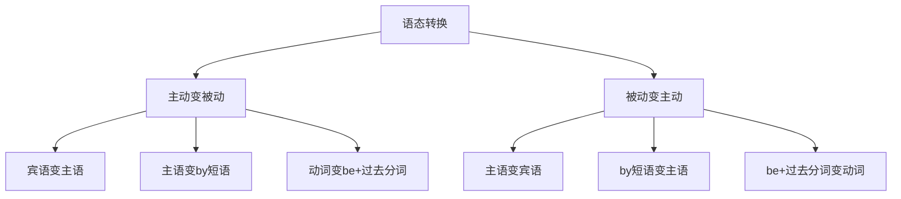

# 语态转换

## 📚 语态转换概述

语态转换是指在主动语态和被动语态之间进行转换，是英语语法中的重要技能。

## 🎯 学习目标

- **认识层面**：了解语态转换的基本规则
- **理解层面**：掌握语态转换的方法和技巧
- **应用层面**：能够熟练进行语态转换

## 📖 语态转换规则

### 转换规则图

## 🔄 主动语态变被动语态

### 基本转换规则
1. 将宾语变为主语
2. 将主语变为by短语（可省略）
3. 谓语动词变为be + 过去分词
4. 保持时态不变

### 转换示例

| 时态 | 主动语态 | 被动语态 | 说明 |
|------|----------|----------|------|
| 一般现在时 | I read the book. | The book is read by me. | 一般现在时 |
| 一般过去时 | He wrote a letter. | A letter was written by him. | 一般过去时 |
| 一般将来时 | She will finish the work. | The work will be finished by her. | 一般将来时 |
| 现在进行时 | They are building a house. | A house is being built by them. | 现在进行时 |
| 过去进行时 | We were reading books. | Books were being read by us. | 过去进行时 |
| 现在完成时 | I have finished the work. | The work has been finished by me. | 现在完成时 |
| 过去完成时 | He had written the letter. | The letter had been written by him. | 过去完成时 |

### 特殊转换

#### 双宾语动词
- **主动**：He gave me a book.
- **被动1**：I was given a book by him.
- **被动2**：A book was given to me by him.

#### 带宾补的动词
- **主动**：We call him Tom.
- **被动**：He is called Tom by us.

#### 短语动词
- **主动**：They looked after the children.
- **被动**：The children were looked after by them.

## 🔄 被动语态变主动语态

### 基本转换规则
1. 将主语变为宾语
2. 将by短语变为主语
3. 谓语动词变为主动形式
4. 保持时态不变

### 转换示例

| 时态 | 被动语态 | 主动语态 | 说明 |
|------|----------|----------|------|
| 一般现在时 | The book is read by me. | I read the book. | 一般现在时 |
| 一般过去时 | A letter was written by him. | He wrote a letter. | 一般过去时 |
| 一般将来时 | The work will be finished by her. | She will finish the work. | 一般将来时 |
| 现在进行时 | A house is being built by them. | They are building a house. | 现在进行时 |
| 过去进行时 | Books were being read by us. | We were reading books. | 过去进行时 |
| 现在完成时 | The work has been finished by me. | I have finished the work. | 现在完成时 |
| 过去完成时 | The letter had been written by him. | He had written the letter. | 过去完成时 |

## 📊 语态转换练习

### 基础转换练习

#### 练习1：主动变被动
1. **一般现在时**
   - I read books. → Books are read by me.
   - He studies English. → English is studied by him.

2. **一般过去时**
   - I wrote a letter. → A letter was written by me.
   - She built a house. → A house was built by her.

3. **一般将来时**
   - I will finish the work. → The work will be finished by me.
   - He will read the book. → The book will be read by him.

#### 练习2：被动变主动
1. **一般现在时**
   - Books are read by me. → I read books.
   - English is studied by him. → He studies English.

2. **一般过去时**
   - A letter was written by me. → I wrote a letter.
   - A house was built by her. → She built a house.

3. **一般将来时**
   - The work will be finished by me. → I will finish the work.
   - The book will be read by him. → He will read the book.

### 进阶转换练习

#### 练习3：复杂时态转换
1. **现在进行时**
   - I am reading a book. → A book is being read by me.
   - They are building a house. → A house is being built by them.

2. **现在完成时**
   - I have finished the work. → The work has been finished by me.
   - She has written a letter. → A letter has been written by her.

#### 练习4：特殊结构转换
1. **双宾语动词**
   - He gave me a book. → I was given a book by him. / A book was given to me by him.
   - She told me a story. → I was told a story by her. / A story was told to me by her.

2. **带宾补的动词**
   - We call him Tom. → He is called Tom by us.
   - They made him happy. → He was made happy by them.

## ⚠️ 常见错误分析

### 错误1：时态不一致
- ❌ The book was read by me now.
- ✅ The book is read by me now.

### 错误2：by短语错误
- ❌ The book is read by I.
- ✅ The book is read by me.

### 错误3：动词形式错误
- ❌ The book is read by me.
- ✅ The book is read by me.

## 🎯 费曼学习法应用

### 第一步：选择概念
选择"主动语态变被动语态"这个概念进行解释

### 第二步：教授他人
用简单语言解释：主动变被动是把宾语变主语，主语变by短语

### 第三步：发现问题
在解释过程中发现：需要掌握过去分词的变化规律

### 第四步：重新学习
回到资料重新学习动词的变化规律

### 第五步：简化表达
用更简单的语言重新表达：主动变被动是"我做"变成"被我做"

## 📚 刻意练习

### 基础练习
1. 将下列句子改为被动语态：
   - I read the book. → The book is read by me.
   - He wrote a letter. → A letter was written by him.
   - She will finish the work. → The work will be finished by her.

2. 将下列句子改为主动语态：
   - The book is read by me. → I read the book.
   - A letter was written by him. → He wrote a letter.
   - The work will be finished by her. → She will finish the work.

### 进阶练习
1. 复杂时态转换：
   - I am reading a book. → A book is being read by me.
   - I have finished the work. → The work has been finished by me.

2. 特殊结构转换：
   - He gave me a book. → I was given a book by him.
   - We call him Tom. → He is called Tom by us.

## 🔗 相关知识点

- [[01-主动语态|主动语态]] - 主动语态基础
- [[02-被动语态|被动语态]] - 被动语态基础
- [[01-基础认知层/01-词性系统/03-动词系统|动词系统]] - 动词基础
- [[01-基础认知层/03-基本句型/01-五种基本句型|五种基本句型]] - 句型基础

## 📖 扩展阅读

- [[02-理解掌握层/01-时态系统/01-时态总览|时态总览]] - 时态与语态
- [[99-附录资料/01-语法术语表|语法术语表]]
