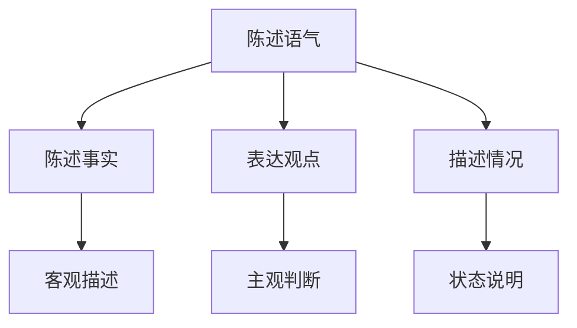

# 陈述语气

## 📚 陈述语气概述

陈述语气是英语语气系统的基础，用于陈述事实、表达观点或描述情况。

## 🎯 学习目标

- **认识层面**：了解陈述语气的基本概念
- **理解层面**：掌握陈述语气的构成和用法
- **应用层面**：能够正确运用陈述语气

## 📖 陈述语气特征

### 陈述语气特征图

## 🔍 陈述语气构成

### 基本构成
- **主语** + **谓语动词** + **其他成分**
- 使用陈述句语序
- 句末用句号
- 语调平稳

### 构成示例

| 句型 | 主语 | 谓语 | 其他成分 | 例句 |
|------|------|------|----------|------|
| SV | The sun | rises | in the east. | The sun rises in the east. |
| SVO | I | like | music. | I like music. |
| SVC | She | is | a teacher. | She is a teacher. |
| SVOO | He | gave | me a book. | He gave me a book. |
| SVOC | We | call | him Tom. | We call him Tom. |

## 📝 陈述语气用法

### 1. 陈述事实
- **The sun** rises in the east.
- **Water** boils at 100°C.
- **Beijing** is the capital of China.

### 2. 表达观点
- **I think** he is right.
- **In my opinion**, this is a good idea.
- **I believe** she will succeed.

### 3. 描述情况
- **The weather** is fine today.
- **He** is working hard.
- **They** are students.

### 4. 说明状态
- **I am** a teacher.
- **She feels** tired.
- **The book** is interesting.

## 🎯 陈述语气类型

### 肯定陈述
- **I work** every day.
- **She studies** English.
- **They live** in Beijing.

### 否定陈述
- **I don't work** on Sundays.
- **She doesn't study** French.
- **They don't live** in Shanghai.

### 强调陈述
- **I do work** every day.
- **She does study** English.
- **They do live** in Beijing.

## 📊 陈述语气与时态

### 时态应用表

| 时态 | 陈述语气构成 | 例句 |
|------|-------------|------|
| 一般现在时 | 主语 + 动词原形/第三人称单数 | I work. / He works. |
| 一般过去时 | 主语 + 动词过去式 | I worked. |
| 一般将来时 | 主语 + will + 动词原形 | I will work. |
| 现在进行时 | 主语 + am/is/are + 现在分词 | I am working. |
| 过去进行时 | 主语 + was/were + 现在分词 | I was working. |
| 现在完成时 | 主语 + have/has + 过去分词 | I have worked. |
| 过去完成时 | 主语 + had + 过去分词 | I had worked. |

## ⚠️ 常见错误分析

### 错误1：语序错误
- ❌ Work I every day.
- ✅ I work every day.

### 错误2：时态错误
- ❌ I work yesterday.
- ✅ I worked yesterday.

### 错误3：主谓不一致
- ❌ He work every day.
- ✅ He works every day.

## 🎯 费曼学习法应用

### 第一步：选择概念
选择"陈述语气"这个概念进行解释

### 第二步：教授他人
用简单语言解释：陈述语气是陈述事实的语气

### 第三步：发现问题
在解释过程中发现：需要掌握陈述句的语序规则

### 第四步：重新学习
回到资料重新学习陈述句的语法规则

### 第五步：简化表达
用更简单的语言重新表达：陈述语气是"说事实"的语气

## 📚 刻意练习

### 基础练习
1. 用陈述语气造句：
   - I ______ (work) every day. → work
   - He ______ (study) English. → studies
   - They ______ (live) in Beijing. → live

2. 识别陈述语气：
   - I work every day. → 陈述语气
   - Do you work every day? → 疑问语气
   - Work every day! → 祈使语气

### 进阶练习
1. 时态转换练习：
   - I work every day. → I worked every day. (改为过去时)
   - I work every day. → I will work every day. (改为将来时)

2. 语气转换练习：
   - I work every day. → Do you work every day? (改为疑问语气)
   - I work every day. → Work every day! (改为祈使语气)

## 🔗 相关知识点

- [[02-疑问语气|疑问语气]] - 语气对比
- [[03-祈使语气|祈使语气]] - 语气对比
- [[04-虚拟语气|虚拟语气]] - 语气对比
- [[01-基础认知层/03-基本句型/01-五种基本句型|五种基本句型]] - 句型基础

## 📖 扩展阅读

- [[02-理解掌握层/01-时态系统/01-时态总览|时态总览]] - 时态与语气
- [[99-附录资料/01-语法术语表|语法术语表]]
