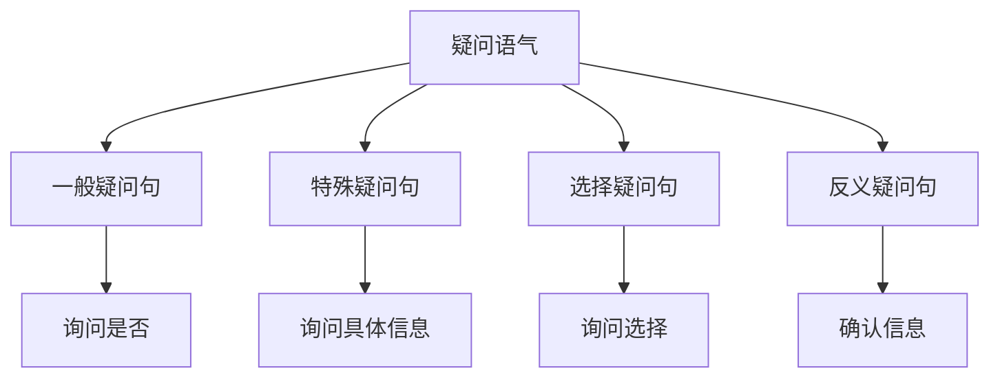

# 疑问语气

## 📚 疑问语气概述

疑问语气用于提出问题、询问信息或表达疑问，是英语语气系统的重要组成部分。

## 🎯 学习目标

- **认识层面**：了解疑问语气的基本概念
- **理解层面**：掌握疑问语气的构成和用法
- **应用层面**：能够正确运用疑问语气

## 📖 疑问语气特征

### 疑问语气特征图

## 🔍 疑问语气构成

### 基本构成
- **疑问词** + **主语** + **谓语动词** + **其他成分**
- 使用疑问句语序
- 句末用问号
- 语调上升

### 构成示例

| 类型 | 疑问词 | 主语 | 谓语 | 其他成分 | 例句 |
|------|--------|------|------|----------|------|
| 一般疑问句 | Do | you | like | music? | Do you like music? |
| 特殊疑问句 | What | do | you | like? | What do you like? |
| 选择疑问句 | Do | you | like | tea or coffee? | Do you like tea or coffee? |
| 反义疑问句 | You | like | music, | don't you? | You like music, don't you? |

## 📝 疑问语气用法

### 1. 一般疑问句
- **Do you** like music?
- **Is he** a teacher?
- **Can you** speak English?

### 2. 特殊疑问句
- **What** do you like?
- **Where** do you live?
- **When** do you work?

### 3. 选择疑问句
- **Do you** like tea **or** coffee?
- **Is he** a teacher **or** a student?
- **Will you** go **or** stay?

### 4. 反义疑问句
- **You** like music, **don't you**?
- **He** is a teacher, **isn't he**?
- **They** will come, **won't they**?

## 🎯 疑问语气类型

### 一般疑问句
- **Do/Does** + 主语 + 动词原形？
- **Is/Are** + 主语 + 其他？
- **Can/Will** + 主语 + 动词原形？

### 特殊疑问句
- **What/Where/When/Why/How** + 疑问句？
- **Who/Whom/Whose** + 疑问句？
- **Which** + 疑问句？

### 选择疑问句
- **Do you** like A **or** B?
- **Is he** A **or** B?
- **Will you** A **or** B?

### 反义疑问句
- 陈述句 + **don't/doesn't/isn't/aren't** + 主语？
- 陈述句 + **do/does/is/are** + 主语？

## 📊 疑问语气与时态

### 时态应用表

| 时态 | 疑问语气构成 | 例句 |
|------|-------------|------|
| 一般现在时 | Do/Does + 主语 + 动词原形？ | Do you work? / Does he work? |
| 一般过去时 | Did + 主语 + 动词原形？ | Did you work? |
| 一般将来时 | Will + 主语 + 动词原形？ | Will you work? |
| 现在进行时 | Am/Is/Are + 主语 + 现在分词？ | Are you working? |
| 过去进行时 | Was/Were + 主语 + 现在分词？ | Were you working? |
| 现在完成时 | Have/Has + 主语 + 过去分词？ | Have you worked? |
| 过去完成时 | Had + 主语 + 过去分词？ | Had you worked? |

## ⚠️ 常见错误分析

### 错误1：语序错误
- ❌ You do like music?
- ✅ Do you like music?

### 错误2：疑问词错误
- ❌ What you like?
- ✅ What do you like?

### 错误3：时态错误
- ❌ Do you worked yesterday?
- ✅ Did you work yesterday?

## 🎯 费曼学习法应用

### 第一步：选择概念
选择"一般疑问句"这个概念进行解释

### 第二步：教授他人
用简单语言解释：一般疑问句是询问是否的句子

### 第三步：发现问题
在解释过程中发现：需要掌握疑问句的语序规则

### 第四步：重新学习
回到资料重新学习疑问句的语法规则

### 第五步：简化表达
用更简单的语言重新表达：一般疑问句是"是不是"的句子

## 📚 刻意练习

### 基础练习
1. 用疑问语气造句：
   - ______ you like music? → Do
   - ______ do you like? → What
   - You like music, ______ you? → don't

2. 识别疑问语气：
   - Do you like music? → 一般疑问句
   - What do you like? → 特殊疑问句
   - You like music, don't you? → 反义疑问句

### 进阶练习
1. 时态转换练习：
   - Do you work? → Did you work? (改为过去时)
   - Do you work? → Will you work? (改为将来时)

2. 语气转换练习：
   - Do you like music? → You like music. (改为陈述语气)
   - You like music. → Do you like music? (改为疑问语气)

## 🔗 相关知识点

- [[01-陈述语气|陈述语气]] - 语气对比
- [[03-祈使语气|祈使语气]] - 语气对比
- [[04-虚拟语气|虚拟语气]] - 语气对比
- [[01-基础认知层/03-基本句型/01-五种基本句型|五种基本句型]] - 句型基础

## 📖 扩展阅读

- [[02-理解掌握层/01-时态系统/01-时态总览|时态总览]] - 时态与语气
- [[99-附录资料/01-语法术语表|语法术语表]]
