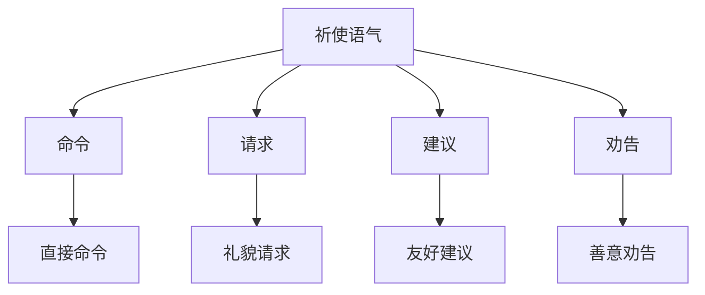

# 祈使语气

## 📚 祈使语气概述

祈使语气用于表达命令、请求、建议或劝告，是英语语气系统的重要组成部分。

## 🎯 学习目标

- **认识层面**：了解祈使语气的基本概念
- **理解层面**：掌握祈使语气的构成和用法
- **应用层面**：能够正确运用祈使语气

## 📖 祈使语气特征

### 祈使语气特征图

## 🔍 祈使语气构成

### 基本构成
- **动词原形** + **其他成分**
- 通常省略主语you
- 句末用句号或感叹号
- 语调下降

### 构成示例

| 类型 | 动词 | 其他成分 | 例句 |
|------|------|----------|------|
| 肯定祈使句 | Open | the door. | Open the door. |
| 否定祈使句 | Don't | open the door. | Don't open the door. |
| 礼貌祈使句 | Please | open the door. | Please open the door. |
| 强调祈使句 | Do | open the door. | Do open the door. |

## 📝 祈使语气用法

### 1. 表达命令
- **Open** the door.
- **Close** the window.
- **Stop** talking.

### 2. 表达请求
- **Please** help me.
- **Please** come in.
- **Please** sit down.

### 3. 表达建议
- **Let's** go to the park.
- **Let's** have a rest.
- **Let's** study together.

### 4. 表达劝告
- **Don't** be late.
- **Don't** worry.
- **Don't** give up.

## 🎯 祈使语气类型

### 肯定祈使句
- **动词原形** + 其他成分
- **Open** the door.
- **Come** here.
- **Study** hard.

### 否定祈使句
- **Don't** + 动词原形 + 其他成分
- **Don't open** the door.
- **Don't come** here.
- **Don't study** hard.

### 礼貌祈使句
- **Please** + 动词原形 + 其他成分
- **Please open** the door.
- **Please come** here.
- **Please study** hard.

### 强调祈使句
- **Do** + 动词原形 + 其他成分
- **Do open** the door.
- **Do come** here.
- **Do study** hard.

## 📊 祈使语气与时态

### 时态应用表

| 时态 | 祈使语气构成 | 例句 |
|------|-------------|------|
| 一般现在时 | 动词原形 | Open the door. |
| 一般将来时 | Will you + 动词原形 | Will you open the door? |
| 现在进行时 | Be + 现在分词 | Be working. |
| 现在完成时 | Have + 过去分词 | Have finished. |

## ⚠️ 常见错误分析

### 错误1：主语错误
- ❌ You open the door.
- ✅ Open the door.

### 错误2：时态错误
- ❌ Opened the door.
- ✅ Open the door.

### 错误3：否定形式错误
- ❌ Not open the door.
- ✅ Don't open the door.

## 🎯 费曼学习法应用

### 第一步：选择概念
选择"祈使语气"这个概念进行解释

### 第二步：教授他人
用简单语言解释：祈使语气是表达命令或请求的语气

### 第三步：发现问题
在解释过程中发现：需要掌握祈使句的构成规则

### 第四步：重新学习
回到资料重新学习祈使句的语法规则

### 第五步：简化表达
用更简单的语言重新表达：祈使语气是"做"的语气

## 📚 刻意练习

### 基础练习
1. 用祈使语气造句：
   - ______ the door. → Open
   - ______ come here. → Please
   - ______ open the door. → Don't

2. 识别祈使语气：
   - Open the door. → 祈使语气
   - Do you open the door? → 疑问语气
   - You open the door. → 陈述语气

### 进阶练习
1. 语气转换练习：
   - Open the door. → Do you open the door? (改为疑问语气)
   - You open the door. → Open the door. (改为祈使语气)

2. 否定形式练习：
   - Open the door. → Don't open the door.
   - Come here. → Don't come here.

## 🔗 相关知识点

- [[01-陈述语气|陈述语气]] - 语气对比
- [[02-疑问语气|疑问语气]] - 语气对比
- [[04-虚拟语气|虚拟语气]] - 语气对比
- [[01-基础认知层/03-基本句型/01-五种基本句型|五种基本句型]] - 句型基础

## 📖 扩展阅读

- [[02-理解掌握层/01-时态系统/01-时态总览|时态总览]] - 时态与语气
- [[99-附录资料/01-语法术语表|语法术语表]]
