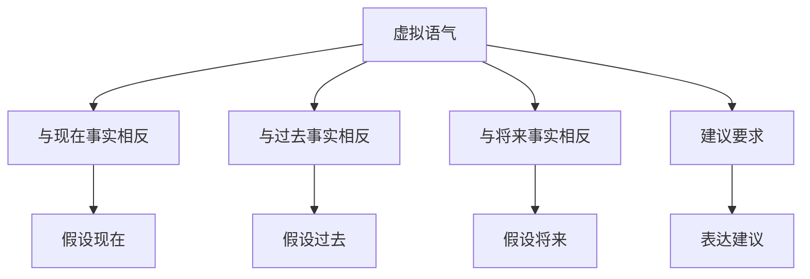

# 虚拟语气

## 📚 虚拟语气概述

虚拟语气用于表达假设、愿望、建议或与事实相反的情况，是英语语气系统的高级部分。

## 🎯 学习目标

- **认识层面**：了解虚拟语气的基本概念
- **理解层面**：掌握虚拟语气的构成和用法
- **应用层面**：能够正确运用虚拟语气

## 📖 虚拟语气特征

### 虚拟语气特征图

## 🔍 虚拟语气构成

### 基本构成
- **If** + **条件从句** + **主句**
- 使用特殊的动词形式
- 表达假设情况
- 与事实相反

### 构成示例

| 类型 | 条件从句 | 主句 | 例句 |
|------|----------|------|------|
| 与现在事实相反 | If I were you | I would go | If I were you, I would go. |
| 与过去事实相反 | If I had known | I would have gone | If I had known, I would have gone. |
| 与将来事实相反 | If I should go | I would be happy | If I should go, I would be happy. |
| 建议要求 | I suggest that | he go | I suggest that he go. |

## 📝 虚拟语气用法

### 1. 与现在事实相反
- **If I were** you, I would study hard.
- **If he had** time, he would help you.
- **If it were** fine, we would go out.

### 2. 与过去事实相反
- **If I had known**, I would have told you.
- **If he had come**, we would have met.
- **If it had rained**, we would have stayed home.

### 3. 与将来事实相反
- **If I should go**, I would be happy.
- **If he were to come**, we would meet.
- **If it were to rain**, we would stay home.

### 4. 表达建议要求
- **I suggest that** he go.
- **I demand that** she come.
- **I insist that** they be here.

## 🎯 虚拟语气类型

### 与现在事实相反
- **If** + 主语 + **were/did** + 其他，主语 + **would/could/might** + 动词原形
- **If I were** you, I would go.
- **If he had** time, he would help.

### 与过去事实相反
- **If** + 主语 + **had done** + 其他，主语 + **would/could/might have** + 过去分词
- **If I had known**, I would have told you.
- **If he had come**, we would have met.

### 与将来事实相反
- **If** + 主语 + **should/were to** + 动词原形，主语 + **would/could/might** + 动词原形
- **If I should go**, I would be happy.
- **If he were to come**, we would meet.

### 建议要求
- **suggest/demand/insist** + **that** + 主语 + **动词原形**
- **I suggest that** he go.
- **I demand that** she come.

## 📊 虚拟语气与时态

### 时态应用表

| 类型 | 条件从句 | 主句 | 例句 |
|------|----------|------|------|
| 与现在事实相反 | 一般过去时 | would + 动词原形 | If I were you, I would go. |
| 与过去事实相反 | 过去完成时 | would have + 过去分词 | If I had known, I would have told you. |
| 与将来事实相反 | should/were to + 动词原形 | would + 动词原形 | If I should go, I would be happy. |
| 建议要求 | 动词原形 | 动词原形 | I suggest that he go. |

## ⚠️ 常见错误分析

### 错误1：时态错误
- ❌ If I am you, I will go.
- ✅ If I were you, I would go.

### 错误2：动词形式错误
- ❌ If I had know, I would have told you.
- ✅ If I had known, I would have told you.

### 错误3：建议语气错误
- ❌ I suggest that he goes.
- ✅ I suggest that he go.

## 🎯 费曼学习法应用

### 第一步：选择概念
选择"与现在事实相反的虚拟语气"这个概念进行解释

### 第二步：教授他人
用简单语言解释：虚拟语气是表达假设的语气

### 第三步：发现问题
在解释过程中发现：需要掌握虚拟语气的动词形式

### 第四步：重新学习
回到资料重新学习虚拟语气的语法规则

### 第五步：简化表达
用更简单的语言重新表达：虚拟语气是"如果"的语气

## 📚 刻意练习

### 基础练习
1. 用虚拟语气填空：
   - If I ______ (be) you, I would go. → were
   - If I ______ (know), I would have told you. → had known
   - I suggest that he ______ (go). → go

2. 识别虚拟语气：
   - If I were you, I would go. → 与现在事实相反
   - If I had known, I would have told you. → 与过去事实相反
   - I suggest that he go. → 建议要求

### 进阶练习
1. 时态转换练习：
   - If I were you, I would go. → If I had been you, I would have gone. (改为与过去事实相反)
   - If I should go, I would be happy. → If I were to go, I would be happy. (改为与将来事实相反)

2. 语气转换练习：
   - If I were you, I would go. → I suggest that you go. (改为建议语气)
   - I suggest that he go. → If he were to go, it would be good. (改为虚拟语气)

## 🔗 相关知识点

- [[01-陈述语气|陈述语气]] - 语气对比
- [[02-疑问语气|疑问语气]] - 语气对比
- [[03-祈使语气|祈使语气]] - 语气对比
- [[01-基础认知层/03-基本句型/01-五种基本句型|五种基本句型]] - 句型基础

## 📖 扩展阅读

- [[02-理解掌握层/01-时态系统/01-时态总览|时态总览]] - 时态与语气
- [[99-附录资料/01-语法术语表|语法术语表]]
