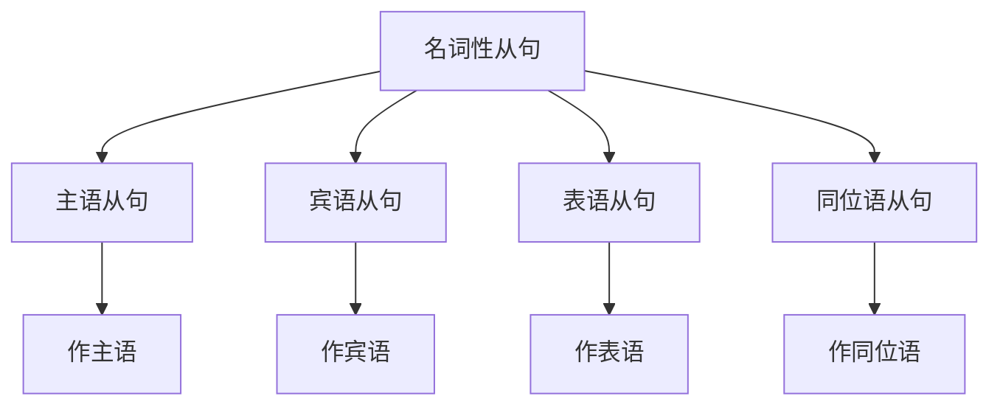

# 名词性从句

## 📚 名词性从句概述

名词性从句在句子中起名词的作用，可以作主语、宾语、表语或同位语。

## 🎯 学习目标

- **认识层面**：了解名词性从句的基本概念
- **理解层面**：掌握名词性从句的构成和用法
- **应用层面**：能够正确运用名词性从句

## 📖 名词性从句特征

### 名词性从句特征图

## 🔍 名词性从句构成

### 基本构成
- **引导词** + **主语** + **谓语** + **其他成分**
- 引导词：that, what, who, whom, whose, which, when, where, why, how
- 在句子中起名词作用
- 可以作主语、宾语、表语或同位语

### 构成示例

| 类型 | 引导词 | 从句 | 例句 |
|------|--------|------|------|
| 主语从句 | That | he is right | That he is right is clear. |
| 宾语从句 | What | you said | I know what you said. |
| 表语从句 | That | he is a teacher | The fact is that he is a teacher. |
| 同位语从句 | That | he will come | The news that he will come is true. |

## 📝 名词性从句用法

### 1. 主语从句
- **That he is right** is clear.
- **What you said** is important.
- **Whether he will come** is unknown.

### 2. 宾语从句
- I know **that he is right**.
- I know **what you said**.
- I wonder **whether he will come**.

### 3. 表语从句
- The fact is **that he is right**.
- The question is **what you said**.
- The problem is **whether he will come**.

### 4. 同位语从句
- The news **that he will come** is true.
- The idea **that we should go** is good.
- The fact **that he is right** is clear.

## 🎯 名词性从句类型

### 主语从句
- **That** + 从句 + 谓语 + 其他
- **What** + 从句 + 谓语 + 其他
- **Whether** + 从句 + 谓语 + 其他

### 宾语从句
- 主语 + 谓语 + **that** + 从句
- 主语 + 谓语 + **what** + 从句
- 主语 + 谓语 + **whether** + 从句

### 表语从句
- 主语 + 系动词 + **that** + 从句
- 主语 + 系动词 + **what** + 从句
- 主语 + 系动词 + **whether** + 从句

### 同位语从句
- 名词 + **that** + 从句
- 名词 + **what** + 从句
- 名词 + **whether** + 从句

## 📊 名词性从句与时态

### 时态应用表

| 类型 | 时态 | 例句 |
|------|------|------|
| 主语从句 | 一般现在时 | That he works hard is clear. |
| 宾语从句 | 一般过去时 | I knew that he worked hard. |
| 表语从句 | 现在完成时 | The fact is that he has worked hard. |
| 同位语从句 | 一般将来时 | The news that he will work hard is true. |

## ⚠️ 常见错误分析

### 错误1：引导词错误
- ❌ I know he is right.
- ✅ I know that he is right.

### 错误2：语序错误
- ❌ I know what did you say.
- ✅ I know what you said.

### 错误3：时态错误
- ❌ I know that he is right yesterday.
- ✅ I know that he was right yesterday.

## 🎯 费曼学习法应用

### 第一步：选择概念
选择"宾语从句"这个概念进行解释

### 第二步：教授他人
用简单语言解释：宾语从句是作宾语的从句

### 第三步：发现问题
在解释过程中发现：需要掌握引导词的使用规则

### 第四步：重新学习
回到资料重新学习引导词的语法规则

### 第五步：简化表达
用更简单的语言重新表达：宾语从句是"我知道什么"的从句

## 📚 刻意练习

### 基础练习
1. 用名词性从句填空：
   - I know ______ he is right. → that
   - I know ______ you said. → what
   - I wonder ______ he will come. → whether

2. 识别名词性从句：
   - That he is right is clear. → 主语从句
   - I know that he is right. → 宾语从句
   - The fact is that he is right. → 表语从句

### 进阶练习
1. 时态转换练习：
   - I know that he is right. → I knew that he was right. (改为过去时)
   - I know that he is right. → I will know that he is right. (改为将来时)

2. 从句转换练习：
   - That he is right is clear. → I know that he is right. (改为宾语从句)
   - I know that he is right. → The fact is that he is right. (改为表语从句)

## 🔗 相关知识点

- [[02-定语从句|定语从句]] - 从句对比
- [[03-状语从句|状语从句]] - 从句对比
- [[04-从句综合练习|从句综合练习]] - 从句练习
- [[01-基础认知层/03-基本句型/01-五种基本句型|五种基本句型]] - 句型基础

## 📖 扩展阅读

- [[02-理解掌握层/01-时态系统/01-时态总览|时态总览]] - 时态与从句
- [[99-附录资料/01-语法术语表|语法术语表]]
