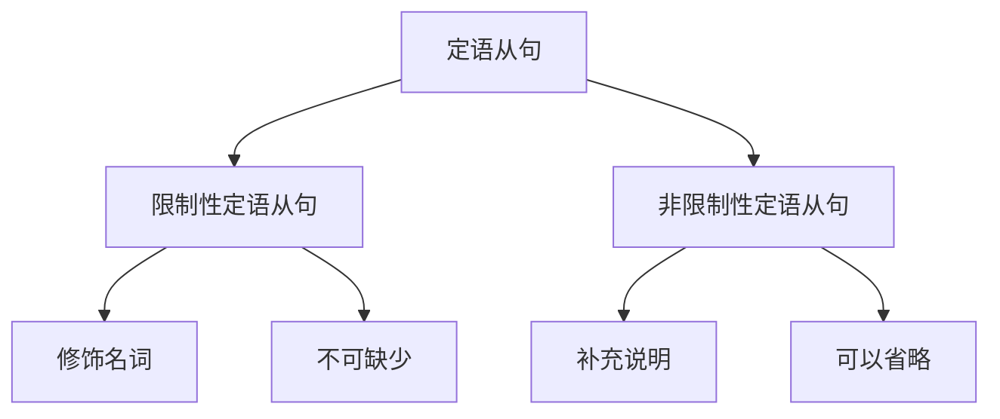

# 定语从句

## 📚 定语从句概述

定语从句在句子中起定语的作用，修饰名词或代词，说明其性质、特征或所属关系。

## 🎯 学习目标

- **认识层面**：了解定语从句的基本概念
- **理解层面**：掌握定语从句的构成和用法
- **应用层面**：能够正确运用定语从句

## 📖 定语从句特征

### 定语从句特征图

## 🔍 定语从句构成

### 基本构成
- **先行词** + **关系词** + **从句**
- 关系词：who, whom, whose, which, that, when, where, why
- 修饰先行词
- 在从句中作成分

### 构成示例

| 关系词 | 先行词 | 从句 | 例句 |
|--------|--------|------|------|
| who | the man | is a teacher | The man who is a teacher is my friend. |
| which | the book | I bought | The book which I bought is interesting. |
| that | the car | he drives | The car that he drives is expensive. |
| where | the place | we met | The place where we met is beautiful. |

## 📝 定语从句用法

### 1. 限制性定语从句
- The man **who is a teacher** is my friend.
- The book **which I bought** is interesting.
- The car **that he drives** is expensive.

### 2. 非限制性定语从句
- My father, **who is a teacher**, is very kind.
- This book, **which I bought yesterday**, is very interesting.
- The car, **which he drives**, is very expensive.

### 3. 关系词的选择
- **who/whom**：指人
- **which**：指物
- **that**：指人或物
- **whose**：指所属关系
- **when**：指时间
- **where**：指地点
- **why**：指原因

## 🎯 定语从句类型

### 限制性定语从句
- **who/whom/which/that** + 从句
- **whose** + 名词 + 从句
- **when/where/why** + 从句

### 非限制性定语从句
- **, who/whom/which** + 从句
- **, whose** + 名词 + 从句
- **, when/where/why** + 从句

## 📊 定语从句与时态

### 时态应用表

| 类型 | 时态 | 例句 |
|------|------|------|
| 限制性定语从句 | 一般现在时 | The man who works hard is successful. |
| 非限制性定语从句 | 一般过去时 | My father, who was a teacher, is retired. |
| 关系词作主语 | 现在进行时 | The man who is working is my brother. |
| 关系词作宾语 | 现在完成时 | The book which I have read is interesting. |

## ⚠️ 常见错误分析

### 错误1：关系词错误
- ❌ The man which is a teacher is my friend.
- ✅ The man who is a teacher is my friend.

### 错误2：语序错误
- ❌ The man who is a teacher he is my friend.
- ✅ The man who is a teacher is my friend.

### 错误3：逗号错误
- ❌ My father who is a teacher is very kind.
- ✅ My father, who is a teacher, is very kind.

## 🎯 费曼学习法应用

### 第一步：选择概念
选择"限制性定语从句"这个概念进行解释

### 第二步：教授他人
用简单语言解释：定语从句是修饰名词的从句

### 第三步：发现问题
在解释过程中发现：需要掌握关系词的选择规则

### 第四步：重新学习
回到资料重新学习关系词的语法规则

### 第五步：简化表达
用更简单的语言重新表达：定语从句是"什么样的"的从句

## 📚 刻意练习

### 基础练习
1. 用定语从句填空：
   - The man ______ is a teacher is my friend. → who
   - The book ______ I bought is interesting. → which
   - The place ______ we met is beautiful. → where

2. 识别定语从句：
   - The man who is a teacher is my friend. → 限制性定语从句
   - My father, who is a teacher, is very kind. → 非限制性定语从句
   - The book which I bought is interesting. → 限制性定语从句

### 进阶练习
1. 关系词选择练习：
   - The man ______ is a teacher is my friend. → who
   - The book ______ I bought is interesting. → which
   - The place ______ we met is beautiful. → where

2. 从句转换练习：
   - The man who is a teacher is my friend. → The man that is a teacher is my friend. (改为that)
   - The book which I bought is interesting. → The book that I bought is interesting. (改为that)

## 🔗 相关知识点

- [[01-名词性从句|名词性从句]] - 从句对比
- [[03-状语从句|状语从句]] - 从句对比
- [[04-从句综合练习|从句综合练习]] - 从句练习
- [[01-基础认知层/02-句子成分/04-定语|定语]] - 定语基础

## 📖 扩展阅读

- [[02-理解掌握层/01-时态系统/01-时态总览|时态总览]] - 时态与从句
- [[99-附录资料/01-语法术语表|语法术语表]]
