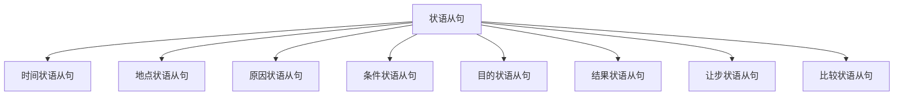

# 状语从句

## 📚 状语从句概述

状语从句在句子中起状语的作用，修饰动词、形容词或副词，表示时间、地点、原因、条件、目的、结果、让步、比较等。

## 🎯 学习目标

- **认识层面**：了解状语从句的基本概念
- **理解层面**：掌握状语从句的构成和用法
- **应用层面**：能够正确运用状语从句

## 📖 状语从句特征

### 状语从句特征图

## 🔍 状语从句构成

### 基本构成
- **引导词** + **主语** + **谓语** + **其他成分**
- 引导词：when, where, because, if, so that, so...that, although, as...as
- 修饰主句
- 表示各种关系

### 构成示例

| 类型 | 引导词 | 从句 | 例句 |
|------|--------|------|------|
| 时间状语从句 | when | I was young | When I was young, I liked music. |
| 地点状语从句 | where | you live | Where you live is beautiful. |
| 原因状语从句 | because | it is raining | I stay home because it is raining. |
| 条件状语从句 | if | you work hard | If you work hard, you will succeed. |

## 📝 状语从句用法

### 1. 时间状语从句
- **When I was young**, I liked music.
- **While he was working**, I was reading.
- **After he finished**, he went home.

### 2. 地点状语从句
- **Where you live** is beautiful.
- **Wherever you go**, I will follow you.
- **Where there is a will**, there is a way.

### 3. 原因状语从句
- I stay home **because it is raining**.
- **Since you are here**, let's start.
- **As it is late**, we should go home.

### 4. 条件状语从句
- **If you work hard**, you will succeed.
- **Unless you study**, you will fail.
- **As long as you try**, you can do it.

### 5. 目的状语从句
- I study hard **so that I can pass the exam**.
- He works hard **in order that he can support his family**.
- She saves money **so that she can buy a car**.

### 6. 结果状语从句
- He is **so tired that he can't work**.
- The book is **so interesting that I can't put it down**.
- It is **such a good book that everyone likes it**.

### 7. 让步状语从句
- **Although it is raining**, we will go out.
- **Though he is young**, he is very smart.
- **Even if you don't like it**, you should try.

### 8. 比较状语从句
- He is **as tall as his brother**.
- She works **harder than her sister**.
- This book is **more interesting than that one**.

## 🎯 状语从句类型

### 时间状语从句
- **when/while/as** + 从句
- **before/after** + 从句
- **since/until** + 从句

### 地点状语从句
- **where/wherever** + 从句
- **where there is** + 从句

### 原因状语从句
- **because/since/as** + 从句
- **now that** + 从句

### 条件状语从句
- **if/unless** + 从句
- **as long as** + 从句
- **provided that** + 从句

### 目的状语从句
- **so that/in order that** + 从句
- **for fear that** + 从句

### 结果状语从句
- **so...that/such...that** + 从句
- **so that** + 从句

### 让步状语从句
- **although/though** + 从句
- **even if/even though** + 从句
- **no matter how/what** + 从句

### 比较状语从句
- **as...as** + 从句
- **than** + 从句
- **the more...the more** + 从句

## 📊 状语从句与时态

### 时态应用表

| 类型 | 时态 | 例句 |
|------|------|------|
| 时间状语从句 | 一般现在时 | When I work, I feel happy. |
| 条件状语从句 | 一般过去时 | If I worked hard, I would succeed. |
| 原因状语从句 | 现在进行时 | Because I am working, I can't go out. |
| 目的状语从句 | 现在完成时 | I study hard so that I have passed the exam. |

## ⚠️ 常见错误分析

### 错误1：引导词错误
- ❌ I stay home because of it is raining.
- ✅ I stay home because it is raining.

### 错误2：时态错误
- ❌ If you will work hard, you will succeed.
- ✅ If you work hard, you will succeed.

### 错误3：语序错误
- ❌ Although it is raining, but we will go out.
- ✅ Although it is raining, we will go out.

## 🎯 费曼学习法应用

### 第一步：选择概念
选择"时间状语从句"这个概念进行解释

### 第二步：教授他人
用简单语言解释：时间状语从句是表示时间的从句

### 第三步：发现问题
在解释过程中发现：需要掌握引导词的使用规则

### 第四步：重新学习
回到资料重新学习引导词的语法规则

### 第五步：简化表达
用更简单的语言重新表达：时间状语从句是"什么时候"的从句

## 📚 刻意练习

### 基础练习
1. 用状语从句填空：
   - I stay home ______ it is raining. → because
   - ______ you work hard, you will succeed. → If
   - He is so tired ______ he can't work. → that

2. 识别状语从句：
   - When I was young, I liked music. → 时间状语从句
   - I stay home because it is raining. → 原因状语从句
   - If you work hard, you will succeed. → 条件状语从句

### 进阶练习
1. 引导词选择练习：
   - I stay home ______ it is raining. → because
   - ______ you work hard, you will succeed. → If
   - He is so tired ______ he can't work. → that

2. 从句转换练习：
   - When I was young, I liked music. → I liked music when I was young. (改变语序)
   - Because it is raining, I stay home. → I stay home because it is raining. (改变语序)

## 🔗 相关知识点

- [[01-名词性从句|名词性从句]] - 从句对比
- [[02-定语从句|定语从句]] - 从句对比
- [[04-从句综合练习|从句综合练习]] - 从句练习
- [[01-基础认知层/02-句子成分/05-状语|状语]] - 状语基础

## 📖 扩展阅读

- [[02-理解掌握层/01-时态系统/01-时态总览|时态总览]] - 时态与从句
- [[99-附录资料/01-语法术语表|语法术语表]]
