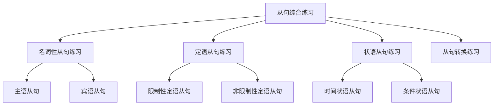

# 从句综合练习

## 📚 从句综合练习概述

从句综合练习是巩固和掌握各种从句的重要方法，通过系统性的练习，提高对从句的理解和运用能力。

## 🎯 学习目标

- **认识层面**：识别各种从句类型
- **理解层面**：理解从句的结构和特点
- **应用层面**：能够熟练运用各种从句

## 📖 练习内容

### 练习类型图

## 🔍 名词性从句练习

### 练习1：识别名词性从句

#### 题目
识别下列句子中的名词性从句类型：

1. That he is right is clear.
2. I know what you said.
3. The fact is that he is a teacher.
4. The news that he will come is true.

#### 答案
1. **主语从句**：That he is right is clear.
2. **宾语从句**：I know what you said.
3. **表语从句**：The fact is that he is a teacher.
4. **同位语从句**：The news that he will come is true.

### 练习2：选择引导词

#### 题目
选择正确的引导词：

1. I know ______ he is right.
2. I know ______ you said.
3. I wonder ______ he will come.

#### 答案
1. **that**：I know that he is right.
2. **what**：I know what you said.
3. **whether**：I wonder whether he will come.

## 🔍 定语从句练习

### 练习3：识别定语从句

#### 题目
识别下列句子中的定语从句类型：

1. The man who is a teacher is my friend.
2. My father, who is a teacher, is very kind.
3. The book which I bought is interesting.
4. The place where we met is beautiful.

#### 答案
1. **限制性定语从句**：The man who is a teacher is my friend.
2. **非限制性定语从句**：My father, who is a teacher, is very kind.
3. **限制性定语从句**：The book which I bought is interesting.
4. **限制性定语从句**：The place where we met is beautiful.

### 练习4：选择关系词

#### 题目
选择正确的关系词：

1. The man ______ is a teacher is my friend.
2. The book ______ I bought is interesting.
3. The place ______ we met is beautiful.

#### 答案
1. **who**：The man who is a teacher is my friend.
2. **which**：The book which I bought is interesting.
3. **where**：The place where we met is beautiful.

## 🔍 状语从句练习

### 练习5：识别状语从句

#### 题目
识别下列句子中的状语从句类型：

1. When I was young, I liked music.
2. I stay home because it is raining.
3. If you work hard, you will succeed.
4. Although it is raining, we will go out.

#### 答案
1. **时间状语从句**：When I was young, I liked music.
2. **原因状语从句**：I stay home because it is raining.
3. **条件状语从句**：If you work hard, you will succeed.
4. **让步状语从句**：Although it is raining, we will go out.

### 练习6：选择引导词

#### 题目
选择正确的引导词：

1. I stay home ______ it is raining.
2. ______ you work hard, you will succeed.
3. He is so tired ______ he can't work.

#### 答案
1. **because**：I stay home because it is raining.
2. **If**：If you work hard, you will succeed.
3. **that**：He is so tired that he can't work.

## 🔄 从句转换练习

### 练习7：从句类型转换

#### 题目
将下列句子转换为其他类型的从句：

1. That he is right is clear. (改为宾语从句)
2. I know that he is right. (改为表语从句)
3. The man who is a teacher is my friend. (改为非限制性定语从句)

#### 答案
1. **宾语从句**：I know that he is right.
2. **表语从句**：The fact is that he is right.
3. **非限制性定语从句**：The man, who is a teacher, is my friend.

### 练习8：语序转换

#### 题目
改变下列句子的语序：

1. When I was young, I liked music.
2. Because it is raining, I stay home.
3. Although he is young, he is very smart.

#### 答案
1. **改变语序**：I liked music when I was young.
2. **改变语序**：I stay home because it is raining.
3. **改变语序**：He is very smart although he is young.

## 📊 综合应用练习

### 练习9：综合应用

#### 题目
根据要求完成句子：

1. 用主语从句：______ is clear.
2. 用宾语从句：I know ______.
3. 用定语从句：The man ______ is my friend.
4. 用状语从句：______, I will go out.

#### 答案
1. **主语从句**：That he is right is clear.
2. **宾语从句**：I know that he is right.
3. **定语从句**：The man who is a teacher is my friend.
4. **状语从句**：If it is fine, I will go out.

### 练习10：错误改正

#### 题目
改正下列句子中的错误：

1. I know he is right.
2. The man which is a teacher is my friend.
3. Although it is raining, but we will go out.

#### 答案
1. **改正**：I know that he is right.
2. **改正**：The man who is a teacher is my friend.
3. **改正**：Although it is raining, we will go out.

## 🎯 费曼学习法应用

### 第一步：选择概念
选择"定语从句"这个概念进行解释

### 第二步：教授他人
用简单语言解释：定语从句是修饰名词的从句

### 第三步：发现问题
在解释过程中发现：需要掌握关系词的选择规则

### 第四步：重新学习
回到资料重新学习关系词的语法规则

### 第五步：简化表达
用更简单的语言重新表达：定语从句是"什么样的"的从句

## 📚 刻意练习

### 基础练习
1. 识别从句类型：
   - That he is right is clear. → 主语从句
   - I know that he is right. → 宾语从句
   - The man who is a teacher is my friend. → 定语从句

2. 选择引导词：
   - I know ______ he is right. → that
   - The man ______ is a teacher is my friend. → who
   - I stay home ______ it is raining. → because

### 进阶练习
1. 从句转换练习：
   - That he is right is clear. → I know that he is right. (改为宾语从句)
   - The man who is a teacher is my friend. → The man, who is a teacher, is my friend. (改为非限制性定语从句)

2. 语序转换练习：
   - When I was young, I liked music. → I liked music when I was young.
   - Because it is raining, I stay home. → I stay home because it is raining.

## 🔗 相关知识点

- [[01-名词性从句|名词性从句]] - 名词性从句基础
- [[02-定语从句|定语从句]] - 定语从句基础
- [[03-状语从句|状语从句]] - 状语从句基础
- [[01-基础认知层/03-基本句型/01-五种基本句型|五种基本句型]] - 句型基础

## 📖 扩展阅读

- [[02-理解掌握层/01-时态系统/01-时态总览|时态总览]] - 时态与从句
- [[99-附录资料/01-语法术语表|语法术语表]]
