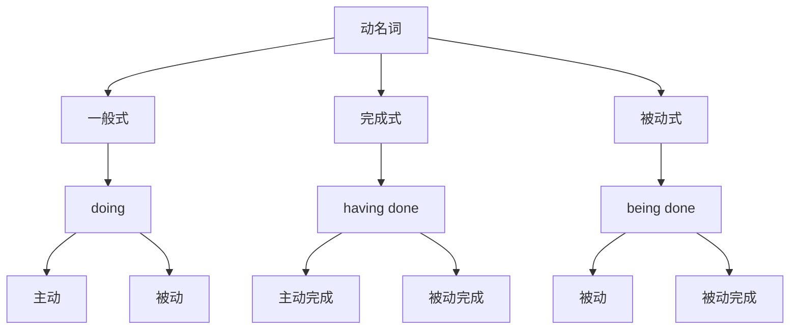

# 动名词基本概念

## 🎯 学习目标
- 掌握动名词的基本概念和构成
- 理解动名词的语法功能
- 熟练运用动名词的各种形式

## 📚 基本概念

### 动名词（Gerund）
**定义**：动词的一种非谓语形式，由动词原形+ing构成，在句中不能单独作谓语

### 基本特征
- 由动词原形+ing构成
- 不能单独作谓语
- 具有动词和名词的双重性质
- 可以有自己的宾语和状语

## 🔄 动名词分类

## 📊 动名词形式表

### 动名词形式表
| 形式 | 构成 | 示例 | 说明 |
|------|------|------|------|
| 一般式 | 动词原形+ing | working | 表示一般动作 |
| 完成式 | having+过去分词 | having worked | 表示已完成的动作 |
| 被动式 | being+过去分词 | being worked | 表示被动动作 |
| 完成被动式 | having been+过去分词 | having been worked | 表示已完成的被动动作 |

## 🎯 动名词语法功能

### 1. 作主语
**功能**：动名词在句中作主语

**示例**：
- ✅ Learning English is important. (学英语很重要)
- ✅ Helping others is our duty. (帮助别人是我们的责任)
- ✅ Studying hard is necessary. (努力学习是必要的)
- ✅ Being honest is the best policy. (诚实是最好的策略)
- ✅ Making mistakes is human. (犯错误是人之常情)

**语法特点**：
- 动名词作主语
- 谓语动词用单数
- 常用it作形式主语

### 2. 作宾语
**功能**：动名词在句中作宾语

**示例**：
- ✅ I enjoy learning English. (我喜欢学英语)
- ✅ She likes reading books. (她喜欢读书)
- ✅ He enjoys playing football. (他喜欢踢足球)
- ✅ We finish doing homework. (我们完成做作业)
- ✅ They avoid making mistakes. (他们避免犯错误)

**语法特点**：
- 动名词作宾语
- 放在及物动词后
- 可以有自己的宾语和状语

### 3. 作表语
**功能**：动名词在句中作表语

**示例**：
- ✅ My hobby is reading books. (我的爱好是读书)
- ✅ Her job is teaching English. (她的工作是教英语)
- ✅ His favorite sport is playing basketball. (他最喜欢的运动是打篮球)
- ✅ Our plan is building a new house. (我们的计划是建一座新房子)
- ✅ Their goal is learning English well. (他们的目标是学好英语)

**语法特点**：
- 动名词作表语
- 放在连系动词后
- 说明主语的内容

### 4. 作定语
**功能**：动名词在句中作定语

**示例**：
- ✅ This is a reading room. (这是一个阅览室)
- ✅ She has a teaching job. (她有一份教学工作)
- ✅ He bought a swimming pool. (他买了一个游泳池)
- ✅ We need a sleeping bag. (我们需要一个睡袋)
- ✅ They have a dining room. (他们有一个餐厅)

**语法特点**：
- 动名词作定语
- 放在被修饰的名词前
- 表示用途或功能

### 5. 作介词宾语
**功能**：动名词在句中作介词宾语

**示例**：
- ✅ I am good at learning English. (我擅长学英语)
- ✅ She is interested in reading books. (她对读书感兴趣)
- ✅ He is fond of playing football. (他喜欢踢足球)
- ✅ We are tired of doing homework. (我们厌倦了做作业)
- ✅ They are afraid of making mistakes. (他们害怕犯错误)

**语法特点**：
- 动名词作介词宾语
- 放在介词后
- 可以有自己的宾语和状语

## 🎯 动名词时态和语态

### 1. 一般式
**功能**：表示与谓语动词同时或之后发生的动作

**示例**：
- ✅ I enjoy learning English. (我喜欢学英语)
- ✅ She likes reading books. (她喜欢读书)
- ✅ He enjoys playing football. (他喜欢踢足球)
- ✅ We finish doing homework. (我们完成做作业)
- ✅ They avoid making mistakes. (他们避免犯错误)

**语法特点**：
- 表示一般动作
- 与谓语动词同时或之后发生
- 用动词原形+ing

### 2. 完成式
**功能**：表示在谓语动词之前已经完成的动作

**示例**：
- ✅ I am glad for having learned English. (我很高兴已经学了英语)
- ✅ She is happy for having read the book. (她很高兴已经读了这本书)
- ✅ He is proud for having seen you. (他很自豪已经见到了你)
- ✅ We are satisfied for having gone there. (我们很满意已经去了那里)
- ✅ They are pleased for having visited Beijing. (他们很高兴已经访问了北京)

**语法特点**：
- 表示已完成的动作
- 在谓语动词之前完成
- 用having+过去分词

### 3. 被动式
**功能**：表示被动动作

**示例**：
- ✅ I enjoy being helped. (我喜欢被帮助)
- ✅ She likes being praised. (她喜欢被表扬)
- ✅ He enjoys being invited. (他喜欢被邀请)
- ✅ We finish being supported. (我们完成被支持)
- ✅ They avoid being criticized. (他们避免被批评)

**语法特点**：
- 表示被动动作
- 主语是动作的承受者
- 用being+过去分词

### 4. 完成被动式
**功能**：表示已完成的被动动作

**示例**：
- ✅ I am glad for having been helped. (我很高兴已经被帮助)
- ✅ She is happy for having been praised. (她很高兴已经被表扬)
- ✅ He is proud for having been invited. (他很自豪已经被邀请)
- ✅ We are satisfied for having been supported. (我们很满意已经被支持)
- ✅ They are pleased for having been welcomed. (他们很高兴已经被欢迎)

**语法特点**：
- 表示已完成的被动动作
- 在谓语动词之前完成
- 用having been+过去分词

## 🎯 动名词构成规则

### 1. 规则变化
**规则**：动词原形+ing

**变化规则**：
| 规则 | 示例 | 说明 |
|------|------|------|
| 一般情况 | work→working, play→playing | 直接加-ing |
| 以e结尾 | live→living, hope→hoping | 去e加-ing |
| 以辅音字母+y结尾 | study→studying, try→trying | 直接加-ing |
| 以重读闭音节结尾 | stop→stopping, plan→planning | 双写辅音字母加-ing |

**示例**：
- ✅ work → working (工作)
- ✅ play → playing (玩)
- ✅ live → living (生活)
- ✅ hope → hoping (希望)
- ✅ study → studying (学习)
- ✅ try → trying (尝试)
- ✅ stop → stopping (停止)
- ✅ plan → planning (计划)

**语法特点**：
- 规则变化
- 直接加-ing
- 有特殊变化规则

### 2. 不规则变化
**规则**：不规则动词的动名词

**示例**：
- ✅ go → going (去)
- ✅ come → coming (来)
- ✅ see → seeing (看)
- ✅ do → doing (做)
- ✅ have → having (有)
- ✅ be → being (是)

**语法特点**：
- 不规则变化
- 需要特殊记忆
- 大多数不规则动词动名词规则

## 📊 动名词语法功能对比表

| 语法功能 | 示例 | 说明 |
|----------|------|------|
| 作主语 | Learning English is important. | 动名词作主语 |
| 作宾语 | I enjoy learning English. | 动名词作宾语 |
| 作表语 | My hobby is reading books. | 动名词作表语 |
| 作定语 | This is a reading room. | 动名词作定语 |
| 作介词宾语 | I am good at learning English. | 动名词作介词宾语 |

## 🚫 常见错误分析

### 错误类型1：动名词构成错误
**错误**：❌ I enjoy to learn English.
**正确**：✅ I enjoy learning English.
**分析**：动名词需要用动词原形+ing

### 错误类型2：动名词时态错误
**错误**：❌ I am glad learning English.
**正确**：✅ I am glad for having learned English.
**分析**：过去的动作用完成式

### 错误类型3：动名词语态错误
**错误**：❌ I enjoy help.
**正确**：✅ I enjoy being helped.
**分析**：被动动作用被动式

### 错误类型4：动名词位置错误
**错误**：❌ Learning English, I enjoy.
**正确**：✅ I enjoy learning English.
**分析**：动名词作宾语时放在动词后

## 🔗 相关链接
- [[02-动名词用法]]：动名词的用法
- [[03-动名词时态语态]]：动名词的时态和语态
- [[04-动名词特殊情况]]：动名词的特殊情况
- [[05-动名词易混点辨析]]：动名词的易混点辨析
- [[01-基础认知层/01-词性系统/03-动词系统/03-动词基本形式]]：动词的基本形式

## 💡 记忆口诀

**动名词基本概念记忆法**：
- 动名词由动词原形+ing构成，不能单独作谓语
- 具有动词和名词的双重性质，可以有自己的宾语和状语
- 语法功能：主语、宾语、表语、定语、介词宾语
- 时态形式：一般式、完成式、被动式、完成被动式
- 构成规则要记牢，特殊变化要掌握
- 语法功能要分清，时态语态要正确

---
*掌握动名词基本概念是语法学习的重要基础，需要大量练习才能熟练运用*
