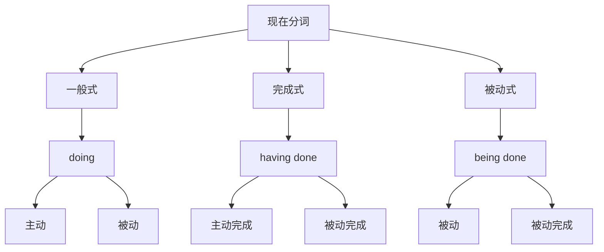

# 现在分词

## 🎯 学习目标
- 掌握现在分词的基本概念和构成
- 理解现在分词的语法功能
- 熟练运用现在分词的各种形式

## 📚 基本概念

### 现在分词（Present Participle）
**定义**：动词的一种非谓语形式，由动词原形+ing构成，在句中不能单独作谓语

### 基本特征
- 由动词原形+ing构成
- 不能单独作谓语
- 具有动词和形容词的双重性质
- 可以有自己的宾语和状语

## 🔄 现在分词分类

## 📊 现在分词形式表

### 现在分词形式表
| 形式 | 构成 | 示例 | 说明 |
|------|------|------|------|
| 一般式 | 动词原形+ing | working | 表示一般动作 |
| 完成式 | having+过去分词 | having worked | 表示已完成的动作 |
| 被动式 | being+过去分词 | being worked | 表示被动动作 |
| 完成被动式 | having been+过去分词 | having been worked | 表示已完成的被动动作 |

## 🎯 现在分词语法功能

### 1. 作定语
**功能**：现在分词在句中作定语

**示例**：
- ✅ The working people are happy. (工作的人们很快乐)
- ✅ The sleeping child is beautiful. (睡觉的孩子很美丽)
- ✅ The running water is clear. (流动的水很清澈)
- ✅ The falling leaves are colorful. (飘落的叶子很美丽)
- ✅ The rising sun is bright. (升起的太阳很明亮)

**语法特点**：
- 现在分词作定语
- 放在被修饰的名词前
- 表示主动或进行

### 2. 作表语
**功能**：现在分词在句中作表语

**示例**：
- ✅ The story is interesting. (故事很有趣)
- ✅ The movie is exciting. (电影很刺激)
- ✅ The book is boring. (书很无聊)
- ✅ The game is amusing. (游戏很有趣)
- ✅ The music is relaxing. (音乐很放松)

**语法特点**：
- 现在分词作表语
- 放在连系动词后
- 说明主语的特征

### 3. 作状语
**功能**：现在分词在句中作状语

**示例**：
- ✅ Working hard, he passed the exam. (努力学习，他通过了考试)
- ✅ Walking along the street, I met an old friend. (沿着街道走，我遇到了一个老朋友)
- ✅ Seeing the teacher, the students stood up. (看到老师，学生们站了起来)
- ✅ Hearing the news, she was very happy. (听到消息，她很开心)
- ✅ Thinking about the problem, he found a solution. (思考问题，他找到了解决方案)

**语法特点**：
- 现在分词作状语
- 表示时间、原因、条件、方式等
- 可以放在句首或句末

### 4. 作宾语补足语
**功能**：现在分词在句中作宾语补足语

**示例**：
- ✅ I saw him working in the garden. (我看见他在花园里工作)
- ✅ She heard the children playing outside. (她听见孩子们在外面玩)
- ✅ He watched the birds flying in the sky. (他看着鸟儿在天空中飞翔)
- ✅ We found the door standing open. (我们发现门开着)
- ✅ They kept the fire burning. (他们让火继续燃烧)

**语法特点**：
- 现在分词作宾语补足语
- 放在宾语后
- 说明宾语的动作或状态

### 5. 作主语补足语
**功能**：现在分词在句中作主语补足语

**示例**：
- ✅ He was seen working in the garden. (他被看见在花园里工作)
- ✅ The children were heard playing outside. (孩子们被听见在外面玩)
- ✅ The birds were watched flying in the sky. (鸟儿被看着在天空中飞翔)
- ✅ The door was found standing open. (门被发现开着)
- ✅ The fire was kept burning. (火被保持燃烧)

**语法特点**：
- 现在分词作主语补足语
- 放在主语后
- 说明主语的动作或状态

## 🎯 现在分词时态和语态

### 1. 一般式
**功能**：表示与谓语动词同时或之后发生的动作

**示例**：
- ✅ The working people are happy. (工作的人们很快乐)
- ✅ The sleeping child is beautiful. (睡觉的孩子很美丽)
- ✅ The running water is clear. (流动的水很清澈)
- ✅ The falling leaves are colorful. (飘落的叶子很美丽)
- ✅ The rising sun is bright. (升起的太阳很明亮)

**语法特点**：
- 表示一般动作
- 与谓语动词同时或之后发生
- 用动词原形+ing

### 2. 完成式
**功能**：表示在谓语动词之前已经完成的动作

**示例**：
- ✅ Having finished his work, he went home. (完成工作后，他回家了)
- ✅ Having read the book, she returned it. (读完书后，她还了书)
- ✅ Having seen the movie, he talked about it. (看完电影后，他谈论了它)
- ✅ Having visited Beijing, we went to Shanghai. (访问北京后，我们去了上海)
- ✅ Having learned English, he found a job. (学完英语后，他找到了工作)

**语法特点**：
- 表示已完成的动作
- 在谓语动词之前完成
- 用having+过去分词

### 3. 被动式
**功能**：表示被动动作

**示例**：
- ✅ The building being built is a school. (正在建的建筑是一所学校)
- ✅ The book being read is interesting. (正在读的书很有趣)
- ✅ The movie being shown is exciting. (正在放映的电影很刺激)
- ✅ The game being played is fun. (正在玩的游戏很有趣)
- ✅ The music being played is beautiful. (正在播放的音乐很美)

**语法特点**：
- 表示被动动作
- 主语是动作的承受者
- 用being+过去分词

### 4. 完成被动式
**功能**：表示已完成的被动动作

**示例**：
- ✅ Having been built, the building is beautiful. (建成后，建筑很美丽)
- ✅ Having been read, the book is interesting. (读完后，书很有趣)
- ✅ Having been shown, the movie is exciting. (放映完后，电影很刺激)
- ✅ Having been played, the game is fun. (玩完后，游戏很有趣)
- ✅ Having been played, the music is beautiful. (播放完后，音乐很美)

**语法特点**：
- 表示已完成的被动动作
- 在谓语动词之前完成
- 用having been+过去分词

## 🎯 现在分词构成规则

### 1. 规则变化
**规则**：动词原形+ing

**变化规则**：
| 规则 | 示例 | 说明 |
|------|------|------|
| 一般情况 | work→working, play→playing | 直接加-ing |
| 以e结尾 | live→living, hope→hoping | 去e加-ing |
| 以辅音字母+y结尾 | study→studying, try→trying | 直接加-ing |
| 以重读闭音节结尾 | stop→stopping, plan→planning | 双写辅音字母加-ing |

**示例**：
- ✅ work → working (工作)
- ✅ play → playing (玩)
- ✅ live → living (生活)
- ✅ hope → hoping (希望)
- ✅ study → studying (学习)
- ✅ try → trying (尝试)
- ✅ stop → stopping (停止)
- ✅ plan → planning (计划)

**语法特点**：
- 规则变化
- 直接加-ing
- 有特殊变化规则

### 2. 不规则变化
**规则**：不规则动词的现在分词

**示例**：
- ✅ go → going (去)
- ✅ come → coming (来)
- ✅ see → seeing (看)
- ✅ do → doing (做)
- ✅ have → having (有)
- ✅ be → being (是)

**语法特点**：
- 不规则变化
- 需要特殊记忆
- 大多数不规则动词现在分词规则

## 📊 现在分词语法功能对比表

| 语法功能 | 示例 | 说明 |
|----------|------|------|
| 作定语 | The working people are happy. | 现在分词作定语 |
| 作表语 | The story is interesting. | 现在分词作表语 |
| 作状语 | Working hard, he passed the exam. | 现在分词作状语 |
| 作宾语补足语 | I saw him working in the garden. | 现在分词作宾语补足语 |
| 作主语补足语 | He was seen working in the garden. | 现在分词作主语补足语 |

## 🚫 常见错误分析

### 错误类型1：现在分词构成错误
**错误**：❌ The work people are happy.
**正确**：✅ The working people are happy.
**分析**：现在分词需要用动词原形+ing

### 错误类型2：现在分词时态错误
**错误**：❌ Finish his work, he went home.
**正确**：✅ Having finished his work, he went home.
**分析**：过去的动作用完成式

### 错误类型3：现在分词语态错误
**错误**：❌ The building build is a school.
**正确**：✅ The building being built is a school.
**分析**：被动动作用被动式

### 错误类型4：现在分词位置错误
**错误**：❌ Working hard, the exam he passed.
**正确**：✅ Working hard, he passed the exam.
**分析**：现在分词作状语时放在句首

## 🔗 相关链接
- [[02-过去分词]]：过去分词的用法
- [[03-分词特殊情况]]：分词的特殊情况
- [[04-分词易混点辨析]]：分词的易混点辨析
- [[01-基础认知层/01-词性系统/03-动词系统/03-动词基本形式]]：动词的基本形式

## 💡 记忆口诀

**现在分词基本概念记忆法**：
- 现在分词由动词原形+ing构成，不能单独作谓语
- 具有动词和形容词的双重性质，可以有自己的宾语和状语
- 语法功能：定语、表语、状语、宾语补足语、主语补足语
- 时态形式：一般式、完成式、被动式、完成被动式
- 构成规则要记牢，特殊变化要掌握
- 语法功能要分清，时态语态要正确

---
*掌握现在分词基本概念是语法学习的重要基础，需要大量练习才能熟练运用*
