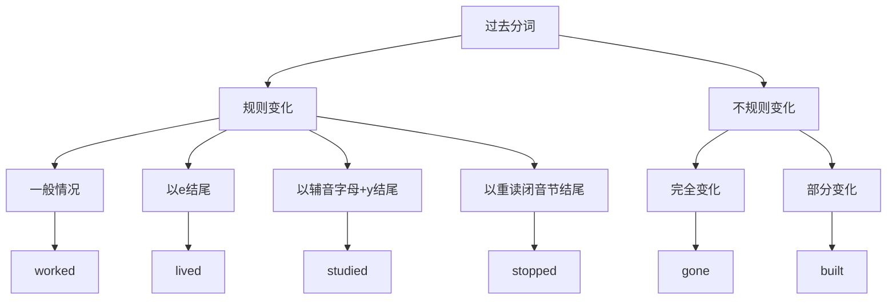

# 过去分词

## 🎯 学习目标
- 掌握过去分词的基本概念和构成
- 理解过去分词的语法功能
- 熟练运用过去分词的各种形式

## 📚 基本概念

### 过去分词（Past Participle）
**定义**：动词的一种非谓语形式，由动词原形+ed构成（规则动词）或不规则变化，在句中不能单独作谓语

### 基本特征
- 由动词原形+ed构成（规则动词）或不规则变化
- 不能单独作谓语
- 具有动词和形容词的双重性质
- 可以有自己的宾语和状语

## 🔄 过去分词分类

## 📊 过去分词形式表

### 规则变化形式表
| 规则 | 示例 | 说明 |
|------|------|------|
| 一般情况 | work→worked, play→played | 直接加-ed |
| 以e结尾 | live→lived, hope→hoped | 直接加-d |
| 以辅音字母+y结尾 | study→studied, try→tried | 变y为i加-ed |
| 以重读闭音节结尾 | stop→stopped, plan→planned | 双写辅音字母加-ed |

### 不规则变化形式表
| 动词 | 过去分词 | 示例 |
|------|----------|------|
| go | gone | He has gone to Beijing. |
| come | come | She has come back. |
| see | seen | I have seen this movie. |
| do | done | He has done his work. |
| have | had | She has had lunch. |
| be | been | They have been here. |

## 🎯 过去分词语法功能

### 1. 作定语
**功能**：过去分词在句中作定语

**示例**：
- ✅ The broken window needs repair. (破碎的窗户需要修理)
- ✅ The finished work is excellent. (完成的工作很优秀)
- ✅ The closed door is locked. (关闭的门被锁着)
- ✅ The written letter is ready. (写的信准备好了)
- ✅ The spoken English is fluent. (说的英语很流利)

**语法特点**：
- 过去分词作定语
- 放在被修饰的名词前
- 表示被动或完成

### 2. 作表语
**功能**：过去分词在句中作表语

**示例**：
- ✅ The window is broken. (窗户破了)
- ✅ The work is finished. (工作完成了)
- ✅ The door is closed. (门关着)
- ✅ The letter is written. (信写好了)
- ✅ The English is spoken. (英语被说了)

**语法特点**：
- 过去分词作表语
- 放在连系动词后
- 说明主语的状态

### 3. 作状语
**功能**：过去分词在句中作状语

**示例**：
- ✅ Broken by the wind, the window needs repair. (被风吹破，窗户需要修理)
- ✅ Finished early, the work is excellent. (提前完成，工作很优秀)
- ✅ Closed at night, the door is locked. (晚上关闭，门被锁着)
- ✅ Written carefully, the letter is ready. (仔细写好，信准备好了)
- ✅ Spoken fluently, the English is good. (流利地说，英语很好)

**语法特点**：
- 过去分词作状语
- 表示时间、原因、条件、方式等
- 可以放在句首或句末

### 4. 作宾语补足语
**功能**：过去分词在句中作宾语补足语

**示例**：
- ✅ I found the window broken. (我发现窗户破了)
- ✅ She saw the work finished. (她看见工作完成了)
- ✅ He heard the door closed. (他听见门关了)
- ✅ We watched the letter written. (我们看着信被写)
- ✅ They kept the English spoken. (他们让英语被说)

**语法特点**：
- 过去分词作宾语补足语
- 放在宾语后
- 说明宾语的状态

### 5. 作主语补足语
**功能**：过去分词在句中作主语补足语

**示例**：
- ✅ The window was found broken. (窗户被发现破了)
- ✅ The work was seen finished. (工作被看见完成了)
- ✅ The door was heard closed. (门被听见关了)
- ✅ The letter was watched written. (信被看着写了)
- ✅ The English was kept spoken. (英语被保持说了)

**语法特点**：
- 过去分词作主语补足语
- 放在主语后
- 说明主语的状态

## 🎯 过去分词构成规则

### 1. 规则变化
**规则**：动词原形+ed

**变化规则**：
| 规则 | 示例 | 说明 |
|------|------|------|
| 一般情况 | work→worked, play→played | 直接加-ed |
| 以e结尾 | live→lived, hope→hoped | 直接加-d |
| 以辅音字母+y结尾 | study→studied, try→tried | 变y为i加-ed |
| 以重读闭音节结尾 | stop→stopped, plan→planned | 双写辅音字母加-ed |

**示例**：
- ✅ work → worked (工作)
- ✅ play → played (玩)
- ✅ live → lived (生活)
- ✅ hope → hoped (希望)
- ✅ study → studied (学习)
- ✅ try → tried (尝试)
- ✅ stop → stopped (停止)
- ✅ plan → planned (计划)

**语法特点**：
- 规则变化
- 直接加-ed
- 有特殊变化规则

### 2. 不规则变化
**规则**：不规则动词的过去分词

**示例**：
- ✅ go → gone (去)
- ✅ come → come (来)
- ✅ see → seen (看)
- ✅ do → done (做)
- ✅ have → had (有)
- ✅ be → been (是)

**语法特点**：
- 不规则变化
- 需要特殊记忆
- 大多数不规则动词过去分词不规则

## 🎯 过去分词特殊用法

### 1. 表示被动
**功能**：表示被动动作

**示例**：
- ✅ The broken window needs repair. (破碎的窗户需要修理)
- ✅ The finished work is excellent. (完成的工作很优秀)
- ✅ The closed door is locked. (关闭的门被锁着)
- ✅ The written letter is ready. (写的信准备好了)
- ✅ The spoken English is fluent. (说的英语很流利)

**语法特点**：
- 表示被动动作
- 主语是动作的承受者
- 用过去分词

### 2. 表示完成
**功能**：表示完成的动作

**示例**：
- ✅ The finished work is excellent. (完成的工作很优秀)
- ✅ The closed door is locked. (关闭的门被锁着)
- ✅ The written letter is ready. (写的信准备好了)
- ✅ The spoken English is fluent. (说的英语很流利)
- ✅ The done homework is correct. (做的作业是正确的)

**语法特点**：
- 表示完成的动作
- 动作已经完成
- 用过去分词

### 3. 表示状态
**功能**：表示状态

**示例**：
- ✅ The window is broken. (窗户破了)
- ✅ The work is finished. (工作完成了)
- ✅ The door is closed. (门关着)
- ✅ The letter is written. (信写好了)
- ✅ The English is spoken. (英语被说了)

**语法特点**：
- 表示状态
- 说明主语的状态
- 用过去分词

## 📊 过去分词语法功能对比表

| 语法功能 | 示例 | 说明 |
|----------|------|------|
| 作定语 | The broken window needs repair. | 过去分词作定语 |
| 作表语 | The window is broken. | 过去分词作表语 |
| 作状语 | Broken by the wind, the window needs repair. | 过去分词作状语 |
| 作宾语补足语 | I found the window broken. | 过去分词作宾语补足语 |
| 作主语补足语 | The window was found broken. | 过去分词作主语补足语 |

## 🚫 常见错误分析

### 错误类型1：过去分词构成错误
**错误**：❌ The break window needs repair.
**正确**：✅ The broken window needs repair.
**分析**：过去分词需要用动词的过去分词形式

### 错误类型2：过去分词时态错误
**错误**：❌ The window is break.
**正确**：✅ The window is broken.
**分析**：过去分词作表语时用过去分词形式

### 错误类型3：过去分词语态错误
**错误**：❌ The window is breaking.
**正确**：✅ The window is broken.
**分析**：被动状态用过去分词

### 错误类型4：过去分词位置错误
**错误**：❌ The window broken needs repair.
**正确**：✅ The broken window needs repair.
**分析**：过去分词作定语时放在名词前

## 🔗 相关链接
- [[01-现在分词]]：现在分词的用法
- [[03-分词特殊情况]]：分词的特殊情况
- [[04-分词易混点辨析]]：分词的易混点辨析
- [[01-基础认知层/01-词性系统/03-动词系统/03-动词基本形式]]：动词的基本形式

## 💡 记忆口诀

**过去分词基本概念记忆法**：
- 过去分词由动词原形+ed构成（规则动词）或不规则变化，不能单独作谓语
- 具有动词和形容词的双重性质，可以有自己的宾语和状语
- 语法功能：定语、表语、状语、宾语补足语、主语补足语
- 表示被动、完成、状态
- 构成规则要记牢，不规则变化要掌握
- 语法功能要分清，时态语态要正确

---
*掌握过去分词基本概念是语法学习的重要基础，需要大量练习才能熟练运用*
