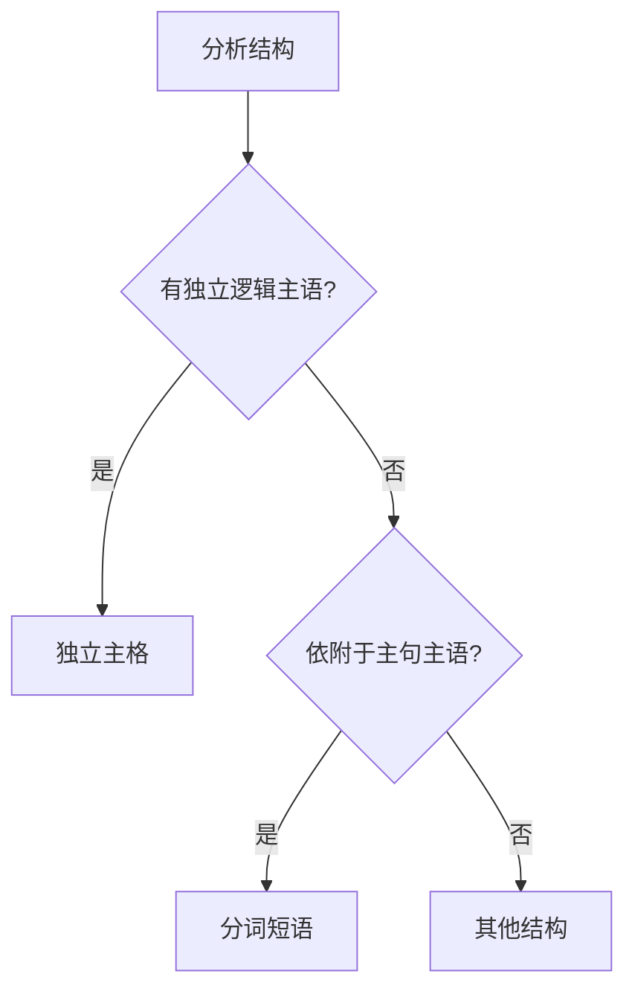
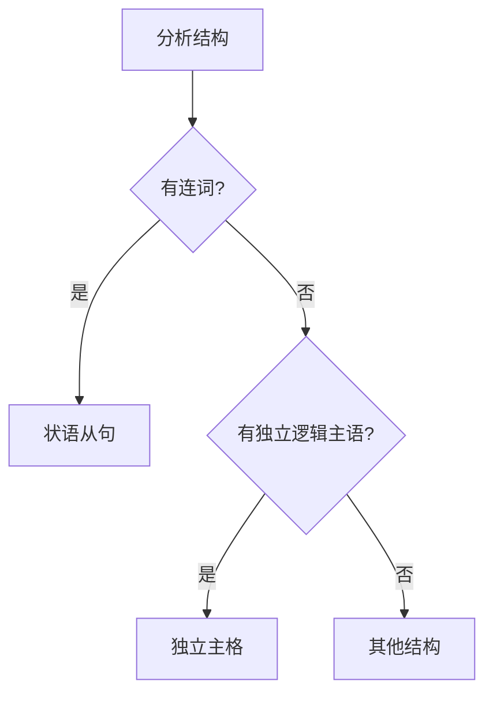
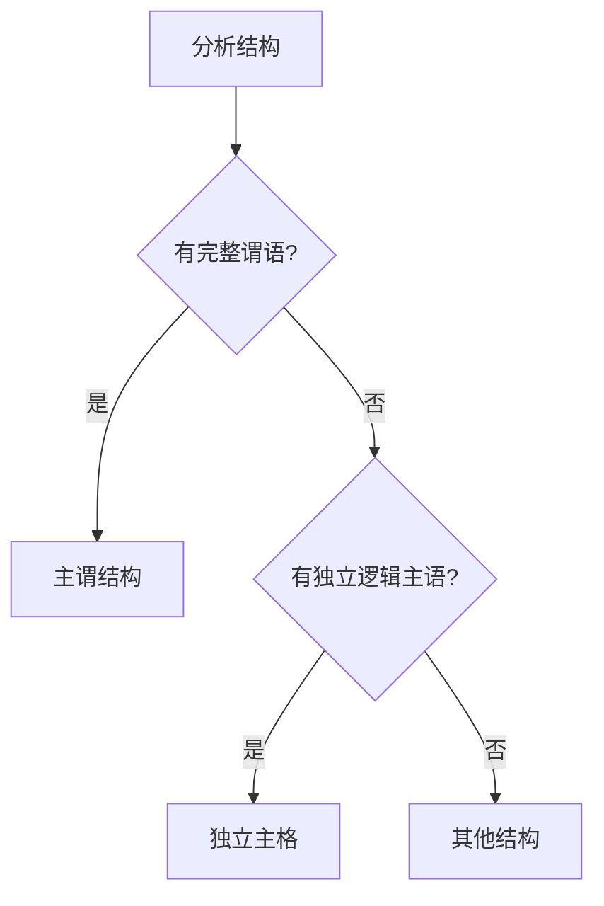
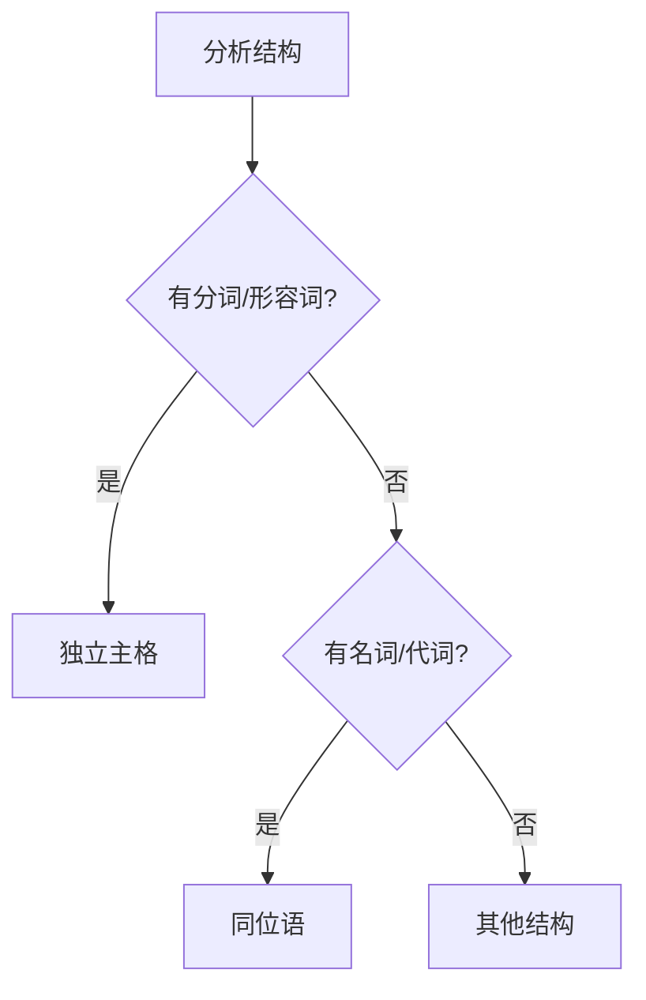
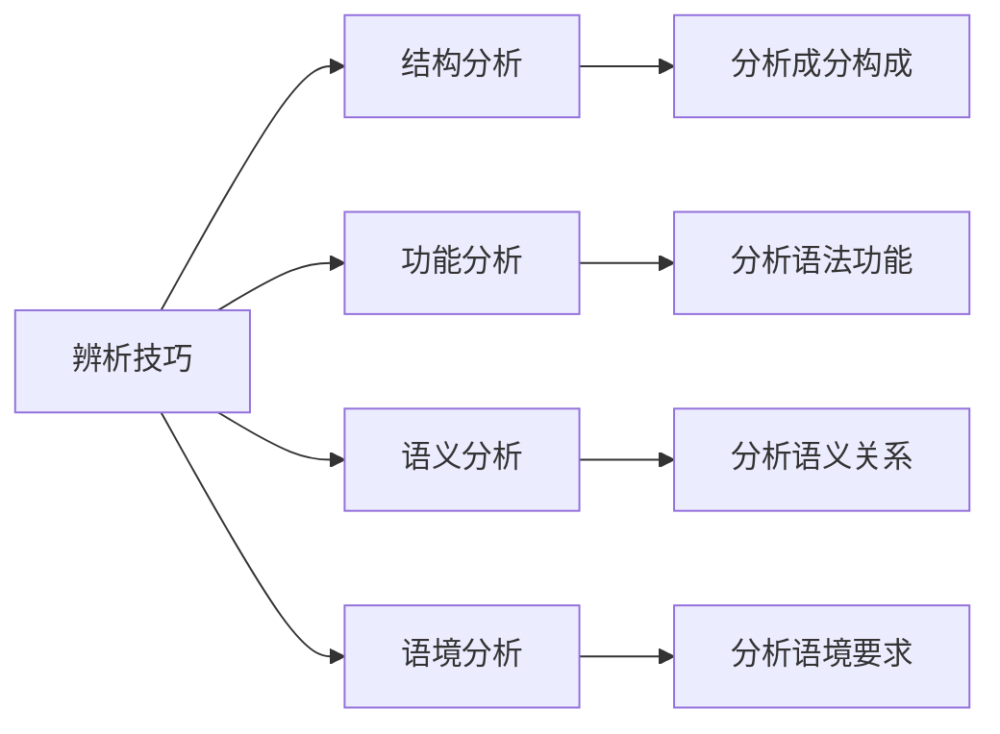

# 独立主格易混点辨析

## 核心概念
独立主格易混点辨析是英语语法学习中的重点难点，准确区分相似结构有助于提高语法运用的准确性和流畅性。

## 主要易混点

### 1. 独立主格 vs 分词短语

#### 区别要点
| 方面 | 独立主格 | 分词短语 |
|------|----------|----------|
| **逻辑主语** | 有自己的逻辑主语 | 依附于主句主语 |
| **语法独立性** | 语法上独立 | 语法上依附 |
| **语义完整性** | 语义完整 | 语义不完整 |
| **位置灵活性** | 位置灵活 | 位置相对固定 |
| **使用场景** | 状语功能 | 定语、状语功能 |

#### 辨析方法

#### 典型例句对比
- **独立主格**: Weather permitting, we'll go out. (Weather是独立逻辑主语)
- **分词短语**: Permitting the weather, we'll go out. (permitting依附于we)

#### 常见错误
❌ 错误: Permitting the weather, we'll go out.
✅ 正确: Weather permitting, we'll go out. (独立主格需要独立逻辑主语)

### 2. 独立主格 vs 状语从句

#### 区别要点
| 方面 | 独立主格 | 状语从句 |
|------|----------|----------|
| **结构特点** | 名词+分词/形容词 | 连词+主语+谓语 |
| **语法功能** | 作状语 | 作状语 |
| **逻辑关系** | 隐含逻辑关系 | 明确逻辑关系 |
| **使用场景** | 简洁表达 | 详细表达 |
| **语体风格** | 书面语体 | 口语书面语体 |

#### 辨析方法

#### 典型例句对比
- **独立主格**: Weather permitting, we'll go out. (简洁表达)
- **状语从句**: If weather permits, we'll go out. (详细表达)

#### 常见错误
❌ 错误: If weather permitting, we'll go out.
✅ 正确: Weather permitting, we'll go out. (独立主格不需要连词)

### 3. 独立主格 vs 介词短语

#### 区别要点
| 方面 | 独立主格 | 介词短语 |
|------|----------|----------|
| **结构特点** | 名词+分词/形容词 | 介词+名词/代词 |
| **语法功能** | 作状语 | 作状语、定语 |
| **逻辑关系** | 隐含逻辑关系 | 明确逻辑关系 |
| **使用场景** | 简洁表达 | 详细表达 |
| **语体风格** | 书面语体 | 口语书面语体 |

#### 辨析方法

#### 典型例句对比
- **独立主格**: Weather permitting, we'll go out. (简洁表达)
- **介词短语**: With weather permitting, we'll go out. (详细表达)

#### 常见错误
❌ 错误: With weather permitting, we'll go out.
✅ 正确: Weather permitting, we'll go out. (独立主格不需要介词)

### 4. 独立主格 vs 主谓结构

#### 区别要点
| 方面 | 独立主格 | 主谓结构 |
|------|----------|----------|
| **结构特点** | 名词+分词/形容词 | 主语+谓语 |
| **语法功能** | 作状语 | 作句子主干 |
| **逻辑关系** | 隐含逻辑关系 | 明确逻辑关系 |
| **使用场景** | 简洁表达 | 详细表达 |
| **语体风格** | 书面语体 | 口语书面语体 |

#### 辨析方法

#### 典型例句对比
- **独立主格**: Weather permitting, we'll go out. (简洁表达)
- **主谓结构**: Weather permits, so we'll go out. (详细表达)

#### 常见错误
❌ 错误: Weather permits, we'll go out.
✅ 正确: Weather permitting, we'll go out. (独立主格不需要完整谓语)

### 5. 独立主格 vs 同位语

#### 区别要点
| 方面 | 独立主格 | 同位语 |
|------|----------|----------|
| **结构特点** | 名词+分词/形容词 | 名词+名词/代词 |
| **语法功能** | 作状语 | 作定语 |
| **逻辑关系** | 隐含逻辑关系 | 明确逻辑关系 |
| **使用场景** | 简洁表达 | 详细表达 |
| **语体风格** | 书面语体 | 口语书面语体 |

#### 辨析方法

#### 典型例句对比
- **独立主格**: Weather permitting, we'll go out. (简洁表达)
- **同位语**: Weather, a natural phenomenon, affects our plans. (详细表达)

#### 常见错误
❌ 错误: Weather, permitting, we'll go out.
✅ 正确: Weather permitting, we'll go out. (独立主格不需要逗号)

## 综合辨析表

### 6. 易混点总结
| 易混点 | 关键区别 | 判断方法 | 典型例句 |
|--------|----------|----------|----------|
| 独立主格 vs 分词短语 | 逻辑主语独立性 | 是否有独立逻辑主语 | Weather permitting vs Permitting weather |
| 独立主格 vs 状语从句 | 连词使用 | 是否有连词 | Weather permitting vs If weather permits |
| 独立主格 vs 介词短语 | 介词使用 | 是否有介词 | Weather permitting vs With weather permitting |
| 独立主格 vs 主谓结构 | 谓语完整性 | 是否有完整谓语 | Weather permitting vs Weather permits |
| 独立主格 vs 同位语 | 成分类型 | 是否有分词/形容词 | Weather permitting vs Weather, a phenomenon |

### 7. 辨析技巧总结

## 辨析技巧

### 技巧1: 结构分析法
1. **分析成分构成**: 识别各成分的类型和关系
2. **分析语法功能**: 确定各成分的语法功能
3. **分析语义关系**: 理解各成分的语义关系
4. **分析语境要求**: 考虑具体的语境要求

### 技巧2: 功能分析法
1. **理解语法功能**: 理解各结构的语法功能
2. **分析语义作用**: 分析各结构的语义作用
3. **验证功能正确性**: 验证功能的正确性
4. **考虑语境适应性**: 考虑语境适应性

### 技巧3: 对比分析法
1. **相似结构对比**: 对比相似结构的差异
2. **相反概念对比**: 对比相反概念的差异
3. **相关概念对比**: 对比相关概念的差异

## 记忆口诀
> **独立主格要辨析，结构功能要分析**
> **分词短语依附主，独立主格有独立**
> **状语从句有连词，独立主格无连词**
> **介词短语有介词，独立主格无介词**
> **主谓结构有谓语，独立主格无谓语**

## 刻意练习

### 练习1: 结构识别
判断下列句子中的结构类型：
1. Weather permitting, we'll go out.
2. Permitting the weather, we'll go out.
3. If weather permits, we'll go out.

### 练习2: 错误纠正
找出并纠正下列句子中的错误：
1. If weather permitting, we'll go out.
2. With weather permitting, we'll go out.
3. Weather permits, we'll go out.

### 练习3: 结构转换
将下列独立主格转换为其他结构：
1. Weather permitting, we'll go out.
2. The work done, we went home.

## 相关链接
- [[01-独立主格基本概念]] - 理解独立主格的基本概念
- [[02-独立主格用法]] - 学习独立主格的具体用法
- [[03-独立主格特殊情况]] - 了解独立主格的特殊情况

## 学习要点
1. **理解**: 掌握各易混点的本质区别
2. **识别**: 能够识别相似结构的差异
3. **辨析**: 能够区分易混结构
4. **应用**: 在实际中正确运用各种结构

---
*学习建议: 通过大量对比练习，逐步掌握独立主格辨析的方法*
