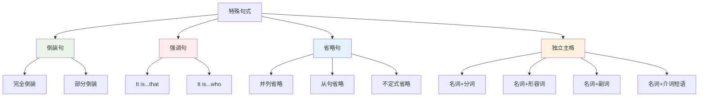
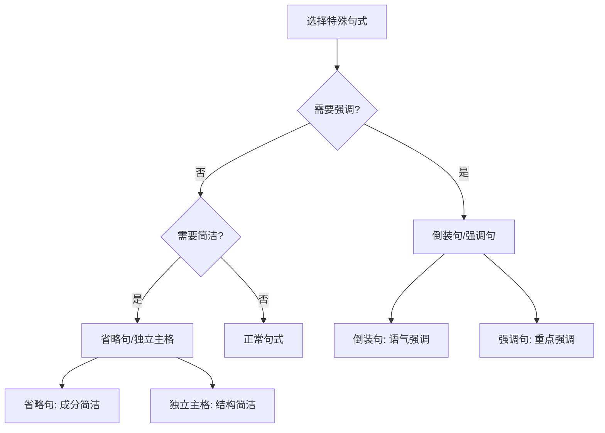
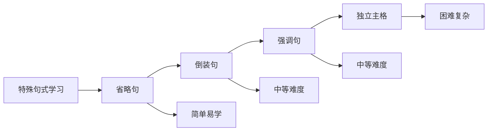

# 特殊句式对比图表

## 核心概念
特殊句式对比图表通过表格形式直观展示不同特殊句式之间的相似点和差异点，帮助学习者快速掌握特殊句式的特点和用法。

## 主要特殊句式对比

### 1. 倒装句 vs 正常句

| 对比方面 | 倒装句 | 正常句 |
|----------|--------|--------|
| **定义** | 主语和谓语位置颠倒 | 主语在前，谓语在后 |
| **结构特点** | 谓语在前，主语在后 | 主语在前，谓语在后 |
| **语法功能** | 强调语气 | 正常表达 |
| **使用场景** | 强调、疑问、感叹 | 一般表达 |
| **语体风格** | 书面语体 | 口语书面语体 |
| **示例** | Here comes the bus. | The bus comes here. |
| **特点** | 语气强烈 | 语气平和 |

**记忆要点**:
- 倒装句：谓语在前，主语在后，语气强烈
- 正常句：主语在前，谓语在后，语气平和

### 2. 强调句 vs 正常句

| 对比方面 | 强调句 | 正常句 |
|----------|--------|--------|
| **定义** | 突出强调某个成分 | 正常表达 |
| **结构特点** | It is...that/who | 正常语序 |
| **语法功能** | 强调重点 | 正常表达 |
| **使用场景** | 突出重点 | 一般表达 |
| **语体风格** | 书面语体 | 口语书面语体 |
| **示例** | It was Tom who broke the window. | Tom broke the window. |
| **特点** | 重点突出 | 重点不突出 |

**记忆要点**:
- 强调句：使用It is...that/who结构，重点突出
- 正常句：正常语序，重点不突出

### 3. 省略句 vs 完整句

| 对比方面 | 省略句 | 完整句 |
|----------|--------|--------|
| **定义** | 省略某些成分 | 成分完整 |
| **结构特点** | 成分不完整 | 成分完整 |
| **语法功能** | 简洁表达 | 详细表达 |
| **使用场景** | 简洁表达 | 详细表达 |
| **语体风格** | 口语语体 | 口语书面语体 |
| **示例** | I like apples and oranges. | I like apples and I like oranges. |
| **特点** | 简洁明了 | 详细完整 |

**记忆要点**:
- 省略句：成分不完整，简洁表达
- 完整句：成分完整，详细表达

### 4. 独立主格 vs 状语从句

| 对比方面 | 独立主格 | 状语从句 |
|----------|----------|----------|
| **定义** | 名词+分词/形容词等 | 连词+主语+谓语 |
| **结构特点** | 简洁结构 | 完整结构 |
| **语法功能** | 作状语 | 作状语 |
| **使用场景** | 简洁表达 | 详细表达 |
| **语体风格** | 书面语体 | 口语书面语体 |
| **示例** | Weather permitting, we'll go out. | If weather permits, we'll go out. |
| **特点** | 简洁明了 | 详细完整 |

**记忆要点**:
- 独立主格：简洁结构，书面语体
- 状语从句：完整结构，口语书面语体

## 特殊句式功能对比表

### 5. 特殊句式功能对比
| 句式类型 | 强调功能 | 简洁功能 | 语气功能 | 状语功能 |
|----------|----------|----------|----------|----------|
| **倒装句** | ✅ | ❌ | ✅ | ❌ |
| **强调句** | ✅ | ❌ | ❌ | ❌ |
| **省略句** | ❌ | ✅ | ❌ | ❌ |
| **独立主格** | ❌ | ✅ | ❌ | ✅ |

### 6. 特殊句式使用场景对比
| 句式类型 | 书面语体 | 口语语体 | 正式语体 | 非正式语体 |
|----------|----------|----------|----------|------------|
| **倒装句** | ✅ | ❌ | ✅ | ❌ |
| **强调句** | ✅ | ❌ | ✅ | ❌ |
| **省略句** | ❌ | ✅ | ❌ | ✅ |
| **独立主格** | ✅ | ❌ | ✅ | ❌ |

## 特殊句式构成对比表

### 7. 特殊句式构成规律
| 句式类型 | 基本结构 | 变化规律 | 示例 |
|----------|----------|----------|------|
| **倒装句** | 谓语+主语 | 完全倒装/部分倒装 | Here comes the bus. |
| **强调句** | It is...that/who | 被强调部分放中间 | It was Tom who broke the window. |
| **省略句** | 省略成分 | 并列/从句/不定式省略 | I like apples and oranges. |
| **独立主格** | 名词+分词/形容词 | 逻辑主语+逻辑谓语 | Weather permitting, we'll go out. |

### 8. 特殊句式变化对比
| 句式类型 | 肯定式 | 否定式 | 疑问式 | 特殊疑问式 |
|----------|--------|--------|--------|------------|
| **倒装句** | Here comes the bus. | Here doesn't come the bus. | Does the bus come here? | Where does the bus come? |
| **强调句** | It was Tom who broke the window. | It wasn't Tom who broke the window. | Was it Tom who broke the window? | Who was it that broke the window? |
| **省略句** | I like apples and oranges. | I don't like apples or oranges. | Do you like apples and oranges? | What do you like? |
| **独立主格** | Weather permitting, we'll go out. | Weather not permitting, we won't go out. | Weather permitting, will we go out? | Weather permitting, what will we do? |

## 特殊句式对比图

### 9. 特殊句式关系图

### 10. 特殊句式使用流程图

## 特殊句式特点总结

### 11. 特殊句式特点对比
| 特点 | 倒装句 | 强调句 | 省略句 | 独立主格 |
|------|--------|--------|--------|----------|
| **结构特点** | 主谓颠倒 | It is...that | 成分省略 | 名词+分词 |
| **语法功能** | 强调语气 | 突出重点 | 简洁表达 | 状语功能 |
| **使用场景** | 强调、疑问、感叹 | 突出重点 | 简洁表达 | 状语表达 |
| **语体风格** | 书面语体 | 书面语体 | 口语语体 | 书面语体 |
| **难度等级** | 中等 | 中等 | 简单 | 困难 |

### 12. 特殊句式学习顺序

## 记忆技巧

### 技巧1: 分类记忆
1. **按功能分类**: 强调、简洁、语气、状语
2. **按难度分类**: 简单、中等、困难
3. **按语体分类**: 书面、口语、正式、非正式

### 技巧2: 对比记忆
1. **相似句式对比**: 倒装句 vs 正常句
2. **相反概念对比**: 强调 vs 非强调
3. **相关概念对比**: 简洁 vs 详细

### 技巧3: 规律记忆
1. **构成规律**: 掌握句式构成规律
2. **使用规律**: 掌握句式使用规律
3. **变化规律**: 掌握句式变化规律

## 刻意练习

### 练习1: 句式识别
判断下列句子的句式类型：
1. Here comes the bus.
2. It was Tom who broke the window.
3. I like apples and oranges.

### 练习2: 句式对比
对比下列句式的差异：
1. 倒装句 vs 正常句
2. 强调句 vs 正常句
3. 省略句 vs 完整句

### 练习3: 句式选择
根据语境选择正确的句式：
1. 需要强调语气
2. 需要突出重点
3. 需要简洁表达

## 相关链接
- [[01-特殊句式记忆口诀]] - 学习特殊句式记忆口诀
- [[03-特殊句式练习游戏]] - 进行特殊句式练习游戏
- [[01-倒装句/01-完全倒装]] - 深入学习完全倒装

## 学习要点
1. **对比**: 掌握不同特殊句式的对比要点
2. **功能**: 理解各特殊句式的语法功能
3. **构成**: 掌握各特殊句式的构成规律
4. **应用**: 在实际中正确运用特殊句式

---
*学习建议: 通过对比练习，加深对特殊句式差异的理解*
