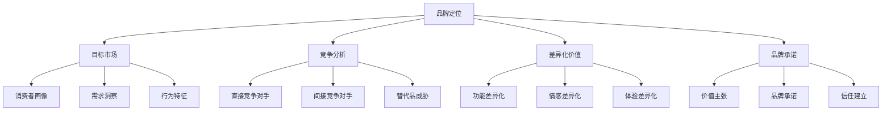
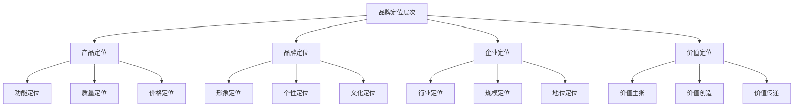
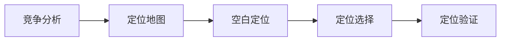
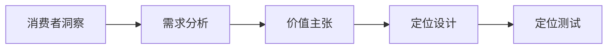
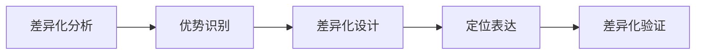
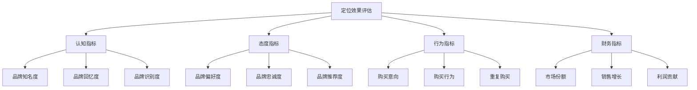

# 品牌定位策略

## 品牌定位概述

### 定义与本质
**品牌定位**：在目标消费者心智中建立独特、清晰、有价值的品牌形象和认知，使品牌在竞争中脱颖而出。

### 定位的核心要素

## 品牌定位理论框架

### 定位理论发展
| 阶段 | 代表人物 | 核心观点 | 应用价值 |
|------|----------|----------|----------|
| **产品定位** | 艾·里斯、杰克·特劳特 | 产品功能差异化 | 功能优势建立 |
| **品牌定位** | 大卫·奥格威 | 品牌形象塑造 | 品牌价值创造 |
| **心智定位** | 艾·里斯、杰克·特劳特 | 消费者心智占领 | 认知优势建立 |
| **价值定位** | 菲利普·科特勒 | 顾客价值创造 | 价值优势建立 |

### 定位层次模型

## 品牌定位策略类型

### 1. 功能定位策略
#### 核心特征
- **产品功能**：突出产品独特功能
- **技术优势**：强调技术领先性
- **性能表现**：突出性能优势

#### 适用场景
- 技术密集型产品
- 功能差异化明显
- 理性购买决策

#### 实施要点
- 功能验证和证明
- 技术参数对比
- 使用场景展示

### 2. 情感定位策略
#### 核心特征
- **情感连接**：建立情感纽带
- **价值认同**：价值观匹配
- **生活方式**：生活方式表达

#### 适用场景
- 情感驱动购买
- 品牌忠诚度建设
- 高端品牌塑造

#### 实施要点
- 情感故事讲述
- 价值观传播
- 生活方式展示

### 3. 体验定位策略
#### 核心特征
- **体验设计**：独特体验创造
- **感官刺激**：多感官体验
- **互动参与**：用户参与体验

#### 适用场景
- 服务型品牌
- 体验经济产品
- 年轻消费群体

#### 实施要点
- 体验触点设计
- 感官体验优化
- 互动体验创新

### 4. 价值定位策略
#### 核心特征
- **价值主张**：独特价值承诺
- **性价比**：价值价格比
- **解决方案**：问题解决方案

#### 适用场景
- 理性消费市场
- 价格敏感群体
- B2B市场

#### 实施要点
- 价值量化展示
- 成本效益分析
- 解决方案设计

## 品牌定位方法

### 1. 竞争定位法
#### 方法步骤

#### 实施要点
- 竞争对手分析
- 定位地图绘制
- 空白市场识别
- 定位策略选择

### 2. 消费者定位法
#### 方法步骤

#### 实施要点
- 消费者深度调研
- 需求层次分析
- 价值主张设计
- 定位效果测试

### 3. 差异化定位法
#### 方法步骤

#### 实施要点
- 差异化维度分析
- 竞争优势识别
- 差异化策略设计
- 差异化效果验证

## 品牌定位实施

### 定位策略制定
#### 1. 市场分析
- **目标市场**：市场细分和目标选择
- **竞争环境**：竞争格局和对手分析
- **消费者洞察**：需求、行为、偏好分析

#### 2. 定位选择
- **定位方向**：功能、情感、体验、价值
- **定位层次**：产品、品牌、企业、价值
- **定位策略**：竞争、消费者、差异化

#### 3. 定位表达
- **定位陈述**：简洁明确的定位描述
- **价值主张**：独特的价值承诺
- **品牌承诺**：品牌对消费者的承诺

### 定位传播策略
#### 传播渠道选择
| 渠道类型 | 特点 | 适用场景 | 传播效果 |
|----------|------|----------|----------|
| **广告传播** | 覆盖面广、影响力大 | 品牌知名度建设 | 认知建立 |
| **公关传播** | 可信度高、影响力强 | 品牌形象塑造 | 信任建立 |
| **内容传播** | 深度沟通、价值传递 | 品牌教育 | 理解建立 |
| **体验传播** | 直接体验、深度感知 | 品牌体验 | 感受建立 |

#### 传播内容设计
- **核心信息**：定位核心信息
- **支持信息**：定位支撑信息
- **情感信息**：情感连接信息
- **行动信息**：购买行动信息

### 定位效果评估
#### 评估指标

#### 评估方法
- **定量研究**：问卷调查、数据分析
- **定性研究**：深度访谈、焦点小组
- **行为分析**：购买行为、使用行为
- **财务分析**：销售数据、利润分析

## 品牌定位案例

### 成功案例：苹果品牌定位
#### 定位策略
- **核心定位**：创新、简约、高端
- **价值主张**：Think Different
- **目标市场**：追求品质和创新的消费者

#### 实施要点
- 产品设计创新
- 品牌形象塑造
- 用户体验优化
- 生态系统建设

#### 成功因素
- 清晰的定位策略
- 一致的价值传递
- 强大的产品支撑
- 有效的传播执行

### 失败案例：品牌定位混乱
#### 问题分析
- 定位不清晰
- 价值主张模糊
- 传播信息不一致
- 产品支撑不足

#### 改进建议
- 明确品牌定位
- 清晰价值主张
- 统一传播信息
- 强化产品支撑

## 实践应用

### 定位策略制定流程
1. **市场调研**：深入了解目标市场
2. **竞争分析**：分析竞争环境和对手
3. **消费者洞察**：洞察消费者需求和偏好
4. **定位选择**：选择适合的定位策略
5. **定位设计**：设计具体的定位方案
6. **定位测试**：测试定位效果
7. **定位实施**：实施定位策略
8. **效果评估**：评估定位效果

### 定位策略优化
- **定期评估**：定期评估定位效果
- **市场变化**：适应市场变化
- **竞争应对**：应对竞争变化
- **消费者变化**：适应消费者变化

---

**相关链接**：
- [[02-品牌传播策略|品牌传播策略]]
- [[03-品牌管理策略|品牌管理策略]]
- [[04-品牌价值评估|品牌价值评估]]
- [[02-战略营销理论/03-定位理论|定位理论]]
- [[03-消费者行为理论/02-消费者心理分析|消费者心理分析]]
