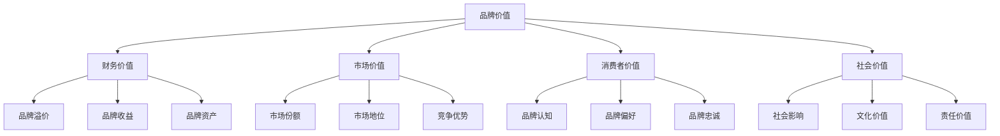
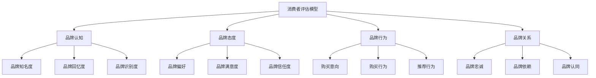
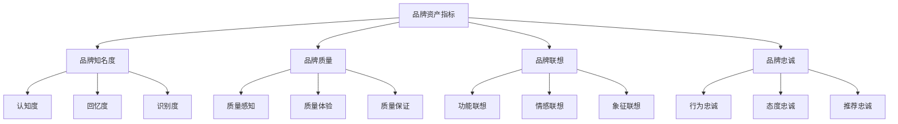
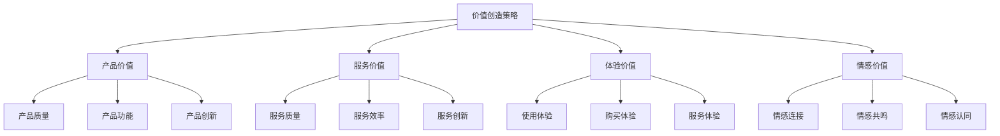

# 品牌价值评估

## 品牌价值评估概述

### 定义与本质
**品牌价值评估**：通过科学的方法和工具，对品牌资产进行量化评估，衡量品牌对企业价值的贡献程度。

### 品牌价值构成

## 品牌价值评估理论

### 品牌价值评估模型
#### 1. 财务评估模型
| 模型类型 | 核心方法 | 适用场景 | 优势 | 劣势 |
|----------|----------|----------|------|------|
| **成本法** | 品牌建设成本 | 新品牌评估 | 客观性强 | 忽略市场价值 |
| **市场法** | 市场交易价格 | 品牌交易 | 市场导向 | 数据获取困难 |
| **收益法** | 未来收益现值 | 成熟品牌 | 价值导向 | 预测难度大 |

#### 2. 消费者评估模型

### 品牌价值评估方法
#### 1. 财务评估方法
- **品牌溢价法**：品牌溢价能力评估
- **品牌收益法**：品牌收益贡献评估
- **品牌资产法**：品牌资产价值评估
- **品牌交易法**：品牌交易价格评估

#### 2. 市场评估方法
- **市场份额法**：市场份额贡献评估
- **市场地位法**：市场地位价值评估
- **竞争优势法**：竞争优势价值评估
- **市场增长法**：市场增长贡献评估

#### 3. 消费者评估方法
- **品牌认知法**：品牌认知价值评估
- **品牌态度法**：品牌态度价值评估
- **品牌行为法**：品牌行为价值评估
- **品牌关系法**：品牌关系价值评估

## 品牌价值评估指标

### 财务指标
#### 1. 品牌收益指标
| 指标名称 | 计算方法 | 评估意义 | 应用场景 |
|----------|----------|----------|----------|
| **品牌收益** | 品牌相关收入 | 品牌收入贡献 | 收入分析 |
| **品牌利润率** | 品牌利润/品牌收入 | 品牌盈利能力 | 盈利能力分析 |
| **品牌ROI** | 品牌收益/品牌投资 | 品牌投资回报 | 投资回报分析 |
| **品牌价值增长率** | 当期价值/上期价值-1 | 品牌价值增长 | 增长趋势分析 |

#### 2. 品牌资产指标

### 市场指标
#### 1. 市场份额指标
- **品牌市场份额**：品牌市场占有率
- **品牌增长份额**：品牌增长贡献率
- **品牌渗透率**：品牌市场渗透率
- **品牌覆盖率**：品牌市场覆盖率

#### 2. 竞争地位指标
- **品牌排名**：品牌市场排名
- **品牌地位**：品牌市场地位
- **品牌影响力**：品牌市场影响力
- **品牌话语权**：品牌市场话语权

### 消费者指标
#### 1. 品牌认知指标
| 指标类型 | 具体指标 | 测量方法 | 评估意义 |
|----------|----------|----------|----------|
| **知名度指标** | 品牌知名度、回忆度 | 问卷调查 | 品牌认知程度 |
| **识别度指标** | 品牌识别度、区分度 | 品牌识别测试 | 品牌识别能力 |
| **联想度指标** | 品牌联想、关联度 | 自由联想测试 | 品牌联想强度 |

#### 2. 品牌态度指标
- **品牌偏好**：品牌偏好程度
- **品牌满意度**：品牌满意度
- **品牌信任度**：品牌信任程度
- **品牌推荐度**：品牌推荐意愿

## 品牌价值评估实施

### 评估流程
#### 1. 评估准备

#### 2. 数据收集
- **财务数据**：品牌相关财务数据
- **市场数据**：品牌市场表现数据
- **消费者数据**：品牌消费者数据
- **竞争数据**：竞争对手品牌数据

#### 3. 数据分析
- **定量分析**：数据统计分析
- **定性分析**：质性数据分析
- **对比分析**：历史对比分析
- **竞品分析**：竞争对手对比

#### 4. 价值计算
- **财务价值计算**：财务价值量化
- **市场价值计算**：市场价值量化
- **消费者价值计算**：消费者价值量化
- **综合价值计算**：综合价值评估

### 评估工具
#### 1. 财务评估工具
- **DCF模型**：现金流折现模型
- **EVA模型**：经济增加值模型
- **ROI模型**：投资回报率模型
- **NPV模型**：净现值模型

#### 2. 市场评估工具
- **市场调研**：市场调研工具
- **竞品分析**：竞争对手分析工具
- **趋势分析**：市场趋势分析工具
- **预测模型**：市场预测模型

#### 3. 消费者评估工具
- **问卷调查**：消费者问卷调查
- **深度访谈**：消费者深度访谈
- **焦点小组**：消费者焦点小组
- **行为分析**：消费者行为分析

## 品牌价值评估案例

### 成功案例：可口可乐品牌价值评估
#### 评估方法
- **财务评估**：品牌收益贡献评估
- **市场评估**：市场份额价值评估
- **消费者评估**：品牌认知价值评估

#### 评估结果
- **品牌价值**：全球品牌价值排名前列
- **财务贡献**：品牌收益贡献显著
- **市场地位**：全球市场领导地位
- **消费者价值**：消费者认知价值高

#### 成功因素
- 科学的评估方法
- 全面的数据收集
- 专业的评估团队
- 持续的评估更新

### 失败案例：品牌价值评估偏差
#### 问题分析
- 评估方法不当
- 数据收集不全
- 分析过程错误
- 结果应用不当

#### 改进建议
- 选择合适方法
- 完善数据收集
- 规范分析过程
- 正确应用结果

## 品牌价值管理

### 价值提升策略
#### 1. 品牌建设策略
- **品牌定位**：清晰品牌定位
- **品牌传播**：有效品牌传播
- **品牌体验**：优化品牌体验
- **品牌创新**：持续品牌创新

#### 2. 价值创造策略

### 价值保护策略
#### 1. 品牌保护
- **商标保护**：商标注册保护
- **专利保护**：专利技术保护
- **版权保护**：版权内容保护
- **商业秘密**：商业秘密保护

#### 2. 品牌维护
- **品牌监控**：品牌形象监控
- **品牌危机**：品牌危机管理
- **品牌更新**：品牌形象更新
- **品牌优化**：品牌管理优化

## 品牌价值评估趋势

### 数字化评估
#### 趋势特征
- **数据驱动**：数据驱动评估
- **实时评估**：实时价值评估
- **智能化**：智能化评估工具
- **个性化**：个性化评估方法

#### 实施要点
- 数据收集自动化
- 评估模型智能化
- 结果分析可视化
- 决策支持实时化

### 可持续发展评估
#### 趋势特征
- **ESG评估**：环境、社会、治理评估
- **可持续发展**：可持续发展价值
- **社会责任**：社会责任价值
- **长期价值**：长期价值创造

#### 实施要点
- ESG指标纳入
- 可持续发展评估
- 社会责任评估
- 长期价值评估

## 实践应用

### 品牌价值评估实施步骤
1. **评估规划**：制定评估计划
2. **数据收集**：收集评估数据
3. **方法选择**：选择评估方法
4. **价值计算**：计算品牌价值
5. **结果分析**：分析评估结果
6. **报告撰写**：撰写评估报告
7. **结果应用**：应用评估结果
8. **持续评估**：持续价值评估

### 品牌价值评估最佳实践
- **科学方法**：采用科学评估方法
- **全面数据**：收集全面评估数据
- **专业团队**：组建专业评估团队
- **持续更新**：持续更新评估结果
- **结果应用**：有效应用评估结果

---

**相关链接**：
- [[01-品牌定位策略|品牌定位策略]]
- [[02-品牌传播策略|品牌传播策略]]
- [[03-品牌管理策略|品牌管理策略]]
- [[06-营销效果评估/01-营销指标/02-ROI计算方法|ROI计算方法]]
- [[06-营销效果评估/02-数据分析/01-营销数据分析|营销数据分析]]
