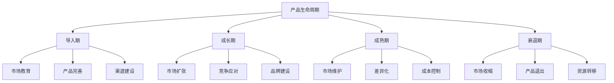
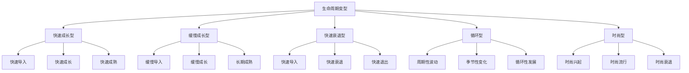
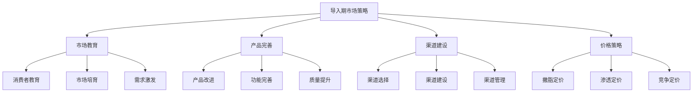
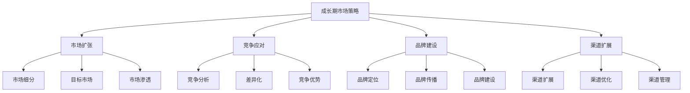
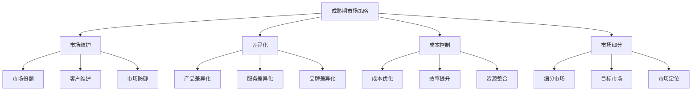
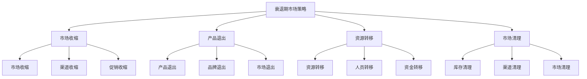
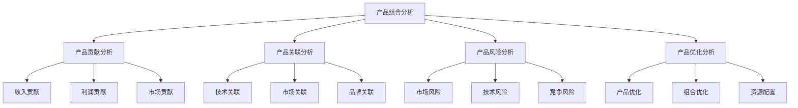
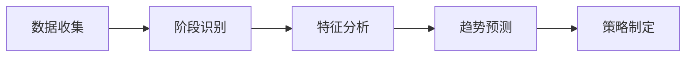
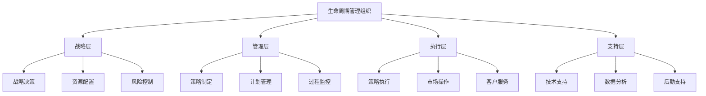

# 产品生命周期管理

## 产品生命周期概述

### 定义与本质
**产品生命周期**：产品从进入市场到退出市场的全过程，包括导入期、成长期、成熟期和衰退期四个阶段。

### 生命周期阶段特征

## 产品生命周期理论

### 生命周期模型
#### 1. 标准生命周期模型
| 阶段 | 特征 | 目标 | 策略重点 | 风险 |
|------|------|------|----------|------|
| **导入期** | 销量低、成本高、亏损 | 市场接受 | 市场教育、产品完善 | 市场不接受 |
| **成长期** | 销量快速增长、利润上升 | 市场扩张 | 渠道建设、品牌建设 | 竞争加剧 |
| **成熟期** | 销量稳定、利润最大化 | 市场维护 | 差异化、成本控制 | 市场饱和 |
| **衰退期** | 销量下降、利润减少 | 市场退出 | 市场收缩、资源转移 | 市场消失 |

#### 2. 生命周期变型

### 生命周期影响因素
#### 1. 内部因素
- **产品特性**：产品创新程度、技术含量
- **企业能力**：研发能力、营销能力、资金实力
- **战略选择**：市场定位、竞争策略、资源配置

#### 2. 外部因素
- **市场环境**：市场需求、竞争状况、技术发展
- **宏观环境**：经济环境、政策环境、社会环境
- **行业环境**：行业生命周期、行业竞争、行业技术

## 各阶段管理策略

### 导入期管理策略
#### 1. 市场策略

#### 2. 营销策略
- **产品策略**：产品完善、功能优化
- **价格策略**：撇脂定价或渗透定价
- **渠道策略**：选择性渠道建设
- **促销策略**：市场教育、产品推广

#### 3. 管理重点
- **市场接受度**：提高市场接受度
- **产品完善**：持续产品完善
- **渠道建设**：建立销售渠道
- **品牌建设**：建立品牌认知

### 成长期管理策略
#### 1. 市场策略

#### 2. 营销策略
- **产品策略**：产品线扩展、功能增强
- **价格策略**：竞争定价、价值定价
- **渠道策略**：渠道扩展、渠道优化
- **促销策略**：品牌建设、市场推广

#### 3. 管理重点
- **市场扩张**：快速市场扩张
- **竞争应对**：应对竞争挑战
- **品牌建设**：强化品牌建设
- **渠道建设**：完善渠道体系

### 成熟期管理策略
#### 1. 市场策略

#### 2. 营销策略
- **产品策略**：产品改进、功能优化
- **价格策略**：竞争定价、促销定价
- **渠道策略**：渠道优化、渠道管理
- **促销策略**：促销活动、客户维护

#### 3. 管理重点
- **市场维护**：维护市场份额
- **差异化**：建立差异化优势
- **成本控制**：控制产品成本
- **客户维护**：维护客户关系

### 衰退期管理策略
#### 1. 市场策略

#### 2. 营销策略
- **产品策略**：产品退出、库存清理
- **价格策略**：清仓定价、促销定价
- **渠道策略**：渠道收缩、渠道清理
- **促销策略**：清仓促销、市场清理

#### 3. 管理重点
- **市场收缩**：有序市场收缩
- **产品退出**：有序产品退出
- **资源转移**：资源有效转移
- **市场清理**：市场清理完成

## 生命周期管理工具

### 1. 生命周期分析工具
#### 波士顿矩阵
| 象限 | 特征 | 策略 | 管理重点 |
|------|------|------|----------|
| **明星产品** | 高增长、高份额 | 投资发展 | 市场扩张 |
| **现金牛产品** | 低增长、高份额 | 收获利润 | 成本控制 |
| **问题产品** | 高增长、低份额 | 选择性投资 | 市场分析 |
| **瘦狗产品** | 低增长、低份额 | 退出市场 | 资源转移 |

#### 产品组合分析

### 2. 生命周期预测工具
#### 趋势分析
- **时间序列分析**：历史数据分析
- **回归分析**：变量关系分析
- **预测模型**：未来趋势预测
- **情景分析**：不同情景分析

#### 市场分析
- **市场调研**：市场现状调研
- **竞争分析**：竞争对手分析
- **技术分析**：技术发展趋势
- **需求分析**：市场需求分析

## 生命周期管理实施

### 管理流程
#### 1. 生命周期识别

#### 2. 策略制定
- **阶段分析**：分析当前阶段特征
- **策略选择**：选择适合的策略
- **计划制定**：制定实施计划
- **资源配置**：配置所需资源

#### 3. 策略实施
- **计划执行**：执行实施计划
- **过程监控**：监控实施过程
- **效果评估**：评估实施效果
- **策略调整**：调整实施策略

### 管理组织
#### 1. 组织架构

#### 2. 职责分工
- **战略层**：生命周期战略决策
- **管理层**：生命周期管理执行
- **执行层**：生命周期策略执行
- **支持层**：生命周期管理支持

## 生命周期管理案例

### 成功案例：iPhone生命周期管理
#### 管理策略
- **导入期**：市场教育、产品完善
- **成长期**：市场扩张、品牌建设
- **成熟期**：市场维护、差异化
- **衰退期**：产品升级、市场转移

#### 实施要点
- 持续产品创新
- 有效市场教育
- 强大品牌建设
- 精准市场定位

#### 成功因素
- 持续产品创新
- 有效生命周期管理
- 强大品牌影响力
- 精准市场策略

### 失败案例：生命周期管理不当
#### 问题分析
- 阶段识别错误
- 策略选择不当
- 执行管理不力
- 效果评估缺失

#### 改进建议
- 准确阶段识别
- 合理策略选择
- 有效执行管理
- 完善效果评估

## 生命周期管理趋势

### 数字化管理
#### 趋势特征
- **数据驱动**：数据驱动管理
- **实时监控**：实时生命周期监控
- **智能化**：智能化管理工具
- **预测性**：预测性管理

#### 实施要点
- 数据收集自动化
- 监控系统实时化
- 管理工具智能化
- 预测模型精准化

### 可持续发展管理
#### 趋势特征
- **环保理念**：环保生命周期管理
- **资源优化**：资源优化配置
- **循环经济**：循环经济模式
- **社会责任**：社会责任承担

#### 实施要点
- 环保理念融入
- 资源优化配置
- 循环经济模式
- 社会责任承担

## 实践应用

### 生命周期管理实施步骤
1. **现状分析**：分析产品现状
2. **阶段识别**：识别生命周期阶段
3. **策略制定**：制定管理策略
4. **计划制定**：制定实施计划
5. **资源配置**：配置所需资源
6. **策略实施**：实施管理策略
7. **效果评估**：评估管理效果
8. **策略调整**：调整管理策略

### 生命周期管理最佳实践
- **科学分析**：科学分析生命周期
- **合理策略**：制定合理管理策略
- **有效执行**：有效执行管理策略
- **持续优化**：持续优化管理效果
- **风险控制**：有效控制管理风险

---

**相关链接**：
- [[02-产品组合策略|产品组合策略]]
- [[03-新产品开发策略|新产品开发策略]]
- [[04-产品创新策略|产品创新策略]]
- [[03-营销理论框架/01-经典营销理论/01-4P营销理论|4P营销理论]]
- [[06-营销效果评估/02-数据分析/03-市场趋势分析|市场趋势分析]]
