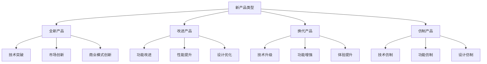
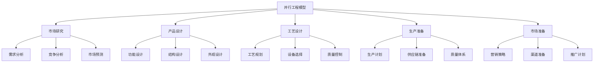
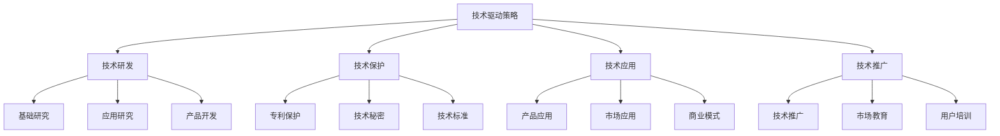
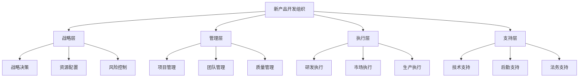
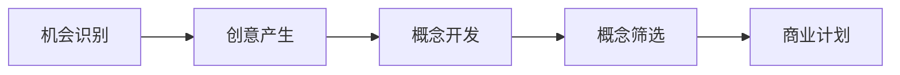
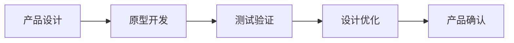
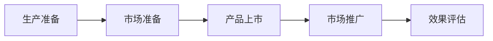

# 新产品开发策略

## 新产品开发概述

### 定义与本质
**新产品开发**：企业为满足市场需求、提升竞争力、实现增长目标，通过系统性的创新过程，开发出具有新功能、新特性或新价值的产品。

### 新产品类型

## 新产品开发理论

### 开发流程模型
#### 1. 阶段-门模型
| 阶段 | 内容 | 目标 | 关键活动 | 决策点 |
|------|------|------|----------|--------|
| **发现** | 机会识别、创意产生 | 发现机会 | 市场调研、创意收集 | 机会评估 |
| **筛选** | 概念筛选、初步评估 | 筛选概念 | 概念测试、可行性分析 | 概念选择 |
| **开发** | 产品设计、原型开发 | 产品开发 | 设计开发、原型测试 | 设计确认 |
| **测试** | 市场测试、产品测试 | 产品验证 | 市场测试、用户测试 | 市场验证 |
| **上市** | 产品上市、市场推广 | 市场成功 | 生产准备、市场推广 | 上市决策 |

#### 2. 并行工程模型

### 开发成功因素
#### 1. 内部因素
| 因素类型 | 具体内容 | 重要性 | 影响程度 |
|----------|----------|--------|----------|
| **技术能力** | 研发能力、技术积累 | 高 | 直接影响 |
| **市场能力** | 市场洞察、营销能力 | 高 | 直接影响 |
| **管理能力** | 项目管理、组织能力 | 中 | 间接影响 |
| **资源能力** | 资金、人才、设备 | 中 | 间接影响 |

#### 2. 外部因素
- **市场需求**：市场需求强度、变化趋势
- **竞争环境**：竞争激烈程度、竞争策略
- **技术环境**：技术发展水平、技术趋势
- **政策环境**：政策支持、法规要求

## 新产品开发策略

### 1. 技术驱动策略
#### 策略特征
- **技术领先**：技术领先优势
- **创新突破**：技术创新突破
- **专利保护**：专利技术保护
- **技术壁垒**：技术壁垒建立

#### 实施要点

### 2. 市场驱动策略
#### 策略特征
- **需求导向**：市场需求导向
- **用户中心**：用户需求中心
- **市场细分**：精准市场细分
- **价值创造**：用户价值创造

#### 实施要点
- **需求洞察**：深度需求洞察
- **用户研究**：用户行为研究
- **市场验证**：市场需求验证
- **价值传递**：价值有效传递

### 3. 竞争驱动策略
#### 策略特征
- **竞争应对**：应对竞争挑战
- **差异化**：建立差异化优势
- **快速响应**：快速市场响应
- **成本优势**：建立成本优势

#### 实施要点
- **竞争分析**：深度竞争分析
- **差异化设计**：差异化产品设计
- **快速开发**：快速产品开发
- **成本控制**：有效成本控制

### 4. 合作驱动策略
#### 策略特征
- **开放创新**：开放创新模式
- **合作开发**：合作产品开发
- **资源共享**：资源共享利用
- **风险分担**：风险共同分担

#### 实施要点
- **合作伙伴**：选择合适伙伴
- **合作模式**：设计合作模式
- **资源共享**：实现资源共享
- **风险控制**：控制合作风险

## 新产品开发管理

### 开发组织
#### 1. 组织架构

#### 2. 团队建设
- **跨职能团队**：跨部门协作团队
- **专业团队**：专业领域团队
- **项目团队**：项目执行团队
- **支持团队**：支持服务团队

### 开发流程
#### 1. 前端流程

#### 2. 开发流程

#### 3. 后端流程

### 开发工具
#### 1. 创意工具
- **头脑风暴**：创意激发工具
- **思维导图**：思维整理工具
- **设计思维**：设计创新工具
- **用户画像**：用户分析工具

#### 2. 开发工具
- **CAD设计**：计算机辅助设计
- **仿真软件**：产品仿真工具
- **项目管理**：项目管理工具
- **协作平台**：团队协作工具

#### 3. 测试工具
- **用户测试**：用户测试工具
- **市场测试**：市场测试工具
- **质量测试**：质量测试工具
- **性能测试**：性能测试工具

## 新产品开发实施

### 实施步骤
#### 1. 前期准备
- **战略规划**：制定开发战略
- **资源准备**：准备开发资源
- **团队组建**：组建开发团队
- **流程设计**：设计开发流程

#### 2. 开发执行
- **机会识别**：识别市场机会
- **创意开发**：开发产品创意
- **概念设计**：设计产品概念
- **产品开发**：开发产品原型

#### 3. 测试验证
- **原型测试**：测试产品原型
- **用户测试**：用户测试验证
- **市场测试**：市场测试验证
- **技术验证**：技术可行性验证

#### 4. 产品上市
- **生产准备**：准备产品生产
- **市场准备**：准备市场推广
- **产品上市**：产品正式上市
- **效果评估**：评估上市效果

### 实施管理
#### 1. 项目管理
- **项目规划**：制定项目计划
- **进度控制**：控制项目进度
- **质量控制**：控制产品质量
- **成本控制**：控制项目成本

#### 2. 风险管理
- **风险识别**：识别项目风险
- **风险评估**：评估风险影响
- **风险应对**：制定应对策略
- **风险监控**：监控风险变化

#### 3. 质量管理
- **质量标准**：制定质量标准
- **质量控制**：控制产品质量
- **质量改进**：持续质量改进
- **质量保证**：保证产品质量

## 新产品开发案例

### 成功案例：iPhone开发
#### 开发策略
- **技术驱动**：技术领先优势
- **用户中心**：用户体验中心
- **生态建设**：生态系统建设
- **持续创新**：持续产品创新

#### 实施要点
- 技术突破创新
- 用户体验优化
- 生态系统建设
- 持续产品迭代

#### 成功因素
- 强大的技术实力
- 深度的用户洞察
- 完整的生态系统
- 持续的创新能力

### 失败案例：新产品开发失败
#### 问题分析
- 市场需求不足
- 技术实现困难
- 成本控制不当
- 市场推广不力

#### 改进建议
- 深入市场调研
- 技术可行性验证
- 合理成本控制
- 有效市场推广

## 新产品开发趋势

### 数字化开发
#### 趋势特征
- **数字化设计**：数字化产品设计
- **虚拟测试**：虚拟产品测试
- **智能制造**：智能制造生产
- **数字营销**：数字化营销推广

#### 实施要点
- 数字化设计工具
- 虚拟测试技术
- 智能制造系统
- 数字营销平台

### 可持续发展
#### 趋势特征
- **绿色设计**：环保产品设计
- **循环经济**：循环经济模式
- **资源节约**：资源节约利用
- **社会责任**：社会责任承担

#### 实施要点
- 绿色设计理念
- 循环经济模式
- 资源节约技术
- 社会责任实践

## 实践应用

### 新产品开发实施步骤
1. **战略规划**：制定开发战略
2. **机会识别**：识别市场机会
3. **创意开发**：开发产品创意
4. **概念设计**：设计产品概念
5. **产品开发**：开发产品原型
6. **测试验证**：测试验证产品
7. **产品上市**：产品正式上市
8. **效果评估**：评估开发效果

### 新产品开发最佳实践
- **用户中心**：以用户为中心
- **技术驱动**：技术驱动创新
- **市场导向**：市场导向开发
- **持续改进**：持续改进优化
- **风险控制**：有效风险控制

---

**相关链接**：
- [[01-产品生命周期管理|产品生命周期管理]]
- [[02-产品组合策略|产品组合策略]]
- [[04-产品创新策略|产品创新策略]]
- [[03-营销理论框架/01-经典营销理论/01-4P营销理论|4P营销理论]]
- [[06-营销效果评估/02-数据分析/01-营销数据分析|营销数据分析]]
