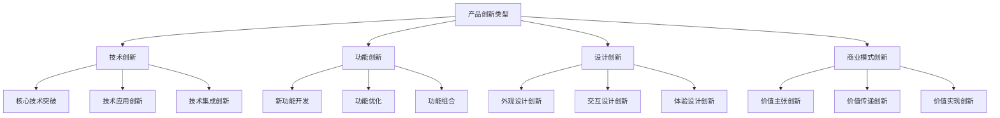
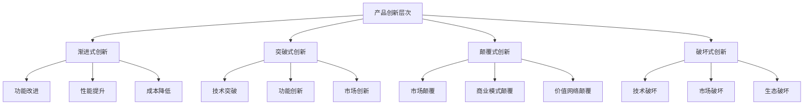
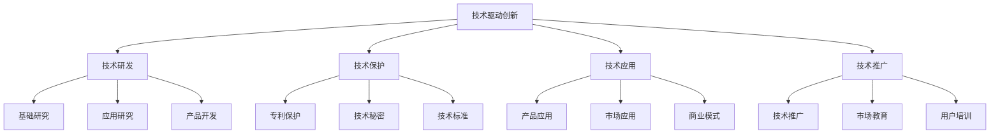
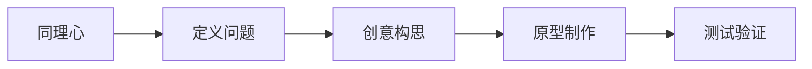
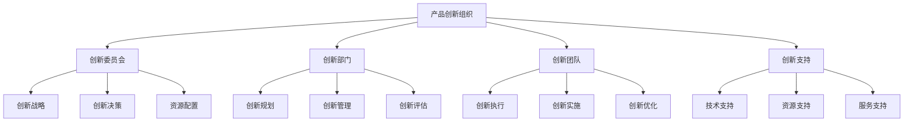
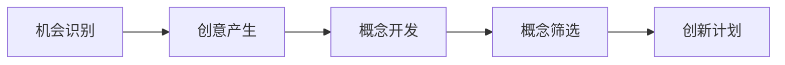
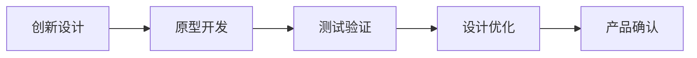
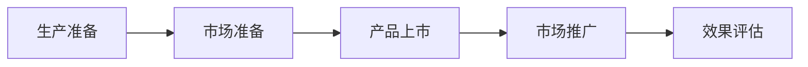

# 产品创新策略

## 产品创新概述

### 定义与本质
**产品创新**：通过技术创新、设计创新、功能创新等方式，开发出具有新功能、新特性、新价值的产品，满足市场需求，提升竞争优势。

### 创新类型

## 产品创新理论

### 创新理论发展
| 理论 | 代表人物 | 核心观点 | 应用价值 |
|------|----------|----------|----------|
| **技术创新理论** | 熊彼特 | 创新是经济发展的动力 | 技术创新驱动 |
| **颠覆性创新理论** | 克里斯坦森 | 颠覆性创新改变市场 | 市场颠覆策略 |
| **开放式创新理论** | 切萨布鲁夫 | 开放创新模式 | 合作创新策略 |
| **设计思维理论** | IDEO | 以人为中心的设计 | 用户体验创新 |

### 创新层次模型

### 创新成功因素
#### 1. 内部因素
| 因素类型 | 具体内容 | 重要性 | 影响程度 |
|----------|----------|--------|----------|
| **创新能力** | 研发能力、技术积累 | 高 | 直接影响 |
| **创新文化** | 创新氛围、创新激励 | 高 | 直接影响 |
| **创新资源** | 资金、人才、设备 | 中 | 间接影响 |
| **创新管理** | 创新流程、创新组织 | 中 | 间接影响 |

#### 2. 外部因素
- **市场需求**：市场需求强度、变化趋势
- **技术环境**：技术发展水平、技术趋势
- **竞争环境**：竞争激烈程度、竞争策略
- **政策环境**：政策支持、法规要求

## 产品创新策略

### 1. 技术驱动创新策略
#### 策略特征
- **技术领先**：技术领先优势
- **专利保护**：专利技术保护
- **技术壁垒**：技术壁垒建立
- **技术标准**：技术标准制定

#### 实施要点

### 2. 用户驱动创新策略
#### 策略特征
- **用户中心**：用户需求中心
- **用户参与**：用户参与创新
- **用户反馈**：用户反馈驱动
- **用户体验**：用户体验优化

#### 实施要点
- **用户洞察**：深度用户洞察
- **用户研究**：用户行为研究
- **用户参与**：用户参与设计
- **用户反馈**：用户反馈收集

### 3. 市场驱动创新策略
#### 策略特征
- **市场导向**：市场需求导向
- **竞争应对**：应对竞争挑战
- **市场细分**：精准市场细分
- **价值创造**：市场价值创造

#### 实施要点
- **市场分析**：深度市场分析
- **竞争分析**：竞争环境分析
- **需求洞察**：市场需求洞察
- **价值设计**：价值主张设计

### 4. 合作驱动创新策略
#### 策略特征
- **开放创新**：开放创新模式
- **合作创新**：合作产品创新
- **资源共享**：资源共享利用
- **风险分担**：风险共同分担

#### 实施要点
- **合作伙伴**：选择合适伙伴
- **合作模式**：设计合作模式
- **资源共享**：实现资源共享
- **风险控制**：控制合作风险

## 产品创新方法

### 1. 设计思维方法
#### 方法步骤

#### 实施要点
- **同理心**：深度理解用户
- **问题定义**：准确定义问题
- **创意构思**：多方案创意
- **原型制作**：快速原型制作
- **测试验证**：用户测试验证

### 2. 精益创新方法
#### 方法特征
- **快速验证**：快速假设验证
- **最小可行产品**：MVP开发
- **迭代优化**：持续迭代优化
- **数据驱动**：数据驱动决策

#### 实施要点
- **假设验证**：快速假设验证
- **MVP开发**：最小可行产品
- **迭代优化**：持续迭代优化
- **数据收集**：数据收集分析

### 3. 蓝海创新方法
#### 方法特征
- **价值创新**：价值创新创造
- **市场创造**：新市场创造
- **差异化**：差异化竞争
- **成本控制**：成本有效控制

#### 实施要点
- **价值创新**：价值创新设计
- **市场分析**：市场机会分析
- **差异化策略**：差异化策略制定
- **成本优化**：成本结构优化

### 4. 开放式创新方法
#### 方法特征
- **外部资源**：利用外部资源
- **合作创新**：合作产品创新
- **知识共享**：知识共享利用
- **创新网络**：创新网络建设

#### 实施要点
- **外部合作**：外部合作伙伴
- **知识管理**：知识管理系统
- **创新平台**：创新平台建设
- **网络管理**：创新网络管理

## 产品创新管理

### 创新组织
#### 1. 组织架构

#### 2. 团队建设
- **跨职能团队**：跨部门协作团队
- **专业团队**：专业领域团队
- **项目团队**：项目执行团队
- **支持团队**：支持服务团队

### 创新流程
#### 1. 创新前端流程

#### 2. 创新开发流程

#### 3. 创新后端流程

### 创新工具
#### 1. 创意工具
- **头脑风暴**：创意激发工具
- **思维导图**：思维整理工具
- **设计思维**：设计创新工具
- **用户画像**：用户分析工具

#### 2. 开发工具
- **CAD设计**：计算机辅助设计
- **仿真软件**：产品仿真工具
- **项目管理**：项目管理工具
- **协作平台**：团队协作工具

#### 3. 测试工具
- **用户测试**：用户测试工具
- **市场测试**：市场测试工具
- **质量测试**：质量测试工具
- **性能测试**：性能测试工具

## 产品创新实施

### 实施步骤
#### 1. 创新规划
- **创新战略**：制定创新战略
- **创新目标**：设定创新目标
- **创新计划**：制定创新计划
- **资源配置**：配置创新资源

#### 2. 创新执行
- **机会识别**：识别创新机会
- **创意开发**：开发创新创意
- **概念设计**：设计创新概念
- **产品开发**：开发创新产品

#### 3. 创新验证
- **原型测试**：测试产品原型
- **用户测试**：用户测试验证
- **市场测试**：市场测试验证
- **技术验证**：技术可行性验证

#### 4. 创新上市
- **生产准备**：准备产品生产
- **市场准备**：准备市场推广
- **产品上市**：产品正式上市
- **效果评估**：评估创新效果

### 实施管理
#### 1. 创新管理
- **创新规划**：制定创新规划
- **创新执行**：执行创新计划
- **创新监控**：监控创新过程
- **创新评估**：评估创新效果

#### 2. 风险管理
- **风险识别**：识别创新风险
- **风险评估**：评估风险影响
- **风险应对**：制定应对策略
- **风险监控**：监控风险变化

#### 3. 质量管理
- **质量标准**：制定质量标准
- **质量控制**：控制产品质量
- **质量改进**：持续质量改进
- **质量保证**：保证产品质量

## 产品创新案例

### 成功案例：特斯拉产品创新
#### 创新策略
- **技术驱动**：技术领先优势
- **用户中心**：用户体验中心
- **生态建设**：生态系统建设
- **持续创新**：持续产品创新

#### 实施要点
- 技术突破创新
- 用户体验优化
- 生态系统建设
- 持续产品迭代

#### 成功因素
- 强大的技术实力
- 深度的用户洞察
- 完整的生态系统
- 持续的创新能力

### 失败案例：产品创新失败
#### 问题分析
- 市场需求不足
- 技术实现困难
- 成本控制不当
- 市场推广不力

#### 改进建议
- 深入市场调研
- 技术可行性验证
- 合理成本控制
- 有效市场推广

## 产品创新趋势

### 数字化创新
#### 趋势特征
- **数字化设计**：数字化产品设计
- **虚拟测试**：虚拟产品测试
- **智能制造**：智能制造生产
- **数字营销**：数字化营销推广

#### 实施要点
- 数字化设计工具
- 虚拟测试技术
- 智能制造系统
- 数字营销平台

### 可持续发展创新
#### 趋势特征
- **绿色设计**：环保产品设计
- **循环经济**：循环经济模式
- **资源节约**：资源节约利用
- **社会责任**：社会责任承担

#### 实施要点
- 绿色设计理念
- 循环经济模式
- 资源节约技术
- 社会责任实践

## 实践应用

### 产品创新实施步骤
1. **创新规划**：制定创新战略
2. **机会识别**：识别创新机会
3. **创意开发**：开发创新创意
4. **概念设计**：设计创新概念
5. **产品开发**：开发创新产品
6. **测试验证**：测试验证产品
7. **产品上市**：产品正式上市
8. **效果评估**：评估创新效果

### 产品创新最佳实践
- **用户中心**：以用户为中心
- **技术驱动**：技术驱动创新
- **市场导向**：市场导向创新
- **持续改进**：持续改进优化
- **风险控制**：有效风险控制

---

**相关链接**：
- [[01-产品生命周期管理|产品生命周期管理]]
- [[02-产品组合策略|产品组合策略]]
- [[03-新产品开发策略|新产品开发策略]]
- [[03-营销理论框架/01-经典营销理论/01-4P营销理论|4P营销理论]]
- [[07-营销创新趋势/01-新兴技术/01-AI营销应用|AI营销应用]]
