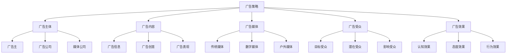
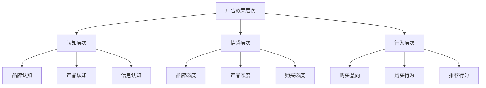
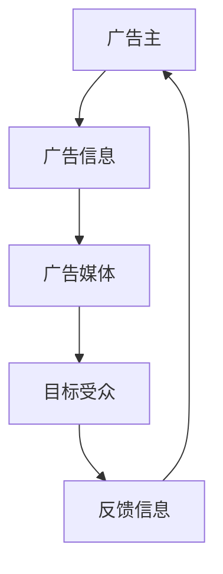
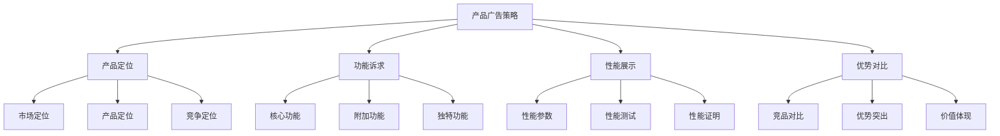
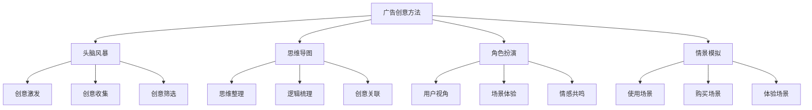
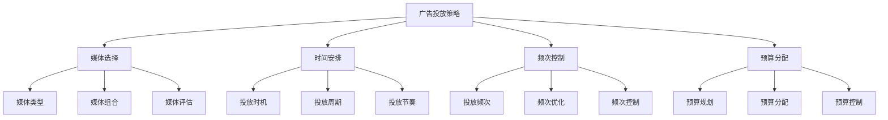

# 广告策略

## 广告策略概述

### 定义与本质
**广告策略**：通过付费的大众传播媒体，向目标受众传递产品信息，影响消费者认知、态度和行为，实现营销目标的策略性活动。

### 广告要素模型

## 广告理论

### 广告理论发展
| 理论 | 代表人物 | 核心观点 | 应用价值 |
|------|----------|----------|----------|
| **AIDA理论** | 刘易斯 | 注意-兴趣-欲望-行动 | 广告效果评估 |
| **USP理论** | 罗瑟·瑞夫斯 | 独特销售主张 | 广告定位策略 |
| **品牌形象理论** | 大卫·奥格威 | 品牌形象塑造 | 品牌广告策略 |
| **定位理论** | 艾·里斯、杰克·特劳特 | 心智定位 | 广告定位策略 |

### 广告效果层次

### 广告传播模式
#### 1. 线性传播模式

#### 2. 互动传播模式

## 广告策略类型

### 1. 产品广告策略
#### 策略特征
- **产品导向**：突出产品特性
- **功能诉求**：强调产品功能
- **性能展示**：展示产品性能
- **优势对比**：对比产品优势

#### 实施要点

### 2. 品牌广告策略
#### 策略特征
- **品牌导向**：突出品牌价值
- **形象塑造**：塑造品牌形象
- **情感诉求**：情感连接诉求
- **文化传播**：品牌文化传播

#### 实施要点
- **品牌定位**：清晰品牌定位
- **形象设计**：设计品牌形象
- **情感连接**：建立情感连接
- **文化传播**：传播品牌文化

### 3. 促销广告策略
#### 策略特征
- **促销导向**：突出促销信息
- **价格诉求**：强调价格优势
- **限时优惠**：限时优惠信息
- **行动号召**：明确行动号召

#### 实施要点
- **促销信息**：突出促销信息
- **价格优势**：强调价格优势
- **限时优惠**：限时优惠信息
- **行动号召**：明确行动号召

### 4. 公益广告策略
#### 策略特征
- **公益导向**：突出公益价值
- **社会责任**：承担社会责任
- **价值传播**：传播价值观念
- **形象提升**：提升企业形象

#### 实施要点
- **公益主题**：选择公益主题
- **社会责任**：承担社会责任
- **价值传播**：传播价值观念
- **形象提升**：提升企业形象

## 广告媒体策略

### 传统媒体
#### 1. 电视广告
| 特点 | 优势 | 劣势 | 适用场景 |
|------|------|------|----------|
| **覆盖面广** | 视觉冲击强、可信度高 | 成本高、互动性差 | 品牌知名度建设 |
| **影响力大** | 传播效果好、记忆度高 | 制作成本高、时效性差 | 产品推广 |
| **可信度高** | 权威性强、说服力强 | 投放灵活性差 | 企业形象塑造 |

#### 2. 广播广告
| 特点 | 优势 | 劣势 | 适用场景 |
|------|------|------|----------|
| **成本低** | 成本效益高、灵活性好 | 视觉冲击弱、记忆度低 | 本地市场推广 |
| **覆盖面广** | 传播范围广、受众广泛 | 信息承载量小 | 产品促销 |
| **时效性强** | 传播速度快、实时性强 | 保存性差 | 活动推广 |

#### 3. 平面广告
| 特点 | 优势 | 劣势 | 适用场景 |
|------|------|------|----------|
| **信息承载量大** | 信息详细、可信度高 | 互动性差、时效性弱 | 产品详细介绍 |
| **保存性好** | 可重复阅读、保存时间长 | 传播速度慢 | 品牌形象展示 |
| **针对性强** | 目标受众精准、成本可控 | 覆盖面有限 | 专业市场推广 |

#### 4. 户外广告
| 特点 | 优势 | 劣势 | 适用场景 |
|------|------|------|----------|
| **覆盖面广** | 重复曝光、成本效益高 | 信息承载量小、互动性差 | 品牌形象展示 |
| **视觉冲击强** | 视觉效果好、记忆度高 | 目标受众不精准 | 产品推广 |
| **成本效益高** | 成本相对较低、效果持久 | 环境限制多 | 本地市场推广 |

### 数字媒体
#### 1. 网络广告
- **搜索引擎广告**：精准投放、效果可测
- **展示广告**：视觉冲击强、覆盖面广
- **视频广告**：内容丰富、互动性强
- **移动广告**：精准定位、互动性强

#### 2. 社交媒体广告
- **微博广告**：传播速度快、互动性强
- **微信广告**：精准投放、社交属性强
- **抖音广告**：内容丰富、传播效果好
- **小红书广告**：生活方式、影响力强

## 广告创意策略

### 创意原则
#### 1. 创意原则
- **原创性**：创意独特、新颖
- **相关性**：与产品、品牌相关
- **冲击性**：视觉冲击、情感冲击
- **记忆性**：易于记忆、印象深刻

#### 2. 创意方法

### 创意表现
#### 1. 表现手法
- **对比手法**：产品对比、效果对比
- **夸张手法**：功能夸张、效果夸张
- **幽默手法**：幽默表达、轻松氛围
- **情感手法**：情感诉求、情感连接

#### 2. 表现元素
- **视觉元素**：色彩、图形、文字
- **听觉元素**：音乐、音效、语音
- **触觉元素**：材质、质感、包装
- **嗅觉元素**：香味、气味、环境

## 广告投放策略

### 投放计划
#### 1. 投放目标
- **认知目标**：提高品牌认知度
- **态度目标**：改善品牌态度
- **行为目标**：促进购买行为
- **销售目标**：提升销售业绩

#### 2. 投放策略

### 投放管理
#### 1. 投放执行
- **媒体购买**：媒体资源购买
- **广告制作**：广告内容制作
- **投放监控**：投放过程监控
- **效果评估**：投放效果评估

#### 2. 投放优化
- **数据收集**：投放数据收集
- **效果分析**：投放效果分析
- **策略调整**：投放策略调整
- **持续优化**：持续投放优化

## 广告效果评估

### 评估指标
#### 1. 认知指标
| 指标类型 | 具体指标 | 测量方法 | 评估意义 |
|----------|----------|----------|----------|
| **曝光指标** | 曝光量、覆盖率、到达率 | 媒体监测 | 广告传播效果 |
| **认知指标** | 品牌认知度、产品认知度 | 问卷调查 | 广告认知效果 |
| **记忆指标** | 品牌回忆度、广告回忆度 | 回忆测试 | 广告记忆效果 |

#### 2. 态度指标
- **品牌态度**：品牌偏好度、品牌满意度
- **产品态度**：产品偏好度、产品满意度
- **购买态度**：购买意向、购买意愿

#### 3. 行为指标
- **购买行为**：购买率、转化率
- **推荐行为**：推荐率、分享率
- **忠诚行为**：重复购买率、忠诚度

### 评估方法
#### 1. 定量评估
- **数据统计**：投放数据统计分析
- **市场调研**：市场调研数据收集
- **销售分析**：销售数据分析
- **ROI分析**：投资回报率分析

#### 2. 定性评估
- **焦点小组**：焦点小组讨论
- **深度访谈**：深度访谈调研
- **专家评估**：专家评估分析
- **竞品分析**：竞争对手对比

## 广告策略案例

### 成功案例：可口可乐广告策略
#### 策略特点
- **品牌导向**：突出品牌价值
- **情感诉求**：情感连接诉求
- **全球统一**：全球统一策略
- **持续创新**：持续创意创新

#### 实施要点
- 统一品牌信息
- 情感故事讲述
- 全球策略统一
- 持续创意创新

#### 成功因素
- 清晰的品牌定位
- 强大的创意能力
- 有效的媒体策略
- 持续的策略创新

### 失败案例：广告策略失败
#### 问题分析
- 目标不明确
- 创意缺乏吸引力
- 媒体选择不当
- 效果评估缺失

#### 改进建议
- 明确广告目标
- 提升创意质量
- 优化媒体选择
- 完善效果评估

## 广告策略趋势

### 数字化趋势
#### 趋势特征
- **数据驱动**：数据驱动广告策略
- **精准投放**：精准目标受众投放
- **实时优化**：实时广告优化
- **个性化**：个性化广告内容

#### 实施要点
- 数据收集分析
- 精准受众定位
- 实时投放优化
- 个性化内容创作

### 整合营销趋势
#### 趋势特征
- **全媒体整合**：全媒体广告整合
- **线上线下融合**：线上线下广告融合
- **内容营销整合**：内容营销广告整合
- **社交营销整合**：社交营销广告整合

#### 实施要点
- 全媒体策略整合
- 线上线下融合
- 内容营销整合
- 社交营销整合

## 实践应用

### 广告策略制定步骤
1. **目标设定**：明确广告目标
2. **受众分析**：分析目标受众
3. **策略选择**：选择广告策略
4. **创意开发**：开发广告创意
5. **媒体选择**：选择广告媒体
6. **投放计划**：制定投放计划
7. **效果评估**：评估广告效果
8. **策略优化**：优化广告策略

### 广告策略最佳实践
- **目标明确**：明确广告目标
- **创意突出**：突出广告创意
- **媒体精准**：精准媒体选择
- **效果可测**：可测量广告效果
- **持续优化**：持续策略优化

---

**相关链接**：
- [[02-公关策略|公关策略]]
- [[03-促销策略|促销策略]]
- [[04-渠道管理|渠道管理]]
- [[05-零售营销|零售营销]]
- [[03-营销理论框架/01-经典营销理论/01-4P营销理论|4P营销理论]]
