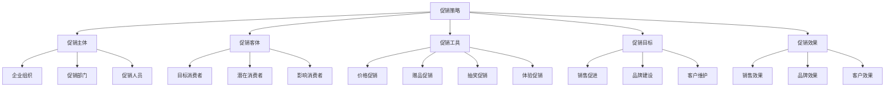
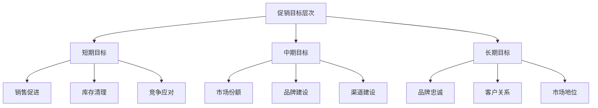
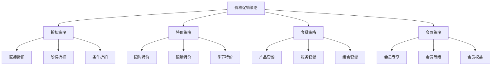
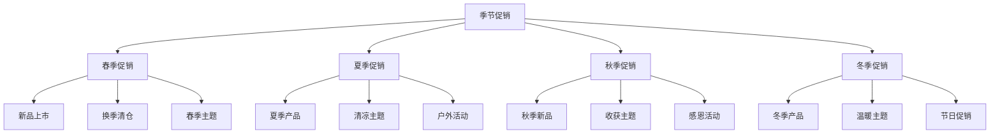
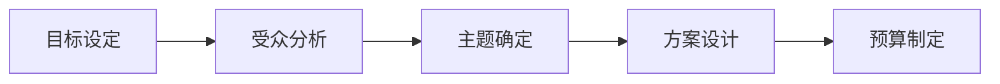

# 促销策略

## 促销策略概述

### 定义与本质
**促销策略**：通过短期的激励措施，刺激消费者购买欲望，促进产品销售，实现销售目标的营销策略。

### 促销要素模型

## 促销理论

### 促销理论发展
| 理论 | 代表人物 | 核心观点 | 应用价值 |
|------|----------|----------|----------|
| **刺激-反应理论** | 巴甫洛夫 | 刺激产生反应 | 促销效果基础 |
| **购买决策理论** | 霍华德-谢思 | 购买决策过程 | 促销时机选择 |
| **消费者行为理论** | 科特勒 | 消费者行为分析 | 促销策略制定 |
| **整合营销传播理论** | 舒尔茨 | 整合传播策略 | 促销整合策略 |

### 促销目标层次

### 促销工具类型
#### 1. 消费者促销
- **价格促销**：折扣、降价、特价
- **赠品促销**：买赠、满赠、抽奖
- **体验促销**：试用、体验、展示
- **会员促销**：积分、会员价、专享

#### 2. 渠道促销
- **进货奖励**：进货返利、进货奖励
- **陈列奖励**：陈列费、陈列奖励
- **销售奖励**：销售返利、销售奖励
- **培训支持**：培训、技术支持

#### 3. 内部促销
- **员工激励**：销售提成、奖金
- **团队竞赛**：销售竞赛、团队奖励
- **培训提升**：技能培训、能力提升
- **职业发展**：晋升机会、职业规划

## 促销策略类型

### 1. 价格促销策略
#### 策略特征
- **价格优惠**：直接价格优惠
- **限时特价**：限时价格优惠
- **批量优惠**：批量购买优惠
- **会员价格**：会员专享价格

#### 实施要点

### 2. 赠品促销策略
#### 策略特征
- **买赠活动**：购买赠送活动
- **满赠活动**：满额赠送活动
- **抽奖活动**：抽奖赠送活动
- **积分兑换**：积分兑换活动

#### 实施要点
- **赠品选择**：选择合适的赠品
- **活动设计**：设计吸引人的活动
- **成本控制**：控制促销成本
- **效果评估**：评估促销效果

### 3. 体验促销策略
#### 策略特征
- **产品试用**：产品免费试用
- **体验活动**：产品体验活动
- **展示活动**：产品展示活动
- **互动活动**：用户互动活动

#### 实施要点
- **体验设计**：设计好的体验
- **活动策划**：策划体验活动
- **用户参与**：促进用户参与
- **效果转化**：实现效果转化

### 4. 会员促销策略
#### 策略特征
- **会员专享**：会员专享优惠
- **积分奖励**：积分奖励机制
- **等级权益**：会员等级权益
- **专属服务**：会员专属服务

#### 实施要点
- **会员体系**：建立会员体系
- **权益设计**：设计会员权益
- **积分机制**：建立积分机制
- **服务提升**：提升会员服务

## 促销活动策划

### 活动类型
#### 1. 节日促销
| 节日类型 | 特点 | 促销策略 | 实施要点 |
|----------|------|----------|----------|
| **传统节日** | 文化内涵、情感连接 | 情感营销、文化营销 | 文化融入、情感诉求 |
| **商业节日** | 商业氛围、消费冲动 | 价格促销、赠品促销 | 价格优惠、赠品吸引 |
| **自创节日** | 品牌特色、差异化 | 品牌营销、体验营销 | 品牌特色、体验设计 |

#### 2. 季节促销

#### 3. 事件促销
- **新品发布**：新品发布促销
- **品牌活动**：品牌活动促销
- **社会事件**：社会事件促销
- **竞争应对**：竞争应对促销

### 活动策划流程
#### 1. 策划准备

#### 2. 活动执行
- **活动准备**：活动前期准备
- **活动实施**：活动现场实施
- **活动监控**：活动过程监控
- **活动总结**：活动后期总结

#### 3. 效果评估
- **效果测量**：活动效果测量
- **数据分析**：活动数据分析
- **经验总结**：活动经验总结
- **改进建议**：活动改进建议

## 促销渠道策略

### 渠道类型
#### 1. 线上渠道
- **电商平台**：天猫、京东、拼多多
- **社交媒体**：微信、微博、抖音
- **官方网站**：企业官网、品牌官网
- **移动应用**：APP、小程序

#### 2. 线下渠道
- **零售门店**：专卖店、百货店
- **超市卖场**：大型超市、连锁店
- **专业市场**：专业市场、批发市场
- **体验中心**：体验店、展示中心

#### 3. 全渠道
- **线上线下融合**：O2O模式
- **全渠道统一**：统一促销策略
- **渠道协同**：渠道间协同
- **数据共享**：渠道数据共享

### 渠道策略
#### 1. 渠道选择
- **目标匹配**：渠道与目标匹配
- **成本效益**：成本效益分析
- **覆盖能力**：渠道覆盖能力
- **执行能力**：渠道执行能力

#### 2. 渠道管理
- **渠道培训**：渠道人员培训
- **渠道支持**：渠道支持服务
- **渠道激励**：渠道激励措施
- **渠道监控**：渠道效果监控

## 促销效果评估

### 评估指标
#### 1. 销售指标
| 指标类型 | 具体指标 | 计算方法 | 评估意义 |
|----------|----------|----------|----------|
| **销售增长** | 销售额增长率 | (当期-上期)/上期×100% | 销售促进效果 |
| **销量增长** | 销量增长率 | (当期-上期)/上期×100% | 销量促进效果 |
| **市场份额** | 市场份额变化 | 当期份额-上期份额 | 市场地位变化 |
| **客户增长** | 新客户增长率 | 新客户数/总客户数×100% | 客户获取效果 |

#### 2. 品牌指标
- **品牌知名度**：品牌认知度提升
- **品牌美誉度**：品牌好感度提升
- **品牌忠诚度**：品牌忠诚度提升
- **品牌推荐度**：品牌推荐意愿

#### 3. 客户指标
- **客户满意度**：客户满意度提升
- **客户留存率**：客户留存率提升
- **客户价值**：客户价值提升
- **客户生命周期**：客户生命周期延长

### 评估方法
#### 1. 定量评估
- **销售数据分析**：销售数据统计分析
- **市场调研**：市场调研数据收集
- **客户调研**：客户调研数据收集
- **ROI分析**：投资回报率分析

#### 2. 定性评估
- **焦点小组**：焦点小组讨论
- **深度访谈**：深度访谈调研
- **专家评估**：专家评估分析
- **竞品分析**：竞争对手对比

## 促销策略案例

### 成功案例：双11促销策略
#### 策略特点
- **全渠道促销**：线上线下全渠道
- **价格优惠**：大幅价格优惠
- **赠品丰富**：丰富赠品活动
- **体验升级**：购物体验升级

#### 实施要点
- 全渠道策略整合
- 价格优惠设计
- 赠品活动策划
- 购物体验优化

#### 成功因素
- 强大的平台支持
- 有效的价格策略
- 丰富的促销活动
- 优质的购物体验

### 失败案例：促销策略失败
#### 问题分析
- 促销目标不明确
- 促销工具选择不当
- 促销时机把握不准
- 促销效果评估缺失

#### 改进建议
- 明确促销目标
- 合理选择促销工具
- 准确把握促销时机
- 完善效果评估体系

## 促销策略趋势

### 数字化趋势
#### 趋势特征
- **数字化促销**：数字化促销工具
- **精准营销**：精准目标受众
- **实时优化**：实时促销优化
- **个性化**：个性化促销内容

#### 实施要点
- 数字化工具应用
- 精准受众定位
- 实时数据监控
- 个性化内容创作

### 体验化趋势
#### 趋势特征
- **体验营销**：体验式促销
- **互动营销**：互动式促销
- **社交营销**：社交式促销
- **内容营销**：内容式促销

#### 实施要点
- 体验设计优化
- 互动机制建立
- 社交传播利用
- 内容创作提升

## 实践应用

### 促销策略制定步骤
1. **目标设定**：明确促销目标
2. **受众分析**：分析目标受众
3. **策略选择**：选择促销策略
4. **工具选择**：选择促销工具
5. **活动策划**：策划促销活动
6. **渠道选择**：选择促销渠道
7. **效果评估**：评估促销效果
8. **策略优化**：优化促销策略

### 促销策略最佳实践
- **目标明确**：明确促销目标
- **工具合适**：选择合适的促销工具
- **时机准确**：准确把握促销时机
- **效果可测**：可测量促销效果
- **持续优化**：持续优化促销策略

---

**相关链接**：
- [[01-广告策略|广告策略]]
- [[02-公关策略|公关策略]]
- [[04-渠道管理|渠道管理]]
- [[05-零售营销|零售营销]]
- [[03-营销理论框架/01-经典营销理论/01-4P营销理论|4P营销理论]]
